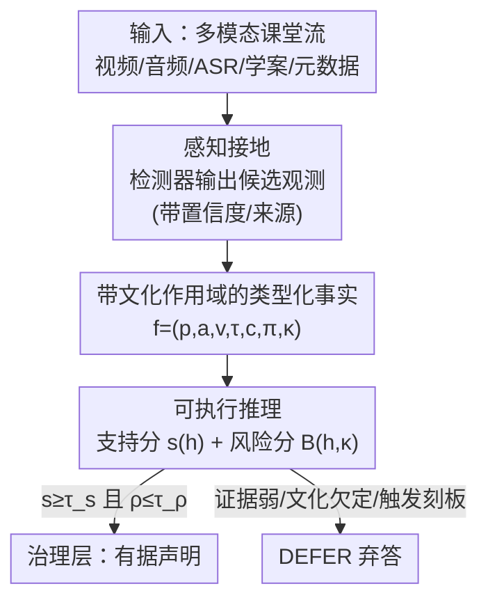

# Signals Are Not States: Neuro-Symbolic Safeguards for Culturally Aware Classroom AI

**会议**: ACL 2026  
**arXiv**: [2603.22793](https://arxiv.org/abs/2603.22793)  
**代码**: 无（方法/立场论文，未开源实现）  
**领域**: AI安全 / 公平性 / 神经符号推理  
**关键词**: 课堂AI、刻板印象、神经符号、文化作用域、弃答

## 一句话总结
论文主张课堂 AI 不该把"沉默、回避眼神、语码转换"这类文化情境化的信号直接读成"低参与、不专心、能力差"的教育判断，提出神经符号框架 NSCR：先把多模态信号落成带不确定性、来源和**文化作用域**的类型化事实，再通过可执行推理与治理策略组合出有据声明，证据不足或有刻板印象风险时**主动弃答（DEFER）**。

## 研究背景与动机
**领域现状**：大模型与多模态基础模型正以课堂助手、教师看板、讨论摘要工具的形式进入教育现场。主流的多模态学习分析（MMLA）做法是"低层检测 + 直接标签预测"——估计视线、姿态、语音、面部活动或语言内容，然后把这些信号映射到某个下游课堂判断（如"该学生困惑/不投入"）。

**现有痛点**：参与度、困惑、协作质量、教学质量这些**教育构念**和"物体类别"不一样——它们不是直接可见的，而是从局部证据推断、被本地教学法/课堂规范/语言实践/学段塑造的"理论负载"解释。一个学生不看黑板，可能在看学案、跟同伴讨论、出于尊重而回避直视、在等发言轮次，或在脑内做翻译。但现有系统从信号走到声明的这一段"几乎没有规范化"：当它判定某个学习者"困惑/不投入/不合作/语言能力低"时，往往说不清哪条证据起了作用、调用了哪些文化假设、不确定性如何传播、什么时候本该弃答。

**核心矛盾**：在多文化、多语言课堂里，文化情境化的行为会被悄悄转换成关于努力、能力、纪律、语言能力或教师水平的**教育刻板印象**。问题根源在于现有 pipeline 把"可观测证据"和"文化负载的解释"混在了同一个学习表征里——端到端分类器把证据揉进激活值，长上下文 LLM 把证据埋进 prompt，二者都无法回答"是哪条观测支撑了这个声明、是否暗中调用了某个文化假设"。

**本文目标**：(1) 把"刻板印象易发的课堂推断"定义为一个跨文化**安全问题**；(2) 给出一个能把可观测证据与构念级声明分离的框架；(3) 提出面向文化变异的评估议程与指标。

**切入角度**：作者的核心观察是——**信号不等于状态（Signals Are Not States）**。系统应当能说"该学生在这一讨论阶段没有发言"（可观测事实），但**不应**在没有"参与机会、任务情境、语言情境、文化作用域"支撑时推断"低参与"。

**核心 idea**：用神经符号架构在"信号"和"判断"之间插入一个**可审计的类型化事实层**，让不确定性、来源、文化作用域成为一等公民，并把"弃答"当成安全行为而非失败。

## 方法详解

### 整体框架
NSCR（Neuro-Symbolic Classroom Reasoning）把课堂推断拆成四个串行阶段，核心设计原则是把**可观测事实 → 构念假设 → 刻板印象风险声明**三层表征始终分开，系统可以只报告较低的一层而拒绝输出更高的一层。

一段课堂被建模为多模态流 $X=\{X^{v}_{1:T}, X^{a}_{1:T}, X^{\ell}_{1:T}, X^{c}\}$，分别是视觉、音频、语言内容（ASR/翻译/学案文本）和上下文元数据（座位布局、学科、活动阶段、语言配置、地区、本地评分量规等）。与端到端直接预测不同，NSCR 引入显式中间对象：感知接地模块 $g_m$ 把原始流变成候选观测 $\mathcal{O}=\bigcup_{m\in\mathcal{M}} g_m(X)$，抽象算子 $\Gamma$ 把候选观测映射成符号事实 $\mathcal{F}=\Gamma(\mathcal{O}, X^c)$，可执行推理器 $R$ 在策略 $\mathcal{P}$ 下返回 $(\hat{y}, \mathcal{E}, s, \rho)$——预测、证据轨迹、支持分 $s$、刻板印象风险分 $\rho$。

整个设计哲学是刻意保守的：让系统倾向于"少说、但有证据"，而不是"多说、却没证据"。

### 关键设计

**1. 信号≠状态：三层表征分离**

这是全文的中心论点，针对"信号直接读成状态"这个根本痛点。NSCR 区分三层表征：**可观测事实**（observable facts）是接地事件，如发言轮次、视线目标、求助请求、共享学具使用、教师提问；**构念假设**（construct hypotheses）是试探性的教育解释，如"困惑候选""参与机会""协作片段"；**刻板印象风险声明**（stereotype-risk claims）是无支撑或文化上过度泛化的归因，如"低努力""低能力""纪律差""语言能力低""教学薄弱"。系统被设计成始终保持这三层分离，关键是 `OBS(student_4, silent, true)` 与 `CLAIM(student_4, disengaged, true)` **绝不等价**——前者是观测，后者是需要更多情境证据才能成立的声明。论文给出一张刻板印象分类表（Table 1），把"参与度/语言能力/参与/协作/纪律/教师实践"六类刻板印象的危险捷径、跨文化问题、对应符号安全阀逐一列出，作为可扩展的 taxonomy 而非普适清单。

**2. 带文化作用域与不确定性的类型化事实**

针对"端到端把证据揉进激活值、说不清是哪条观测"的痛点。每个事实是一个七元组 $f=(p,a,v,\tau,c,\pi,\kappa)$，其中 $p$ 是谓词，$a$ 是参数，$v$ 是取值，$\tau$ 是时间点/区间，$c\in[0,1]$ 是置信度，$\pi$ 是来源（检测器名、模态、源片段或标注来源），$\kappa$ 是该事实/规则**意图成立的文化或部署作用域**（可标识课堂设置、语言配置、本地量规、标注协议或社区验证过的解释）。这里有两个关键约束：其一，符号事实要离检测器输出足够近以便审计，又离原始信号足够远以保证教育意义；其二，词表必须区分观测和声明（六个谓词族 OBS/EVENT/REL/CONTEXT/CLAIM/POLICY）。设计原则 P2（不确定性传播）要求把检测器置信度、标注分歧、翻译噪声一路携带下去，弱证据不能悄悄硬化成自信声明；P3（显式文化作用域）要求**规则一旦被用在其作用域之外，就触发置信度下调或弃答**——这正是 ASR 在语码转换/方言/重叠语音下失败、视线在遮挡下失败时，防止上游误差转成学习者/群体级判断的关键。

**3. 可执行推理与刻板印象风险评分**

针对"看不见的激活值无法解释为何下结论"的痛点。一些课堂构念可以写成组合式模板：一个"困惑候选"可能需要近期教师提问 + 一次失败尝试 + 求助请求 + 对学具的持续注意；一个"参与机会"要求发言地板开放、学生有资格进入、活动阶段确实期待个人发言。对复杂查询，LLM 可以从符号事实合成一段**可执行推理程序**（类似 program-aided reasoning），程序本身成为可执行、可检查、可调试的工件，并被 schema、算子白名单和"阻止无支撑高风险声明"的策略约束。论文给出一段"参与度"程序示例：除非先确立了 `opportunity`，否则任何"低参与"声明都不被允许（`if not opportunity: return DEFER`）。支持分写成置信度加权平均减去违规惩罚：

$$s(h)=\frac{\sum_{f\in\operatorname{supp}(h)} w_f c_f}{\sum_{f\in\operatorname{supp}(h)} w_f}-\Big(\lambda_v V(h)+\lambda_p P(h)+\lambda_b B(h,\kappa)\Big)$$

其中 $V(h)$ 数违反的逻辑/时序约束，$P(h)$ 数策略违规，$B(h,\kappa)$ 估计文化作用域下的刻板印象风险。风险项被具体化为对 Table 1 中已知危险捷径的求和：

$$B(h,\kappa)=\sum_{r\in\mathcal{R}}\alpha_r\,\mathbf{1}[h\sim r]\,\bigl(1-\sigma_r(h,\kappa)\bigr)$$

$\mathbf{1}[h\sim r]$ 表示假设 $h$ 匹配了捷径 $r$（如"沉默→不投入"），$\sigma_r(h,\kappa)\in[0,1]$ 度量在作用域 $\kappa$ 下"能为 $r$ 背书的情境证据（参与机会、任务情境、语言配置）"是否真的存在。于是风险恰好在"假设匹配了刻板捷径、但许可情境缺失"时最高——这把"刻板印象风险"从含糊的伦理担忧变成了可计算量。

**4. 弃答即安全：治理层**

针对"系统被迫在证据不足时也要给个标签"的痛点。NSCR 把治理当成缓解层而非事后补丁，输出策略是一个分段函数：

$$\text{output}=\begin{cases}\hat{y}, & s(\hat{y})\geq\tau_s,\ \Delta\geq\tau_\Delta,\ \rho(\hat{y})\leq\tau_\rho\\ \texttt{DEFER}, & \text{否则}\end{cases}$$

只有当支持分够高（$s\geq\tau_s$）、与次优假设的间隔够大（$\Delta\geq\tau_\Delta$）、且刻板印象风险够低（$\rho\leq\tau_\rho$）时才输出声明，否则弃答。设计原则 P4 把"弃答"明确定为**一等安全行为**：在证据弱、文化欠定或易触发刻板印象时拒答不是失败模式，而是必要的安全行为。P5（隐私即构造）进一步让符号轨迹（而非持久原始录像）成为默认保留单位，把同意、留存、审计、删除变得比端到端 embedding 更可控。机器可检查的策略据此强制弃答、人工复核或置信度下调。

### 一个完整示例
以"避免参与度刻板印象"为例：一个只数发言轮次的课堂看板，会把安静的学生误判为"不投入"。在 NSCR 里，**参与机会**是独立的推理目标——系统先检查发言地板是否开放、学生是否有资格进入、是否被重叠语音挡住、活动阶段是否期待个人发言、以及本地课堂规范是否把"公开口头发言"当作合适的投入信号。若这些条件不满足，系统可以报告"未观测到发言轮次"（可观测事实），但**不应**推断"低投入"（构念声明）。这一步把 Table 1 里"低发言数→低努力"的危险捷径，用一段可执行守卫显式拦了下来。

## 实验关键数据
> ⚠️ 这是一篇**方法/立场论文**，贡献是"框架 + 评估议程"，没有跑模型的实证结果；下面给出论文用来支撑论点的分类表、定位对比与提出的安全指标。

### NSCR 与两种主流范式的定位对比（Table 2）
对比的不是预测精度，而是"从信号到声明的路径是否可审计、感知不确定性、文化作用域、能否弃答"。

| 属性 | 端到端多模态分类器 | 仅 prompt 的多模态 LLM | NSCR（本文） |
|------|------|------|------|
| 证据轨迹 | 无，只有标签 | 自然语言理由，可能事后编造 | 显式类型化事实 + 可执行程序 |
| 不确定性 | 隐含在 logits | 口头化、常不可靠 | 逐事实传播并聚合为支持分 $s$ |
| 文化作用域 | 不表示 | 临时、若 prompt 提到才有 | 事实/规则的一等属性 $\kappa$ |
| 弃答 | 阈值化分数 | 不一致、可被 prompt 诱导 | 策略强制的 DEFER |
| 可审计性 | 低 | 中（理由可能不忠实） | 高（可查事实 + 可验证程序） |
| 隐私/留存 | 保留原始特征 | prompt 里有原始上下文 | 默认只留符号轨迹 |

### 提出的刻板印象安全指标
论文主张评估应在"推理、文化作用域、治理"层面进行，给出三个核心安全指标，要求与任务精度**并列报告**而非附在其后。

| 指标 | 定义 | 含义 |
|------|------|------|
| 刻板印象泄露率 SLR | $\Pr(\mathrm{SP}(\hat{y})\mid\hat{y}\neq\texttt{DEFER})$ | 非弃答输出中"刻板印象易发"的比例 |
| 无支撑归因率 UAR | $\Pr(\mathrm{UNSUP}(\hat{y})\mid\hat{y}\neq\texttt{DEFER})$ | 非弃答输出中"证据不足"的比例 |
| 文化校准差 CCG | $\max_g\operatorname{ECE}_g-\min_g\operatorname{ECE}_g$ | 不同部署群体间校准误差的最大落差 |

### 关键发现
- 论文提出一个六任务族的评估议程（Table 3）：文化条件化状态推断、证据接地的声明验证、多语言/语码转换推理、跨文化协作分析、反事实文化鲁棒性、文化条件化红队测试——目标不只是感知质量，而是多模态课堂推理的正确性、文化作用域、证据忠实度与安全性。
- 评估被分成五个互补层次：感知质量（mAP/事件 F1/WER/DER，仅作上游诊断）、接地保真度与证据忠实度、刻板印象敏感风险（SLR/UAR/CCG）、弃答下的可靠性（覆盖率/选择性风险/校准）、人类有用性与策略合规。
- 核心主张：把课堂 AI 从"黑盒标签预测"推向"可验证、文化感知、有责任作用域"的语言技术——少下结论、但每个结论都附证据。

## 亮点与洞察
- **把"弃答"提升为安全目标**：大多数系统把"拒答"当失败，本文把它当一等输出，并给出可计算的触发条件（支持分/间隔/风险三阈值），这对高风险教育场景尤其重要。
- **刻板印象风险被形式化成可计算量** $B(h,\kappa)$："假设匹配捷径但许可情境缺失时风险最高"这个直觉被写成显式公式，比"系统应当公平"这类口号可操作得多，可迁移到医疗、招聘等其它"信号→社会判断"易出偏见的场景。
- **文化作用域 $\kappa$ 当一等属性**：规则被用在作用域外就自动降权或弃答，这是一个很干净的"防止规则跨文化误用"机制，思路可复用到任何"本地规范不可移植"的判断系统。
- **隐私即构造**：用符号轨迹替代持久原始录像作为默认留存单位，把数据最小化从"合规要求"变成"架构默认"，对涉及未成年人的课堂数据格外有价值。

## 局限与展望
- **无实证验证**：全文是框架 + 议程，没有在真实课堂数据上跑出 SLR/UAR/CCG 的数字，三阈值 $\tau_s/\tau_\Delta/\tau_\rho$ 和权重 $\lambda$、$\alpha_r$ 如何标定、$\sigma_r(h,\kappa)$ 如何估计都未给经验答案。
- **符号 schema 可能"透明但教育上无效"**：作者自承，若选的谓词不对应目标场景里有意义的构念，系统会产出"整洁但误导"的解释；规则组件可能脆弱，LLM 生成的程序仍可能出错或社会上不当。
- **标注成本高**：构念对齐、文化接地的数据集需要比简单检测基准丰富得多的标签（多标注者视角、本地教育者参与），且涉及未成年人课堂的标注有情感负担与隐私风险。
- **不消除监控风险**：符号轨迹比持久原始视频更安全，但仍可能编码关于未成年人、教师、课堂实践的敏感信息——神经符号 pipeline 不解决"是否该监控"的根本问题。

## 相关工作与启发
- **vs 多模态学习分析（MMLA）**：MMLA 聚焦多模态融合，把信号融进学习表征后直接预测标签；本文把注意力从"多模态融合"转向"对文化作用域证据的多模态推理"，强调证据可查与弃答。
- **vs 端到端多模态分类器 / 长上下文 LLM**：前者把证据揉进激活值、不可审计；后者在相关证据被干扰项淹没时退化、且跨语言不均。NSCR 先抽出紧凑、类型化、可审计的事实层再推理，用一些端到端灵活性换取可审计性、校准的不确定性和显式文化作用域。
- **vs NLP 偏见基准（CrowS-Pairs / StereoSet / BBQ）**：这些基准多是语言/地区/任务特定的纯文本刻板印象度量，不触及"社会意义是多模态、教学化、本地情境化"的课堂场景；本文把刻板印象问题搬到多模态课堂推理，并补上文化作用域维度。

## 评分
- 新颖性: ⭐⭐⭐⭐☆ 把"信号≠状态"形式化为神经符号安全框架、把刻板印象风险写成可计算项，角度新颖。
- 实验充分度: ⭐⭐☆☆☆ 纯框架/议程，无任何实证结果，阈值与风险估计均未标定。
- 写作质量: ⭐⭐⭐⭐☆ 论点清晰，taxonomy 与定位对比表organized，公式与示例程序到位。
- 价值: ⭐⭐⭐⭐☆ 为高风险教育 AI 提供了可审计、可弃答的设计蓝图与评估指标，方法论价值明确。

<!-- RELATED:START -->

## 相关论文

- [\[CVPR 2026\] Scaling Up AI-Generated Image Detection with Generator-Aware Prototypes](../../CVPR2026/ai_safety/scaling_up_ai-generated_image_detection_with_generator-aware_prototypes.md)
- [\[CVPR 2025\] NoT: Federated Unlearning via Weight Negation](../../CVPR2025/ai_safety/not_federated_unlearning_via_weight_negation.md)
- [\[ICML 2026\] Where Rectified Flows Leak: Characterising Membership Signals Along the Interpolation Path](../../ICML2026/ai_safety/where_rectified_flows_leak_characterising_membership_signals_along_the_interpola.md)
- [\[ICML 2026\] Privacy Amplification in Differentially Private Zeroth-Order Optimization with Hidden States](../../ICML2026/ai_safety/privacy_amplification_in_differentially_private_zeroth-order_optimization_with_h.md)
- [\[CVPR 2026\] SAIDO: 基于场景感知与重要性引导动态优化的可泛化 AI 生成图像检测](../../CVPR2026/ai_safety/saido_generalizable_detection_of_ai-generated_images_via_scene-aware_and_importa.md)

<!-- RELATED:END -->
