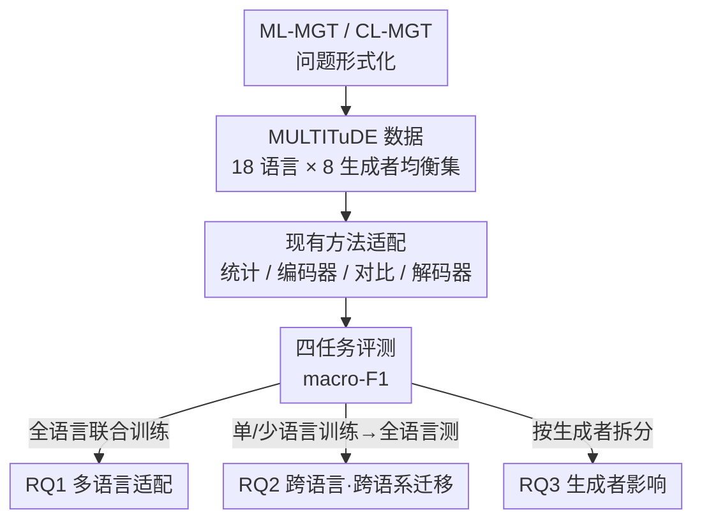

# Authorship Attribution in Multilingual Machine-Generated Texts

**会议**: ACL 2026  
**arXiv**: [2508.01656](https://arxiv.org/abs/2508.01656)  
**代码**: 待确认  
**领域**: AIGC检测  
**关键词**: 机器生成文本检测, 作者归属, 多语言, 跨语言迁移, MULTITuDE

## 一句话总结
现有「机器生成文本作者归属（attribution，即判断一段文本出自哪个具体 LLM 还是人类）」研究几乎全是单语种（尤其英语）的，这篇论文首次形式化定义了**多语言作者归属（ML-MGT）**和**跨语言迁移（CL-MGT）**两个问题，在 18 种语言 × 8 个生成者（7 个 LLM + 人类）上系统评测了统计法、微调编码器、对比学习、微调解码器等一整套现有方法，发现微调/对比方法能适配多语言（最佳 macro-F1 > 0.9），但**跨不同语系/书写体系迁移时严重退化**，揭示了真实多语言场景的难度。

## 研究背景与动机
**领域现状**：LLM 流畅度已逼近人类，使得机器生成文本（MGT）越来越难辨。最初的应对是**二分类 MGT 检测**（判断「是不是机器写的」）。但随着 LLM 数量每天暴涨，光知道「是机器写的」不够，还要知道**具体是哪个模型写的**——这就是更细粒度的**作者归属（authorship attribution, AA）**，对问责、溯源、防滥用都很关键。

**现有痛点**：AA 这条线**整体仍停留在单语种**，绝大多数工作只做英语，少数延伸到俄语、西班牙语，但缺乏对多语言归属的系统研究。而现代 LLM 本身是多语言的、被用于各种语言文化语境——只在英语上验证的 AA 方法，在真实多语言场景能不能用、能不能跨语言泛化，完全是个盲区。

**核心矛盾**：归属比检测难得多（要在 8 个均衡类别里多分类，随机基线只有 0.125 macro-F1），而多语言又叠加了一层难度——不同语系、不同书写体系（拉丁/西里尔/阿拉伯/汉字/希腊）的语言学性质差异巨大，一个在某语言上学到的「生成者指纹」未必能迁移到另一个语言。

**本文目标**：用三个研究问题把这个盲区拆开——
RQ1：现有 AA 方法处理多语言 MGT（ML-MGT）的效果如何？
RQ2：AA 方法能在多大程度上跨语言、跨语系迁移（CL-MGT）？
RQ3：生成者模型的选择如何影响多语言适配性和跨语言泛化？

**核心 idea**：不是提一个新模型，而是**首次形式化 ML-MGT / CL-MGT 问题 + 构建统一可比的多语言评测 + 把现有代表性方法系统适配并实测**，给出这个新问题难在哪、哪些方法路线有希望的第一份系统证据。

## 方法详解

### 整体框架
这是一篇**问题定义 + 系统性实证研究**论文，不是单一新方法。整体逻辑链是：① 把多语言作者归属形式化为多类分类问题 ML-MGT，并把跨语言迁移定义为其特例 CL-MGT；② 基于 MULTITuDE 数据集筛出 18 种语言 × 8 个生成者的均衡评测集；③ 把四类代表性现有方法（统计、微调编码器、对比学习、微调解码器）适配到这个归属任务上；④ 设计四个评测任务分别回答 RQ1（多语言适配）、RQ2（按语言/语系的跨语言迁移）、RQ3（生成者影响），用 macro-averaged F1 统一衡量。

### 关键设计

**1. ML-MGT 与 CL-MGT 的问题形式化：把多语言归属拆成「联合」与「迁移」两层**

论文先把作者归属定义清楚。给定文本集 $\mathcal{X}=\mathcal{X}_h\cup\mathcal{X}_m$（人类写的 + 来自生成者集合 $\mathcal{M}$ 的机器文本），每条文本属于语言集 $\mathcal{L}$ 中某一语言。**ML-MGT**（Problem 1）的目标是学一个映射 $f:\widehat{\mathcal{X}}\mapsto\mathcal{Y}=\{y_h\}\cup\mathcal{Y}_m$，即在「人类类 $y_h$ + $|\mathcal{M}|$ 个机器生成者类」共 8 个类里判断作者；语言选择由策略 $g(\cdot)$ 控制，默认假设人类文本和 MGT 用同一组语言、成对对齐。**CL-MGT**（Problem 2）是它的特例：当训练语言集 $\mathcal{L}_{train}\subset\mathcal{L}_{test}$，即测试语言里含训练时没见过的语言，问题就退化为跨语言迁移——逼模型靠跨语言知识迁移而非记忆。这个「联合多语言」与「迁移到未见语言」的两层切分，是后面所有实验设计的骨架。

**2. 均衡多语言评测集：从 MULTITuDE 筛 18 语言 × 8 生成者，控制可比性**

为了让跨语言对比「不被数据偏差污染」，论文用 MULTITuDE (v3) 数据集——它含 7 个 LLM（Mistral-7B-Instruct、OPT-IML-Max-30B、v5-Eagle-7B、Vicuna-13B、Llama-2-70B-Chat、Aya-101、GPT-3.5-Turbo）用相同新闻标题 prompt 生成的文章 + MassiveSum 的人类新闻，**每个语言用同一组生成者、同样的生成设置和领域**，专门为无偏跨语言对比设计（这也是没选 M4GT-Bench / RAID 的原因）。在 21 种可用语言里筛出 18 种，要求：(i) 语言-生成者组合完全均衡，(ii) 至少达到目标样本量的 95%（训练每生成者约 1000、测试约 300）。最终覆盖 8 个语系、5 种书写体系（12 拉丁 / 3 西里尔 / 1 阿拉伯 / 1 汉字 / 1 希腊），每个类别均匀分布（人类占 1/8，其余均分给 7 个 LLM）。这种「跨语言只变语言、其他全控住」的设计，是后面能干净归因到「语言/语系」效应的前提。

**3. 现有方法的多语言适配套件：四条技术路线统一改造到归属任务**

论文不是凭空造方法，而是把四类代表性现有方法**适配**到 AA。**统计法**：用 Fast-DetectGPT（mGPT-13B 作参考与采样模型）和 Binoculars（Falcon-7B 作 observer）抽零样本特征，再训一个逻辑回归做多类分类；更强的 **StatEnsemble** 把 Binoculars、Fast-DetectGPT、perplexity、Rank、log-rank、log-likelihood、Entropy、LLM-Deviation、DetectLLM-LRR 共九种统计特征喂给 MLP 分类器。**微调编码器**：RoBERTa-large（英语单语）与 XLM-RoBERTa-large（多语言），按已有工作微调（lr 2e-6，最大长度 512）。**对比学习**：把 OpenTuringBench 上最强的 OTBDetector 适配过来，并把原 Longformer 换成 XLM-RoBERTa-large 以保多语言性，用对比损失分离不同生成者的潜在表示。**微调解码器**：把原本做二分类的 mdok（基于 Qwen3-4B-Base + QLoRA）改成多类分类头，外加 Qwen3-4B-Base 本身做同样微调。这一套覆盖「无训练统计 → 判别式微调 → 对比式表示分离 → 解码器微调」的完整谱系，让结论不依赖单一方法。

### 一个完整示例：RQ2 跨语系迁移怎么暴露脆弱性
以「书写体系迁移」为例走一遍：论文用英语+西班牙语代表**拉丁脚本**训练、用俄语代表**西里尔脚本**训练，然后在全部 18 种语言上测 macro-F1。结果（详见 RQ2 数据）显示——同语系/同脚本内迁移尚可，但拉丁训练的模型迁到西里尔/阿拉伯/汉字语言、或反之，F1 明显下滑。这把「联合训练时 >0.9 的漂亮数字」背后的脆弱性具体化：模型很大程度学的是「特定语言里的生成者指纹」，一旦脚本和语系换了，指纹就对不上。这正是论文要传达的核心警示：当前 AA 方法的多语言能力被「联合训练」高估了。

## 实验关键数据

### 主实验（RQ1：多语言适配）
全 18 语言联合训练、8 类、报告 macro-averaged F1（随机基线 0.125）。8 个检测器里 5 个达到 macro-F1 ≥ 0.75；微调与对比方法适配性最好。

| 方法 | 类型 | all 语言平均 F1 | 说明 |
|------|------|------|------|
| Qwen3-4B-Base | 微调解码器 | 0.93 | 最佳之一 |
| mdok | 微调解码器(QLoRA) | 0.93 | 多数语言 >0.9 |
| OTBDetector | 对比学习 | 0.90 | 参数比前两者小 7×，仅降 ~3% |
| XLM-R-large | 多语言编码器 | 0.84 | |
| RoBERTa-large | 英语编码器 | 0.75 | 英语文本反而难归属 |
| StatEnsemble | 统计集成 | 0.45 | 统计法整体偏弱 |
| Fast-DetectGPT | 单统计 | 0.23 | |
| Binoculars | 单统计 | 0.16 | 接近随机偏上 |

### 跨语言/跨语系迁移（RQ2）与生成者影响（RQ3）

| 评测维度 | 设置 | 关键观察 |
|------|------|------|
| 多语言适配（RQ1） | 全语言联合训练 | 微调/对比方法 F1 普遍 >0.9，统计法 ≤0.45 |
| 按语言迁移（RQ2） | 英/西/俄单语或组合训练 → 全语言测 | 迁到训练未见语言时性能依语言相似度大幅波动 |
| 按语系/脚本迁移（RQ2） | 拉丁(en+es) vs 西里尔(ru) 训练 → 全语言测 | 跨不同书写体系迁移退化最明显 |
| 生成者影响（RQ3） | 按生成者看类级 F1 | 生成者身份与语言语境交互，影响适配与迁移 |

### 关键发现
- **微调/对比 > 统计，且解码器/对比方法在多数语言上 >0.9**：Qwen3-4B-Base、mdok、OTBDetector 三强遥遥领先；纯统计零样本方法（Fast-DetectGPT 0.23、Binoculars 0.16）在归属任务上几乎不可用——「检测」能work的统计信号不足以「归属」。
- **OTBDetector 性价比突出**：尽管参数比 Qwen3-4B-Base/mdok 小 7×，F1 只降约 3%，论文归因于对比损失带来的更锐利决策边界。
- **英语文本反而难归属**：即便用英语单语预训练的 RoBERTa，英语上 F1 也偏低（0.72/0.65 量级），说明高资源语言的生成者指纹未必更易区分。
- **跨语系/跨脚本是真正的瓶颈**：方法在相似语言族内迁移尚可，但跨拉丁↔西里尔↔阿拉伯↔汉字时性能受目标语言语言学性质和生成者身份双重影响而显著退化——这是论文最核心的负面结论，指向需要真正语言无关的归属方法。

## 亮点与洞察
- **问题定义本身是贡献**：把「多语言作者归属」和「跨语言迁移」形式化为 ML-MGT/CL-MGT，并给出对应的训练/测试语言子集切分，为后续工作立了可复用的评测框架。
- **「联合训练高分」会误导**：RQ1 的 >0.9 很漂亮，但 RQ2 一做跨语系迁移就露馅——这个对比提醒社区不要被单一联合多语言数字迷惑，迁移性才是真实场景的试金石。
- **可迁移的实验设计思路**：用「同生成者、同领域、同设置，只变语言」的均衡数据来干净隔离语言/语系效应，这套控制变量法可推广到任何「跨语言鲁棒性」评测。

## 局限与展望
- 只用 MULTITuDE 一个数据集、且仅新闻领域——结论是否跨领域（社交、代码、对话）成立未验证。
- 生成者集合是 7 个相对早期的 LLM（含 GPT-3.5、Llama-2、Vicuna 等），更新更强的模型（GPT-4 类、Claude、最新开源）未覆盖，指纹可分性可能随模型迭代改变。
- 论文止步于「揭示问题 + 评测现有方法」，没有提出能跨语系泛化的新方法，CL-MGT 的解法仍是 open problem。
- 评测以 macro-F1 为主，对实际部署关心的校准、对抗鲁棒性（改写/混淆）等维度涉及有限。

## 相关工作与启发
- **vs 二分类 MGT 检测（DetectGPT/Binoculars 等）**: 检测只判「人 vs 机」，本文做的是细粒度归属（判哪个具体生成者）；实验也证明检测有效的统计信号迁到归属几乎失效。
- **vs 单语种归属（OTBDetector / OpenTuringBench）**: 这些方法在英语等单语种 SOTA，本文把它们适配到 18 语言并暴露跨语言迁移短板，是对单语种结论的多语言压力测试。
- **vs 既有多语言 MGT 数据（M4GT-Bench / RAID）**: 本文选 MULTITuDE 正因为它在所有语言上用一致的生成者/设置/领域，能做无偏跨语言对比，而非简单堆语言数量。

## 评分
- 新颖性: ⭐⭐⭐⭐ 首次形式化并系统研究多语言/跨语言机器文本作者归属，填补明确盲区
- 实验充分度: ⭐⭐⭐⭐ 18 语言 × 8 生成者 × 4 类方法 × 3 个 RQ，覆盖广；但仅单数据集单领域
- 写作质量: ⭐⭐⭐⭐ 问题定义清晰、RQ 驱动、控制变量设计严谨
- 价值: ⭐⭐⭐⭐ 给溯源/问责场景立了评测标准，并明确指出跨语系迁移这一待解难题

<!-- RELATED:START -->

## 相关论文

- [\[ACL 2025\] MultiSocial: Multilingual Benchmark of Machine-Generated Text Detection of Social-Media Texts](../../ACL2025/aigc_detection/multisocial_mgt_detection.md)
- [\[ACL 2026\] DetectRL-X: Towards Reliable Multilingual and Real-World LLM-Generated Text Detection](detectrl-x_towards_reliable_multilingual_and_real-world_llm-generated_text_detec.md)
- [\[NeurIPS 2025\] DuoLens: A Framework for Robust Detection of Machine-Generated Multilingual Text and Code](../../NeurIPS2025/aigc_detection/duolens_a_framework_for_robust_detection_of_machine-generated_multilingual_text_.md)
- [\[ACL 2026\] BIASEDTALES-ML: A Multilingual Dataset for Analyzing Narrative Attribute Distributions in LLM-Generated Stories](biasedtales-ml_a_multilingual_dataset_for_analyzing_narrative_attribute_distribu.md)
- [\[ACL 2026\] ExaGPT: Example-Based Machine-Generated Text Detection for Human Interpretability](exagpt_example-based_machine-generated_text_detection_for_human_interpretability.md)

<!-- RELATED:END -->
