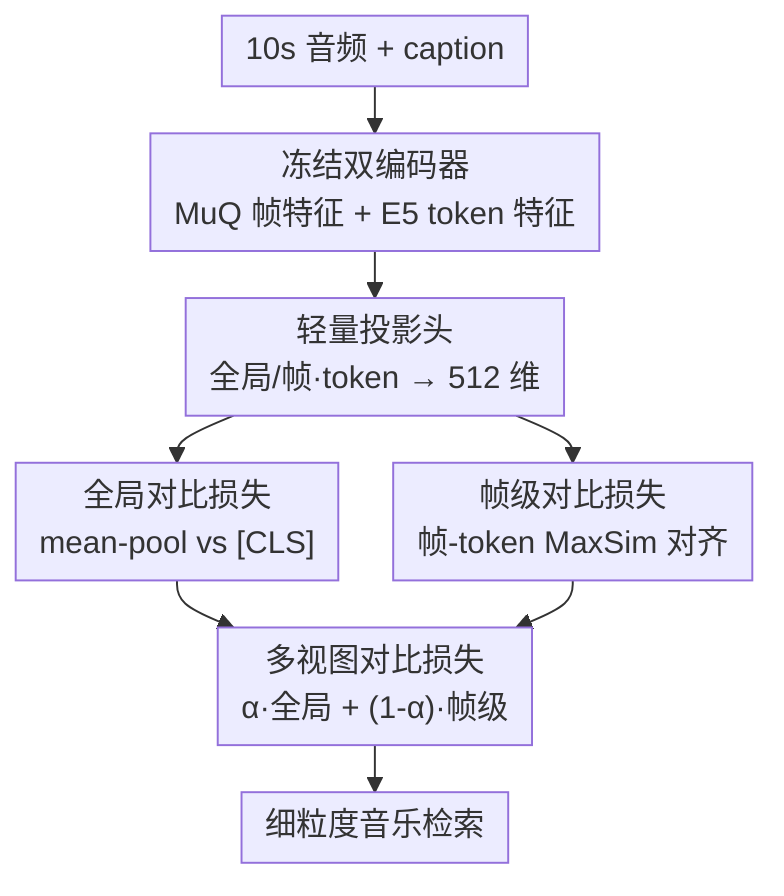

# FIGMA: Towards Fine-Grained Music Retrieval

**会议**: ACL 2026  
**arXiv**: [2606.06615](https://arxiv.org/abs/2606.06615)  
**代码**: 项目页 https://nishitanand.github.io/figma-website  
**领域**: 音频语音 / 跨模态检索  
**关键词**: 细粒度音乐检索, 对比学习, 帧级对齐, 多视图损失, 数据集构建

## 一句话总结
针对 CLAP 类音乐检索模型"只用得上 caption 前 40–50 个 token、长描述坍缩成词袋"的毛病，FIGMA 在标准全局对比损失之外加了一条帧-token 级别的细粒度对比损失（多视图对比），并配套构建了 38 万对带乐理标注的 FGMCaps 数据集，让模型能按 tempo、调性、和弦、节拍这类精确属性检索音乐，相对提升最高达 73.3%。

## 研究背景与动机

**领域现状**：音乐检索的主流范式是把文本 query 和音频片段映射到同一表示空间、用对比目标对齐——即 CLIP 在音频上的延伸 CLAP。为补音乐领域的短板，又有了 MuLaN、CLAMP、MuQ-MuLaN 等只在音乐-文本对上训练的专用模型。

**现有痛点**：当 query 写得很细（"一首 F 大调、110 BPM、4/4 拍的曲子"）时，这些模型常常检索不到正确音频。作者做了一个 token 截断实验：把 caption 截到前 $k$ 个 token（$k$ 从 5 起步每次 +5）再检索，发现 Retrieval@1/5/10 在 $k$ 超过约 40–50 后就饱和——也就是说，更长描述里携带的细粒度乐理信息几乎被模型忽略了。更扎心的是，把 LAION-CLAP 直接在富含细节的 FGMCaps 上继续训练，提升也极其有限。

**核心矛盾**：问题出在标准对比学习目标本身。现有架构把音频沿时间轴 mean-pool 成一个 $d$ 维向量、把文本用单个 `[CLS]` token 概括，对比损失只在这两个全局向量之间施加。这种全局聚合丢掉了音频的时序结构和文本的 token 级区分，长 caption 于是退化成"词袋"，即便属性词都在里面，模型也没有机制把它们和音频中对应的声学片段对齐。

**核心 idea**：在全局对比之外，再加一条**帧级、token 级**的对比损失，显式地把每个音频帧和 caption 里的 token 对齐，让粗粒度语义和细粒度乐理在同一表示空间里被同时保留。

## 方法详解

### 整体框架
FIGMA 用两个**冻结**的预训练编码器作底座：MuQ 音频编码器（自监督预训练）输出帧级特征 $H^{a}=f_{\mathrm{MuQ}}(A)\in\mathbb{R}^{B\times T\times 1024}$（$T=250$ 帧，对应 10 秒 24kHz 音频），Microsoft 多语 E5-Large-Instruct 文本编码器输出 token 级特征 $H^{t}=g_{\mathrm{E5}}(T)\in\mathbb{R}^{B\times L\times 1024}$（$L=128$）。从这两个矩阵里既抽全局表示（音频 mean-pool 得 $\bar{h}^{a}$、文本取 `[CLS]` 得 $\bar{h}^{t}$），又保留完整的帧/token 矩阵作细粒度学习。两组特征都经轻量投影头映射到共享的 512 维空间，然后施加**多视图对比损失** = 全局对比损失 + 帧级对比损失。整个训练只更新约 22M 参数的投影头，底层约 800M 的编码器全程冻结。

### 关键设计

**1. 帧-token 级对比损失：让长 caption 里的乐理细节真正落到声学帧上**

这是 FIGMA 解决"词袋坍缩"的核心。在标准全局 InfoNCE（把配对音频-文本的 mean-pool/`[CLS]` 拉近、batch 内其余推远）之外，作者引入一条细粒度损失，直接在帧矩阵 $Z^{a}_{\mathrm{frame}}=[\mathbf{z}^{a}_{1},\dots,\mathbf{z}^{a}_{T}]$ 和 token 矩阵 $Z^{t}_{\mathrm{token}}=[\mathbf{z}^{t}_{1},\dots,\mathbf{z}^{t}_{L}]$ 之间计算。对每个音频帧 $t$，先取它与样本 $j$ 所有 token 的**最大相似度**（MaxSim，类似 ColBERT 的延迟交互）：

$$s_{i,t;j}=\max_{1\leq \ell\leq L}\mathrm{sim}\bigl(\mathbf{z}^{a}_{i,t},\,\mathbf{z}^{t}_{j,\ell}\bigr)$$

再对所有帧求平均得到帧级相似度 $S_{\mathrm{frame\text{-}level}}(i,j)=\frac{1}{T}\sum_{t=1}^{T}s_{i,t;j}$，最后把它喂进双向 InfoNCE（audio→text 和 text→audio 各算一遍取平均）。max 操作的关键在于：它为每个帧自动挑出最匹配的 token，从而把"110 BPM""F 大调"这类具体词和音频里相应的节奏/调性帧对应起来——这正是 mean-pool 全局表示做不到的细粒度对应。

**2. 多视图损失加权融合：全局管语义、帧级管细节，二者互补**

单用帧级损失会丢掉对整体语义（风格、情绪）的把握，单用全局损失又回到词袋老路，所以 FIGMA 用一个超参 $\alpha$ 把两者线性融合：

$$\mathcal{L}_{\mathrm{Multi\text{-}View}}=\alpha\,\mathcal{L}_{\mathrm{global}}+(1-\alpha)\,\mathcal{L}_{\mathrm{frame}}$$

作者解释这两条损失是互补且都必要的：全局损失靠 `[CLS]` 给出 caption 的整体表示，帮模型学到"这段文字整体对应这段音频"；帧级损失则负责音乐特有的细粒度属性对齐。经验上 $\alpha=0.6$ 最好——略偏向全局，但留下足够权重给细粒度。温度 $\tau=0.07$。这种"粗+细双视图"的设计让单一表示空间里既有高层语义又有逐帧对应。

**3. 冻结双编码器 + 轻量投影头：22M 参数撬动 800M 底座**

FIGMA 不做端到端预训练，而是冻结 MuQ 和 E5（合计约 800M），只训练约 22M 的投影头。音频和文本投影头各由 2 层 Transformer encoder（8 头、FFN 维度 512）+ 一个线性层组成，映射到 512 维。之所以用 Transformer 而非简单线性投影，是因为帧级对比目标需要建模音频帧/文本 token 的序列依赖，线性层做不到。这和并行工作 FLAM 形成对比：FLAM 用 SigLIP 风格的 BCE 损失（需要小心初始化 logit bias $\beta$ 来抵消 1:(B-1) 的正负样本极度不平衡），还要全模型预训练；FIGMA 用 InfoNCE 借 softmax 隐式归一化绕开了这个不平衡，训练更稳、对超参更鲁棒，算力也省得多。

### 损失函数 / 训练策略
全局损失为对称 InfoNCE $\mathcal{L}_{\mathrm{global}}=\frac{1}{B}\sum_i \ell^{\mathrm{global}}_i$；帧级损失为双向 InfoNCE $\mathcal{L}_{\mathrm{frame}}=\frac{1}{2B}\sum_i(\ell^{a\to t}_{i}+\ell^{t\to a}_{i})$；总损失按 $\alpha=0.6$ 加权。训练 15 epoch、batch 256、Adam（lr $1\times10^{-4}$）、early stopping、$\tau=0.07$。

## 实验关键数据

### 主实验
在 MusicBench 测试集上做双向检索（T2A 文本检音频，A2T 音频检文本），FIGMA 在全部 R@K 上刷新 SOTA：

| 模型 | T2A R@1 | T2A R@10 | A2T R@1 | A2T R@10 |
|------|---------|----------|---------|----------|
| MuQ-MuLaN | 20.81 | 62.94 | 17.76 | 57.86 |
| M2D-CLAP | 25.38 | 70.05 | 36.55 (次优) | 75.63 |
| CLAMP 3 | 28.43 (次优) | 74.62 | 05.08 | 34.01 |
| LAION-CLAP(续训 FGMCaps) | 10.66 | 48.73 | 13.71 | 52.79 |
| **FIGMA** | **34.52** | **81.73** | **39.09** | **80.71** |

在更换分布的 FMACaps-Eval（来自 Free Music Archive）上做域外评测，FIGMA 优势更明显，这也是论文宣称"相对提升最高 73.3%"的来源：

| 模型 | T2A R@1 | T2A R@10 | A2T R@1 | A2T R@10 |
|------|---------|----------|---------|----------|
| MuQ-MuLaN | 04.10 | 17.80 | 03.90 | 19.10 |
| CLAMP 3 | 07.50 (次优) | 30.80 | 01.10 | 06.40 |
| LAION-CLAP(续训 FGMCaps) | 06.10 | 26.50 | 06.00 (次优) | 30.10 |
| **FIGMA** | **13.00** | **37.60** | **13.20** | **42.90** |

值得注意的是，直接把 LAION-CLAP 在 FGMCaps 上续训反而退步（MusicBench T2A R@1 仅 10.66），印证了"光有细粒度数据、没有细粒度对齐机制"是不够的。

### 数据集对比
FGMCaps 是唯一在 38 万规模上同时标注和弦/tempo/节拍/调性的音乐检索数据集：

| 数据集 | 训练/测试样本 | 和弦 | tempo | 节拍 | 调性 |
|--------|--------------|------|-------|------|------|
| MusicBench | 52,768 / 400 | ✓ | ✓ | ✓ | ✓ |
| Music4All | 108,042 / 0 | ✗ | ✓ | ✗ | ✓ |
| MTG-Jamendo | 48,709 / 2,707 | ✗ | ✗ | ✗ | ✗ |
| **FGMCaps** | **380,878 / 10,000** | ✓ | ✓ | ✓ | ✓ |

### 关键发现
- **帧级损失是性能主力**：去掉它退回纯全局对比，就是表中那些饱和在 40–50 token 的 baseline；加上后细粒度 query 才被真正利用。
- **$\alpha=0.6$ 最优**：略偏全局但保留细粒度，纯帧级会丢高层语义。
- **数据 ≠ 对齐机制**：LAION-CLAP 续训 FGMCaps 反而掉点，说明真正的瓶颈是损失设计而非数据量。
- **域外更能拉开差距**：FMACaps-Eval 上相对提升最高 73.3%，说明帧-token 对齐学到的是可迁移的属性对应而非数据集偏置。

## 亮点与洞察
- 把"长 caption 用不上"这个现象用 token 截断曲线量化出来，定位到全局 mean-pool/`[CLS]` 的信息坍缩，诊断扎实、动机具体。
- 借鉴 ColBERT 式 MaxSim 延迟交互做帧-token 对齐，是把检索领域成熟的细粒度匹配思路迁移到音频-文本的漂亮一步，可直接复用到其它需要细粒度对齐的跨模态检索。
- 用 InfoNCE 替代 FLAM 的 SigLIP-BCE 绕开正负样本不平衡，既稳又省超参调试，是个值得记住的工程权衡。
- 只训 22M 投影头、冻结 800M 底座，验证了"细粒度能力可以在冻结表示之上后挂"，对算力受限场景很友好。

## 局限与展望
- 帧级 MaxSim 对每个帧都要遍历全部 token 算相似度，$O(T\times L)$ 的开销随帧数/token 数增长，长音频或长文本时成本上升。
- FGMCaps 的乐理标注由 BeatNet/Omnizart/Essentia 自动抽取，这些工具本身有误差（论文也提到 <0.5% 抽取失败、调性置信度需 >0.5 过滤），标注噪声会传导到训练。
- caption 由 Qwen3-Next-80B 生成且被要求"客观无主观描述"，风格相对单一，真实用户 query 的多样性（口语、模糊表达）覆盖有限。
- 评测仍以 10 秒片段为主，整曲级别、结构随时间变化的检索尚未涉及。

## 相关工作与启发
- **vs CLAP / MuQ-MuLaN**：它们只在全局 mean-pool/`[CLS]` 上做对比，长 caption 坍缩成词袋；FIGMA 额外加帧-token 对齐，保留细粒度，区别就是"有没有细粒度对齐通路"。
- **vs FLAM**：同样结合全局+帧级对齐，但 FLAM 用 SigLIP-BCE（需调 logit bias $\beta$）+ 全模型预训练；FIGMA 用 InfoNCE + 只训投影头，更稳更省。
- **vs LAION-CLAP 续训**：证明了仅靠在细粒度数据上续训不解决问题，机制（损失设计）比数据更关键。

## 评分
- 新颖性: ⭐⭐⭐⭐ 帧-token MaxSim 对齐在音乐检索上是首次系统化，但延迟交互思路本身借自检索文献。
- 实验充分度: ⭐⭐⭐⭐ 多 baseline、双向检索、域内外双评测，外加新数据集；消融可再细化。
- 写作质量: ⭐⭐⭐⭐ 诊断—动机—方法链条清晰，token 截断实验很有说服力。
- 价值: ⭐⭐⭐⭐ 任务形式化 + 38 万规模数据集 + 可复用对齐机制，对音乐检索社区贡献实在。

<!-- RELATED:START -->

## 相关论文

- [\[ACL 2026\] SegTune: Structured and Fine-Grained Control for Song Generation](segtune_structured_and_fine-grained_control_for_song_generation.md)
- [\[ACL 2026\] Towards Fine-Grained and Multi-Granular Contrastive Language-Speech Pre-training](towards_fine-grained_and_multi-granular_contrastive_language-speech_pre-training.md)
- [\[ICML 2026\] MECAT: A Multi-Experts Constructed Benchmark for Fine-Grained Audio Understanding Tasks](../../ICML2026/audio_speech/mecat_a_multi-experts_constructed_benchmark_for_fine-grained_audio_understanding.md)
- [\[CVPR 2026\] FoleyDirector: Fine-Grained Temporal Steering for Video-to-Audio Generation via Structured Scripts](../../CVPR2026/audio_speech/foleydirector_fine-grained_temporal_steering_for_video-to-audio_generation_via_s.md)
- [\[AAAI 2026\] MF-Speech: Achieving Fine-Grained and Compositional Control in Speech Generation via Factor Disentanglement](../../AAAI2026/audio_speech/mf-speech_achieving_fine-grained_and_compositional_control_in_speech_generation_.md)

<!-- RELATED:END -->
