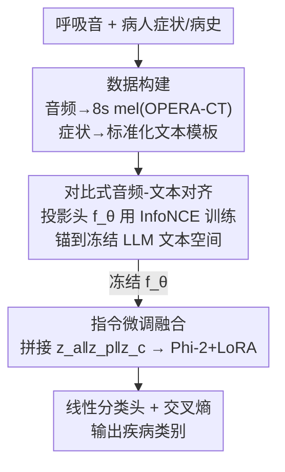

# RespiraMFM: 用对比式音频-语言对齐做呼吸疾病识别的多模态基础模型

**会议**: ACL 2026  
**arXiv**: [2606.09966](https://arxiv.org/abs/2606.09966)  
**代码**: 有（原文提供 Project Page + GitHub，缓存未给出确切 URL）  
**领域**: 音频/语音 / 医学多模态 / 对比学习  
**关键词**: 呼吸疾病识别, 音频-文本对齐, 对比学习, 多模态融合, 零样本

## 一句话总结
RespiraMFM 针对"咳嗽/喘鸣等非语言声学生物标记很难和症状文本对齐"这一痛点，提出**两阶段解耦**架构：先用对比学习把音频嵌入显式锚到 LLM 文本语义空间、再冻结这个对齐器去做指令微调分类，在五种呼吸疾病、九个任务上把有监督 AUROC 提升 9.15%、零样本提升 20.98%。

## 研究背景与动机

**领域现状**：呼吸疾病（COVID-19、结核 TB、慢阻肺 COPD、哮喘、肺炎）检测大量依赖音频——咳嗽声、听诊器录音。单模态音频模型（OPERA、HeAR、AST 对比学习等）已有不少，但只用声音能给的信息有限。于是出现了多模态做法：把呼吸音和临床文本（症状、病史、吸烟史等）结合，如 BTS 用 CLAP 抽特征接线性分类器、RespLLM 用 LLM 当文本编码器外加一个可训练线性投影器对齐维度。

**现有痛点**：把"语音-文本对齐"的现成做法直接搬到呼吸疾病上会出问题。语音里音频本身携带丰富的语义/句法信息，天然能和文本对齐；但呼吸疾病任务要融合的是**非语言声学生物标记**（咳嗽、喘鸣、爆裂音）和自由文本症状描述，两者根本不在一个语义层面。RespLLM 这类方法沿用语音那套"特征拼接 / 线性投影器 + 端到端统一训练"，于是有两个硬伤：其一，咳嗽声和病情文本在本质上错位，统一训练目标难以收敛到稳定的共享表示，两个模态都没用好；其二，这种低效融合和训练数据强耦合，模型只在域内疾病上表现好，遇到没见过的新疾病就零样本失效。

**核心矛盾**：线性投影器只做了**维度对齐**（把 768 维音频拍到 LLM 的 $d$ 维），却没做**语义对齐**——音频编码器和文本编码器各自独立训练，输出表示分布不同、跨模态并不兼容，单靠一个线性层和分类损失一起端到端学，既难收敛又不泛化。

**本文目标**：识别出"音频-文本语义错位"这个根因，并给一个简单有效的解法——在微调之前先专门做一阶段对齐，把声学特征语义锚定到症状概念上。

**切入角度**：借鉴 CLIP/CLAP 里对比学习能造出强多模态表示、且利于零样本的经验，把对齐从"端到端附带学"拆出来单独做。

**核心 idea**：两阶段解耦——先对比训练一个轻量投影头把音频显式对齐到冻结 LLM 的文本嵌入空间，再冻结它做指令微调分类。

## 方法详解

### 整体框架

RespiraMFM 是**两阶段、解耦**的训练架构。先做数据构建：把原始呼吸音和病人症状预处理成指令微调数据。第一阶段**模态对齐**——一个轻量投影头 $f_\theta$ 用对比学习单独训练，把高维音频特征映到 LLM 的语义嵌入空间，给投影头权重一个"语义锚定"的好初始化。第二阶段**指令微调**——冻结这个对齐器，把对齐后的音频嵌入与文本嵌入拼接，喂给 LLM（Phi-2 2.7B + LoRA）外加一个线性分类头，用交叉熵学疾病分类。关键在于：对齐和微调被拆开，对齐器学好后冻结，不再被分类损失"带歪"。

### 关键设计

**1. 两阶段解耦训练：把"语义对齐"从"端到端微调"里拆出来单独做**

针对"统一端到端训练难收敛、不泛化"的痛点，作者不再让投影器和 LLM 一起从分类损失学，而是分两步走：第一阶段只训对齐器、第二阶段冻结对齐器只训分类。这样做的好处是，对齐阶段有一个干净、专一的目标（让配对音频-文本靠近），不被下游分类信号干扰，能学到稳定的共享表示；微调阶段则直接复用这份已对齐的表示当好初始化。和 RespLLM 那种"线性投影器随 LLM 一起端到端训"的根本区别就在这里——解耦让对齐质量不再受制于和训练数据耦合的分类目标，因而显著改善了零样本泛化。

**2. 对比式音频-文本对齐：用 InfoNCE 把非语言声学标记锚到症状文本语义空间**

这是全文核心。用冻结的 OPERA-CT 音频编码器 $f_O$ 得到 768 维音频嵌入 $\mathbf{e}_a$、冻结 LLM 文本编码器 $f_T$ 得到 $d$ 维文本嵌入 $\mathbf{e}_t$，只训一个轻量投影头 $f_\theta:\mathbb{R}^{768}\to\mathbb{R}^{d}$。先做 L2 归一化 $\mathbf{z}_i^a=f_\theta(\mathbf{e}_i^a)/\|f_\theta(\mathbf{e}_i^a)\|$、$\mathbf{z}_i^t=\mathbf{e}_i^t/\|\mathbf{e}_i^t\|$，再用 InfoNCE 对比损失

$$\mathcal{L}_{\text{contrast}} = -\frac{1}{N}\sum_{i=1}^{N}\log\frac{\exp(\mathbf{z}_i^a\cdot\mathbf{z}_i^t/\tau)}{\sum_{j=1}^{N}\exp(\mathbf{z}_i^a\cdot\mathbf{z}_j^t/\tau)}$$

让配对的音频-症状靠近、不配对的推远，$\tau$ 是温度。它解决的是"线性投影器只对齐维度、不对齐语义"的问题：对比监督迫使咳嗽/喘鸣这类声学标记在语义上对到正确的症状概念上。论文用 t-SNE 可视化证实，对齐后的音频嵌入在 COVID/健康两类间聚类更清晰、更可分，这正是零样本泛化变好的来源。

**3. 数据构建 + 指令微调融合：把异构临床数据规整成统一指令，再拼接喂 LLM**

针对各数据集症状字段格式杂乱的现实，先做标准化：每段音频统一裁/补到 8 秒，用 64ms Hann 窗、32ms 步长经 OPERA-CT 转成 mel 频谱 $x_a$；表格里挑相关症状套标准模板生成文本 $x_c$；再配任务专属提示 $x_p$（如"判断是否患 COVID-19，输出 0/1"）。微调阶段三路嵌入在 embedding 层拼接 $z_{fusion}=z_a\,\|\,z_p\,\|\,z_c$，其中 $z_a=f_\theta(f_O(x_a))$ 用的正是冻结的对齐投影头。融合序列过 Phi-2（2.7B）取末 token 的 pooled 表示 $z_h$，接全连接分类头 + softmax，用交叉熵 $\mathcal{L}_{CE}=-\sum_i y_i\log(\hat{y}_i)$ 训练；LLM 用 LoRA（$r=16$、$\alpha=32$、dropout 0.1）做参数高效微调，编码器和对齐器全程冻结。

### 损失函数 / 训练策略

两阶段两套损失：对齐阶段用 InfoNCE $\mathcal{L}_{\text{contrast}}$ 只训投影头 $f_\theta$；微调阶段冻结 $f_\theta$、$f_O$、$f_T$，只用 LoRA + 分类头以交叉熵 $\mathcal{L}_{CE}$ 学分类。骨干 LLM 为 Phi-2 (2.7B)，训练 20 epoch、batch 16，4×A100-80GB。九个任务里 T1–T4 用于训练与域内评测、T5–T9 留作零样本（其中 T8 哮喘、T9 肺炎是训练完全没见过的新病）。

## 实验关键数据

### 主实验（有监督，T1–T4 域内 AUROC）

三次独立运行的均值。RespiraMFM 在四个任务上一致超过所有多模态基线，平均 AUROC 0.823，相对最强基线 RespLLM（0.754）提升 9.15%：

| 任务 | 数据集/疾病 | Qwen2-Audio | BTS | RespLLM | RespiraMFM | 相对提升 |
|------|------|------|------|------|------|------|
| T1 | UK COVID-19 | 0.855 | 0.898 | 0.881 | **0.910** | ↑1.41% |
| T2 | Coughvid / COVID | 0.561 | 0.595 | 0.613 | **0.673** | ↑9.79% |
| T3 | TBscreen / TB | 0.334 | 0.568 | 0.687 | **0.709** | ↑3.20% |
| T4 | ICBHI / COPD | 0.614 | 0.880 | 0.833 | **0.999** | ↑13.64% |
| 平均 | — | 0.591 | 0.735 | 0.754 | **0.823** | ↑9.15% |

### 零样本（T5–T9，含未见数据集与未见疾病）

平均 AUROC 0.738，相对 BTS（0.61）提升 20.98%；T8 哮喘、T9 肺炎是训练完全没出现过的新疾病：

| 任务 | 疾病 | BTS | RespLLM | RespiraMFM | 相对提升 |
|------|------|------|------|------|------|
| T6 | TB（未见集 CodaTB） | 0.645 | 0.669 | **0.689** | ↑2.99% |
| T7 | COPD（未见集 KAUH） | 0.491 | 0.425 | **0.829** | ↑42.74% |
| T8 | 哮喘（未见病） | 0.418 | 0.399 | **0.552** | ↑20.55% |
| T9 | 肺炎（未见病） | 0.595 | 0.400 | **0.709** | ↑19.29% |
| 平均(T5-T9) | — | 0.61 | 0.56 | **0.738** | ↑20.98%(vs BTS) |

### 消融实验

| 维度 | 配置 | 关键指标 | 说明 |
|------|------|---------|------|
| 模态 (Coswara, Acc) | 仅音频 | 0.6102 | 轻症/无症状时音频更准 |
| 模态 | 仅文本 | 0.7934 | 有症状/健康时文本更准 |
| 模态 | **音频+文本** | **0.8203** | 各严重度与总体均最优 |
| 对齐模块 (T5-T9) | 无对齐（线性投影器端到端） | 较低 | 零样本明显掉点 |
| 对齐模块 | **有对比对齐（冻结）** | 一致更高 | t-SNE 上两类更可分 |

### 关键发现
- **对齐模块是泛化关键**：去掉对比对齐、改回"线性投影器端到端"后，所有零样本任务 AUC 一致下降；t-SNE 显示对齐后 COVID/健康嵌入聚类更清晰，解释了零样本为何变好。
- **音频与文本互补**：轻症/无症状时音频更可靠、有症状/健康时文本更可靠，多模态在所有严重度分组上都压过任一单模态（0.8203 > 0.7934 > 0.6102）。
- **数据效率高**：在多模态配置下，用约一个数量级更少的训练数据就能逼近峰值性能，适合标注稀缺的临床场景；即便测试时只给音频，对齐阶段学到的更好嵌入空间仍让纯音频性能更强。
- **可解释**：[CLS] 注意力显示 COVID 患者样本上注意力集中在发烧、咳嗽、乏力等症状 token，健康样本上集中在"无症状/非吸烟"等否定 token，与临床直觉一致。

## 亮点与洞察
- **定位准、解法简**：把多模态失效归因到"语义错位而非维度不匹配"，再用"对齐前置 + 冻结"这一最小改动解决，是典型的"找对病因"型工作。
- **解耦带来零样本**：把对齐从端到端里拆出来单独对比训练，避免被分类损失带偏，直接换来 20%+ 的零样本提升——这条"先对齐再微调"的范式可迁移到其他非语言音频（心音、肠鸣音）+ 临床文本的诊断任务。
- **冻结编码器 + LoRA + 轻量投影头**：可训练参数极少却拿到 SOTA，工程上很友好，利于资源受限的医疗部署。
- **纯音频也吃到对齐红利**：对齐阶段改善了音频嵌入空间结构，使得推理时即便缺症状文本，纯音频也比基线强。

## 局限与展望
- **依赖症状元数据质量**：作者承认模型效果受症状元数据的质量与一致性影响，不同数据集/临床环境差异大。
- **评测数据不均衡**：COPD/哮喘/肺炎（T7-T9）样本远少于 COVID/TB，测试集偏小，这些病种的性能估计统计可靠性有限——T7 高达 ↑42.74% 的相对提升需结合 132 个样本的小测试集谨慎解读。
- **模态仍较窄**：只融合了音频 + 症状文本，作者指出引入医学影像、可穿戴传感器等模态有望进一步提升。
- **改进方向**：在更大更均衡的低资源病种数据上验证、并把对齐损失推广到更多临床模态。

## 相关工作与启发
- **vs RespLLM**：同样是 LLM + 音频多模态，但 RespLLM 用可训练线性投影器随 LLM 端到端训，只对齐维度不对齐语义；RespiraMFM 用对比学习前置对齐 + 冻结，主实验 +9.15%、零样本相对其 +32.02%。
- **vs BTS**：BTS 用 CLAP 抽双模态特征接线性分类器，零样本能力弱；RespiraMFM 的对比对齐 + LLM 指令微调在未见疾病上大幅领先（零样本平均 +20.98%）。
- **vs 单模态（OPERA、HeAR、AST 对比学习）**：它们只用音频、受限于声音信息量；RespiraMFM 引入症状文本并解决跨模态对齐，且即便退化到纯音频推理也因对齐而更强。
- **vs CLIP/CLAP**：借用其对比对齐造强多模态表示的思想，但针对"非语言声学标记 ↔ 自由症状文本"这一更难的对齐场景，并嵌入到两阶段诊断框架中。

## 评分
- 新颖性: ⭐⭐⭐⭐ 把"语义错位"诊断清楚 + 对齐前置的解法简洁有效，虽借鉴 CLIP 思想但场景与解耦设计有新意
- 实验充分度: ⭐⭐⭐⭐⭐ 五病九任务、七数据集、有监督/零样本/数据缩放/模态/对齐/可解释多组实验完整
- 写作质量: ⭐⭐⭐⭐ 动机—方法—实验链条清晰，个别小测试集的相对提升数值需 caveat
- 价值: ⭐⭐⭐⭐⭐ 给标注稀缺、需零样本泛化的临床呼吸诊断提供了可部署的多模态范式

<!-- RELATED:START -->

## 相关论文

- [\[ACL 2026\] MTR-DuplexBench: Towards a Comprehensive Evaluation of Multi-Round Conversations for Full-Duplex Speech Language Models](mtr-duplexbench_towards_a_comprehensive_evaluation_of_multi-round_conversations_.md)
- [\[ACL 2026\] Speech-Hands: A Self-Reflection Voice Agentic Approach to Speech Recognition and Audio Reasoning with Omni Perception](speech-hands_a_self-reflection_voice_agentic_approach_to_speech_recognition_and_.md)
- [\[ACL 2026\] Analyzing Reasoning Shifts in Audio Deepfake Detection under Adversarial Attacks: The Reasoning Tax versus Shield Bifurcation](analyzing_reasoning_shifts_in_audio_deepfake_detection_under_adversarial_attacks.md)
- [\[ACL 2026\] SegTune: Structured and Fine-Grained Control for Song Generation](segtune_structured_and_fine-grained_control_for_song_generation.md)
- [\[ACL 2026\] Multimodal In-Context Learning for ASR of Low-Resource Languages](multimodal_in-context_learning_for_asr_of_low-resource_languages.md)

<!-- RELATED:END -->
