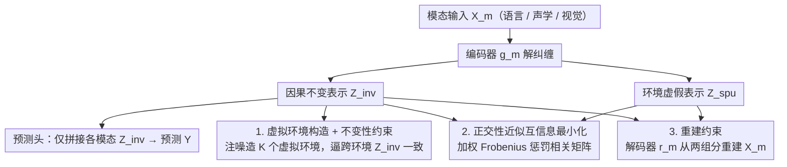

# Learning Invariant Modality Representation for Robust Multimodal Learning from a Causal Inference Perspective

**会议**: ACL 2026  
**arXiv**: [2604.18460](https://arxiv.org/abs/2604.18460)  
**代码**: [GitHub](https://github.com/TmacMai/CmIR)  
**领域**: 音频语音  
**关键词**: 因果不变表示, 多模态情感分析, 分布外泛化, 特征解纠缠, 虚拟环境

## 一句话总结

本文提出 CmIR（因果模态不变表示学习），基于因果推理理论将每种模态显式解纠缠为因果不变表示和环境特定虚假表示，通过不变性约束+互信息约束+重建约束的优雅目标函数确保不变表示具有跨环境的稳定预测关系，在多模态情感/幽默/讽刺检测上取得 SOTA，尤其在 OOD 和噪声场景下表现突出。

## 研究背景与动机

**领域现状**：多模态情感计算通过整合语言/声学/视觉模态预测情感。现有方法在同分布测试上表现良好，但往往学习了训练数据中的虚假跨模态相关性。

**现有痛点**：(1) 模型可能过度依赖说话者一贯的微笑（虚假视觉特征）而非语义内容；(2) 噪声模态（如背景噪声/低分辨率视频）进一步破坏虚假相关性，加剧泛化差距；(3) 现有因果方法要么缺乏理论保证，要么只针对特定偏差（如说话者偏差），不通用。

**核心矛盾**：需要一种通用的框架来区分因果特征和虚假特征——不依赖对偏差类型的先验假设，不需要预定义的偏差标签。

**本文目标**：基于因果推理建立有理论保证的通用框架，将每种模态解纠缠为因果不变和环境虚假两个组分。

**切入角度**：因果不变表示的核心性质是跨环境的预测稳定性——如果 $P(Y|Z_m^{\text{inv}}, E=e_1) = P(Y|Z_m^{\text{inv}}, E=e_2)$，则 $Z_m^{\text{inv}}$ 只包含因果特征。

**核心 idea**：通过三约束优化学习解纠缠：不变性约束确保跨环境预测一致，互信息约束确保两组分独立，重建约束确保无信息丢失。在缺乏显式环境标签时，通过向原始特征注入不同强度的噪声模拟虚拟环境。

## 方法详解

### 整体框架

CmIR 把每种模态都拆成「因果不变」和「环境虚假」两半，只让前者参与预测，从而把训练数据里那些偶然的跨模态相关性挡在决策之外。给定模态输入 $X_m$，编码器 $g_m$ 将其解纠缠为 $(Z_m^{\text{inv}}, Z_m^{\text{spu}})$，预测头仅消费所有模态不变表示的拼接 $\{Z_m^{\text{inv}}\}_{m=1}^M$；与此同时解码器 $r_m$ 要能从这两半重建回原始输入。训练时模型沿着「编码解纠缠 → 不变表示预测 + 三项约束 → 解码重建」的回路联合优化，三项约束分别从因果性、纯净性、完整性三个角度把解纠缠钉牢，使不变表示真正只承载跨环境稳定的因果信号。

### 关键设计

**1. 虚拟环境构造 + 不变性约束：在没有环境标签时也能逼出跨环境不变性**

因果不变表示的判定性质是跨环境预测稳定，但绝大多数多模态数据集并不带显式环境标签。CmIR 的做法是为每个样本随机分配一个虚拟环境 $e\in\{1,\dots,K\}$，并按强度 $\alpha^{(e)}=\alpha^{(1)}\cdot e$ 注入加性高斯噪声来人工制造环境差异，再要求不同环境下提取出的不变表示彼此一致：$\mathcal{R}_{\text{inv}}^{(m)}=\sum_{e_1\neq e_2}\|Z_m^{\text{inv},(e_1)}-Z_m^{\text{inv},(e_2)}\|_1$。相比 KL 散度形式的约束，这种 L1 一致性更强——同一输入经不同扰动后若要求表示完全相等，分布自然也必然相同——而且分类与回归任务通用，无需额外训练单模态预测器。

**2. 正交性近似的互信息最小化：用相关矩阵的加权 Frobenius 惩罚逼近独立性**

要让不变与虚假两组分真正分担不同语义，理想目标是最小化二者互信息，但互信息本身不可直接计算。CmIR 退而求其次地用正交性这个独立性的必要条件来近似：在每个 batch 内计算归一化相关矩阵 $\bm{C}^m=\text{Nor}(\bm{Z}_m^{\text{inv}})\cdot\text{Nor}(\bm{Z}_m^{\text{spu}})^\top$，再以加权 Frobenius 范数惩罚之——对角项（同一样本两组分的正交性）权重为 1，非对角项权重取 $\alpha<1$。这一项与下面的不变性、重建约束协同作用，才足以把语义稳定地切成两半。

**3. 重建约束防止退化：逼两组分共同保留输入的全部信息**

若只有不变性与正交约束，模型可能滑向退化解：不变组分独吞所有信息而虚假组分塌成空，或者反过来。CmIR 因此引入解码器 $r_m$，要求从两组分能重建回原始特征：$\mathcal{R}_{\text{rec}}^{(m)}=\|X_m-r_m(Z_m^{\text{inv}},Z_m^{\text{spu}})\|_2^2$。重建项保证解纠缠是「分工」而非「丢弃」，使两组分合起来仍是输入的完整表达，从信息层面堵死了平凡解。

### 损失函数 / 训练策略

总目标把预测损失与三项模态级约束相加：$\mathcal{L}=\mathcal{L}_{\text{pred}}+\sum_{m=1}^{M}\lambda_1\mathcal{R}_{\text{inv}}^{(m)}+\lambda_2\mathcal{R}_{\text{dec}}^{(m)}+\lambda_3\mathcal{R}_{\text{rec}}^{(m)}$，其中 $\lambda_1,\lambda_2,\lambda_3$ 分别平衡不变性、独立性与重建。理论上作者给出三个定理的完整证明：不变表示的存在性、可提取性，以及其相对虚假表示的 OOD 风险优势，为整套约束提供了支撑。

## 实验关键数据

### 主实验

在 CMU-MOSI/MOSEI/CH-SIMS-v2（情感）+ UR-FUNNY（幽默）+ MUStARD（讽刺）上评估。CmIR 在标准和 OOD 设置下均取得 SOTA。

### 关键发现

- OOD 设置下（CMU-MOSI OOD），CmIR 的优势更加明显——证实了因果不变表示的泛化优势
- 噪声模态测试中，CmIR 的退化幅度远小于基线——虚假组分的隔离使模型对噪声更鲁棒
- 消融证明三个约束都不可或缺——去掉任一约束都导致性能下降

## 亮点与洞察

- 三约束框架的设计非常优雅——不变性确保"因果性"，正交性确保"纯净性"，重建确保"完整性"，三者缺一不可
- 虚拟环境构造是一个实用的折中——虽然不如真实环境标签精确，但在多数数据集没有环境标签的现实下提供了可行方案
- 理论保证（三个定理）为框架提供了坚实的理论基础

## 局限与展望

- 虚拟环境的构造依赖于加性高斯噪声假设，可能不完全反映真实的分布偏移
- 超参数（环境数K、噪声系数α、三个λ）需要调优
- 编码器/解码器均为简单MLP，更强的架构可能进一步提升

## 相关工作与启发

- **vs IRM**: 针对单模态的不变风险最小化，CmIR 将其扩展到多模态解纠缠
- **vs 现有多模态因果方法**: 针对特定偏差（说话者/模态），CmIR 是通用的不依赖偏差假设的框架

## 评分

- 新颖性: ⭐⭐⭐⭐⭐ 首次在MAC中系统地将因果不变表示学习与特征解纠缠结合
- 实验充分度: ⭐⭐⭐⭐⭐ 6数据集+标准/OOD/噪声设置+完整消融+理论证明
- 写作质量: ⭐⭐⭐⭐⭐ 理论推导严谨，实验全面
- 价值: ⭐⭐⭐⭐⭐ 对多模态鲁棒性研究有范式级贡献

<!-- RELATED:START -->

## 相关论文

- [\[ICLR 2026\] Learning Robust Intervention Representations with Delta Embeddings](../../ICLR2026/causal_inference/learning_robust_intervention_representations_with_delta_embeddings.md)
- [\[ICLR 2026\] Beyond DAGs: A Latent Partial Causal Model for Multimodal Learning](../../ICLR2026/causal_inference/beyond_dags_a_latent_partial_causal_model_for_multimodal_learning.md)
- [\[ACL 2026\] Function Words as Statistical Cues for Language Learning](function_words_as_statistical_cues_for_language_learning.md)
- [\[ECCV 2024\] Integrating Markov Blanket Discovery into Causal Representation Learning for Domain Generalization](../../ECCV2024/causal_inference/integrating_markov_blanket_discovery_into_causal_representation_learning_for_dom.md)
- [\[ICML 2025\] Learning Time-Aware Causal Representation for Model Generalization in Evolving Domains](../../ICML2025/causal_inference/learning_time-aware_causal_representation_for_model_generalization_in_evolving_d.md)

<!-- RELATED:END -->
