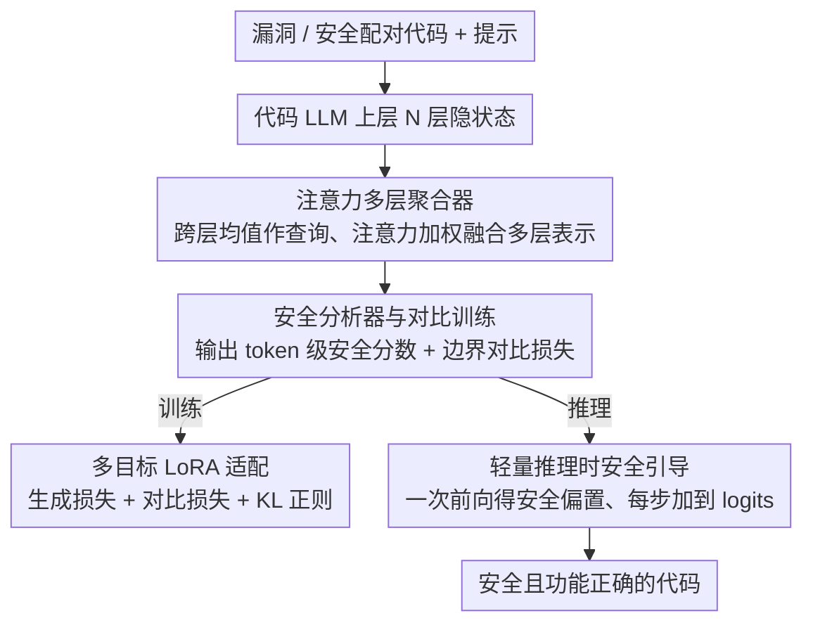

# DeepGuard: Secure Code Generation via Multi-Layer Semantic Aggregation

**会议**: ACL 2026  
**arXiv**: [2604.09089](https://arxiv.org/abs/2604.09089)  
**代码**: [https://github.com/unknownhl/DeepGuard](https://github.com/unknownhl/DeepGuard)  
**领域**: 代码智能 / 安全  
**关键词**: 安全代码生成, 多层聚合, 漏洞检测, 对比学习, 推理引导

## 一句话总结
提出 DeepGuard，通过注意力机制聚合 Transformer 上层多层表示克服"最终层瓶颈"问题，结合多目标训练和轻量推理时安全引导策略，在 5 个代码 LLM 上将安全-正确生成率平均提升 11.9%。

## 研究背景与动机

**领域现状**：代码 LLM 在代码生成中表现出色，GitHub Copilot 据报辅助生成了平台上高达 46% 的代码。但这些模型也会复制训练数据中的不安全编码模式——约 40% 的 Copilot 生成代码包含漏洞，且开发者常无法识别这些 AI 生成的缺陷。

**现有痛点**：现有安全加固方法（如 SVEN 的前缀调优、SafeCoder 的安全指令微调）几乎都从最终 Transformer 层提取监督信号。但最终层表示主要为下一个 token 预测优化，而非精细的漏洞区分。作者发现漏洞判别信号在中间到上层最强，到最终层反而衰减——即"最终层瓶颈"。

**核心矛盾**：防止不安全代码需要整合多样的句法和语义证据（如识别字符串拼接的句法模式+推理不可信数据流的语义属性），但这些信息在 Transformer 层间分布——浅层捕捉局部句法，深层编码抽象语义，最终层却以牺牲漏洞区分力为代价优化了 token 预测。

**本文目标**：利用模型内部多层分布的安全相关线索，而非仅依赖最终层，提升安全代码生成。

**切入角度**：通过逐层线性探针诊断——在每层训练线性分类器检测漏洞模式，发现探针置信度在中间-上层达到峰值，向最终层衰减。

**核心 idea**：用注意力机制聚合上层多层隐状态，构建比单一最终层更强的安全分析信号，支撑多目标训练和推理时引导。

## 方法详解

### 整体框架
DeepGuard 要解决的是「最终层瓶颈」：代码 LLM 的漏洞判别信号在中到上层最强、到最终层反而衰减，而以往加固方法全从最终层取信号。它的做法是把 Transformer 上层多层隐状态聚合成一个比单层更强的安全分析信号，再拿这个信号同时支撑训练和推理两条链路。训练阶段在（漏洞代码 / 安全代码）配对数据上用 LoRA 做多目标适配（安全对比损失 + 生成损失 + KL 正则）；推理阶段用轻量的提示条件偏置把解码拉向安全 token。

### 关键设计

**1. 注意力多层聚合器：让模型自适应选层**

不同 Transformer 层对不同类型漏洞的敏感度不同——浅层捕句法、深层编语义，固定权重的融合不如让注意力自适应挑选。具体做法是：对每个 token 位置 $j$，取上层 $N$ 层的隐状态堆叠为 $h^{(j)} \in \mathbb{R}^{N \times D}$，用跨层均值作为查询向量提供「共识」摘要，再通过注意力加权融合 $h_{agg}^{(j)} = \text{Softmax}(\frac{QK^\top}{\sqrt{D}})V$，让模型自适应地去关注对安全分析最有价值的那几层。这样聚合出的表示比任何单层（尤其是被 token 预测抢占了语义的最终层）都更适合漏洞判别。

**2. 安全分析器与对比训练：直接学“安全 vs 漏洞”的可分性**

单纯把代码分成安全/不安全两类不够稳健，作者改用对比学习直接拉开两者距离。安全分析器 $f_{sa}$ 消费聚合表示 $H_{agg}$ 和学习的 token 级安全嵌入 $E_{sec}$，输出每个 token 的安全分数 $s_i(x) \in [0,1]$。对每对（漏洞，安全）代码计算序列级分数，并施加边界对比损失 $\mathcal{L}_{sec} = \max(0, \Delta - (s_{sec} - s_{vul}))$，强制安全样本的分数高出漏洞样本一个边界 $\Delta$。对 $E_{sec}$ 的语义分析显示模型确实学到了有意义的安全/不安全 token 关联。

**3. 轻量推理时安全引导：一次前向传播全程复用**

若每步解码都重跑一遍安全分析器，开销不可接受，所以作者把安全信号提前凝成一个偏置。训练时统计安全/漏洞样本中各 token 的出现倾向，得到 token 级安全先验向量 $T_{stats}$；推理时只对输入提示做一次前向传播拿到安全分数 $\bar{s}_{prompt}$，计算偏置 $b = (1 - \bar{s}_{prompt}) \cdot T_{stats}$——提示越不安全偏置越强——然后每步解码都把这个偏置加到 logits 上。整个额外开销只是一次前向 + 一次 logit 加法，部署几乎无感。

### 损失函数 / 训练策略
$\mathcal{L}_{total} = \mathcal{L}_{gen} + w_{sec}\mathcal{L}_{sec} + w_{kl}\mathcal{L}_{kl}$，其中 $\mathcal{L}_{gen}$ 是安全代码上的标准生成损失，$\mathcal{L}_{kl}$ 是与冻结基础模型的 KL 散度防止灾难遗忘，全部适配通过 LoRA 完成。

## 实验关键数据

### 主实验（Qwen2.5-Coder-3B）

| 方法 | pass@1 | sec@1_pass | sec-pass@1 | SVEN-SR |
|------|--------|-----------|------------|---------|
| Base | 91.00 | 76.47 | 69.59 | 77.95 |
| SVEN | 83.00 | 84.90 | 70.47 | 82.60 |
| SafeCoder | 63.94 | 82.34 | 52.65 | 87.02 |
| **DeepGuard** | **86.65** | **93.21** | **80.76** | **94.11** |

### 消融实验

| 配置 | 说明 |
|------|------|
| 仅最终层（标准方法） | 安全信号弱，改进有限 |
| 多层均值融合 | 比最终层好但不如注意力融合 |
| 注意力多层聚合 | **最优**，自适应选择最相关层 |
| w/o 推理引导 | 训练阶段改进保留但推理时无额外保护 |

### 关键发现
- DeepGuard 在 5 个模型上平均提升 sec-pass@1 11.9%，同时基本保持功能正确性
- 安全嵌入 $E_{sec}$ 的语义分析显示模型确实学到了有意义的安全/不安全 token 关联
- 对训练时未见的漏洞类型（held-out CWEs）也展现了泛化能力

## 亮点与洞察
- **逐层线性探针诊断**提供了直接证据支持"最终层瓶颈"假说——这种诊断方法论可推广到理解 Transformer 其他任务中的信息分布
- **推理时引导的极轻量设计**——仅一次额外前向传播和 logit 加法，实际部署开销可忽略
- **安全-正确权衡**处理得当——很多基线为了安全牺牲了大量功能正确性（如 SafeCoder pass@1 仅 63.94%），DeepGuard 在显著提升安全性的同时保持 86.65% 的 pass@1

## 局限与展望
- token 级安全先验 $T_{stats}$ 是粗粒度的统计关联，可能在特定语境下给出错误偏置
- 训练数据需要配对的漏洞/安全代码，这类数据的获取成本较高
- 目前仅在 Python 代码上验证，跨语言泛化性未知

## 相关工作与启发
- **vs SVEN**：使用前缀调优从最终层提取信号，受限于最终层瓶颈；DeepGuard 聚合多层
- **vs SafeCoder**：通过安全指令微调，牺牲大量功能正确性；DeepGuard 通过多目标训练平衡两者

## 评分
- 新颖性: ⭐⭐⭐⭐ 多层聚合思路清晰，诊断+解决方案完整
- 实验充分度: ⭐⭐⭐⭐⭐ 5 个模型、多基线、泛化测试、消融充分
- 写作质量: ⭐⭐⭐⭐ 从诊断到方案的逻辑链清晰
- 价值: ⭐⭐⭐⭐ 对安全代码生成有直接实用价值

<!-- RELATED:START -->

## 相关论文

- [\[ACL 2026\] SecureVibeBench: Evaluating Secure Coding Capabilities of Code Agents with Realistic Vulnerability Scenarios](securevibebench_evaluating_secure_coding_capabilities_of_code_agents_with_realis.md)
- [\[ACL 2026\] MARS2: Scaling Multi-Agent Tree Search via Reinforcement Learning for Code Generation](mars2_scaling_multi-agent_tree_search_via_reinforcement_learning_for_code_genera.md)
- [\[ACL 2026\] Sense and Sensitivity: Examining the Influence of Semantic Recall on Long Context Code Understanding](sense_and_sensitivity_examining_the_influence_of_semantic_recall_on_long_context.md)
- [\[ACL 2026\] QAQ: Bidirectional Semantic Coherence for Selecting High-Quality Synthetic Code Instructions](qaq_bidirectional_semantic_coherence_for_selecting_high-quality_synthetic_code_i.md)
- [\[AAAI 2026\] MoSE: Hierarchical Self-Distillation Enhances Early Layer Embeddings](../../AAAI2026/code_intelligence/mose_hierarchical_self-distillation_enhances_early_layer_embeddings.md)

<!-- RELATED:END -->
