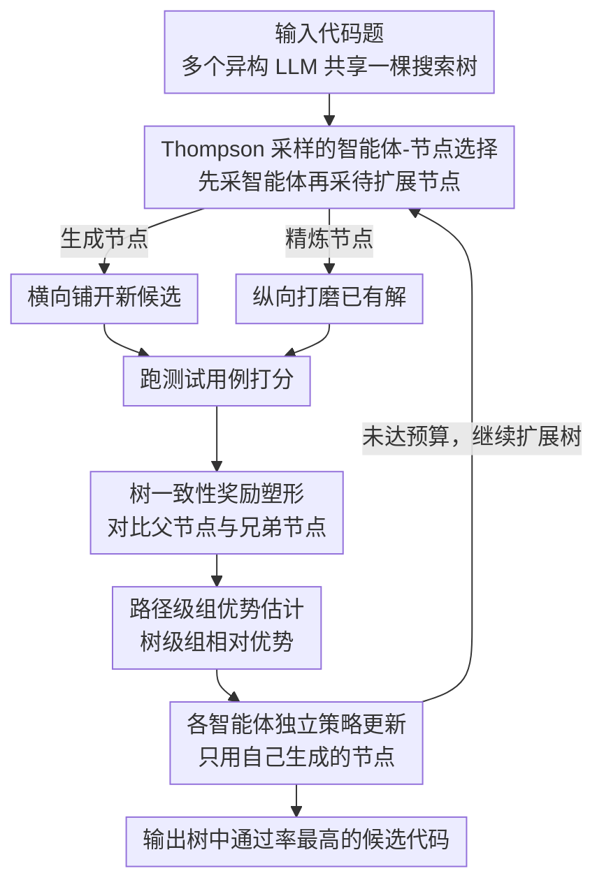

# MARS2: Scaling Multi-Agent Tree Search via Reinforcement Learning for Code Generation

**会议**: ACL 2026  
**arXiv**: [2604.14564](https://arxiv.org/abs/2604.14564)  
**代码**: [https://github.com/TsinghuaC3I/MARTI](https://github.com/TsinghuaC3I/MARTI)  
**领域**: 代码智能  
**关键词**: 多智能体, 树搜索, 强化学习, 代码生成, GRPO

## 一句话总结

MARS2 提出多智能体强化树搜索框架，将多个独立优化的策略嵌入共享搜索树中协作探索，通过 Thompson 采样选择智能体-节点对、树一致性奖励塑形和路径级组优势估计，在代码生成基准上一致提升单模型 Pass@1 最高 8.0%、系统级 Pass@1(MCTS) 最高 6.5%。

## 研究背景与动机

**领域现状**：GRPO 等 RLVR 范式在代码生成等推理任务上取得显著进展。搜索增强 RL（如 TreeRL）通过引入 MCTS 树结构提供更多样的探索信号。多智能体 RL（MARL）通过多策略交互产生非平稳数据分布，有望突破单策略探索的限制。

**现有痛点**：(1) 单智能体树搜索受限——整棵搜索树由单一策略分布驱动，训练后期搜索行为集中在少数高概率分支，探索增益递减；(2) 多智能体方法与结构化搜索脱节——现有多智能体推理框架（辩论、投票等）仅做轻量级协调，缺乏分支、回溯和预算分配等结构化搜索支持。

**核心矛盾**：单策略搜索会收敛到局部最优（挑战1），多智能体协作缺乏搜索结构（挑战2）。需要将两者统一。

**本文目标**：构建一个多智能体协作的树搜索 RL 框架，使异构智能体在共享搜索树中协作生成和精炼候选解。

**切入角度**：将搜索树视为可学习的多智能体交互环境，不同智能体贡献不同的策略先验，通过 Thompson 采样动态分配探索预算。

**核心 idea**：多智能体在共享搜索树上协作扩展节点，每个智能体独立优化，奖励信号通过树一致性奖励塑形结合父节点和兄弟节点信息，路径级组优势确保跨复杂搜索轨迹的稳定信用分配。

## 方法详解

### 整体框架

MARS2 要解决的问题是：单策略驱动的树搜索训练后期会收敛到少数高概率分支，探索增益递减；而多智能体协作又往往停留在辩论、投票等轻量协调，缺乏分支与回溯。MARS2 把这两条线索拧成一股——让多个独立优化的异构 LLM（如 Qwen3 与 AReaL）共享同一棵搜索树。一道代码题输入后，每一步先用 Thompson 采样挑出一个智能体、再挑出一个待扩展节点，对生成节点横向铺开新候选、对精炼节点纵向打磨已有解；扩展出的每个节点跑测试用例拿到奖励，经过树一致性奖励塑形与路径级组优势的加工后，分别回流给各自的智能体做独立的策略更新，最终输出树中通过率最高的候选代码。

### 关键设计

**1. Thompson 采样的智能体-节点选择：把探索预算交给"谁更可能赢"来分**

异构智能体各有所长，固定轮询或贪心选择都会浪费预算在不擅长的分支上。MARS2 为每个智能体-节点对维护一个 Beta 先验，扩展时先对智能体做 Thompson 采样、再在该智能体的可扩展节点上做一次 Thompson 采样。节点被区分为生成节点（新建候选，横向探索）与精炼节点（改进已有候选，纵向深入），采样的随机性天然地在两类动作和强弱智能体之间维持探索-利用平衡，把更多扩展机会自适应地导向当前更有前景的智能体。

**2. 树一致性奖励塑形：好不好不只看绝对分，还要看比父辈和同辈强多少**

纯全局树级奖励无法表达"这个子节点相对它的来路是不是进步"。MARS2 对每个非根节点 $v$ 构造混合基线 $b(v) = (1-\lambda) r_{p(v)} + \lambda \cdot \mu_{C(p(v)) \setminus v}$，把父节点奖励 $r_{p(v)}$ 与兄弟节点平均奖励 $\mu_{C(p(v))\setminus v}$ 按 $\lambda$ 加权——前者度量纵向改进，后者度量横向竞争。由此得到结构一致性增益 $\Delta(v) = r_v - b(v)$，塑形后奖励为 $\hat{r}_v = r_v + \gamma \cdot \Delta(v)$。这样一个节点只有同时跑赢自己的来路和身边的兄弟，才能拿到额外加成，从而在协作中鼓励出真正有分工、有递进的探索路径。

**3. 路径级组优势估计：把 GRPO 的组相对基线从并行采样搬到树上**

标准 GRPO 假设一组轨迹是从同一 prompt 并行独立采样得到的，但树搜索里的节点带有父子和兄弟的层次依赖，i.i.d. 假设不成立。MARS2 注意到一棵树中所有节点都源自同一道题，本身就构成天然的语义分组，于是直接在塑形后奖励上计算树级组相对优势 $\hat{A}_{v,j} = (\hat{r}_{v,j} - \text{mean}) / \text{std}$。关键在于每个智能体只用自己生成的那些节点来更新参数，既复用了整棵树的统计基线，又避免了把别人的轨迹错误地归功到自己头上。

### 损失函数 / 训练策略

在上述优势估计之上，MARS2 把 GRPO 目标扩展为多智能体版本：每个智能体独立优化自己的策略，沿用 DAPO 的 clip-higher 技巧放宽上侧裁剪以保留探索，并加 KL 正则约束。训练数据为过滤后的 DeepCoder 7992 道代码生成题，评估基准为 LiveCodeBench v6（2025.01–05）。

## 实验关键数据

### 主实验

| 模型/系统 | 方法 | Pass@1 | Pass@1(MCTS) | Pass@N |
|-----------|------|--------|-------------|--------|
| Qwen3-8B | Base | 50.3 | 54.3 | 68.6 |
| Qwen3-8B | GRPO | 52.5 (+2.2) | 57.1 (+2.8) | 73.1 |
| Qwen3-8B | RS2 | 55.4 (+5.1) | 60.6 (+6.3) | 71.4 |
| Qwen3-8B | **MARS2** | **58.3 (+8.0)** | **60.8 (+6.5)** | 72.3 |
| AReaL-14B | GRPO | 58.9 (+0.5) | 60.7 (-2.2) | 75.4 |
| AReaL-14B | **MARS2** | **64.6 (+6.2)** | **68.1 (+5.2)** | 80.2 |

### 消融实验

| 配置 | 关键指标 | 说明 |
|------|---------|------|
| GRPO (单智能体无搜索) | +2.2 Pass@1 | 基线 |
| RS2 (单智能体+树搜索) | +5.1 Pass@1 | 搜索结构有用 |
| MARS2 (多智能体+树搜索) | +8.0 Pass@1 | 多智能体进一步提升 |
| 加入弱智能体 (DeepCoder) | 性能仍提升 | 对智能体异质性鲁棒 |

### 关键发现

- MARS2 在所有模型上一致超越 GRPO 和单智能体树搜索（RS2），Pass@1 提升最高 8.0%
- 对已高度优化的代码模型（AReaL），GRPO 几乎无效甚至退化，MARS2 仍能提升 6.2%
- 多智能体系统级 Pass@1(MCTS) 提升最高 6.0%，证明多智能体训练确实产生了互补的策略
- 引入弱智能体（DeepCoder-14B）后性能仍有提升，说明框架对智能体异质性鲁棒
- AReaL-14B 在 MARS2 下达到 64.6% Pass@1，超过 O4-Mini (Low) 的 63.7%

## 亮点与洞察

- 将搜索树视为"可学习的多智能体交互环境"而非静态采样过程，是范式创新。每个节点扩展都是智能体间的协作决策
- 树一致性奖励塑形同时考虑纵向改进（vs 父节点）和横向竞争（vs 兄弟节点），是多智能体信用分配在树结构上的自然推广
- 实验设计严谨：训练和推理配置明确分离，所有方法共享相同数据预算和推理框架

## 局限与展望

- 仅在代码生成上评估，数学推理等其他 RLVR 场景待验证
- 智能体数量固定为 2，更多智能体的 scaling 行为未探索
- Thompson 采样的先验更新规则较简单，更复杂的 bandit 策略可能更优
- 多智能体训练需要同时运行多个模型，GPU 资源需求倍增

## 相关工作与启发

- **vs TreeRL**: TreeRL 用单策略驱动搜索树，训练后期探索增益递减。MARS2 引入多策略打破单策略先验的限制
- **vs MAPoRL**: MAPoRL 用多智能体对话协作但缺乏搜索结构。MARS2 将多智能体嵌入树搜索，提供分支和回溯支持

## 评分

- 新颖性: ⭐⭐⭐⭐⭐ 首次将多智能体 RL 与树搜索统一，树一致性奖励塑形设计精巧
- 实验充分度: ⭐⭐⭐⭐ 多模型、多规模，但仅代码生成任务
- 写作质量: ⭐⭐⭐⭐ 框架清晰，公式严谨
- 价值: ⭐⭐⭐⭐⭐ 为搜索增强 RL 提供了新范式，性能提升显著

<!-- RELATED:START -->

## 相关论文

- [\[AAAI 2026\] ReCode: Updating Code API Knowledge with Reinforcement Learning](../../AAAI2026/code_intelligence/recode_updating_code_api_knowledge_with_reinforcement_learning.md)
- [\[ACL 2026\] CodeRL+: Improving Code Generation via Reinforcement with Execution Semantics Alignment](coderl_improving_code_generation_via_reinforcement_with_execution_semantics_alig.md)
- [\[ACL 2026\] ChipSeek: Optimizing Verilog Generation via EDA-Integrated Reinforcement Learning](chipseek_optimizing_verilog_generation_via_eda-integrated_reinforcement_learning.md)
- [\[ACL 2025\] Tree-of-Code: A Tree-Structured Exploring Framework for End-to-End Code Generation](../../ACL2025/code_intelligence/tree-of-code_a_tree-structured_exploring_framework_for_end-to-end_code_generatio.md)
- [\[ICLR 2026\] ReasoningBank: Scaling Agent Self-Evolving with Reasoning Memory](../../ICLR2026/code_intelligence/reasoningbank_scaling_agent_self-evolving_with_reasoning_memory.md)

<!-- RELATED:END -->
