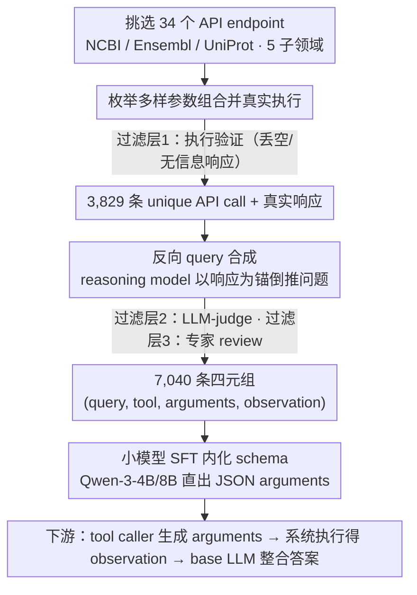

# BioTool: A Comprehensive Tool-Calling Dataset for Enhancing Biomedical Capabilities of Large Language Models

**会议**: ACL 2026  
**arXiv**: [2605.05758](https://arxiv.org/abs/2605.05758)  
**代码**: https://github.com/gxx27/BioTool  
**领域**: 计算生物  
**关键词**: 生物医学工具调用、NCBI/Ensembl/UniProt、指令微调、小模型超越商业大模型

## 一句话总结
BioTool 构建了一个覆盖 NCBI / Ensembl / UniProt 三大生物医学数据库 34 个常用工具、7,040 条经人工核验的「查询–API 调用」对的指令微调数据集，用它微调 4B 量级开源 LLM 后，工具调用质量超过 GPT-5.1 / Gemini-3 Pro / Claude-4.5-Sonnet 等商业大模型 15% 以上。

## 研究背景与动机

**领域现状**：通用领域已经有 Toolformer / Gorilla / ToolBench / APIGen 等成熟的工具调用数据集与微调流水线；而在生物医学领域，主流做法仍然是 GeneGPT / ChemCrow / Biomni 这类基于 in-context learning 的 agent，把若干工具的文档塞进 prompt 里让模型现学现用。

**现有痛点**：in-context 方式存在三重瓶颈：(1) 受 context length 限制，工具数量很小（GeneGPT 只覆盖 NCBI 一小撮 API）；(2) 生物医学 API 的参数 schema 极其复杂，单靠几行 prompt 描述无法覆盖各种调用场景；(3) 把自然语言问题映射到专业 schema、identifier、参数规范的难度远高于通用工具，hallucination 严重。

**核心矛盾**：通用工具调用数据集再大，里面包含的生物医学工具也只是「沧海一粟」，无法让 LLM 在 BLAST、Variation API、UniProt sequence query 这种需要严格 schema 的场景里给出可执行调用。要让 LLM 真正成为生物医学研究者的助手，必须有一份「数据库原生」的高质量工具调用语料。

**本文目标**：(1) 系统性地从三大权威生物医学数据库挑选高频工具；(2) 自动化批量合成「查询–API 调用」对并保证语义有效；(3) 用这份数据微调中小开源 LLM，把工具调用能力打到甚至超过顶级闭源大模型。

**切入角度**：作者反向构造数据——先从工具文档枚举出多样化的 API 参数组合并实际执行，再以「真实可用的 API 响应」为种子，用 reasoning model 反推「能被这个响应回答的用户 query」，最后让 LLM judge + 人工专家把关。这种「先有正确答案再造问题」的范式天然规避了 query 与 API 错配的标注噪声。

**核心 idea**：用「response-grounded 反向 query 合成 + 多轮 LLM/人工过滤」替代「人工撰写 query→人工标 API」的传统范式，把生物医学工具调用语料的规模和质量同时拉上去，让 4B 模型在专业 schema 上超过 200×参数量的闭源模型。

## 方法详解

### 整体框架

BioTool 的核心不是模型而是一条"先有答案再造问题"的数据构造流水线，目标是产出一份数据库原生、schema 严格的生物医学工具调用语料。整条流水线分四步：先人工从 NCBI / Ensembl / UniProt 三大数据库挑出 34 个研究者高频使用的 API endpoint，覆盖变异、基因组、蛋白质组、进化、通识生物五大子领域；再把每个工具的官方文档喂给 LLM 枚举多样化参数组合并真实执行，丢掉返回空或无信息的样本，得到 3,829 条 unique API call；接着给 reasoning model 输入「API call + 真实响应」，让它反推一条"能被这条响应支撑回答"的自然语言 query；最后经 LLM-judge 加生物学专家逐条人工 review，留下 7,040 条 (query, tool info, API arguments, observation) 四元组。下游使用时把任务解耦成 tool caller 与 answer generator——微调后的小模型只负责生成 API arguments，系统执行拿到 observation，再由 base LLM 把 observation 整合进最终答案。

### 关键设计

**1. Response-grounded 反向 query 合成：先锚定可用响应，再倒推问题**

传统做法是人工先写 query 再标注对应 API，结果常常出现"API 响应根本回答不了这个 query"的错配噪声。BioTool 反过来做：先随机生成多样化的 API 参数组合并实际执行，筛出那些确实能返回有用信息的 (API call, response)，再以这条真实响应为锚，让 reasoning model 编出最合理的用户问题。由于响应已经把"可回答性"内嵌进了数据，query 必然被 API 支撑，从源头消除了对齐噪声。这一反向范式之所以奏效，是因为凭空写生物医学 query 需要大量 domain 知识、极易 hallucination，而以真实响应为种子写问题，比正向标注更容易控制质量。

**2. 三层过滤漏斗：执行验证 + LLM-judge + 专家 review**

为保证 7,040 条数据在生物学正确性、API schema 合规性、query-response 对齐性三个维度都达标，BioTool 设了三道漏斗：第一层是执行验证，API 必须真能返回非空响应；第二层是 LLM-judge，评估"响应是否充分支撑 query 的回答"；第三层是生物学专家人工 review，重点核查生物学相关性与正确性，例如基因 ID 是否匹配物种、变异坐标是否合规。纯 LLM 合成数据在专业领域噪声极大，少了人工这一关，模型会把错误的 schema 当真学进权重，所以高人工核验比例是这份语料质量统一的兜底。

**3. 小模型 SFT 内化 schema 超越大模型 ICL：把领域知识焊进权重**

作者把 BioTool 训练集喂给 Qwen-3-4B / 8B 这类小模型做 SFT，让它们把 34 个工具的参数规范从"临时读 prompt"变成"内化进权重"，推理时直接吐出 JSON 格式的 API arguments。背后的判断是：in-context 大模型在专业 schema 任务上的瓶颈不在智能而在专精——一旦把领域知识 hardcode 进权重，4B 小模型即可在工具调用质量上反超 200× 参数量的通用闭源模型超过 15%。这正是 specialization 对 generalization 的一次典型胜利。

### 损失函数 / 训练策略

标准 SFT cross-entropy，训练 target 为 (tool name, API arguments) 的 JSON 字符串；observation 不参与训练 loss，仅作为推理时由系统执行后填充的字段。

## 实验关键数据

### 主实验：工具调用质量对比

| 模型 | 参数量 | 训练方式 | API-calling 质量 | 备注 |
|------|--------|---------|------------------|------|
| GPT-5.1 (闭源) | 未公开 | ICL | baseline | 顶级通用大模型 |
| Gemini-3 Pro | 未公开 | ICL | 接近 GPT-5.1 | |
| Claude-4.5-Sonnet | 未公开 | ICL | 三家中最强 baseline | |
| Qwen-3-4B + BioTool SFT | 4B | SFT | 比 Claude-4.5 高 **15.0%** | 本文最佳 |
| Qwen-3-8B + BioTool SFT | 8B | SFT | 进一步提升 | |

### 下游问答质量评估（人工生物学家打分）

| 配置 | 相对裸 GPT-5.1 的 normalized answer quality 提升 | 说明 |
|------|------|------|
| GPT-5.1（无工具） | 0%（基线） | 直接回答，易 hallucination |
| GPT-5.1 + Oracle BioTool API call | +**88.4%** | 上限：API call 由数据集 ground truth 提供 |
| GPT-5.1 + BioTool-fine-tuned tool caller | +**69%** | 实战：用微调好的 4B 模型作为 tool caller |
| GPT-5.1 + ICL tool calling | 远低于上述两者 | 传统做法 |

测试集规模：1,048 条 test query，由生物学专家做 head-to-head 偏好评估。

### 关键发现
- **专科数据胜于通用规模**：4B 模型在工具调用任务上击败 200×参数量的闭源大模型，说明 in-context 方式在专业 schema 任务上的边际收益已经触顶，weight-level 内化是下一步的必经之路。
- **Oracle (88.4%) 与实测 (69%) 之差**：约 20 个百分点的 gap，说明 BioTool fine-tuned caller 还有提升空间，但已经能 capture 约 78% 的工具调用收益。
- **覆盖广度的价值**：34 个工具横跨变异 / 基因组 / 蛋白质组 / 进化 / 通识 5 个子领域，使下游能处理跨学科查询（如同时需要 NCBI gene 与 UniProt protein 信息的复杂问题）。

## 亮点与洞察
- **反向构造范式**：先有「正确的 API 响应」再让 LLM 反推 query 的设计，几乎从根本上消灭了「query 与 ground-truth API call 不对齐」这一传统 tool-use 数据集的最大噪声源，值得迁移到其他垂直领域（如金融 API、地理 API、电商 API）。
- **小模型 specialization 路线的胜利**：再次印证「与其追求 200B 通用模型，不如把 4B 模型在特定 schema 上微调到极致」——对学术界 + 中小团队是非常重要的方向信号。
- **Oracle 上限分析的实验设计**：用 Oracle API call 给出 88.4% 的天花板，再用 fine-tuned caller 给出 69% 的实测值，让读者清楚知道「数据集 intrinsic quality」与「caller 实现差距」分别占多少，方法论值得借鉴。

## 局限与展望
- **工具范围仍偏窄**：34 个工具相对生物医学整体（数百 API）还是小，未来需要扩到 chemistry / proteomics imaging / clinical trial database 等。
- **人工核验成本高**：7,040 条需要专家逐条 review，难以无限 scale，下一步可以探索「专家 review + active learning 选样」的混合范式。
- **下游 base LLM 仍是 closed-source**：最终答案质量评估用的是 GPT-5.1 作为 answer generator，无法完全开源复现；理想情况下应该有一个全开源 stack。
- **没有探索多工具串行调用**：当前每条样本只对应单次 API call，复杂生物学问题往往需要多步 BLAST → annotation → cross-reference 的链式调用，未来需要扩展到 multi-step tool use。

## 相关工作与启发
- **vs Toolformer / Gorilla**：通用工具数据集，覆盖广但生物医学工具占比微乎其微，schema 复杂度也远低于 NCBI/Ensembl。本文专攻生物医学，schema 严格度更高。
- **vs GeneGPT**：同样针对 NCBI，但 GeneGPT 用 ICL 方式只能挂少量工具；BioTool 通过 SFT 一次性把 34 个工具的全套 schema 内化进权重。
- **vs ChemCrow / SciAgent**：scientific agent 路线，强调 agent 编排；BioTool 互补——提供高质量训练语料，可以用来强化 ChemCrow 那类 agent 中的 tool caller 子模块。
- **vs Biomni**：通用生物医学 agent，工具集仍偏小；BioTool 的数据可以直接补强其 caller。

## 评分
- 新颖性: ⭐⭐⭐⭐ 反向 query 合成 + 三层过滤的数据集构造范式扎实，但每个组件并非完全首创
- 实验充分度: ⭐⭐⭐⭐ 同时报告 API-quality benchmark 与人工生物学家 head-to-head 评估，Oracle 上限分析尤其加分
- 写作质量: ⭐⭐⭐⭐ 数据集 → 实验 → 人工评估三段式叙述清晰
- 价值: ⭐⭐⭐⭐⭐ 7,040 条高质量数据 + 数据集 / 代码开源，对生物医学 LLM 社区是真正可用的基础设施

<!-- RELATED:START -->

## 相关论文

- [\[ICLR 2026\] Tracing Pharmacological Knowledge in Large Language Models](../../ICLR2026/computational_biology/tracing_pharmacological_knowledge_in_large_language_models.md)
- [\[NeurIPS 2025\] FGBench: A Dataset and Benchmark for Molecular Property Reasoning at Functional Group-Level in Large Language Models](../../NeurIPS2025/computational_biology/fgbench_a_dataset_and_benchmark_for_molecular_property_reasoning_at_functional_g.md)
- [\[ICLR 2026\] AFD-INSTRUCTION: A Comprehensive Antibody Instruction Dataset with Functional Annotations for LLM-Based Understanding and Design](../../ICLR2026/computational_biology/afd-instruction_a_comprehensive_antibody_instruction_dataset_with_functional_ann.md)
- [\[NeurIPS 2025\] Mol-LLaMA: Towards General Understanding of Molecules in Large Molecular Language Models](../../NeurIPS2025/computational_biology/mol-llama_towards_general_understanding_of_molecules_in_large_molecular_language.md)
- [\[ACL 2026\] ProtoCycle: Reflective Tool-Augmented Planning for Text-Guided Protein Design](protocycle_reflective_tool-augmented_planning_for_text-guided_protein_design.md)

<!-- RELATED:END -->
