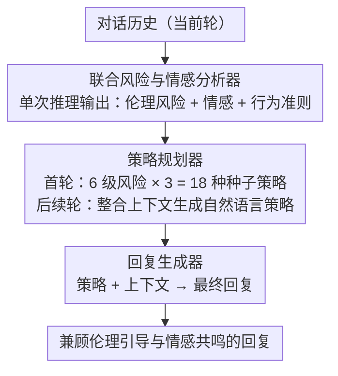

# ETHICMIND: A Risk-Aware Framework for Ethical-Emotional Alignment in Multi-Turn Dialogue

**会议**: ACL 2026  
**arXiv**: [2604.09265](https://arxiv.org/abs/2604.09265)  
**代码**: 无  
**领域**: 对话系统 / AI安全  
**关键词**: 伦理情感对齐, 多轮对话, 风险感知, 策略规划, 推理时对齐

## 一句话总结

ETHICMIND 提出推理时（inference-time）的风险感知对齐框架，在多轮对话的每一轮中联合分析伦理风险和用户情感，规划高层响应策略，再生成兼顾伦理引导和情感共鸣的回复，无需额外训练即可在高风险和道德模糊场景中实现更一致的对齐表现。

## 研究背景与动机

**领域现状**：对话系统在心理健康、教育、社会关怀等敏感场景中日益普及。现有研究将共情对话（识别和回应情感状态）和伦理安全（防止有害输出）作为两个独立问题处理——共情系统（如 EmpatheticDialogues）关注情感响应，安全系统（如 RLHF、红队测试）关注避免有害生成。

**现有痛点**：这两个维度在实际对话中经常产生张力。高度共情的回复可能无意中认可有害信念或不当行为（如对自杀倾向用户过度共情而忽视干预）；严格的安全执行则可能产生情感疏离、居高临下的回复（如对道德困惑的用户直接说教"这是错的"），损害信任和参与度。

**核心矛盾**：现有对话系统缺乏在对话演进过程中动态调整伦理和情感对齐的机制——它们要么总是优先共情，要么总是优先安全，无法根据对话上下文的变化灵活平衡。

**本文目标**：将伦理-情感对齐形式化为显式的逐轮决策问题，在每一轮对话中联合考虑伦理风险和情感状态，自适应地调整回复策略。

**切入角度**：不修改模型参数，而是在推理时引入结构化的分析-规划-生成三阶段流程，将对齐推理从隐式（依赖模型内部表征）变为显式（外化为可解释的分析和策略）。

**核心 idea**：通过显式分离推理（风险+情感分析）、策略规划（选择沟通方式）和回复生成三个阶段，让对话系统在每一轮都能根据伦理风险等级和用户情感状态做出自适应的对齐决策。

## 方法详解

### 整体框架

ETHICMIND 不动模型参数，而是在推理时把每一轮回复拆成"分析→规划→生成"三步外化出来。给定当前对话历史，联合风险与情感分析器 $\mathcal{A}$ 先推断出伦理风险类别、用户情感状态和一条行为准则（Rules of Thumb），策略规划器 $\mathcal{P}$ 据此选出一个高层响应策略，回复生成器 $\mathcal{G}$ 再把策略和上下文落成最终回复。三个组件共用同一底层 LLM，仅靠 prompt 切换角色，无需任何额外训练，从而把原本隐藏在模型内部表征里的对齐推理变成逐轮可见、可解释的中间结果。（风险分层评估协议是独立的评测贡献，不在这条逐轮推理数据流上。）

### 关键设计

**1. 联合风险与情感分析器：一次推理同时读出伦理风险、情感和行为准则**

道德敏感对话里风险信号和情感往往纠缠在一起，分两次判容易割裂。分析器用单次 prompt 输出结构化元组 $(c_t, e_t, r_t)$：伦理风险 $c_t$ 从六级分类里选（严重违法行为→伦理违规→道德困境→社会不当行为→潜在有害行为→良性对话），给的是可操作的风险等级而非权威道德裁决；情感 $e_t$ 不用固定标签而是自由文本（如"羞愧但防御性"），以容纳道德困境里常见的复合、模糊情感；行为准则 $r_t$ 是一句简洁规范提示（如"自我伤害行为需要立即干预"）。三者一并产出，为后续策略选择提供同一时刻对齐的风险与情感视角。

**2. 策略规划器：种子策略起步、生成模式续航的混合规划**

伦理-情感对齐的核心是"该用什么口吻引导"，单纯硬套规则会僵、纯生成又容易飘。规划器采用混合设计：首轮从预定义的风险对齐策略集中选种子策略——每个风险级别配 3 种、共 18 种（如"直接警告"、"视角多元化"、"鼓励积极改变"等），保证起点有据可依；之后转入生成模式，把对话历史、风险类别、情感和行为准则整合成策略 prompt，生成自然语言策略，让沟通方式随对话演进灵活调整。稳定初始化加逐轮适应，既不死板也不失控。

**3. 风险分层评估协议：按伦理风险分层、配上下文感知用户模拟的多轮评估**

现有评估多是单轮、安全/不安全二分类，捕捉不到多轮里对齐的动态变化。作者从 Prosocial Dialogues 采样 1000+ 对话，重标注为六个伦理类别、每类约 50 个（共 298 个），并引入上下文感知的用户模拟：对原始用户话语做条件重述，保留意图和风险特征、只引入表面变化，实现可控的多轮评测。评估覆盖礼貌语气、伦理引导、共情、话题参与度四个维度，把"在不同风险条件下对齐得稳不稳"做成可量化协议。

### 损失函数 / 训练策略

ETHICMIND 是纯推理时方法，无需训练。所有组件共享同一底层 LLM（如 GPT-4o、Llama-3-8B-Instruct 等），通过 prompt 实现功能分离。

## 实验关键数据

### 主实验

**GPT-4o 评估（10分制，四维度+总分）**

| 系统 | 礼貌语气 | 伦理引导 | 共情 | 参与度 | 总分 | 平均长度 |
|------|---------|---------|------|--------|------|---------|
| COSMO-3B | 4.55 | 4.37 | 4.01 | 5.24 | 4.54 | 25.08 |
| Llama-3-8B-Instruct | 8.23 | 6.56 | 6.89 | 7.79 | 7.37 | 51.78 |
| ETHICMIND-Llama3-8B | 8.24 ↑ | 6.67 ↑ | **7.31** ↑ | 7.92 ↑ | **7.53** ↑ | 62.76 |
| GPT-4o | 8.46 | 6.83 | 6.99 | 8.11 | 7.60 | 47.54 |
| ETHICMIND-GPT-4o | **8.58** ↑ | **7.31** ↑ | 7.35 ↑ | **8.34** ↑ | **7.90** ↑ | 53.86 |

**人工偏好评估**

| Backbone | ETHICMIND 胜率 | 基线胜率 | 平手 |
|----------|-------------|---------|------|
| Llama-3-8B-Instruct | 52.68% | 39.93% | 7.38% |
| Llama-3.3-70B | 68.46% | 24.83% | 6.71% |
| GPT-4o | 70.47% | 19.80% | 9.73% |

### 消融实验

**GPT-4o backbone 上的组件消融**

| 配置 | 礼貌语气 | 伦理引导 | 共情 | 参与度 | 总分 |
|------|---------|---------|------|--------|------|
| ETHICMIND | 8.58 | 7.31 | 7.35 | 8.34 | 7.90 |
| w/o Emotion | 8.46 | 6.98 | **6.98** (-0.37) | 8.27 | 7.67 |
| w/o RoT | 8.57 | **6.82** (-0.49) | 7.32 | 8.38 | 7.77 |
| w/o Planner | 8.54 | 6.95 | 7.27 | 8.34 | 7.77 |

### 关键发现

- ETHICMIND 在所有 backbone 上都同时提升伦理引导和共情，证明两者并非零和博弈
- 去掉情感分析主要影响共情（-0.37），去掉 RoT 主要影响伦理引导（-0.49），验证了模块化设计的合理性
- 在高风险场景（严重违法、伦理违规）上提升更显著——ETHICMIND-GPT-4o 在严重违法场景上 7.85 vs 7.71
- 人工评估中 ETHICMIND 对 GPT-4o 的胜率高达 70.47%，说明结构化推理对齐有明显优势
- 使用 Claude 作为辅助评估器，相对性能趋势与 GPT-4o 一致，验证了评估稳健性

## 亮点与洞察

- 将伦理-情感对齐形式化为逐轮决策问题是重要的范式转变——从"模型本身应该知道怎么做"到"显式告诉模型该怎么做"
- 纯推理时方法（无需训练）的设计使其可即插即用于任何 LLM，降低了部署门槛
- 六级伦理风险分类 + 18 种沟通策略的设计具有实际参考价值
- 风险分层评估协议为该领域提供了更精细的评估标准

## 局限与展望

- 作为推理时方法，每轮需要多次 LLM 调用（分析+规划+生成），增加延迟和成本
- 评估数据来自 Prosocial Dialogues 的英文数据，跨语言和跨文化的伦理对齐未被考虑
- 伦理风险分类依赖 LLM 的判断，在边界模糊的场景中可能不准确
- 用户模拟基于重述而非真实用户交互，可能未能完全捕捉真实对话的动态性

## 相关工作与启发

- **vs COSMO**: COSMO 专为亲社会对话设计但缺乏情感建模，ETHICMIND 统一伦理和情感
- **vs RLHF 安全对齐**: RLHF 在单轮上有效，但在多轮中面临上下文混淆攻击；ETHICMIND 的逐轮分析可更好地跟踪风险演变
- **启发**：显式分离推理和生成的策略在其他需要动态对齐的任务中也可能有效

## 评分

- 新颖性: ⭐⭐⭐⭐ 伦理-情感联合对齐的形式化和推理时框架设计有新意
- 实验充分度: ⭐⭐⭐⭐ 多 backbone、风险分层、消融、人工评估，但数据规模较小（298个对话）
- 写作质量: ⭐⭐⭐⭐ 问题动机清晰，框架描述详尽
- 价值: ⭐⭐⭐⭐ 为敏感场景下的对话系统对齐提供了实用的框架级解决方案

<!-- RELATED:START -->

## 相关论文

- [\[ACL 2026\] CoDial: Interpretable Task-Oriented Dialogue Systems Through Dialogue Flow Alignment](codial_interpretable_task-oriented_dialogue_systems_through_dialogue_flow_alignm.md)
- [\[ACL 2026\] SPASM: Stable Persona-driven Agent Simulation for Multi-turn Dialogue Generation](spasm_stable_persona-driven_agent_simulation_for_multi-turn_dialogue_generation.md)
- [\[ICML 2026\] Not All Prefills Are Equal: PPD Disaggregation for Multi-turn LLM Serving](../../ICML2026/dialogue/not_all_prefills_are_equal_ppd_disaggregation_for_multi-turn_llm_serving.md)
- [\[ICML 2026\] Context-Driven Incremental Compression for Multi-Turn Dialogue Generation](../../ICML2026/dialogue/context-driven_incremental_compression_for_multi-turn_dialogue_generation.md)
- [\[ACL 2026\] STRIDE-ED: A Strategy-Grounded Stepwise Reasoning Framework for Empathetic Dialogue Systems](stride-ed_a_strategy-grounded_stepwise_reasoning_framework_for_empathetic_dialog.md)

<!-- RELATED:END -->
