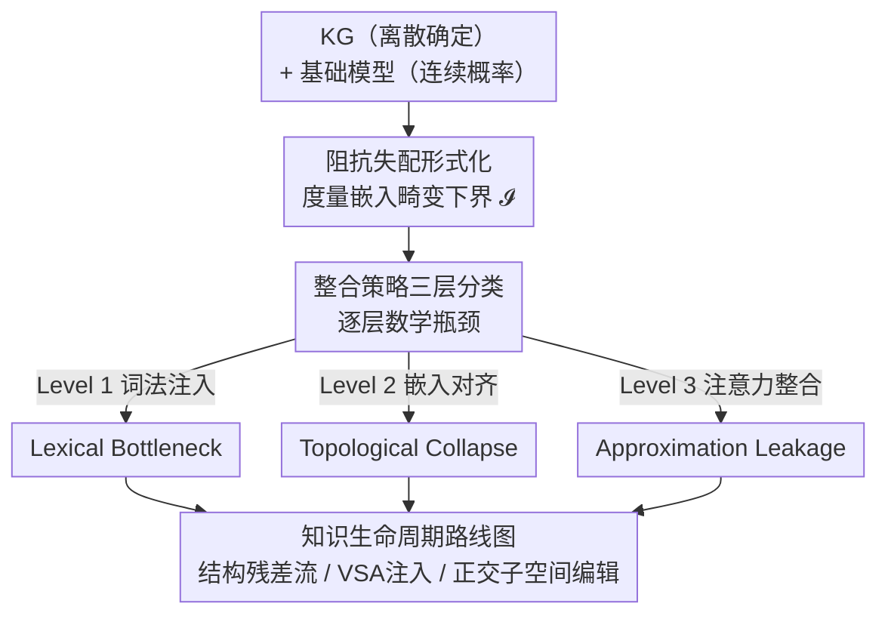

# Overcoming the Impedance Mismatch: A Theoretical Roadmap for Fusing Foundation Models and Knowledge Graphs

**会议**: ACL2026  
**arXiv**: [2606.15656](https://arxiv.org/abs/2606.15656)  
**代码**: 无（纯理论论文）  
**领域**: 图学习 / 神经符号 / 知识图谱  
**关键词**: 阻抗失配、神经符号融合、知识图谱、多跳推理、向量符号架构  

## 一句话总结
这是一篇纯理论的立场论文：作者把"基础模型（连续概率空间）与知识图谱（离散确定结构）难以真正融合"这一现象形式化为 **Impedance Mismatch（阻抗失配）**，用度量嵌入理论证明了从词法注入到注意力级整合的三类主流方案各自的数学失败上界，并给出一条"涌现—注入—编辑"的知识全生命周期理论路线图。

## 研究背景与动机
**领域现状**：把知识图谱（KG）接进大模型，目前的工业标准是 RAG——检索相关子图、把离散三元组序列化成自然语言文本、拼进上下文窗口。学术界更进一步，有用 GNN/翻译式嵌入把图对齐到共享隐空间的，也有直接改注意力矩阵注入图先验的。

**现有痛点**：作者认为这些做法都只是"表面补丁"。把一张多维图压成一条线性 token 流，会摧毁多跳逻辑推理所需的关系几何结构，直接导致高非检索率、子图断裂和幻觉；而且当序列化的图信息与模型预训练的连续权重冲突时，模型往往直接丢掉提示、相信自己的统计先验（知识冲突）。

**核心矛盾**：根子上是两套知识表示范式的不兼容——KG 是离散、确定、可 $O(1)$ 编辑的拓扑结构；基础模型是连续、概率、分布式纠缠的参数记忆。把确定性图结构硬塞进概率自注意力隐空间，必然产生数学退化。作者借数据库领域的"对象—关系阻抗失配"概念，把这种退化命名为 **Impedance Mismatch**。

**本文目标**：（1）形式化这种结构摩擦并给出可度量的下界；（2）把现有整合策略分层，逐层证明其数学瓶颈；（3）给出一条绕开"词法桥接"、直接在 Transformer 架构层解决问题的理论路线图。

**核心 idea**：知识融合不是文本检索问题，而是离散确定性与连续概率性之间的几何摩擦问题——必须在架构层面做"数学化的中介"，而不是指望连续权重无缝吸收离散事实。

## 方法详解
这是一篇没有实验的理论论文，"方法"即作者构建的**形式化框架 + 分层批判 + 路线图**。整体逻辑链是：先定义阻抗失配 $\mathcal{I}$ 这把"标尺"，再用它量出三层整合策略各自的失败上界，最后顺着"知识从哪来、怎么进去、怎么改"提出三阶段补救方案。

### 整体框架
全文围绕一个核心量 $\mathcal{I}$（阻抗失配）展开，自上而下分三段：**诊断**（定义 $\mathcal{I}$ 及其在多跳推理中的复合误差）→ **分层定罪**（把现有方法分成 Level 1/2/3，给每层一个数学瓶颈与渐近失败模式）→ **开方**（涌现/注入/编辑三阶段路线图）。三段之间是严格递进的：诊断给出标尺，分层用标尺量出"为什么现有方法都不行"，路线图针对每个瓶颈给对策。

### 关键设计

**1. 阻抗失配的形式化：用度量嵌入畸变给"融合难度"一个下界**

针对"大家都说 KG 和大模型难融合，但说不清难在哪"的痛点，作者把它变成一个可计算的量。把 KG 定义为带最短路径度量 $d_{\mathcal{K}}$ 的离散拓扑空间 $\mathcal{K}=(\mathcal{V},\mathcal{E})$，把基础模型隐空间定义为带几何距离 $d_{\mathcal{M}}$ 的连续度量空间 $\mathcal{M}\subseteq\mathbb{R}^h$，任何整合都需要一个映射 $f:\mathcal{V}\to\mathcal{M}$。阻抗失配定义为所有映射上的最小畸变（即度量嵌入的 distortion）：

$$\mathcal{I}=\inf_{f}\left(\sup_{u\neq v}\frac{d_{\mathcal{M}}(f(u),f(v))}{d_{\mathcal{K}}(u,v)}\times\sup_{u\neq v}\frac{d_{\mathcal{K}}(u,v)}{d_{\mathcal{M}}(f(u),f(v))}\right)$$

纯离散确定系统里 $\mathcal{I}=1$（完美结构等距），而稠密 Transformer 表示 $\mathcal{I}\gg 1$。其价值在于：它把"连续空间无法忠实保留闭环、层级树等图 motif"这件事变成了一个可证下界，后面所有批判都挂在它上面。作者进一步指出，多跳关系在图里是确定的代数复合，在模型里只能靠逐层注意力 $\prod_{l=1}^{L}A^{(l)}$ 几何逼近，误差 $\epsilon=\lVert f(v_3)-\prod_{l=1}^{L}A^{(l)}f(v_1)\rVert$ 随跳数**乘性累积**——这正是文本检索在多跳推理上失败的根因。

**2. 三层整合分类法：给每种主流方案一个数学失败上界**

针对"现有方法被一锅端地批评、缺乏可比的失败刻画"，作者按"离散图穿透连续架构有多深"把方法分成三级，并各给一个可证瓶颈。Level 1（词法/提示注入，即 RAG）受 **Lexical Bottleneck** 制约：深度 $k$、分支因子 $b$ 的子图有 $\mathcal{O}(b^k)$ 条推理路径，序列化需 $c\cdot\mathcal{O}(b^k)$ 个 token，一旦超过上下文窗口 $L$，由鸽笼原理必然截断，而经典逻辑里删一个前提就废掉整条演绎链。Level 2（嵌入对齐）受 **Topological Collapse** 制约：由 Bourgain 嵌入定理，把 $|\mathcal{V}|$ 个点的有限度量空间嵌入欧氏空间至少有 $\Omega(\log|\mathcal{V}|)$ 畸变，故 $\mathcal{I}\geq\Omega(\log|\mathcal{V}|)$，本体越大畸变越大，零畸变在数学上不可能。Level 3（注意力级整合）受 **Approximation Leakage** 制约：softmax 只输出正概率，要逼近硬零（无边）需无穷负 logit，故每个非邻节点贡献正残差 $\delta>0$，多跳 $(A_{\text{soft}})^k$ 让 $\delta$ 指数累积，导致表示过平滑、真实离散信号被噪声淹没。

**3. 三大核心瓶颈：为什么"真融合"在原理上被卡死**

在分层批判之上，作者抽出三条更底层的不可调和矛盾，解释为什么连续架构无法原生内化离散结构。**A·可微逻辑的诅咒**：把布尔连接词松弛到 $[0,1]$ 的 t-norm/s-norm 后，损失面非线性且梯度饱和——公式一旦"几乎满足"梯度就消失，过早停止优化；且软真值破坏德摩根律、逆否等经典等价，迫使研究者在"布尔忠实度"和"优化可行性"间二选一。**B·结构与几何干扰**：离散图里编辑一条边对邻边零影响，但连续残差流里事实彼此重叠，改一个事实会扭曲局部几何、引发对结构无关知识的灾难性串扰，连续编辑次数一多保留率就崩。**C·符号接地的不对称**：KG 用唯一实体标识维持跨上下文的指称完整性，而模型用上下文化的子词分布式表示，把不可变符号对齐到流动的语言模式缺乏动态"角色—填充"绑定机制，导致混合模型只会浅层模式匹配、无法真正组合泛化。

### 损失函数 / 训练策略
本文不训练模型，"开方"部分是一条三阶段理论路线图，对应知识的"涌现—注入—编辑"生命周期：

- **涌现（预训练）· 结构残差流**：当前预训练是无约束几何优化，导致事实在隐空间任意重叠。作者主张引入图论归纳偏置，用正交子空间正则惩罚让不同知识域占据互相正交的方向，使离散关系结构原生地、带数学绝缘地在权重里涌现，从根上防止串扰。
- **注入（推理）· 基于 VSA 的隐式子图注入**：放弃外部文本提示，改用向量符号架构（VSA）。VSA 用 binding/bundling/permutation 把离散图编码进固定维超向量，天然对齐 Transformer 的原生嵌入，可在中间注意力层直接注入显式"角色—填充"绑定，迫使生成条件于严格的数学绑定关系而非概率文本。
- **编辑· 正交子空间编辑**：针对连续编辑随次数增多而保留率下降的问题，主张把目标事实编辑严格投影到不激活无关语义概念的正交特征方向上，使一次更新在数学上等价于离散图里的"局部插边"，从而把符号库的可靠可编辑性带进神经参数空间。

## 实验关键数据
本文**无实验**，作者在 Limitations 中明确承认这点：所有框架目前都是理论蓝图。其"结果"是一张把三层方案、机制、瓶颈与渐近失败模式对应起来的分类表，以及三段路线图与三大瓶颈的对应关系。下面两张表整理自原文 Table 1 与正文论证。

### 主结果：三层整合策略的数学瓶颈

| 整合层级 | 机制 | 形式化瓶颈 | 渐近失败模式 |
|----------|------|------------|--------------|
| Level 1 表面 | 词法/提示注入（RAG） | Lexical Bottleneck：$\mathcal{O}(b^k)>L$ | 上下文截断，无法编码指数级路径复杂度 |
| Level 2 嵌入 | 隐空间向量对齐（GNN/翻译嵌入） | Topological Collapse：$\mathcal{I}\geq\Omega(\log\lvert\mathcal{V}\rvert)$ | 语义节点混淆，离散关系边界被扭曲 |
| Level 3 架构 | 图引导注意力 | Approximation Leakage：$(A_{\text{soft}})^k$ 中 softmax 误差 $\delta$ 复合 | 表示过平滑，离散信号淹没于连续噪声 |

### 瓶颈与路线图的对应

| 核心瓶颈 | 本质矛盾 | 路线图对策 |
|----------|----------|------------|
| A 可微逻辑的诅咒 | 梯度饱和 + 破坏逻辑等价 | 结构残差流（预训练阶段引入图论偏置） |
| B 结构与几何干扰 | 连续表示重叠 → 编辑串扰 | 正交子空间编辑（局部化更新） |
| C 符号接地不对称 | 唯一符号 vs 流动子词表示 | VSA 隐式子图注入（角色—填充绑定） |

### 关键发现
- 三层失败模式不是工程难题而是**可证下界**：词法注入卡在鸽笼原理，嵌入对齐卡在 Bourgain 定理，注意力整合卡在 softmax 不能输出硬零——层级越深、瓶颈越隐蔽，但都绕不过 $\mathcal{I}\gg 1$。
- 多跳推理是检验试金石：无论哪层，误差都随跳数 $k$ **乘性/指数累积**，这统一解释了"为什么 RAG 在多跳问题上幻觉严重"。
- 作者强调真正的解法必须把图结构变成模型**原生、内化**的东西（结构残差流 + VSA），而不是当成需要每次外部查询的"外挂约束"。

## 亮点与洞察
- **把一句直觉变成一个可证的量**：用度量嵌入畸变定义 $\mathcal{I}$，让"KG 和大模型难融合"从口号变成有下界的数学命题，这套形式化框架本身就可复用于评估任何 KG+LLM 方法的理论上限。
- **借不同数学工具给不同层定罪**：Level 1 用鸽笼原理、Level 2 用 Bourgain 嵌入定理、Level 3 用 softmax 的正性，三把刀切三层，论证干净且彼此独立——这种"分层 + 各给可证瓶颈"的写法很值得理论综述借鉴。
- **VSA 与正交子空间这两条线索可迁移**：把向量符号架构当作"在隐层注入离散结构"的桥、把正交投影当作"局部化知识编辑"的工具，这两个思路对知识编辑、检索增强、可解释性研究都有直接启发。

## 局限与展望
- **没有任何实验**：作者自己承认全文只有形式分析，结构残差流、VSA 注入、正交子空间编辑都还是理论蓝图，能否落到可扩展训练里完全未验证——这是它作为 position paper 的最大软肋。
- **假设完美确定的知识图谱**：所有几何约束都建立在 KG 无噪声、无矛盾的理想假设上，真实世界 KB 充满噪声和冲突，这些严格的几何下界如何适配尚不清楚。
- **下界是否"紧"未讨论**：$\mathcal{I}\geq\Omega(\log|\mathcal{V}|)$ 这类是渐近下界，实际系统离下界多远、能否通过任务结构特性绕过，论文没有给出可操作的判据。
- **改进思路**：后续工作可挑路线图中最可实现的一环（如在小规模 KG 上做 VSA 隐式子图注入）做原型验证，把"理论上不可能零畸变"细化为"在某任务上实际畸变多大、对多跳准确率影响几何"。

## 相关工作与启发
- **vs RAG / KG-Augmented Generation**：主流做法把子图序列化进上下文，本文证明这只能困在 Lexical Bottleneck，多跳路径数 $\mathcal{O}(b^k)$ 终将撑爆窗口；本文主张用 VSA 在隐层注入而非在文本层拼接。
- **vs GNN/翻译式嵌入对齐（TransE、GNN+LLM）**：它们把图压进共享隐空间，本文用 Bourgain 定理指出这是有损压缩、$\mathcal{I}\geq\Omega(\log|\mathcal{V}|)$，必然混淆语义节点。
- **vs 图引导注意力（Graph-Guided Attention）**：即便是最先进的注意力级整合，softmax 也无法输出硬零，多跳下 leakage 指数累积；本文认为只要还靠连续注意力近似离散路由就不可持续。
- **vs 知识编辑（ROME、MEND、De Cao 等）**：现有连续编辑随次数增多保留率下降，本文把它归因于残差流缺乏正交性，提出正交子空间编辑作为"数学等价于离散插边"的方向。

## 评分
- 新颖性: ⭐⭐⭐⭐ 把神经符号融合难题形式化为可证下界、并分层定罪，视角清晰且有原创性
- 实验充分度: ⭐ 纯理论、零实验，所有方案均为蓝图，作者亦坦承
- 写作质量: ⭐⭐⭐⭐ 逻辑链严密（标尺→分层→路线图），数学论证干净
- 价值: ⭐⭐⭐⭐ 为 KG+LLM 融合提供了可复用的理论框架与研究议程，但短期可落地性弱

<!-- RELATED:START -->

## 相关论文

- [\[ICML 2025\] Towards Graph Foundation Models: Learning Generalities Across Graphs via Task-Trees](../../ICML2025/graph_learning/towards_graph_foundation_models_learning_generalities_across_graphs_via_task-tre.md)
- [\[ICML 2026\] When Do Graph Foundation Models Transfer? A Data-Centric Theory](../../ICML2026/graph_learning/when_do_graph_foundation_models_transfer_a_data-centric_theory.md)
- [\[ACL 2026\] What Makes AI Research Replicable? Executable Knowledge Graphs as Scientific Knowledge Representations](what_makes_ai_research_replicable_executable_knowledge_graphs_as_scientific_know.md)
- [\[NeurIPS 2025\] Deliberation on Priors: Trustworthy Reasoning of Large Language Models on Knowledge Graphs](../../NeurIPS2025/graph_learning/deliberation_on_priors_trustworthy_reasoning_of_large_language_models_on_knowled.md)
- [\[NeurIPS 2025\] Reasoning Meets Representation: Envisioning Neuro-Symbolic Wireless Foundation Models](../../NeurIPS2025/graph_learning/reasoning_meets_representation_envisioning_neuro-symbolic_wireless_foundation_mo.md)

<!-- RELATED:END -->
