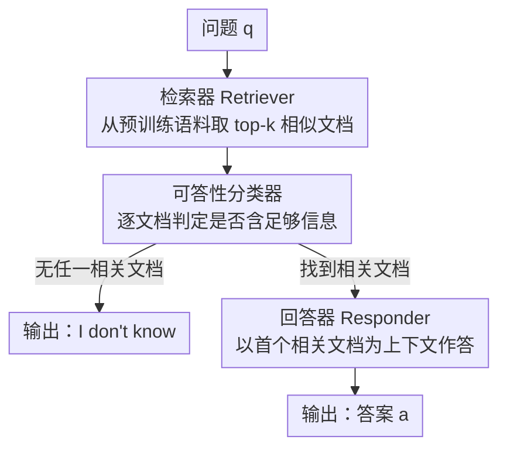

# Parametric Knowledge is Not All You Need: Toward Honest Large Language Models via Retrieval of Pretraining Data

**会议**: ACL 2026  
**arXiv**: [2601.21218](https://arxiv.org/abs/2601.21218)  
**代码**: https://github.com/nusnlp/RETAIN  
**领域**: 幻觉 / LLM 诚实性 / 检索增强  
**关键词**: LLM 诚实性, 知识边界, 预训练数据检索, 拒答, 幻觉

## 一句话总结
作者指出现有「LLM 诚实性」基准都没考虑模型在预训练中到底见过什么知识，于是借助训练数据完全公开的 Pythia，用「预训练数据里能否检索到答案」来精确划定知识边界、构建出更可靠的 TIP-TriviaQA 基准；并提出三智能体方法 RETAIN——直接检索模型自己的预训练语料来决定「该答还是该拒」，把诚实性 EM-F1 从基线最高的 ~40 提到 58.57。

## 研究背景与动机
**领域现状**：LLM 很会答题，但常常**不知道自己知道什么、不知道什么**，于是在知识不足的话题上一本正经地编造答案（幻觉）。一个诚实的模型应该在不懂时回答「我不知道」。诚实性可拆成两面：**自我认知（self-knowledge）**——知道自己知识的边界、该拒答时拒答；**自我表达（self-expression）**——已经掌握的信息要能正确答出来（哪怕训练时见过，低频文档也常答不对）。

**现有痛点**：已有许多提升诚实性的方法（R-Tuning、RLKF、Best-of-N、自反思 prompting…），但它们的**评估缺乏鲁棒性**——评估时**没有考虑模型预训练实际摄入了哪些知识**，而且各自用不同模型、不同指标，无法横向比较。更糟的是现有基准定义「不可答」的方式有问题：如 Cheng et al. 把「模型 100% 答不对」的问题判为不可答，但作者论证这其实测的是**不一致（自我表达问题）**而非**真的缺乏知识（自我认知问题）**——实测发现按该标准判为「不可答」的问题里 **94.7% 其实是可答的**。

**核心矛盾**：要建一个可靠的诚实性基准，前提是知道模型的**真实知识边界**。但现有方法把 LLM 当黑盒、不知道它的确切训练数据，只能间接估计边界，于是把「会不会答」和「有没有这个知识」混为一谈。开发者因此也无从判断该去改进模型的自我认知还是自我表达。

**本文目标**：（1）用模型**真实的预训练数据**来定义知识边界，构建一个能公平横比各方法的诚实性基准；（2）提出一个能切实提升诚实性、还能顺带提升答题准确率的方法。

**切入角度**：用训练数据完全公开的开放模型 **Pythia**（其训练语料是去重版 Pile）——既然能访问训练数据，就能精确知道模型「见没见过」某条知识，从而清晰界定「何时该答、何时该拒」。

**核心 idea**：把知识边界**操作化为「预训练语料里能否检索到支撑答案的文档」**——既用它来给基准打标签，又在推理时直接检索模型自己的预训练数据来决定该答还是该拒。

## 方法详解

### 整体框架
论文有两个并列产物。其一是**基准 TIP-TriviaQA**（Training-Information-Partitioned TriviaQA）：把 TriviaQA 的问题，按「Pythia 预训练语料里是否存在能回答它的相关文档」自动标注为**可答 / 不可答**，从而让评估第一次建立在模型真实知识边界上。其二是方法 **RETAIN**（Retrieval-Enhanced Training-Aware INference）：一个三智能体推理框架，在推理时检索模型自己的预训练数据，用「检索得到的相关文档」既判定可答性、又作为回答上下文。下图是 RETAIN 的推理流程——这也是把「预训练数据可检索性」当作知识边界这一核心思想落地的地方。

### 关键设计

**1. 把知识边界操作化为「预训练数据可检索性」**

这是全文的思想内核。作者用一个**已知-未知四象限**刻画模型实际知识（横轴：训练时是否摄入该信息）与感知知识（纵轴：是否能利用该知识答对）的关系：$N_1$ 答对（知道且答对）、$N_2$ 正确拒答（不知道且拒答）、$N_3$ 见过却答错、$N_4$ 没见过也答错。提升诚实性 = 同时最大化自我认知（提高 $N_2/N_4$）与自我表达（提高 $N_1/N_3$）。关键在于：唯有知道训练数据，才能区分 $N_3$（自我表达问题）和 $N_4$（自我认知问题）。借 Pythia 的公开训练语料，作者把抽象的「知识边界」落成一个可计算的判据——**预训练语料里是否存在一篇含答案信息的相关文档**：存在则该问题对该模型「可答」，应当答出 gold answer；不存在则「不可答」，应当回「我不知道」。这也是为什么标题说「参数化知识不够用」——光靠模型参数里的知识无法可靠判断边界，得回到训练数据本身。

**2. 两阶段检索自动标注，构建 TIP-TriviaQA**

人工核查数十亿 token 不现实，作者设计**先 token、后向量**的两阶段搜索自动判定每个问题是否可答。先对预训练文档建两套 Elasticsearch 索引：token 索引（按分词文本，检索快）和向量索引（用 RecursiveCharacterTextSplitter 切块后，用 Multilingual E5 Large 编码）。**Token-based 搜索**：检索同时含问题关键词与 gold answer 的文档、按词频排序，取前 $k_1=100$ 篇，让裁判 LLM（Llama 3.1 8B Instruct）逐篇判断是否相关；任一篇「是」即标可答；若全「否」但还有未查文档，则**丢弃该问题**（实际丢弃 <1%，也佐证 $k_1=100$ 足够）。**Vector-based 搜索**：对 token 阶段仍判不可答的问题，用问题向量取 top $k_2=10$ 语义最相似文档再让 LLM 判定（向量检索约慢 10 倍，故 $k_2$ 取小）；有「是」则可答，全「否」才最终判不可答。最终 TIP-TriviaQA 规模见下；人工评测显示 Llama 裁判与人类标注一致率 82.8%、标注者间一致率 89.5%，验证了自动标注的可靠性。

**3. RETAIN：检索器 + 可答性分类器 + 回答器三智能体**

RETAIN 把「该不该答、该怎么答」拆给三个智能体协作。**检索器（Retriever）**用与建索引时相同的嵌入模型把问题编码，从已索引的预训练数据里稠密检索 top-$k$ 相似文档；这些文档身兼两职——判定可答性 + 给回答提供上下文。**可答性分类器（Answerability Classifier）**与回答器用同一个 LLM，被微调成「判断某检索文档是否含足够信息回答该问题」的二分类器，训练数据由 Algorithm 1 的 VectorSearch 过程在训练集上构造；**关键是推理时它既不看 gold answer、也不调用任何外部 LLM**，纯靠模型自身判断知识边界。**回答器（Responder）**被微调成「给定文档-问题对生成 gold answer」，训练数据取自分类器训练集中**可答**的那部分子集。三者配合既补强自我认知（分类器决定拒不拒），又补强自我表达（回答器把见过的知识答准）。

**4. 拒答优先的推理流程**

推理时先由检索器取 top-$k$ 文档，再让可答性分类器**逐篇**判断是否足以回答：若**没有任何相关文档**，系统直接输出「I don't know」；否则取**第一篇相关文档作为额外上下文**，交给回答器生成答案。这个「先验证知识边界、再决定答或拒」的顺序，正是 RETAIN 区别于纯参数化方法的地方——消融显示，若跳过分类器、只靠 prompt 让模型「不懂就说不知道」，模型几乎不会拒答（它对超出知识范围的问题同样自信，可答/不可答的生成概率分布几乎无法区分），诚实性无从谈起。

## 实验关键数据

### 主实验
模型用 Pythia-12b-deduped（训练语料公开），GPT-4o-mini 抽关键词，Llama 3.1 8B Instruct 当相关性裁判。评测在 TIP-TriviaQA 上：以精确匹配定义精确率 $P=TP/(TP+FP_u+FP_a)$、召回率 $R=TP/(TP+FP_a+FN)$、二者调和平均 EM-F1（$FP_u$ 为不可答却作答、$FN$ 为可答却拒答、$TP$ 为作答且精确匹配、$FP_a$ 为作答但错）；另用 SQuAD 2.0 风格的 PM-F1（部分匹配，按 token 重叠，拒答不可答题记 1 分）。

| 方法 | EM-Prec | EM-Rec | EM-F1 | PM-F1 |
|------|------|------|------|------|
| Prompting | 30.26 | 31.32 | 30.78 | 36.41 |
| SFT | 39.25 | 40.28 | 39.76 | 43.06 |
| BoN | 21.24 | 22.21 | 21.71 | 25.99 |
| DPO | 39.04 | 41.20 | 40.09 | 43.59 |
| R-Tuning | 39.07 | 41.21 | 40.11 | 44.16 |
| **RETAIN** | **62.82** | **54.86** | **58.57** | **62.23** |

RETAIN 大幅超过所有基线（EM-F1 58.57 vs 次优 R-Tuning 的 40.11）。差距根源就是**它用了预训练数据**——既拒掉超出知识范围的问题，又给可答题提供上下文。只靠参数化知识时模型几乎不拒答，说明 LLM 对自身知识边界感知很差；DPO、R-Tuning 虽略有改善但很有限；BoN 反而掉点（它依赖表现本就差的 SFT 模型来生成候选和当奖励模型，误差被放大）。在 HoneSet（930 道连人类都答不出的不可答题）上 RETAIN 拒答率达 **87.63%**，最高，说明方法能泛化到本基准之外。

### 消融实验
RT=是否用检索器，AC=是否用可答性分类器（✗ 表示仅靠 prompt 让模型「不懂就说不知道」），RS=回答器是否经过训练。

| # | RT | AC | RS | EM-F1 | PM-F1 | 说明 |
|---|----|----|----|------|------|------|
| 1 | ✗ | ✗ | ✗ | 30.78 | 36.41 | 等同 Prompting |
| 2 | ✗ | ✗ | ✓ | 39.76 | 43.06 | 等同 SFT |
| 3 | ✓ | ✗ | ✗ | 39.99 | 48.82 | 仅检索器即超所有基线 |
| 4 | ✓ | ✓ | ✗ | 46.55 | 54.42 | 加分类器 |
| 5 | ✓ | ✗ | ✓ | 19.72 | 37.93 | 训练回答器但缺分类器 → 暴跌 |
| 6 | ✓ | ✓ | ✓ | **58.57** | **62.23** | 完整 RETAIN |

### 关键发现
- **检索器贡献最直接**：仅开检索器（行 3）就把 EM-F1 从 30.78 提到 39.99、PM-F1 提到 48.82，已超过全部基线——检索预训练文档帮模型「回忆」起训练时见过的信息。
- **分类器是诚实性的关键**：对比行 3→4、行 5→6 都显著提升，它有效识别知识边界、减少幻觉。
- **回答器离不开分类器**：行 5（训练回答器但无分类器）反而暴跌到 19.72，因为回答器训练时**默认检索文档总是相关**，没有分类器把关时这一假设被破坏；只有分类器在位（行 6），训练回答器才把 EM-F1 从 46.55 拉到 58.57。
- **缓解长尾**：把相关预训练文档作上下文，显著改善「训练中只见过几次」的长尾问题（Kandpal et al. 报告的难点）。

## 亮点与洞察
- **「用预训练数据定义知识边界」这一刀切得很准**：它把诚实性评估里「不一致」与「真缺知识」这两件长期被混淆的事，第一次干净地分开（并量化出旧标准 94.7% 误判率），是方法论层面的真贡献。
- **检索对象的选择很妙**：RETAIN 检索的不是外部知识库，而是**模型自己的预训练语料**——既贴合「模型该知道什么」的定义，又让回答可解释（能看到哪些训练文档影响了答案），论文还显示用预训练数据当上下文优于用外部知识。
- **三智能体分工对应诚实性两面**：分类器管自我认知（拒不拒）、回答器管自我表达（答得准不准），结构和问题定义严丝合缝。
- **可迁移的评测范式**：「拿训练数据可访问的开放模型来定知识边界、再当裁判」这套思路，可推广到任何需要区分「模型不会」还是「模型不稳定」的可信赖性评测。

## 局限与展望
- **依赖训练数据公开**：整套方法的前提是能访问预训练语料，目前只在 Pythia-12b-deduped（207B token）上验证；闭源大模型、更大训练集/参数量能否照搬，作者留给未来工作。
- **自动标注仍有噪声**：用 LLM 当相关性裁判虽与人类一致率 82.8%，但仍非完美；token 阶段会丢弃 <1% 无法判定的问题。
- **任务范围受限**：问题定义明确排除多跳推理、数学推理等「需推导新知识」的题，只覆盖闭卷事实问答，诚实性的更广形态（如带推理的拒答）未触及。
- **推理成本**：向量检索约比 token 检索慢 10 倍，且每题要跑检索 + 逐文档分类 + 回答三步，部署开销高于纯参数化方法。

## 相关工作与启发
- **vs Cheng et al.（best-of-N、把「总答错」当不可答）**：他们把不一致误当缺知识，作者实测其 94.7% 误判，并改用预训练数据可检索性来界定边界。
- **vs R-Tuning / RLKF / 自反思**：这些方法都不看预训练数据、靠微调或采样间接提升诚实性，效果有限（DPO/R-Tuning EM-F1 仅 ~40），RETAIN 直接检索训练数据故大幅领先。
- **vs SelfAware / KUQ / HoneSet 等诚实性数据集**：它们的不可答题多是「连人类都答不出」（未解科学问题、未来事件、假前提），不考虑模型知识边界；TIP-TriviaQA 聚焦事实问答、按模型真实摄入划分，二者互补。

## 评分
- 新颖性: ⭐⭐⭐⭐⭐ 首个用预训练数据定义诚实性基准、并检索模型自身预训练语料来答题/拒答的工作，思想内核扎实。
- 实验充分度: ⭐⭐⭐⭐ 主实验 + 消融 + HoneSet 泛化 + 长尾分析 + 人工一致性验证齐全；但仅限单一模型 Pythia-12b。
- 写作质量: ⭐⭐⭐⭐ 四象限、知识边界、两阶段建库讲得清晰，问题定义与方法对应工整。
- 价值: ⭐⭐⭐⭐ 既给出可公平横比的基准，又给出可解释、能提精度的诚实性方法，对可信赖 LLM 研究有实用价值。

<!-- RELATED:START -->

## 相关论文

- [\[ACL 2025\] Aligning Large Language Models to Follow Instructions and Hallucinate Less via Effective Data Filtering](../../ACL2025/hallucination/aligning_large_language_models_to_follow_instructions_and_hallucinate_less_via_e.md)
- [\[ACL 2026\] Stable-RAG: Mitigating Retrieval-Permutation-Induced Hallucinations in Retrieval-Augmented Generation](stable-rag_mitigating_retrieval-permutation-induced_hallucinations_in_retrieval-.md)
- [\[ACL 2025\] Retrieval Visual Contrastive Decoding to Mitigate Object Hallucinations in Large Vision-Language Models](../../ACL2025/hallucination/retrieval_visual_contrastive_decoding_to_mitigate_object_hallucinations_in_large.md)
- [\[ACL 2025\] Alleviating Hallucinations from Knowledge Misalignment in Large Language Models via Selective Abstention Learning](../../ACL2025/hallucination/alleviating_hallucinations_from_knowledge_misalignment_in_large_language_models_.md)
- [\[ACL 2026\] Benchmarking Deflection and Hallucination in Large Vision-Language Models](benchmarking_deflection_and_hallucination_in_large_vision-language_models.md)

<!-- RELATED:END -->
