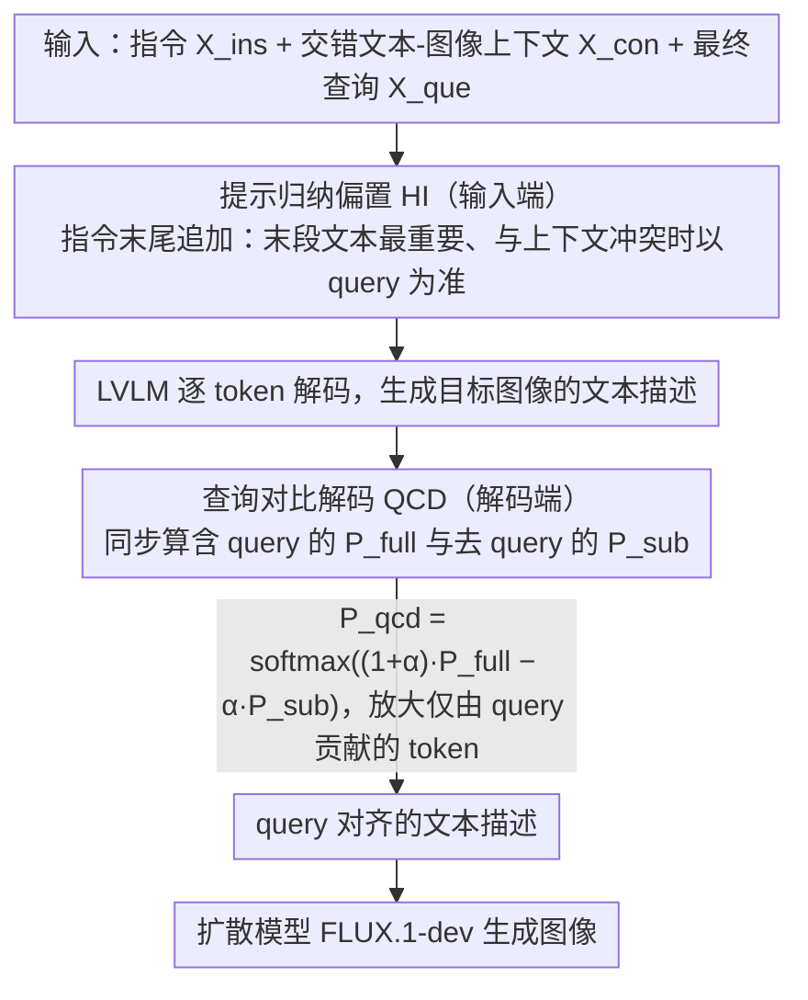

# Think Bright, Diffuse Nice: Enhancing T2I-ICL via Inductive-Bias Hint Instruction and Query Contrastive Decoding

**会议**: ACL 2026  
**arXiv**: [2601.06169](https://arxiv.org/abs/2601.06169)  
**代码**: https://github.com/Calendula597/TBDN  
**领域**: 图像生成 / 多模态推理 / Text-to-Image In-Context Learning  
**关键词**: T2I-ICL、提示归纳偏置、查询对比解码、扩散模型、上下文学习  

## 一句话总结
这篇论文提出训练无关的 TBDN 框架，用 Hint Instruction 让 LVLM 更关注最终 query，用 Query Contrastive Decoding 抑制先验幻觉，再把更准确的文本描述交给扩散模型，在 CoBSAT 和 T2I Fast Mini-ImageNet 上显著提升文本到图像上下文学习性能。

## 研究背景与动机
**领域现状**：Text-to-Image In-Context Learning 试图让模型根据几组交错的文字-图片示例，推断隐含映射规则，然后按新 query 生成目标图像。相比单 prompt 生成，这更接近人类通过示例表达复杂概念的方式。

**现有痛点**：统一 MLLM 虽然能处理交错多模态输入，但在 T2I-ICL 中常常推不出真正规则；另一类 LVLM+diffusion pipeline 生成质量更高，却缺少系统设计，往往需要额外训练或对齐模块。

**核心矛盾**：T2I-ICL 的难点不是单纯生成漂亮图片，而是“先想明白示例和 query 的关系，再把关系转成可视化提示”。现有方法一旦没理解 query，就会机械复述 context；一旦依赖预训练先验，就会生成常识上更常见但违反输入规则的图像。

**本文目标**：作者希望在不训练额外 aligner、不微调 MLLM 的情况下，利用 prompt 和 decoding 两个轻量机制，提升 LVLM 对上下文映射规则和最终 query 的遵循能力。

**切入角度**：论文把失败模式拆成两个互相强化的瓶颈：Compliance Failure 和 Prior-dominated Hallucination。前者让模型忽略 query、照搬 context；后者让模型被“苹果通常是红/绿”“帽子通常在人头上”等先验拖走。

**核心 idea**：用 Hint Instruction 在输入端植入“最后文本最重要”的归纳偏置，再用 Query Contrastive Decoding 在输出端放大 query 带来的分布差异，从前后两端打断错误循环。

## 方法详解
TBDN 的理念是“Think Bright, Diffuse Nice”：先让 LVLM 想清楚上下文和 query 的语义关系，再让 diffusion model 负责高保真生成。它不改变底座模型参数，而是在文本输出驱动的 pipeline 上增加两个闭环约束。

### 整体框架
输入包含任务指令 $X_{ins}$、交错文本-图像上下文 $X_{con}$ 和最终查询 $X_{que}$。TBDN 先把三者拼接成统一多模态序列，并在指令末尾追加 Hint Instruction。LVLM 根据增强后的输入生成目标图像的文本描述；在生成每个 token 时，QCD 同时计算完整输入分布 $P_{full}$ 和去掉 query 后的分布 $P_{sub}$，通过对比削弱仅由 context/先验驱动的 token。最后，文本描述被送入 FLUX.1-dev 这类扩散模型生成图像。

论文强调两个模块互补。HI 主要解决“模型没有把 query 当关键线索”的问题，属于输入端归纳偏置；QCD 主要解决“模型明明看到 query 但输出仍被先验带偏”的问题，属于解码端后验约束。二者结合后，系统既更会读题，也更不容易被常识先验误导。

### 关键设计

**1. 瓶颈诊断与任务化指标：先把"生成得差"拆成两类能定位的错误，再对症下药**

如果只笼统说 T2I-ICL "生成质量不好"，就没法设计出互不冗余的模块——prompt、CoT、aligner、diffusion 调参全混在一起，根本分不清提升来自真的理解了规则还是单纯图更好看。作者把失败拆成两类：Compliance Failure 指模型照搬 context 里出现的对象或属性，而不是根据 query 推断目标；Prior-dominated Hallucination 指模型输出符合预训练常识、却违反示例规则的内容（示例规定"蓝苹果"，模型仍画红苹果）。他们在 CoBSAT 上定义 error count，统计满足"预测属性对但对象来自 context""预测对象对但细节来自 context"等条件的样本数。

把错误拆开之后，后面两个模块就各打一个靶：HI 治第一类的"不读 query 照抄 context"，QCD 治第二类的"被先验拖走"，互不重叠。

**2. Hint Instruction (HI)：用一句话提示告诉模型"最后那段文本最重要"，在输入端纠正 context parroting**

T2I-ICL 的输入往往很长，最终 query 又压在序列末端，LVLM 很容易被前面示例的表面内容吸引，忽略真正要生成的 query。HI 的做法极简：在原始 TD-Ins 指令后追加一句轻量提示——"最后一段文本包含下一张图最重要的线索，生成描述时主要理解并遵循最终文本的含义"。它背后有两条原则：query 提供后续生成的关键指导；当 query 与 context 语义冲突时，query 语义优先。

相比动辄上千 token 的 CoT prompt，HI 长度只有约 82 个 token，却用最小代价注入了"该信谁"的任务先验。它不是让模型多想几步，而是在信息冲突时给出取舍规则，这比通用 CoT 更贴 T2I-ICL 的结构。

**3. Query Contrastive Decoding (QCD)：在解码分布层面放大 query 的贡献，压住只靠 context/先验冒出来的 token**

光靠 prompt 还压不住先验幻觉——模型明明看到了 query，输出仍被常识带偏。QCD 直接在解码时动手：对同一个生成步骤，算两个分布，一个是完整输入的 $P_{full}=p_{\theta}(y_t\mid X_{ins},X_{con},X_{que},y_{<t})$，一个是去掉 query 的 $P_{sub}=p_{\theta}(y_t\mid X_{ins},X_{con},y_{<t})$，再用

$$P_{qcd}=\mathrm{softmax}\big((1+\alpha)\cdot P_{full}-\alpha\cdot P_{sub}\big)$$

采样。若某个 token 主要靠 query 撑着，它在 full 与 sub 之间的差异会被放大；若它来自 context 或先验，在两个分布里都高，相减后被压低。这等于直接问一句"加进 query 之后，哪些 token 真的变得更合理"，因此能精准强化 query-aligned 的知识，而不是一刀切地改 prompt。

### 损失函数 / 训练策略
TBDN 没有训练损失，是 training-free inference framework。实现中 LVLM 采样温度设为 0.7、top-p 设为 0.9，FLUX 推理步数为 28，QCD 默认 $\alpha=0.5$。作者报告峰值显存低于 60GB，可由两张消费级 GPU 或一张 A100 支撑。附录对 $\alpha$ 做了敏感性分析，中间值通常最稳。

## 实验关键数据

### 主实验
CoBSAT 是论文最核心的 T2I-ICL 评测，包含对象推理和属性推理任务。下面按平均准确率摘取 2-shot 和 4-shot 的关键结果，重点看同一 LVLM backbone 下 Base 到 TBDN 的提升。

| Backbone / 方法 | CoBSAT 2-shot Avg. Acc. ↑ | 相对提升 | CoBSAT 4-shot Avg. Acc. ↑ | 相对提升 |
|-----------------|---------------------------|----------|---------------------------|----------|
| ThinkDiff | 0.417 | - | 0.463 | - |
| Base (Qwen2-VL) | 0.537 | - | 0.614 | - |
| TBDN (Qwen2-VL) | 0.693 | +29.1% | 0.767 | +24.9% |
| Base (Qwen2.5-VL) | 0.312 | - | 0.395 | - |
| TBDN (Qwen2.5-VL) | 0.563 | +80.1% | 0.672 | +70.1% |
| Base (InternVL3) | 0.586 | - | 0.713 | - |
| TBDN (InternVL3) | 0.683 | +16.4% | 0.769 | +7.8% |

在 T2I Fast Mini-ImageNet 上，TBDN 也提升明显，并且降低了随机种子间波动。Dreambench++ 则显示 TBDN 的 prompt following 很强，但 concept preservation 受固定视觉生成器影响，不一定超过 fine-tuned MLLM。

| 数据集 | 方法 | 1-shot / CP | 2-shot / PF | 综合指标 | 说明 |
|--------|------|-------------|-------------|----------|------|
| T2IFMIT | GILL | 16.00 ± 2.27 | 15.17 ± 2.72 | - | 早期多模态生成基线 |
| T2IFMIT | Base | 34.50 ± 7.29 | 38.17 ± 5.48 | - | LVLM+FLUX 已经很强 |
| T2IFMIT | + HI | 36.50 ± 1.53 | 38.00 ± 2.18 | - | HI 降低波动，1-shot 提升更明显 |
| T2IFMIT | TBDN | 39.00 ± 2.25 | 39.67 ± 2.47 | - | 均值最高且方差更小 |
| Dreambench++ | SX-IGC | CP=0.458 | PF=0.881 | CP·PF=0.403 | fine-tuned 方法综合最好 |
| Dreambench++ | TBDN (Qwen2-VL) | CP=0.442 | PF=0.778 | CP·PF=0.344 | prompt following 强，但 concept preservation 受限 |

### 消融实验
消融结果显示 HI 与 QCD 的作用并不完全相同。以 Qwen2-VL 和 Qwen2.5-VL 为例，HI 有稳定收益，QCD 通常收益更大，二者结合最好。InternVL3 上 HI 单独使用会下降，但与 QCD 结合后仍达到最优，说明模块交互依赖 backbone。

| Backbone | Shot | Base | + HI | + QCD | TBDN (+HI+QCD) | 关键结论 |
|----------|------|------|------|-------|----------------|----------|
| Qwen2-VL | 2 | 0.537 | 0.601 | 0.638 | 0.693 | 两个模块叠加收益最大 |
| Qwen2-VL | 4 | 0.614 | 0.673 | 0.745 | 0.767 | QCD 是主要增益来源 |
| Qwen2.5-VL | 2 | 0.312 | 0.357 | 0.554 | 0.563 | 弱 backbone 更依赖 QCD |
| Qwen2.5-VL | 4 | 0.394 | 0.484 | 0.634 | 0.672 | 组合仍优于单模块 |
| InternVL3 | 2 | 0.586 | 0.545 | 0.654 | 0.683 | HI 单独下降，但与 QCD 互补 |
| InternVL3 | 4 | 0.712 | 0.644 | 0.763 | 0.768 | QCD 稳定提升，组合略优 |

### 关键发现
- Base pipeline 已经能超过不少 unified MLLM，说明“LVLM 负责推理、diffusion 负责生成”的可解释分工很有竞争力。
- QCD 的贡献通常大于 HI，特别是在 Qwen2.5-VL 这种 Base 较弱的设置下，2-shot 从 0.312 跳到 0.554。
- HI 的优势不只是准确率，还在 token 成本。CoT-Ins 在 2-shot/4-shot 约需 2850/5521 个 instruction tokens，而 HI 长度约 82，准确率却从 TD-Ins 的 0.537/0.614 提到 0.601/0.673。
- $\alpha$ 不是越大越好。附录中 Qwen2-VL 在 $\alpha=0.5$ 最好，Qwen2.5-VL 在 $\alpha=0.75$ 最好，InternVL3 在 0.5-0.75 之间变化很小，说明中等对比强度更稳。

## 亮点与洞察
- 论文没有急着训练新模型，而是先做错误机制分析。Compliance Failure 和 Prior-dominated Hallucination 两个概念让 T2I-ICL 的失败变得可诊断。
- HI 是很朴素但有效的 prompt inductive bias。它不是让模型“多想几步”，而是告诉模型在冲突信息中该信谁，这比通用 CoT 更贴近 T2I-ICL 的结构。
- QCD 的思路可以迁移到其它多模态任务：只要存在一个关键条件，可以比较“有关键条件”和“去掉关键条件”的解码分布，来放大真正由条件触发的 token。
- 论文对训练无关方法很友好。很多 T2I-ICL 工作依赖昂贵的 aligner 或微调数据，而 TBDN 更像一个可快速套在不同 LVLM+diffusion 组合上的推理策略。

## 局限与展望
- TBDN 依赖 LVLM 先生成文本描述，再交给扩散模型。这种间接链路可能产生语义落差：文本描述正确不代表最终图像一定保留细粒度视觉细节。
- Dreambench++ 上 concept preservation 不如强 fine-tuned 方法，说明当任务需要保持参考图像中的细粒度 identity/style 时，单靠 query reasoning 和 QCD 不够。
- HI 和 QCD 主要验证在 LVLM+diffusion pipeline 上，对端到端 MLLM 图像生成模型是否同样有效还不清楚。
- QCD 需要额外计算去 query 分布，推理成本高于普通 decoding；在高吞吐图像生成服务中，需要进一步优化缓存和并行计算。

## 相关工作与启发
- **vs CoBSAT prompt engineering**: CoBSAT 展示了 prompt 对 T2I-ICL 有帮助，TBDN 进一步把 prompt 设计收敛到“最终 query 优先”的归纳偏置，token 更少且泛化更好。
- **vs ThinkDiff**: ThinkDiff 通过训练 aligner 将 VLM 推理能力接到 diffusion decoder，TBDN 则不训练 aligner，而是用 LVLM 输出文本 prompt 加 QCD 约束完成同类目标。
- **vs ImageGen-CoT / IGC fine-tuning**: IGC 通过数据和微调教模型先分析再生成，TBDN 走轻量推理路线，适合没有任务数据或不方便改模型参数的部署。
- **对后续研究的启发**: 多模态 ICL 的关键不只是更强生成器，而是如何让模型在多示例上下文中识别“最后这个 query 需要的映射规则”。这种 rule extraction 可以单独评测，也可以作为图像生成质量之前的中间诊断。

## 评分
- 新颖性: ⭐⭐⭐⭐☆ HI 简单但抓住任务结构，QCD 把 query 条件差异用于解码，组合思路清楚。
- 实验充分度: ⭐⭐⭐⭐⭐ CoBSAT、T2IFMIT、Dreambench++、多 backbone、prompt 对比、HI/QCD/α 消融都比较完整。
- 写作质量: ⭐⭐⭐⭐☆ 失败模式分析和方法动机很直观，表格较多但结论清晰。
- 价值: ⭐⭐⭐⭐☆ 对训练无关的 T2I-ICL 部署很有用，也为多模态上下文学习中的条件对比解码提供了可复用模板。

<!-- RELATED:START -->

## 相关论文

- [\[ICML 2026\] MIRO: 多奖励条件预训练同时提升 T2I 质量与效率](../../ICML2026/image_generation/miro_multi-reward_conditioned_pretraining_improves_t2i_quality_and_efficiency.md)
- [\[CVPR 2026\] Elucidating the SNR-t Bias of Diffusion Probabilistic Models](../../CVPR2026/image_generation/dcw_snr_t_bias_diffusion.md)
- [\[AAAI 2026\] How Bias Binds: Measuring Hidden Associations for Bias Control in Text-to-Image Compositions](../../AAAI2026/image_generation/how_bias_binds_measuring_hidden_associations_for_bias_control_in_text-to-image_c.md)
- [\[ICLR 2026\] Diverse Text-to-Image Generation via Contrastive Noise Optimization](../../ICLR2026/image_generation/diverse_text-to-image_generation_via_contrastive_noise_optimization.md)
- [\[CVPR 2026\] MixFlow Training: Alleviating Exposure Bias with Slowed Interpolation Mixture](../../CVPR2026/image_generation/mixflow_training_alleviating_exposure_bias_with_slowed_interpolation_mixture.md)

<!-- RELATED:END -->
