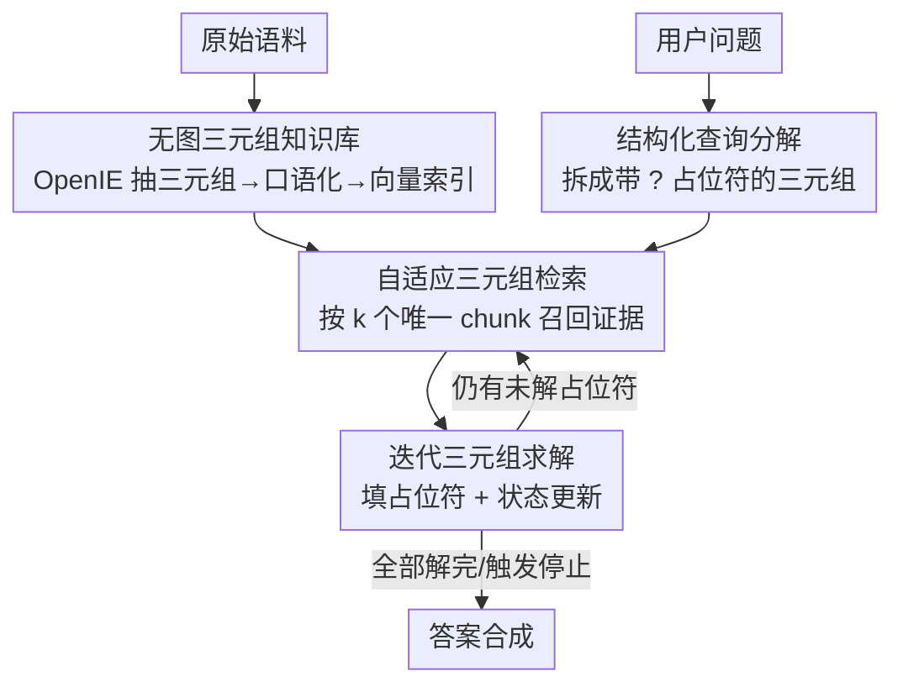

# Beyond Chunks and Graphs: Retrieval-Augmented Generation through Triplet-Driven Thinking

**会议**: ACL2026  
**arXiv**: [2508.02435](https://arxiv.org/abs/2508.02435)  
**代码**: https://github.com/Emory-Melody/T2RAG  
**领域**: 信息检索 / RAG  
**关键词**: 检索增强生成、原子三元组、多跳问答、迭代检索、无图知识库

## 一句话总结
T2RAG 把 RAG 的最小检索单元从"文本块/知识图谱节点"换成**原子三元组**：离线把语料抽成一堆三元组命题建索引，在线则让 LLM 把问题分解成带 `?` 占位符的可搜索三元组、迭代地从三元组库里检索证据填空，直到所有占位符解完再生成答案——在六个数据集上平均提升最多 11%，同时检索成本降低最多 45%。

## 研究背景与动机
**领域现状**：RAG 是缓解 LLM 幻觉、注入外部知识的主流范式。标准 RAG 按相似度召回文档块（chunk），简单问题够用；复杂多跳问题则发展出两条进阶路线——多轮 RAG（Multi-Round）和图 RAG（Graph RAG）。

**现有痛点**：这两条路线各有硬伤。多轮 RAG（如 IRCoT）靠 LLM 把复杂问题拆成子查询逐跳推理，多跳能力强，但每轮要生成冗长的自然语言 CoT，一轮就要 3–6 次 LLM 调用、总共可能 8 轮，token 和延迟开销巨大；而且 chunk 向量在长文本压缩时会丢细节（compression loss）。图 RAG（如 GraphRAG、LightRAG、HippoRAG2）把语料结构化成知识图谱再检索，但离线建图昂贵且易错——实体消歧（entity ambiguity）不准、高度数节点带来检索冗余，LLM 还难以理解图结构。

**核心矛盾**：检索的"粒度"和"代价"之间存在错位。chunk 太粗（混入无关信息+压缩丢细节），显式图谱太重（建图贵、链接错）。问题的根源是：**多跳查询本身缺少连接不同 chunk 所需的中间实体**，而无论 chunk 还是图都没有把"推理时缺什么"和"索引里存什么"对齐起来。

**本文目标**：能不能直接把**三元组**当作 RAG 的基本单元，从而既避开实体级的歧义、又避开 chunk 级的压缩丢失，同时保留多跳推理能力、砍掉 token 开销？

**切入角度**：三元组 (subject, predicate, object) 是一条完整、无歧义的原子事实，比孤立实体语义更完整、比 chunk 更聚焦。如果让 LLM 也"用三元组思考"——把缺失的推理环节表达成同样格式的三元组——那么推理产物和检索索引就天然语义对齐，检索和推理被紧紧耦合。

**核心 idea**：用**带占位符的三元组**作为索引、检索、推理的统一单元，迭代式地"解三元组"代替"建图"和"写 CoT"。

## 方法详解

### 整体框架
T2RAG（Triplet-driven Thinking RAG）分两个阶段。**离线索引**：把原始语料 $\mathcal{C}$ 用 OpenIE 抽成全局三元组集合 $\mathcal{T}_{total}$，再把每个三元组"口语化"（verbalize）成一句自然语言命题 $p$，用嵌入模型编码进一个 FAISS 向量库——这就是一个**无图（graph-free）的三元组命题索引**，同时保留每个命题到源 chunk 的映射。**在线检索**：给定问题，LLM 先做结构化分解，把问题拆成若干带 `?` 占位符的查询三元组；然后进入迭代循环，每轮把"可搜索三元组"转成检索 query 去命题库召回证据、让 LLM 填占位符，更新状态后进入下一轮，直到所有占位符解完或触发停止条件，最后基于已解三元组合成答案。

整条管线是一个清晰的"离线建库 → 分解 → 检索 → 求解 → 状态更新（回环）→ 合成"流程：

### 关键设计

**1. 无图三元组知识库：用原子命题索引代替建图**

针对图 RAG"建图贵且易错"的痛点，T2RAG 干脆不建图。离线阶段对每个 chunk $c_i$ 用信息抽取模型 $LLM_{IE}$ 做 OpenIE，抽出规范三元组 $(subject, predicate, object)$，聚合成 $\mathcal{T}_{total}=\bigcup_{i=1}^{M}\mathcal{T}_i$。关键的一步是**口语化（verbalization）**：把三元组的三个分量直接拼成一句话（"subject predicate object"）变成命题 $p$，再用嵌入模型 $E(\cdot)$ 编码进 FAISS 索引 $\mathcal{I}$。这样做有两层考量：相比实体级，每条命题编码的是一条**完整无歧义的事实**；相比 chunk 级，它**避免了长文本嵌入的压缩丢失**。索引里同时存命题→源 chunk 的映射，因为后续解析常需要回看原文补细节。和图 RAG 相比，它跳过了离线建图这一步——论文指出 LightRAG、GraphRAG 的建图分别要花初始三元组抽取约 $6\times$、$10\times$ 的 token，而 T2RAG 把开销停在"抽三元组"这一步，索引成本在这一类方法里很有竞争力。

**2. 结构化查询分解：把问题拆成带占位符的三元组并按可搜索性分类**

针对"多跳查询缺中间实体"的痛点，T2RAG 不写自然语言子查询，而是让 LLM 把问题分解成一组查询三元组 $\mathcal{T}_q$，其中未知实体用 `?` 占位符显式标出。按占位符个数把三元组分成三类：**已解三元组**（$\mathcal{T}_{\text{resolved}}$，零占位符，已知事实无需检索）、**可搜索三元组**（$\mathcal{T}_{\text{searchable}}$，恰好一个占位符，两个已知元素让检索高度聚焦准确）、**模糊三元组**（$\mathcal{T}_{\text{fuzzy}}$，两个及以上占位符，太含糊不能直接搜，要等后续轮次升级成可搜索或已解）。这套显式分类保证了每一轮检索都"打在刀刃上"——只对刚好缺一格的三元组发起检索，避免对信息不足的查询乱召回。

**3. 自适应三元组检索：用唯一源 chunk 数控预算 + 全局排序**

针对固定 top-$k$ 对不同复杂度查询不鲁棒的问题，T2RAG 的检索在两个维度上自适应。先把当前可搜索三元组 $\mathcal{T}_{\text{searchable}}^{(l)}$ 去掉占位符拼成查询命题、用同一个 $E(\cdot)$ 编码去查 $\mathcal{I}$。第一，**检索量按唯一 chunk 数约束而非固定命题数**：召回持续进行，直到累积覆盖 $k$ 个不同来源 chunk 的三元组为止——这样难问题能自然地从更广的命题里取证。第二，**全局候选池**：把所有查询命题的候选汇成一个统一池子按相似度全局排序，而不是给每条命题各分一份固定预算。最终返回召回命题集 $\mathcal{P}_{\text{retrieved}}^{(l)}$ 及其源 chunk $\mathcal{C}_{\text{retrieved}}^{(l)}$——保留原文是因为三元组常缺细节，需要 chunk 补全。

**4. 迭代三元组求解与紧凑状态转移：用三元组当"工作记忆"代替冗长 CoT**

这是 T2RAG 高效的核心。每轮拿到检索上下文后，LLM 被提示用证据**填占位符**：把可搜索三元组升级为已解（填掉那一个 `?`），或把模糊三元组升级为可搜索/已解（填掉一个或多个 `?`）。随后做**状态更新**：已解集合单调累加本轮验证的事实；下一轮只针对**新产生的**可搜索三元组（不重扫旧的）；模糊队列里被解掉或升级的项被剪掉；若某轮没产生可搜索三元组，则回退用当前问题的自然语言嵌入直接对三元组库做稠密检索。整个迭代在轮次间**只传递紧凑三元组、不传冗长 CoT**，这正是 token 大降的原因；而且 LLM 生成的"推理缺口"与检索索引同为三元组格式，二者语义强对齐。终止条件有三：(1) 可搜索与模糊队列都空（推理链完整）；(2) 没新可搜索三元组且无剩余模糊三元组（早停）；(3) 达到最大迭代数 $N$。终止后分两路合成答案——自然完成则只用已解三元组生成答案，强制终止（早停或到上限）则把累积的已解+剩余可搜索三元组都拼进上下文。把最终生成主要锚在结构化已验证事实而非原始文本上，进一步压低 token 与幻觉风险。

### 一个完整示例
追踪查询"Who is the child of the performer of Me And Bobby McGee?"的某一轮：上一轮已把 `?performer` 解成 "Roger Miller"，系统生成可搜索三元组 $(\text{Roger Miller}, \text{child}, \texttt{?child})$，去占位符拼成查询命题 "Roger Miller child" 编码去查 $\mathcal{I}$，召回含 Roger Miller 家庭信息的 chunk；LLM 读到上下文"…Roger Miller's son, Dean Miller…"，把可搜索三元组升级为已解 $(\text{Roger Miller}, \text{child}, \text{Dean Miller})$；状态更新后可搜索队列清空、无模糊三元组剩余，触发终止，用这条已解三元组合成最终答案 "Dean Miller"。可以看到：缺什么就只问那一格，证据一到立刻填实，全程在三元组层面流转。

## 实验关键数据

### 主实验
六个数据集覆盖三类 ODQA：简单 QA（PopQA）、多跳 QA（2Wiki、MuSiQue、HotpotQA）、领域 QA（Story、Medical，从 GraphRAG-Bench 改造）。统一用 NV-Embed-v2 做嵌入，LLM 用 Gemini-2.5-flash 或 GPT-4o-mini，多轮方法最大 $N=3$ 轮、每轮 $k=5$，指标为 EM/F1。基线含非检索 NOR、BM25、Standard RAG、图 RAG 的 HippoRAG2、摘要式 RAPTOR、多轮的 IRCoT。

| 后端 LLM | 方法 | 平均 EM | 平均 F1 |
|----------|------|---------|---------|
| Gemini-2.5-flash | IRCoT（最强基线） | 46.7 | 61.8 |
| Gemini-2.5-flash | RAPTOR | 43.6 | 54.6 |
| Gemini-2.5-flash | HippoRAG2 | 39.8 | 52.7 |
| Gemini-2.5-flash | **T2RAG** | **51.7** | **63.9** |
| GPT-4o-mini | HippoRAG2（最强基线） | 45.6 | 61.1 |
| GPT-4o-mini | RAPTOR | 43.5 | 57.4 |
| GPT-4o-mini | IRCoT | 42.8 | 58.8 |
| GPT-4o-mini | **T2RAG** | **47.2** | 60.2 |

T2RAG 在两个后端的平均 EM 都登顶（F1 仅在 GPT-4o-mini 下屈居第二）。多跳数据集优势最明显：2Wiki 上 EM 比 IRCoT 在 Gemini/GPT 后端分别高出 >7.7% 和 >5.4%。论文还观察到 T2RAG 与推理型 LLM（Gemini-2.5-pro 等）有强协同——它能借 step-by-step 引导发挥模型推理力，而 HippoRAG2 换上推理 LLM 反而掉点（把 LLM 降格成简单过滤器没用上推理能力）。

### 消融实验
在 PopQA / 2Wiki / MuSiQue 上做组件消融（数值为 EM/F1，括号为相对完整模型的相对下降）：

| 配置 | PopQA F1 | 2Wiki F1 | MuSiQue F1 | 说明 |
|------|----------|----------|-----------|------|
| T2RAG（完整） | 63.0 | 74.0 | 45.0 | 完整模型 |
| − single round | 60.5（↓4.0%） | 59.0（↓20.3%） | 24.0（↓46.7%） | 退化成单轮、去掉迭代 |
| − w/o chunk | 44.7（↓29.0%） | 68.0（↓8.1%） | 29.9（↓33.6%） | 迭代中不回看原始 chunk |

### 关键发现
- **迭代是多跳的命脉**：去掉多轮迭代后 MuSiQue 的 F1 暴跌 46.7%（EM 跌 54.5%），证明"分解+逐步解三元组"对复杂问题不可或缺；简单的 PopQA 则只掉 4%。
- **原文 chunk 不能丢**：去掉迭代中的原始 chunk 后 PopQA F1 掉 29%，说明三元组常缺细节、需要原文补全，与 MiniRAG 的观察一致。
- **三元组解析状态强相关于成功率**：未能解完全部三元组的问题，2Wiki 上 F1 从 76% 跌到 53%——"把占位符全解掉"几乎等价于答对。错误分析显示主要错因是漏检（missing retrieval），幻觉率低至 2%。
- **效率换位**：离线索引 token 因要把整库抽成三元组而偏高，但这只是图 RAG 建图前的第一步（LightRAG/GraphRAG 还要再花 $6\times$/$10\times$）；在线检索阶段 T2RAG 的 token 和延迟远低于 IRCoT，甚至逼近单轮方法（因为只做针对性三元组检索、不处理大块噪声文本）。

## 亮点与洞察
- **"让推理产物和检索索引同构"是最巧的一招**：LLM 生成的推理缺口和库里存的知识都是三元组，检索与推理天然语义对齐，省掉了 chunk/图与 CoT 之间的格式鸿沟。这个"统一表示"思路可迁移到任何需要把生成意图对齐检索索引的系统。
- **占位符三分类（resolved/searchable/fuzzy）是一个轻量却有效的状态机**：用占位符个数判断"能不能搜、要不要等"，让每轮检索都聚焦在刚好缺一格的事实上，避免了对信息不足查询的盲目召回。
- **"按唯一 chunk 数控预算 + 全局候选池"** 比固定 top-$k$ 更鲁棒，难问题自动取更广证据——这个自适应检索预算的设计可以直接搬到别的多查询 RAG 里。
- **无图却保留多跳能力**：用迭代解三元组"补"了图遍历的功能，绕开了建图的高成本和实体消歧的错误源，是"用在线计算换离线结构"的典型权衡。

## 局限与展望
- 三元组质量受现成 OpenIE 抽取器制约——作者明说更好的抽取技术不在本文范围，附录有错误分析；抽取漏/错会直接传导到检索（错因里"漏检"是主因）。
- 仅聚焦事实型（factoid）QA、答案须为单一实体或 yes/no，对开放式/摘要式问题的适用性未验证。
- 与推理型 LLM 协同显著，意味着方法收益部分依赖强后端模型；在弱模型上的天花板需进一步看。
- 最大迭代数固定 $N=3$，对需要更深推理链（如 MuSiQue 的更难子集）可能受限；自适应轮数预算是潜在改进点。

## 相关工作与启发
- **vs IRCoT（多轮 RAG）**：IRCoT 交替展开冗长 CoT 与检索，token/调用次数高；T2RAG 把查询展开和中间推理都压成三元组，多跳能力相当甚至更强，但 token 大降、在线效率逼近单轮。
- **vs HippoRAG2 / LightRAG / GraphRAG（图 RAG）**：它们显式建知识图谱（同义实体链接、PageRank、社区检测等），建图贵且受实体消歧之害；T2RAG 完全不建图，用无图命题索引 + 迭代解析替代图遍历，索引成本停在抽三元组这一步。
- **vs GEAR（同样用三元组检索）**：GEAR 靠邻居扩展（检索共享头/尾实体的三元组），跨上下文对齐同一实体既不准又贵；T2RAG 不做实体邻居扩展，而是用带占位符的可搜索三元组做稠密检索，回避了实体链接难题。

## 评分
- 新颖性: ⭐⭐⭐⭐⭐ 把三元组作为索引/检索/推理的统一单元、用"解占位符"替代建图与写 CoT，视角新且自洽。
- 实验充分度: ⭐⭐⭐⭐ 六数据集×两后端+消融+效率+错误分析较全面；但仅限 factoid QA、依赖现成抽取器。
- 写作质量: ⭐⭐⭐⭐⭐ 动机推导清晰，三类三元组与迭代状态机讲得明白，配图与示例到位。
- 价值: ⭐⭐⭐⭐⭐ 平均提升至多 11%、检索成本降至多 45%，且代码开源，对落地高效多跳 RAG 有直接参考价值。

<!-- RELATED:START -->

## 相关论文

- [\[ACL 2026\] Beyond Black-Box Interventions: Latent Probing for Faithful Retrieval-Augmented Generation](beyond_black-box_interventions_latent_probing_for_faithful_retrieval-augmented_g.md)
- [\[ACL 2025\] Graph of Records: Boosting Retrieval Augmented Generation for Long-context Summarization with Graphs](../../ACL2025/information_retrieval/gor_rag_long_context_summary.md)
- [\[ACL 2025\] Accelerating Adaptive Retrieval Augmented Generation via Instruction-Driven Representation Reduction of Retrieval Overlaps](../../ACL2025/information_retrieval/accelerating_adaptive_retrieval_augmented_generation_via_instruction-driven_repr.md)
- [\[ICLR 2026\] Attributing Response to Context: A Jensen-Shannon Divergence Driven Mechanistic Study of Context Attribution in Retrieval-Augmented Generation](../../ICLR2026/information_retrieval/attributing_response_to_context_a_jensen-shannon_divergence_driven_mechanistic_s.md)
- [\[CVPR 2026\] Language-driven Fine-grained Retrieval](../../CVPR2026/information_retrieval/language-driven_fine-grained_retrieval.md)

<!-- RELATED:END -->
