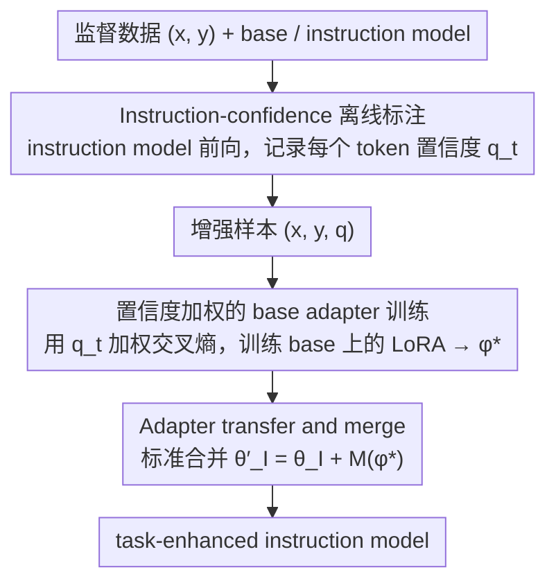

# GIFT: Guided Fine-Tuning and Transfer for Enhancing Instruction-Tuned Language Models

**会议**: ACL2026  
**arXiv**: [2605.01256](https://arxiv.org/abs/2605.01256)  
**代码**: https://github.com/sustech-nlp/gift  
**领域**: LLM适配 / 参数高效微调 / 模型合并  
**关键词**: Guided Fine-Tuning, LoRA, Instruction Model, Adapter Merge, 置信度加权  

## 一句话总结
GIFT 让 instruction-tuned 模型不再只是最终 merge 的被动目标，而是先用它给训练 token 标注置信度，再用这些置信度指导 base model 的 LoRA 微调，最后把 adapter 合并回 instruction model，在数学、医学和指令任务上稳定超过直接微调与 Shadow-FT 等迁移基线。

## 研究背景与动机
**领域现状**：开源 LLM 通常同时发布 base model 和 instruction-tuned model。Instruction 模型经过复杂 post-training，具备更好的指令跟随、鲁棒性和通用推理能力，但直接对它做下游任务微调容易破坏这种平衡。

**现有痛点**：一种常见替代方案是在 base model 上训练任务 adapter，然后把学到的更新 merge 到 instruction model 中，例如 Shadow-FT、Chat Vector、Re-Adapt 等。但这些方法通常只在最后一步使用 instruction model，训练 adapter 时仍按普通 SFT 对所有 token 一视同仁。

**核心矛盾**：任务数据里的每个 token 并不等价。有些 token 是关键推理步骤或领域知识，有些只是风格、措辞或可替代表达。普通 SFT 会在 base model 上强行拟合所有 token，尤其对 instruction model 本身低置信的 token 也施加强梯度，导致学到的 adapter 与 instruction model 的表示空间不兼容。

**本文目标**：作者希望把 instruction model 的知识提前引入训练阶段，用它判断哪些 token 更符合 instruction-aligned 行为，从而训练出更适合 merge 回 instruction model 的 adapter。

**切入角度**：论文把 instruction model 对参考答案 token 的概率看作 token importance。若 instruction model 对某 token 高置信，说明它更可能是任务关键且与指令对齐的表达；低置信 token 则可能是噪声、风格差异或不稳定区域，应减少其训练权重。

**核心 idea**：先离线用 instruction model 计算每个目标 token 的置信度 $q_t$，再用 $q_t$ 加权 base model LoRA 的交叉熵损失，训练完把 LoRA adapter merge 到 instruction model。

## 方法详解
GIFT 的关键是把“base 上训练，instruct 上 merge”的迁移流程变成“由 instruct 指导 base 训练，再 merge 回 instruct”。它并不改变 LoRA 合并方式，而是改变 adapter 学习时每个 token 对梯度的贡献。

### 整体框架
给定监督数据 $\mathcal{D}=\{(x,y)\}$，base model 参数为 $\theta_B$，instruction model 参数为 $\theta_I$。已有 transfer 方法假设 $\theta_I=\theta_B+\Delta_I$，因此在 base 上训练出的任务更新 $M(\phi)$ 可以加到 instruction model 上：$\theta'_I=\theta_I+M(\phi)$。GIFT 保留这个 merge 思路，但在训练 $\phi$ 前，先用 instruction model 对每个目标 token 计算 $q_t=p_{\theta_I}(y_t|x,y_{<t})$。随后在 base model 上训练 LoRA adapter 时，用 $q_t$ 对 token loss 加权。训练完成后，adapter 标准 merge 回 instruction model，得到 task-enhanced instruction model。整条流水线就是「instruct 标注 → base 加权训练 → 合回 instruct」三段串行，下面三个关键设计正对应这三段。

### 关键设计

**1. Instruction-confidence 离线标注：让 instruction model 给每个目标 token 打一个"对齐重要性"分**

任务数据里的 token 并不等价——有些是关键推理步或领域知识，有些只是风格、措辞或可替代表达。要训出和 instruction model 兼容的 adapter，先得知道哪些 token 值得学。GIFT 对每个样本 $(x,y)$ 用 instruction model 做一次 forward pass，记录它对参考答案每个 token 的概率 $q_t=p_{\theta_I}(y_t|x,y_{<t})$，把分数固定保存成增强样本 $(x,y,\mathbf{q})$，之后训练不再反复调用这个 teacher。

为什么用 instruction model 的置信度、而不是 base model 自己的 likelihood？因为 instruction model 经过 post-training，更清楚哪些表达符合指令跟随和任务解决，它的高置信 token 更可能是"适合被 merge 回 instruction 空间"的那一批。

**2. 置信度加权的 base adapter 训练：用 $q_t$ 重新分配交叉熵梯度，让 adapter 多学高置信 token、少碰低置信区域**

普通 SFT 对所有 token 一视同仁地求负 log likelihood，连 instruction model 本身都低置信的 token 也照样施加强梯度，学出来的 adapter 和 instruction model 的表示空间不兼容，merge 回去就破坏原有能力。GIFT 把损失改成按 $q_t$ 加权：

$$\mathcal{L}_{\mathrm{GIFT}}(\phi)=\mathbb{E}_{(x,y)\sim\mathcal{D}}\Big[\sum_{t=1}^T q_t\,\ell_t(\phi)\Big],\quad \ell_t(\phi)=-\log p_{\theta_B,\phi}(y_t|x,y_{<t})$$

实验里直接用原始 $q_t$，不做归一化、截断或温度缩放。要强调的是这并不是蒸馏：它不拟合 teacher 分布、也不最小化 KL，只是借 teacher 的置信度重分配标准 CE 的梯度，把更新方向往 instruction-consistent 的地方拉。

**3. Adapter transfer and merge：把 base 上学到的能力标准合并回 instruction model，刻意不用花哨 merge 技巧**

训练拿到最优 adapter $\phi^\star$ 后，GIFT 按标准 LoRA merge 得到 $\theta'_I=\theta_I+M(\phi^\star)$，依据是已有 transfer 方法假设 $\theta_I=\theta_B+\Delta_I$，所以 base 上的任务更新可以直接加到 instruction model 上。论文特意只用最朴素的 merge，是为了把增益干净地归因到 guided fine-tuning 本身，而不是合并技巧。TIES、DARE、Fisher-weighted averaging 这些更强的 merge 留作后续增强——GIFT 的核心贡献在训练阶段，不在 post-hoc 合并。

### 损失函数 / 训练策略
所有方法使用相同 LoRA 设置：AdamW，训练 1 epoch，最大序列长度 2048，global batch size 256，学习率 $2\times10^{-4}$，LoRA rank $r=64$，LoRA scaling $\alpha=128$，dropout 0.05，warmup ratio 0.1。数学任务用 NuminaMath-CoT 的 2,000 个样本训练，在 Math500、Minerva Math、OlympiadBench、AIME 2024、AMC 2023 上评估；推理使用 temperature 1.0，最大生成长度 4096，每题采样 16 次并报告 Average@16。医学任务用 MedMCQA 10,000 样本训练，在 MedQA、MMLU-medical、MedMCQA test 上报告多选准确率。

## 实验关键数据

### 主实验

| 数据集 / 模型 | 指标 | GIFT | 原始 instruct / 强基线 | 提升 / 结论 |
|--------|------|------|----------|------|
| Llama3.1-8B 数学五任务 | Average@16 | 22.0 | Instruct 16.8；Shadow-FT 18.0 | 比原模型 +5.2，比 Shadow-FT +4.0 |
| Llama3.2-3B 数学五任务 | Average@16 | 19.5 | Instruct 16.5；Shadow-FT 16.7 | 小模型上也稳定提升 |
| Qwen2.5-7B 数学五任务 | Average@16 | 42.9 | Instruct 41.3；Shadow-FT 38.0 | 强 instruction 模型上仍能 +1.6 |
| DeepSeek-Math-7B 数学五任务 | Average@16 | 19.7 | Instruct 16.8；Shadow-FT 17.4 | 数学专门模型也受益 |
| Llama3.1-8B 医学 QA | Average accuracy | 68.8 | Instruct 62.6；Shadow-FT 65.1 | 医学知识密集任务 +6.2 |
| MedQA | Accuracy | 68.3 | Instruct 55.2；Shadow-FT 65.6 | 事实与多选推理提升最大 |
| MMLU-medical | Accuracy | 77.7 | Instruct 75.1；Shadow-FT 73.8 | 保持并提升医学通用知识 |
| MedMCQA | Accuracy | 60.2 | Instruct 57.4；Shadow-FT 55.9 | 训练域测试也领先 |

### 消融实验

| 配置 | 关键指标 | 说明 |
|------|---------|------|
| Qwen2.5-7B Instruct | 数学平均 41.3 | 原始 instruction baseline 很强 |
| SFT+Merge / Shadow-FT | 数学平均 38.0 | 普通 base adapter 合并会造成 -3.3 退化 |
| GIFT-BaseT | 数学平均 41.0 | 用 base model 当 teacher 只能接近恢复 baseline，说明 reweighting 本身不够 |
| GIFT full | 数学平均 42.9 | instruction teacher 的 guidance 才带来稳定增益 |
| Qwen2.5-7B MMLU / IFEval | 68.8 / 72.1 | 相比原模型 68.7 / 71.2，不损害通用知识和指令跟随 |
| Llama3.1-8B MMLU / IFEval | 63.7 / 74.7 | 相比原模型 63.2 / 73.8，同样保持或提升 |
| Super-NaturalInstructions summarization | EM 12.00；RougeL 40.28 | 原模型 10.75 / 37.38，说明不只适用于数学和医学 |
| Qwen2.5 scale 0.5B→32B | 0.5B: 8.3 vs 7.9；32B: 51.2 vs 50.6 | GIFT 在不同模型规模上都超过 instruct baseline |

### 关键发现
- 直接微调 instruction model 在有限监督下会明显退化。例如 Llama3.1-8B 数学平均从 16.8 降到 8.9，Qwen2.5-7B 从 41.3 降到 21.2，说明 naive Instruct-SFT 风险很大。
- GIFT 在强模型上仍有效。Qwen2.5-7B-Instruct 原本数学平均 41.3，Shadow-FT 降到 38.0，而 GIFT 升到 42.9，表明 guidance 能提升 merge compatibility。
- 学习信号分析解释了机制：Shadow-FT 中 79.7% 的学习信号来自低置信 token，高置信 token 只占 6.9%；GIFT 把低置信贡献降到 29.6%，高置信贡献提高到 31.5%。
- 离线标注成本较低：2,000 条 NuminaMath-CoT 样本在单张 RTX 4090 24GB 上，Llama3.1-8B-Instruct 用 2m11s，Qwen2.5-7B-Instruct 用 2m9s，峰值显存均小于 22GB。

## 亮点与洞察
- **让 instruction model 从“merge 目标”变成“训练导师”**：这是本文最漂亮的概念转向。既然最终要把 adapter 合回 instruction model，就应该让 instruction model 参与决定 adapter 学什么。
- **不是蒸馏，成本更低**：GIFT 不需要每步 teacher-student KL，也不需要在线 teacher inference，只做一次离线 token confidence annotation，保留了 SFT 的简单性。
- **解释了为什么 Shadow-FT 有时会不稳**：普通 CE 会被低置信、高 loss token 主导，这些 token 可能正是 instruction model 不认可的区域；merge 后就容易破坏原本的指令能力。
- **适合低数据任务适配**：数学只用 2,000 条样本，医学用 10,000 条，结果说明当数据有限且任务专业时，学习信号选择比单纯增加训练强度更重要。

## 局限与展望
- GIFT 需要额外的离线 annotation pass。当前 2K 数学样本成本很低，但若扩展到数百万样本，预处理时间和存储仍会增加。
- 论文主要使用标准 LoRA merge 来隔离变量，尚未探索与 TIES、Fisher-weighted averaging 等更复杂合并技术结合后的收益。
- guidance 直接使用 instruction model 的 token probability，未研究归一化、温度、截断或基于序列/步骤级置信度的替代设计。
- 如果 instruction model 本身对某个领域知识薄弱或系统性偏见较强，其置信度可能错误压低真正有价值的新知识。未来需要研究 teacher confidence 与 task novelty 之间的张力。

## 相关工作与启发
- **vs Shadow-FT / Chat Vector**: 它们也在 base 上训练任务更新再合回 instruction model，但 instruction model 只在合并阶段出现；GIFT 在训练阶段就用 instruction confidence 塑形更新方向。
- **vs Re-Adapt / Task Arithmetic**: 这些方法关注如何线性组合 base、instruction offset 和 task update；GIFT 更关注 task update 怎么学得更兼容，两类方法可以互补。
- **vs TIES / DARE**: TIES、DARE 解决 post-hoc merge 时的干扰和冗余；GIFT 解决的是训练时低质量梯度进入 adapter 的问题。
- **启发**：在模型适配中，teacher 不一定要提供完整答案分布；只提供“哪些 token 更值得学”的权重，也能显著改善参数更新质量。

## 评分
- 新颖性: ⭐⭐⭐⭐☆ 置信度加权思想直观，但把 instruction model 用作 base adaptation 的训练导师很精准。
- 实验充分度: ⭐⭐⭐⭐☆ 覆盖数学、医学、摘要任务、通用能力、模型尺度和学习信号分析；还可补更多领域和更大数据规模。
- 写作质量: ⭐⭐⭐⭐☆ 方法定义简洁，消融和机制分析有说服力，实验表格支撑充分。
- 价值: ⭐⭐⭐⭐⭐ 对开源 instruction model 的低成本领域适配很实用，尤其适合 LoRA/adapter 工作流。

<!-- RELATED:START -->

## 相关论文

- [\[ACL 2026\] Enhancing Multilingual RAG Systems with Debiased Language Preference-Guided Query Fusion](enhancing_multilingual_rag_systems_with_debiased_language_preference-guided_quer.md)
- [\[ICLR 2026\] Fine-tuning with RAG for Improving LLM Learning of New Skills](../../ICLR2026/information_retrieval/fine-tuning_with_rag_for_improving_llm_learning_of_new_skills.md)
- [\[ICML 2025\] FedRAG: A Framework for Fine-Tuning Retrieval-Augmented Generation Systems](../../ICML2025/information_retrieval/fedrag_a_framework_for_fine-tuning_retrieval-augmented_generation_systems.md)
- [\[ACL 2025\] Enhancing Lexicon-Based Text Embeddings with Large Language Models](../../ACL2025/information_retrieval/enhancing_lexicon-based_text_embeddings_with_large_language_models.md)
- [\[CVPR 2026\] Language-driven Fine-grained Retrieval](../../CVPR2026/information_retrieval/language-driven_fine-grained_retrieval.md)

<!-- RELATED:END -->
