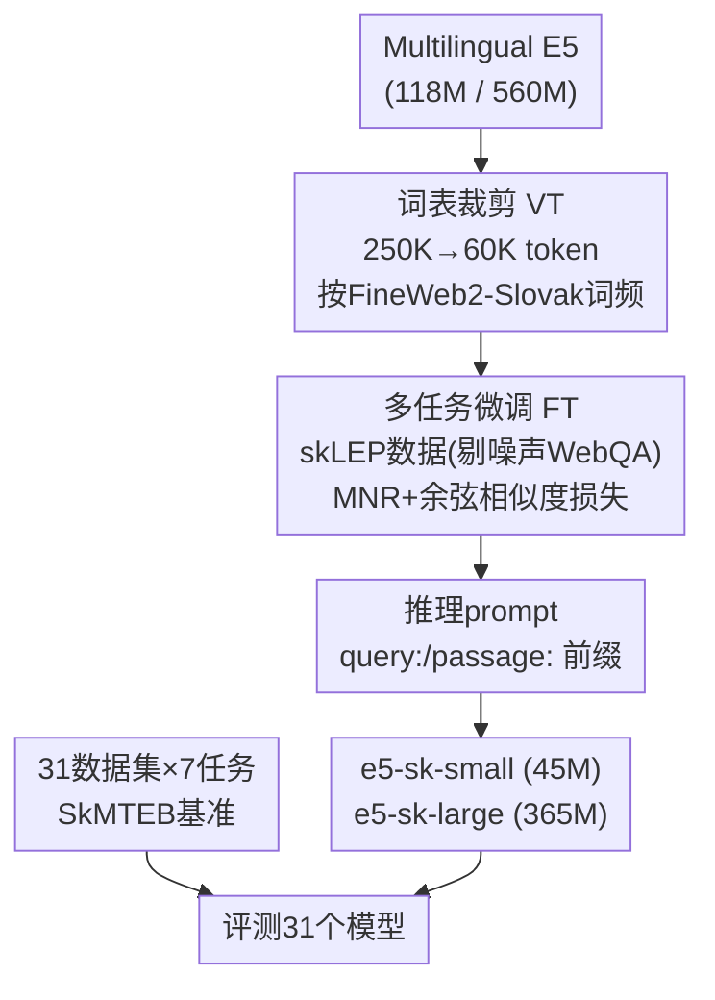

# SkMTEB: Slovak Massive Text Embedding Benchmark and Model Adaptation

**会议**: ACL 2026  
**arXiv**: [2606.13647](https://arxiv.org/abs/2606.13647)  
**代码**: https://github.com/slovak-nlp/skmteb （含模型与数据集 HuggingFace 合集）  
**领域**: 信息检索 / 文本嵌入 / 低资源多语言  
**关键词**: 斯洛伐克语、文本嵌入、MTEB、词表裁剪、低资源NLP

## 一句话总结
论文为斯洛伐克语（约 500 万使用者的西斯拉夫语低资源语言）建了第一个 MTEB 风格的综合文本嵌入基准 SkMTEB（31 个数据集、7 类任务，深度接近现有多语言覆盖的 4 倍），评测了 31 个嵌入模型，并用**词表裁剪 + 定向微调**把 Multilingual E5 压成 45M/365M 的本地可部署斯洛伐克语嵌入模型，在缩小最多 62% 体积的同时追平商用 API。

## 研究背景与动机
**领域现状**：文本嵌入已是语义搜索、检索增强生成（RAG）、聚类、分类的核心基础设施。这个领域一路追求规模——SOTA 模型已达数十亿参数（Qwen3-Embedding 到 8B），但基准证据集中在高资源语言，而最强的模型又难以低延迟或在受限硬件上部署。

**现有痛点**：这个"规模—效率"张力对低资源语言尤其尖锐。大型多语言模型名义上支持数百种语言，但容量主要分给英语、中文等高资源语言；对斯洛伐克语这样的语言，意味着词表里表示不足、训练数据覆盖有限、性能相对受损。更现实的问题是**评估基础设施缺失**：MTEB 催化了英语嵌入研究，C-MTEB/PL-MTEB/ruMTEB 等也为中文、波兰语、俄语提供了相当深度，但斯洛伐克语没有这样的基准——现有 skLEP 只覆盖自然语言理解（NLU），不含检索和语义相似度这些嵌入任务；而 MMTEB 虽覆盖 250+ 语言，却以广度换深度，斯洛伐克语只有 8 个任务（仅为英语 MTEB 深度的 14%、PL-MTEB 的 29%），且多是 SIB-200/FLORES/Tatoeba 这类多语言数据集的子集，缺乏原生检索、领域特定或时间锚定的评估场景。

**核心矛盾**：低资源语言既缺"能诊断本语言模型行为"的深度基准，又缺"能实际部署"的紧凑高效模型；而对这类语言，目标不该是在通用基准上追平最大模型，而是造出"服务好本语言的实用高效模型"。

**本文目标**：(1) 建一个有足够深度和广度的斯洛伐克语嵌入基准；(2) 证明用相对适度的资源（微调现有模型 + 词表裁剪）就能训出有效的斯洛伐克语嵌入模型。

**切入角度 / 核心 idea**：基准侧——复用并改造现有数据集、再补建全新数据集凑出 31×7 的覆盖；模型侧——对多语言 E5 做**词表裁剪**（多语言模型 30%–40% 参数耗在嵌入矩阵、其中大量 token 与目标语言无关）再定向微调，把"砍掉无关 token"和"用高质量本语数据微调"两件事叠起来，换取体积大降而性能不掉。

## 方法详解

### 整体框架
论文有两条并行的工作线。**基准线**：按 MTEB 框架组织 7 类任务——检索（5）、重排（3）、分类（7）、聚类（5）、双语挖掘（6）、句对分类（3）、语义文本相似度 STS（2），共 31 个数据集，跨新闻、政务、社媒、评论、百科等领域，时间跨度 2000–2025；其中 6 个与 MMTEB 重叠（保证可跨语言比较），25 个不在 MMTEB 内、7 个是为本工作全新创建。**模型线**：以 Multilingual E5 为底座，先做词表裁剪再用 skLEP 高质量数据微调，产出 e5-sk-small（45M）和 e5-sk-large（365M）两个本地可部署模型。

### 关键设计

**1. SkMTEB 基准：用"改造 + 新建"补上低资源语言的深度**

针对"斯洛伐克语缺深度嵌入基准"的痛点。直接收集会因斯洛伐克语数据集严重不足而凑不出广度，作者的做法是双管齐下：一方面**把已有数据集改造成新任务**（如把新闻摘要数据集 SlovakSum/SMESum 重构成"用摘要当 query 检索全文"的检索任务、用 URL 结构做聚类），另一方面**新建 7 个全新数据集**（如从药剂师问答构建的两个重排数据集、从 Demagog.sk 事实核查数据构建的 NLI 句对、LLM 生成并人工校验的 SlovakSumSTS）。最终 31 个数据集覆盖检索/重排/分类/聚类/双语挖掘/句对分类/STS 七类，深度接近 MMTEB 斯洛伐克语覆盖的 $4\times$，且只有 6 个数据集与 MMTEB 重叠——两者互补：MMTEB 做跨语言比较，SkMTEB 提供诊断本语言模型行为的深度。

**2. 词表裁剪（Vocabulary Trimming）：砍掉无关 token，体积大降而迁移不掉**

针对"多语言模型 30%–40% 参数耗在嵌入矩阵、其中大量 token 与斯洛伐克语无关"的痛点。VT 移除目标语言用不到的词表 token：作者按 FineWeb2-Slovak（质量过滤的斯洛伐克语网络语料）的 token 词频，从 250K 保留到 60K（沿用前人发现的"覆盖率与效率平衡点"），且在微调**之前**裁剪（Pre-FT VT），同时缩小模型体积和训练时间。结果 E5-small 从 118M 降到 45M（缩 62%）、E5-large 从 560M 降到 365M（缩 35%）。一个自然的担忧是"激进裁剪会损害跨语言迁移"，论文专门用六个跨语言双语挖掘任务验证：裁剪前后 F1 差异极小（small 最大变化 0.92、large 仅 0.14），多个语对裁剪后反而微升——说明定向词表缩减保住了斯洛伐克语-英语、斯洛伐克语-捷克语的迁移能力。

**3. 多任务微调与数据质量把关**

针对"如何用适度资源训出有效嵌入模型"的痛点，以及一个踩过的坑。初始方案是用包含 Slovak Web QA 三元组的全量数据微调 SlovakBERT，得到的 sturovec-base 虽用了 1.4M 训练样本，平均分（68.99）却还**不如**未微调的 multilingual-e5-small（70.32）。分析发现问题出在 Web QA 的**自动硬负例采样**——从同域随机抽答案，并不能稳定提供有意义的对比信号。于是改用只含 skLEP 高质量数据（SK-SQuAD、NLI、STS、RTE）微调 E5：均值池化、最大长度 256，多任务学习用余弦相似度损失（STS）+ 多重负例排序损失 MNR（其余任务），batch 32、学习率 $2\times10^{-5}$、3 epoch、单张 H100 一小时内训完；推理时按 E5 惯例给 query 和 passage 加 `query:`/`passage:` 前缀。这条"剔掉噪声数据 + 加对的损失/前缀"的路线才让裁剪后的小模型追平基线。

### 损失函数 / 训练策略
多任务学习：STS 任务用 Cosine Similarity Loss，其余任务用 Multiple Negatives Ranking Loss（MNR，Henderson et al. 2017）。训练配置：mean pooling、max length 256、batch 32、lr $2\times10^{-5}$（线性 warmup 占 10% 步数）、3 epoch、单张 NVIDIA H100、随机种子 42。训练数据来自 skLEP：SK-SQuAD（72K query-context 对）、XNLI 译来的 NLI（393K 对）、GLUE STS-B（6K 对）、GLUE RTE（2.5K 对）；后续剔除了 Slovak Web QA（967K 对，硬负例信号不稳定）。

## 实验关键数据

### 主实验（SkMTEB 全任务平均，%，节选 Table 1）
"All"为全任务平均，"Type"为按任务类型的非加权平均。

| 模型 | 参数量 | All | Type | 备注 |
|------|------|------|------|------|
| multilingual-e5-large-instruct | 560M | **77.49** | 78.44 | 全场最高（指令微调） |
| gemini-embedding-001 | API | 77.23 | 78.07 | 商用，紧随其后 |
| **e5-sk-large（本文）** | 365M | 74.70 | 75.88 | 缩 35%，追平 text-embedding-3-large |
| text-embedding-3-large | API | 75.07 | 75.89 | 商用上界参考 |
| multilingual-e5-large | 560M | 74.25 | 75.49 | 本文 large 底座 |
| jina-embeddings-v4 | 3.8B | 72.44 | 73.87 | 大模型未必更强 |
| **e5-sk-small（本文）** | 45M | 70.56 | 72.01 | 缩 62%，追平 text-embedding-3-small |
| text-embedding-3-small | API | 70.48 | 71.39 | 商用 |
| multilingual-e5-small | 118M | 70.32 | 71.78 | 本文 small 底座 |

### 消融实验（VT / FT / prompt，Table 2）

| 变体 | VT | FT | prompt | 体积 | Avg | Δ |
|------|----|----|--------|------|-----|---|
| mE5-small（基线） | | | | 118M | 70.32 | — |
| + VT | ✓ | | | 45M | 70.45 | +0.13 |
| + FT | | ✓ | | 118M | 70.58 | +0.26 |
| + VT + FT | ✓ | ✓ | | 45M | 70.56 | +0.24 |
| + VT + FT + prompt | ✓ | ✓ | ✓ | 45M | **71.07** | +0.75 |
| mE5-large（基线） | | | | 560M | 74.25 | — |
| + VT | ✓ | | | 365M | 74.56 | +0.31 |
| + VT + FT | ✓ | ✓ | | 365M | 74.70 | +0.45 |
| + VT + FT + prompt | ✓ | ✓ | ✓ | 365M | **74.72** | +0.47 |

### 关键发现
- **大不一定强**：指令微调的 multilingual-e5-large-instruct（77.49）和 gemini-embedding-001（77.23）领先，但超大模型回报递减——jina-embeddings-v4（3.8B，72.44）反落后于 snowflake-arctic-embed-l-v2.0（568M，72.54）和 nomic-embed-text-v2-moe（330M，72.58），仅微胜 multilingual-e5-base（278M，72.39）。
- **任务难度悬殊**：双语挖掘近乎被解决（多数模型 F1>90），聚类最难（V-measure 仅 17–50，提升空间大）；STS 偏好有显式相似度训练目标的模型（jina-embeddings-v3 达 89.82）。
- **Slovak NLU 模型迁移差**：为 NLU 训练的 slovakbert-skquad-mnlr、slovakbert-sts-stsb 在嵌入任务上明显逊于多语言替代，凸显需要专门的嵌入模型开发。
- **本文模型实用等价商用 API**：TOST 等价性检验确认 e5-sk-small≈text-embedding-3-small、e5-sk-large≈text-embedding-3-large（90% CI 落在 ±2 分内），且本文模型开源、本地零 API 成本、体积更小吞吐更高。
- **prompt 对小模型增益更大**：加 `query:`/`passage:` 前缀对 small 提升 +0.51（70.56→71.07），对 large 仅 +0.02——容量有限的模型更受益于显式的 query-passage 区分。

## 亮点与洞察
- **"砍词表"是低资源部署的高性价比杠杆**：VT 把 small 体积砍 62% 而性能反升 +0.13，且专门验证跨语言迁移几乎无损（最大掉 0.92 F1）——这条"先裁剪再微调"的路线对任何"多语言大模型→单一低资源语言"的压缩需求都可复制。
- **诚实地报告失败路线**：sturovec-base 用 1.4M 样本反而不如未微调基线，作者把它当"数据质量教训"写出来（硬负例随机采样不提供对比信号），比只报最好结果更有参考价值。
- **基准设计兼顾互补性**：刻意只与 MMTEB 重叠 6 个数据集，让 SkMTEB（深度）和 MMTEB（跨语言广度）互补而非重复，是低资源语言建基准时值得借鉴的策略。
- **"实用等价"用统计检验背书**：用 TOST 等价性检验而非简单比大小来论证"追平商用 API"，结论更稳。

## 局限与展望
- **聚类等难任务仍弱**：V-measure 17–50 表明嵌入在斯洛伐克语聚类上远未解决，本文模型也未在此类任务上明显突破。
- **微调数据规模有限**：剔掉 Web QA 后仅用 skLEP 的几个数据集（最大 SK-SQuAD 72K），高质量斯洛伐克语对比数据仍稀缺，限制了进一步提升。
- **未触及解码器/生成式嵌入新范式**：评测以 encoder/双编码器为主，对最新的 LLM-as-embedder 路线探索有限。
- **可迁移性待验证**：作者称这是"可复制到其它低资源语言的路径"，但论文只在斯洛伐克语上验证，VT 的 60K token 阈值、skLEP 式数据是否对其它语言同样有效尚需检验。

## 相关工作与启发
- **vs MTEB / C-MTEB / PL-MTEB / MMTEB**：MTEB 系列为高资源语言提供深度评估，MMTEB 以广度覆盖 250+ 语言但每语言浅（斯洛伐克语仅 8 任务）；SkMTEB 填上斯洛伐克语的深度缺口（31 任务、≈4× MMTEB），并刻意只与 MMTEB 少量重叠以保持互补。
- **vs 词表裁剪原始工作（Ushio et al. 2023）与荷兰语嵌入裁剪（Banar et al. 2025）**：本文沿用其 60K token 阈值并首次系统验证斯洛伐克语裁剪后的跨语言迁移保持，把 VT 从"通用压缩技巧"落到具体低资源嵌入部署。
- **vs Multilingual E5 / BGE-M3 / Qwen3-Embedding 等大模型**：这些大模型在 SkMTEB 上虽强，但本文证明对单一低资源语言"规模回报递减"，45M/365M 的裁剪模型即可在本地追平商用 API，更契合实际部署约束。

## 评分
- 新颖性: ⭐⭐⭐⭐☆ 首个斯洛伐克语综合嵌入基准 + 系统验证 VT 在低资源嵌入上的跨语言迁移保持。
- 实验充分度: ⭐⭐⭐⭐⭐ 评测 31 个模型、7 类任务，VT/FT/prompt 消融与跨语言迁移、TOST 等价检验齐全。
- 写作质量: ⭐⭐⭐⭐☆ 结构清晰，任务定义与数据集来源交代详尽，失败路线也如实报告。
- 价值: ⭐⭐⭐⭐☆ 为低资源语言提供"建基准 + 压模型"的可复制范式，模型/数据/代码全开源。

<!-- RELATED:START -->

## 相关论文

- [\[ACL 2026\] PL-MTEB: Polish Massive Text Embedding Benchmark](pl-mteb_polish_massive_text_embedding_benchmark.md)
- [\[ICLR 2026\] HUME: Measuring the Human-Model Performance Gap in Text Embedding Tasks](../../ICLR2026/information_retrieval/hume_measuring_the_human-model_performance_gap_in_text_embedding_tasks.md)
- [\[ACL 2026\] FLARE: Task-Agnostic Embedding Model Evaluation via Normalizing Flows](flare_task-agnostic_embedding_model_evaluation_through_a_normalization_process.md)
- [\[ACL 2026\] More Than Efficiency: Embedding Compression Improves Domain Adaptation in Dense Retrieval](more_than_efficiency_embedding_compression_improves_domain_adaptation_in_dense_r.md)
- [\[ACL 2026\] REZE: Representation Regularization for Domain-adaptive Text Embedding Pre-finetuning](reze_representation_regularization_for_domain-adaptive_text_embedding_pre-finetu.md)

<!-- RELATED:END -->
