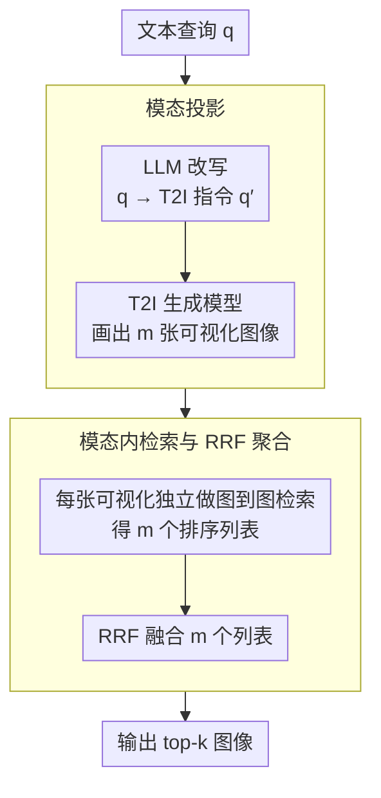

# VisRet: Visualization Improves Knowledge-Intensive Text-to-Image Retrieval

**会议**: ACL 2026  
**arXiv**: [2505.20291](https://arxiv.org/abs/2505.20291)  
**代码**: [GitHub](https://github.com/xiaowu0162/Visualize-then-Retrieve)  
**领域**: 图像生成  
**关键词**: 文本到图像检索, 可视化查询, 跨模态对齐, 检索增强生成, 模态投影

## 一句话总结

本文提出 Visualize-then-Retrieve (VisRet)，一种将文本查询先通过 T2I 生成模型可视化为图像、再在图像模态内进行检索的新范式，在四个基准上平均提升 nDCG@30 0.125（CLIP）和 0.121（E5-V），下游 VQA 准确率在 Visual-RAG-ME 上提升 15.7%。

## 研究背景与动机

**领域现状**：文本到图像（T2I）检索是知识密集型应用的关键环节，常见方法将文本查询和候选图像嵌入共享表示空间后按相似度排序。近年来跨模态嵌入模型（如 CLIP、E5-V）虽不断改进，但跨模态相似度对齐仍面临根本性挑战。

**现有痛点**：跨模态嵌入往往表现为"概念袋"（bags of concepts），无法捕捉结构化的视觉关系，如姿态、视角、空间布局等。例如，查询"翅膀展开的斑头雁"时，嵌入模型能匹配物种类型但无法识别翅膀姿态和仰拍视角等细微视觉特征。现有改进方法（查询重写、多阶段重排序）仍受限于跨模态相似度对齐的内在困难。

**核心矛盾**：文本本质上难以穷尽描述复杂的视觉空间关系，而跨模态检索器在识别细微视觉-空间特征时存在固有弱势。将所有视觉需求编码到文本查询中反而可能因嵌入质量限制而损害检索效果。

**本文目标**：提出一种检索范式，通过将文本查询投射到图像模态来绕过跨模态相似度匹配的弱点，利用检索器在单模态检索中更强的能力。

**切入角度**：可视化提供了比文本更直观、更具表现力的媒介来表达组合概念（实体+姿态+空间关系）。在图像模态内进行检索可以避免跨模态检索器的弱点，利用其在单模态检索中更强的能力。

**核心 idea**：将 T2I 检索分解为"文本→图像模态投影"和"图像→图像模态内检索"两个阶段，通过 T2I 生成模型将文本查询可视化，然后直接用生成的图像进行图到图检索。

## 方法详解

### 整体框架

VisRet 想绕开的是跨模态检索的老问题：文本查询和候选图像被嵌进同一空间后按相似度排序，但跨模态嵌入往往退化成"概念袋"，能匹配物种类型却抓不住翅膀姿态、仰拍视角这类结构化视觉关系。它的思路是干脆不在跨模态空间里硬碰——先用 LLM 把原始文本查询改写成 T2I 指令、再用生成模型把它"画"成若干张图像，把检索彻底搬进图像模态内部完成图到图检索，最后把多张可视化各自的检索结果融合成一个排序。整个过程无需训练，也不动现有的图像嵌入索引。

### 关键设计

**1. 模态投影（Modality Projection）：把文本查询"画"成图像，让视觉需求显式化**

文本天生难以穷尽描述复杂的视觉空间关系，把实体、姿态、视角全塞进一句查询，反而会被跨模态嵌入的质量上限拖累。VisRet 因此让 LLM 先在文本空间把原始查询 $q$ 起草成一条 T2I 指令 $q'$，描述一张可能满足 $q$ 隐含特征需求的图像，再用 Stable Diffusion 等 T2I 方法把 $q'$ 投射成 $m$ 张图像 $\{v_1,\ldots,v_m\} \equiv \mathcal{T}(q)$。一张可视化能同时把所需实体、姿态和视角直接画出来，而这些信息若只靠文本编码就会受制于跨模态匹配；多次采样则顺带引入查询多样性。

**2. 模态内检索与 RRF 聚合：在图像模态里完成检索并融合多张可视化**

一旦查询变成了图像，检索就完全发生在图像模态内部，正好避开跨模态检索器的弱点、转而利用它们在单模态检索中更强的能力。每张生成图像 $v_i$ 独立检索得到一个排序列表 $\mathcal{R}(v_i, \mathcal{I})$，再用 Reciprocal Rank Fusion 把 $m$ 个列表融合：

$$\text{score}_{\text{RRF}}(r) = \sum_{i=1}^{m} \frac{1}{\lambda + \text{rank}_i(r)}$$

其中 $\lambda$ 控制低排名项的影响，最终取融合得分最高的 top-$k$。多图聚合让不同可视化覆盖到查询的不同侧面，比单张图更稳健。

**3. Visual-RAG-ME 基准构建：补上多实体视觉特征比较的评测场景**

现有基准大多只评单实体检索，缺少需要跨多个实体比较视觉特征的场景，而这恰恰是 T2I 检索的难点。VisRet 在 Visual-RAG 基础上扩展出比较两个生物学相近实体视觉特征的问题（如哪个颜色更浅、表面更光滑）：先用 BM25 识别候选实体，再人工构建比较型问题，并从 iNaturalist 标注检索标签，最终筛出 50 个高质量查询。这个基准让"细微视觉-空间特征推理"这一能力有了可量化的考场。

### 损失函数 / 训练策略

VisRet 是一种无训练（training-free）、即插即用的方法，既不修改检索器也不重建预计算的图像嵌入索引，只在查询时一次性调用 LLM 生成 T2I 指令、再用 T2I 模型生成可视化图像即可。

## 实验关键数据

### 主实验

**nDCG@30 跨四个基准（CLIP 检索器）**

| 方法 | Visual-RAG | Visual-RAG-ME | INQUIRE-Rerank-Hard | COCO-Hard |
|------|------|------|------|------|
| Original Query | 0.385 | 0.435 | 0.412 | 0.042 |
| LLM Rewriting | 0.395 | 0.572 | 0.407 | 0.093 |
| Corpus Captioning (BLIP) | 0.271 | 0.371 | 0.401 | 0.153 |
| VISA Reranking | 0.388 | 0.457 | 0.000 | 0.000 |
| **VisRet** | **0.438** | **0.605** | **0.455** | **0.108** |

**nDCG@30 跨四个基准（E5-V 检索器）**

| 方法 | Visual-RAG | Visual-RAG-ME | INQUIRE-Rerank-Hard | COCO-Hard |
|------|------|------|------|------|
| Original Query | 0.407 | 0.486 | 0.407 | 0.178 |
| LLM Rewriting | 0.391 | 0.566 | 0.412 | 0.182 |
| **VisRet** | **0.461** | **0.622** | **0.425** | **0.205** |

### 消融实验

**T2I 生成模型对 Visual-RAG-ME 性能影响（CLIP 检索器）**

| T2I 模型 | N@1 | N@10 | N@30 |
|------|------|------|------|
| Stable Diffusion 3.5 | 0.270 | 0.467 | 0.484 |
| FLUX.1-dev | 0.320 | 0.501 | 0.494 |
| DALL-E 3 | 0.346 | 0.554 | 0.553 |
| gpt-image-1 (high quality) | **0.460** | **0.632** | **0.605** |

**多图聚合 vs 单图（CLIP 检索器）**

| 基准 | 3 张图 N@30 | 1 张图 N@30 |
|------|------|------|
| Visual-RAG | 0.438 | 0.425 |
| Visual-RAG-ME | 0.605 | 0.602 |

### 关键发现

- VisRet 在 CLIP 检索器上平均提升 nDCG@10 0.109（38%↑），在 E5-V 上提升 0.078（23%↑）
- 下游 VQA 准确率：Visual-RAG 上 top-1 检索提升 3.8%，Visual-RAG-ME 上提升 15.7%
- T2I 生成模型质量是性能关键瓶颈：gpt-image-1 远优于 Stable Diffusion 3.5，三类失败模式为缺乏聚焦、事实性问题和指令遵循不佳
- 单图可视化仅轻微降低性能，多图聚合的收益来自增加查询多样性
- 可视化查询虽提升检索但不能替代真实图像作为独立知识来源

## 亮点与洞察

- 视角新颖且实用：通过"先可视化再检索"绕过了跨模态对齐的根本困难，思路简洁有力
- 无训练即插即用：不需要重新训练检索器或修改现有基础设施，可直接利用已有的图像嵌入索引
- Visual-RAG-ME 基准填补了多实体视觉特征比较检索的空白
- VisRet 实际延迟低于 VISA 重排序（约 5× 更快），因为 VISA 需要 LVLM 处理 top-k 候选

## 局限与展望

- 性能强依赖 T2I 生成模型质量，弱模型（如 Stable Diffusion）收益有限
- 生成图像可能存在事实性错误（如物种外观不准确），影响检索质量
- 目前主要评估自然物种领域，在其他知识密集领域（如医学、建筑）的效果待验证
- T2I 生成的计算成本高于简单查询重写

## 相关工作与启发

- **vs LLM Query Rewriting**: 查询重写仍在文本-图像跨模态空间中匹配，VisRet 完全转入图像模态，避免跨模态弱点
- **vs VISA Reranking**: VISA 依赖 LVLM 处理 top-k 候选，成本随 k 线性增长，且受限于初始检索质量；VisRet 从根本上改变查询模态
- **vs Corpus Captioning**: 将图像转为文本会损失信息，尤其在知识密集场景中效果不佳

## 评分

- 新颖性: ⭐⭐⭐⭐⭐ 将 T2I 检索重构为"可视化+图到图检索"，视角独特且优雅
- 实验充分度: ⭐⭐⭐⭐ 四个基准、两个检索器、多种消融分析、下游 VQA 评测，较为全面
- 写作质量: ⭐⭐⭐⭐ 动机清晰，方法简洁，图表直观
- 价值: ⭐⭐⭐⭐ 提供了知识密集型 T2I 检索的新范式，无训练即插即用的特点增加实用性

<!-- RELATED:START -->

## 相关论文

- [\[ACL 2026\] ReasonEmbed: Enhanced Text Embeddings for Reasoning-Intensive Document Retrieval](reasonembed_enhanced_text_embeddings_for_reasoning-intensive_document_retrieval.md)
- [\[ACL 2026\] A Survey of Reasoning-Intensive Retrieval: Progress and Challenges](a_survey_of_reasoning-intensive_retrieval_progress_and_challenges.md)
- [\[ICLR 2026\] Beyond Sequential Reranking: Reranker-Guided Search Improves Reasoning Intensive Retrieval](../../ICLR2026/information_retrieval/beyond_sequential_reranking_reranker-guided_search_improves_reasoning_intensive_.md)
- [\[ACL 2026\] More Than Efficiency: Embedding Compression Improves Domain Adaptation in Dense Retrieval](more_than_efficiency_embedding_compression_improves_domain_adaptation_in_dense_r.md)
- [\[ICML 2026\] LARE: Low-Attention Region Encoding for Text–Image Retrieval](../../ICML2026/information_retrieval/lare_low-attention_region_encoding_for_text-image_retrieval.md)

<!-- RELATED:END -->
