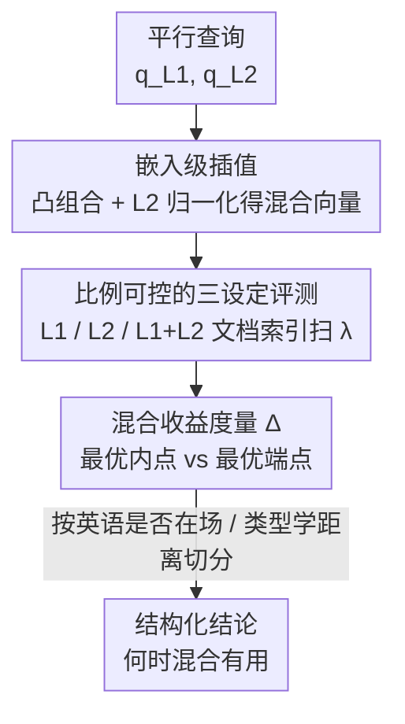

# When Does Mixing Help? Analyzing Query Embedding Interpolation in Multilingual Dense Retrieval

**会议**: ACL2026  
**arXiv**: [2606.13537](https://arxiv.org/abs/2606.13537)  
**代码**: https://github.com/tongyao-zhu/query-embedding-mix  
**领域**: 信息检索 / 多语言 NLP  
**关键词**: 多语言稠密检索, 代码混合查询, 嵌入插值, mMARCO, 英语主导性

## 一句话总结
本文用"嵌入级插值"作为可控代理来研究多语言稠密检索对混合语言查询的敏感性：在 mMARCO 上系统改变两种平行查询的混合比例后发现，最优的混合比例在 88/105 个设定里超过最好的单语查询，且这种收益高度结构化——英语在向量空间里扮演"最强混合伙伴"和"非对称霸主"的角色。

## 研究背景与动机
**领域现状**：多语言社区里用户经常在同一句查询里混用多种语言（code-mixing / code-switching），但稠密检索器（如 BGE-M3）几乎都是在"查询是单一语言"的假设下开发和评测的——要么单语检索、要么跨语言检索（查询整句翻译），混合查询的行为在标准 benchmark 里基本是空白。

**现有痛点**：要真正研究"混合到底有没有用"，需要三样东西同时具备：能精确控制混合比例、有平行查询、能在不同文档语言组成下评测。但用 LLM 生成词级代码混合查询代价极高——每个比例都要单独调一次 LLM，且生成质量不稳定（句子残缺、不遵守指定比例），还会引入语言识别（LID）和分词噪声。

**核心矛盾**：研究者想问的核心问题是——当我们在两种语言之间连续改变混合比例时，检索效果是被"更好的那个单语端点"封顶，还是中间的混合态能同时超过两端？回答它需要的"比例可控性"恰恰是基于文本的混合最难提供的。

**本文目标**：把"混合比例 → 检索效果"这条曲线在大规模语言对上画出来，并搞清楚收益由哪些因素决定（文档语言、英语是否在场、语言对的类型学距离等）。

**切入角度**：作者发现，词级混合查询的嵌入在编码器空间里其实近似落在两个单语端点的连线上（实测沿 EN→ZH 轴近似线性移动、偏离轴的距离很小）。既然如此，与其费力生成文本，不如**直接在嵌入空间插值**两个单语查询的向量。

**核心 idea**：用"嵌入级插值"（embed-mix）代替"LLM 词级混合"作为可控、可扩展、零生成噪声的代理，从而在 35 个语言对 × 3 种文档语言设定上精确扫描混合比例对稠密检索的影响。

## 方法详解
本文不是提出新检索器，而是提出一套**可控测量协议**：固定文档与检索流程，只改变"查询表示"，从而把"语言混合比例"这一个变量干净地隔离出来观察。

### 整体框架
给定一个查询的两种平行翻译 $q_{L_1}, q_{L_2}$，先用固定的多语言编码器各编码一次得到 $\mathbf{e}_{L_1}, \mathbf{e}_{L_2}$；按目标比例 $\lambda$ 对两个嵌入做凸组合并 L2 归一化，得到"混合查询向量"；用这个向量直接到 FAISS 索引里检索 top-$K$ 段落，算 nDCG@10。对每个语言对 $(L_1, L_2)$，都在三种文档语言索引下重复：只有 $L_1$ 文档、只有 $L_2$ 文档、$L_1{+}L_2$ 双语文档。整个研究的输出是一张"nDCG@10 随 $\lambda$ 变化"的曲线族，以及汇总指标 $\Delta$。

### 关键设计

**1. 嵌入级插值（embed-mix）：把"生成混合文本"换成"在向量空间走直线"**

针对"LLM 词级混合代价高、不可控、有 LID/分词噪声"这一痛点，作者直接对两个单语查询嵌入做凸组合。设混合权重 $\lambda \in [0, 100]$（解释为 $L_2$ 的占比），混合查询嵌入定义为归一化的线性插值：

$$\tilde{\mathbf{e}}(\lambda)=\frac{(1-\lambda/100)\,\mathbf{e}_{L_1}+(\lambda/100)\,\mathbf{e}_{L_2}}{\bigl\lVert(1-\lambda/100)\,\mathbf{e}_{L_1}+(\lambda/100)\,\mathbf{e}_{L_2}\bigr\rVert}$$

实验只扫 $\lambda \in \{0,10,30,50,70,90,100\}$，其中 $\mathcal{E}=\{0,100\}$ 是单语端点、$\mathcal{M}=\{10,30,50,70,90\}$ 是内部混合点。检索时直接拿 $\tilde{\mathbf{e}}(\lambda)$ 查索引、**不再调用编码器**，因此一次编码就能扫遍所有比例。它之所以是合法代理，是因为作者用几何诊断验证了词级混合查询的嵌入近似落在 $\mathbf{e}_{L_1}\to\mathbf{e}_{L_2}$ 的连线上：定义沿轴归一化位置 $r=p/d_{\mathrm{axis}}$ 和离轴距离 $\delta$，发现随目标比例上升 $r$ 近似线性增大、$\delta$ 始终很小，说明词级混合"走的就是这条插值轨迹"。

**2. 比例可控 × 三文档语言设定：把"混合是否有用"拆成可分离的因子**

针对"现有资源把'混合性'当成二元属性、无法看比例效应"的痛点，作者对每个语言对都在三种索引（$L_1$ only / $L_2$ only / $L_1{+}L_2$）下扫同一组 $\lambda$，且**唯一变化的只有查询表示**，文档和检索流程全部固定。这样就能把两个常被混在一起的效应分开：一是"查询要匹配文档语言"（对齐效应），二是"另一种语言带来的互补语义"（跨语言增益）。数据用 mMARCO 的 14 种语言、35 个代表性语言对、1,484 条足够长的查询，主实验跑全量 880 万段落、用 BGE-M3 编码并用 L2 归一化后的内积（等价余弦）打分。

**3. 混合收益度量 $\Delta$：用"最优内点减最优端点"量化混合到底赚不赚**

为了把一族曲线压成一个可比的标量，作者对每个 (语言对, 文档语言) 设定定义：端点最优 $\texttt{endpoint\_best}=\max_{\lambda\in\mathcal{E}}\mathrm{nDCG@10}(\lambda)$、内点最优 $\texttt{best\_mid}=\max_{\lambda\in\mathcal{M}}\mathrm{nDCG@10}(\lambda)$，两者之差 $\Delta=\texttt{best\_mid}-\texttt{endpoint\_best}$。$\Delta>0$ 就意味着"存在一个中间混合比例，比任何单语查询都好"。这个度量直接对应了引言里的核心问题——检索效果是否被更好的单语端点封顶。作者还把同一定义套到 MRR@10、Recall@10 上做交叉验证。

**4. 语言对元数据标注：解释"何时混合更值"**

针对"混合收益在不同语言对间差异很大、需要解释变量"，作者给每个语言对标注四类因子：脚本是否匹配、语系距离与类型学距离（取自 DistaL 的连续距离 glot_tree 与 lang2vec_knn）、资源等级（按微软语言多样性分级，band 5 记为高资源 H、band 3–4 记为较低资源 L，推出 H–H / H–L / L–L 三类）。在剔除"英语在文档中"这一压倒性效应后，作者用这些因子去回归 $\Delta$，发现类型学距离与混合收益呈中等负相关，其余因子只是弱相关。

## 实验关键数据

### 主实验
编码器 BGE-M3，主实验跑 mMARCO 全量 880 万段落，105 个设定 = 35 语言对 × 3 文档语言设定。

| 度量 | 平均 $\Delta$ | $\#(\Delta>0)$ | $\#(\Delta<0)$ |
|------|--------------|----------------|----------------|
| nDCG@10 | +0.7037 | 88 | 17 |
| MRR@10 | +0.5844 | 88 | 17 |
| Recall@10 | +1.2021 | 98 | 7 |

最优混合比例在 88/105（83.8%）设定上超过最好的单语查询；$\Delta$ 的中位数 +0.65、范围 −0.34 到 +2.92。最大收益出现在 EN–AR 对、AR 文档上（$\Delta=+2.92$，$\lambda^*=50$）；最差的下降很小（EN–ZH 在 EN+ZH 文档上 $\Delta=-0.34$）。Recall@10 的提升幅度最大，说明混合主要把更多相关段落"召回进 top-10"，而对顶端排序顺序略有损伤。

### 英语效应与最优比例

| 切分维度 | 现象 | 平均 $\Delta$ |
|----------|------|--------------|
| 文档不含英语 | 所有设定 $\Delta>0$，混合普遍有用 | +0.95 |
| 文档含英语（EN-only 或 EN+X） | $\Delta$ 全部贴近零，混合不再帮忙 | −0.04 |
| 非英语对、单语文档的最优点 | 峰值常在 $p_{\text{doc}}(\lambda^*)\approx 70$（35/44） | — |
| EN 对、纯英文文档 | 最优通常是不混合 $\lambda^*=0$（8/13） | — |

### 关键发现
- **英语非对称霸主**：给非英语查询加英语，能提升非英语文档检索（如给 ZH 查询加 EN，在纯 ZH 文档上 $\Delta=+1.72$）；但反过来给英语查询加别的语言，并不能改善英语文档检索。英语效应甚至盖过了"查询-文档相似度"这一直觉解释。
- **英语是最强混合伙伴**：固定文档语言、换不同伙伴语言时，对全部 13 种非英语文档语言，英语都给出最大的 $\Delta$，且大幅领先第二名。作者归因于预训练语料的英语压倒性占比，使模型在英语子空间形成最稠密、最鲁棒的语义表示，像"万有锚点"把混合查询拉进向量空间的高质量区域。
- **对齐与增益的权衡**：单语文档设定下，查询里来自文档语言的占比越高越好，但并非线性——只放 50% 文档语言几乎就追平 100% 单语查询，最优点常落在 70% 处，说明"保留足够文档语言信号 + 补一点互补跨语言信息"是甜点。
- **二级因子弱**：剔除英语效应后，类型学距离与收益中等负相关（Spearman $\rho=-0.405$）；脚本/语系/资源等级只是弱、非单调的趋势，作者只当作提示性而非预测性结论。

## 亮点与洞察
- **用嵌入插值当代理是真正聪明的一步**：它把"需要昂贵 LLM 生成、每个比例调一次"的实验，变成"编码一次、扫遍所有比例"，并附上几何诊断（$r$ 近似线性、$\delta$ 很小）证明这不是偷懒而是合理近似——方法论上既省钱又干净。
- **"英语非对称霸主"是可迁移的洞察**：它提醒做多语言 RAG / 检索的人，简单地"往查询里混英语"在非英语文档上往往有用，但对英语文档反而有害——这对实际混合语言用户输入的处理是可操作的指导。
- **把"混合有没有用"变成结构化、可预测的问题**：作者证明语言混合敏感性不是随机噪声，而是由"英语是否在场 + 文档语言对齐 + 类型学距离"几个因子结构化决定，且跨模型家族与规模都成立。

## 局限与展望
- **嵌入插值不等于真实代码混合**：它是真实词级混合的可控代理，作者也承认 embed-mix 的绝对 nDCG 高于词级混合（因为避开了生成/分词/LID 噪声），所以结论是关于"比例趋势"的，绝对数值不能直接外推到真实用户混合文本。
- **mMARCO 没有极低资源语言**（band 0–2 缺失），主结论的资源等级分析受限于现有 14 种语言；虽然附录在 band 0–2 上做了补充验证，但语言覆盖仍有限。
- **平行查询假设**：研究依赖 mMARCO 的平行翻译来对齐语义，真实场景里用户混合查询往往不是严格平行翻译，混合也可能发生在词义/语用层面而非纯比例。
- **改进思路**：可把"按文档语言/英语是否在场自适应选择混合比例"做成检索时的轻量策略，或在训练阶段引入 code-switched 数据来削弱英语非对称霸主带来的偏置。

## 相关工作与启发
- **vs 词级代码混合生成（Kim et al., 2025）**：他们用 LLM 生成混合查询并报告多语言检索器行为不一致；本文改用嵌入级插值，避开生成噪声、获得比例可控性，并用几何诊断证明二者趋势一致，从而能做大规模可控分析。
- **vs 标准多语言检索 benchmark（mMARCO / MIRACL 等）**：它们假设查询单语或整句跨语言；本文专门补上"查询本身混合语言"这一被忽略的维度。
- **vs 代码混合诊断套件（LinCE / GLUECoS）**：那些工作强调 LID 与分割错误是性能退化主因；本文在 IR 场景用比例可控评测把"语言对 × 比例"的效应量化出来，作为互补诊断。

## 评分
- 新颖性: ⭐⭐⭐⭐ 嵌入插值代理 + "英语非对称霸主"洞察都很扎实，但属于分析性研究而非新方法。
- 实验充分度: ⭐⭐⭐⭐⭐ 105 个设定、多度量、bootstrap 区间、跨模型家族与规模的鲁棒性验证都做了。
- 写作质量: ⭐⭐⭐⭐ 问题驱动、结论层层递进，图表清晰；个别因子分析略显堆砌。
- 价值: ⭐⭐⭐⭐ 给多语言 IR / RAG 处理混合查询提供了可操作指导，结论结构化可预测。

<!-- RELATED:START -->

## 相关论文

- [\[ICLR 2026\] A Dense Subset Index for Collective Query Coverage](../../ICLR2026/information_retrieval/a_dense_subset_index_for_collective_query_coverage.md)
- [\[ACL 2026\] More Than Efficiency: Embedding Compression Improves Domain Adaptation in Dense Retrieval](more_than_efficiency_embedding_compression_improves_domain_adaptation_in_dense_r.md)
- [\[ACL 2026\] Enhancing Multilingual RAG Systems with Debiased Language Preference-Guided Query Fusion](enhancing_multilingual_rag_systems_with_debiased_language_preference-guided_quer.md)
- [\[ACL 2026\] Test-Time Training for Zero-Resource Dense Retrieval Reranking](test-time_training_for_zero-resource_dense_retrieval_reranking.md)
- [\[ACL 2026\] Language-Coupled Reinforcement Learning for Multilingual Retrieval-Augmented Generation](language-coupled_reinforcement_learning_for_multilingual_retrieval-augmented_gen.md)

<!-- RELATED:END -->
