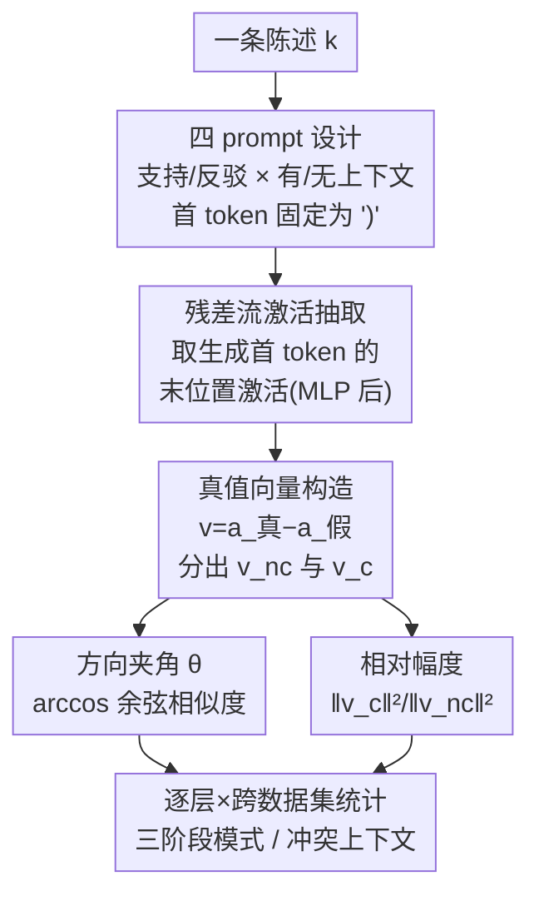

# How Context Shapes Truth: Geometric Transformations of Statement-level Truth Representations in LLMs

**会议**: ACL2026  
**arXiv**: [2601.06599](https://arxiv.org/abs/2601.06599)  
**代码**: 有（论文页脚注提供）  
**领域**: 可解释性 / 表示几何  
**关键词**: 真值向量, 残差流, 上下文, 方向变化, 相对幅度

## 一句话总结
论文首次刻画"加上下文后 LLM 内部真值表示的几何怎么变"——用真值向量在加/不加上下文两种条件下的**方向夹角 θ** 和**相对幅度** 两个量，在 4 个模型 × 多个数据集上发现：真值方向呈"早层近正交→中层急剧收敛→后层稳定或继续增大"的三阶段模式，加上下文普遍放大真假分离度，且与参数知识冲突的上下文比对齐的上下文引起更大的几何变化。

## 研究背景与动机
**领域现状**：已有大量工作发现 LLM 把"一句话是真是假"编码成残差流激活空间里的一条线性方向（truth direction / 真值向量），线性分类器（探针）能可靠地把真句和假句分开，说明"真值"在激活空间里有清晰的几何结构。代表工作包括 CCS（无监督找真值方向）、mass-mean 探针、ITI（沿真值方向干预激活提升真实性），以及把真值表示成二维子空间以解决否定句泛化问题。

**现有痛点**：这些工作都在**静态、无上下文**的设定下研究真值几何，或者只测"一个探针能不能跨设定迁移"。但真实部署里 LLM 几乎总是带着上下文工作——in-context learning、检索增强（RAG）都靠往 prompt 里塞上下文来改善输出。**没有人研究：当上下文被加进来时，这套真值几何结构本身会怎么变。** Bao et al. (2025) 测了探针能否从无上下文迁移到有上下文，但没测真值向量的几何结构本身是否改变。

**核心矛盾**：上下文显然会改变模型对一句话真假的内部表示，但这种改变是发生在**方向**上（真值的"含义"被重新定向）还是**幅度**上（真假的可分性被放大或压缩）？两者机制不同，对设计 RAG / ICL 系统的启示也不同——如果上下文主要靠放大幅度起作用，那就和靠重定向方向是两套故事。

**本文目标**：拆成几个可测量的子问题——(1) 加上下文后真值向量的方向变化 θ 随层怎么演化？(2) 真假分离的相对幅度被放大还是压缩？(3) 模型能不能区分相关 vs 无关上下文，靠的是方向还是幅度？(4) 与参数知识冲突的上下文是否引起更大几何变化？

**切入角度**：作者借鉴激活引导（activation steering）里"用对比向量的方向和幅度刻画行为"的思路，但不去修改行为，而是**观测**真值向量在加/不加上下文时的几何漂移。

**核心 idea**：用一对几何量——方向夹角 $\theta$ 和相对幅度 $\frac{\|v_c\|^2}{\|v_{nc}\|^2}$——逐层刻画上下文对真值表示的变换，给出 LLM 处理上下文的首个几何特征化。

## 方法详解

### 整体框架
方法是一个纯分析/探测流程，不训练任何东西。对每条陈述构造 4 个 prompt（支持/反驳 × 有/无上下文），让 LLM 生成补全；抽取生成首个 token 时最后一个 token 位置的残差流激活（MLP 层之后），按真值标签算出"真值向量"=真激活−假激活；再对比有上下文 $v_c$ 与无上下文 $v_{nc}$ 两个真值向量，逐层计算方向夹角 θ 和相对幅度，最后跨陈述、跨层、跨数据集统计规律。

### 关键设计

**1. 四 prompt 任务设计：把"上下文的影响"隔离成可对照的单一变量**

为了干净地测"上下文带来的几何变化"，作者对每条陈述构造四个 prompt：让模型分别**支持**和**反驳**该陈述，每种各做**有上下文**和**无上下文**两版。模型被指令按 [Selected Choice] 续写，且强制生成的首个 token 是 ")"，保证支持/反驳两种生成在同一位置可公平对比；[Choice] 字段里的选项顺序随机化以消除排序偏置。再用数据集真值标签把"支持真句/反驳假句"映射成 True 生成、"支持假句/反驳真句"映射成 False 生成。只保留模型在四个 prompt 上都遵循指令的陈述。这个设计的巧妙在于：有/无上下文之间唯一的区别就是上下文本身，因此 $v_c$ 与 $v_{nc}$ 的几何差异可以干净地归因到上下文。

**2. 残差流真值向量构造：用真假激活之差定位"真值方向"**

针对"真值在激活空间是一条线性方向"这一先验，作者把真值向量定义为同一层里真生成与假生成的残差流激活之差。激活取的是**生成首个输出 token 时、prompt 最后一个 token 位置**的残差流（MLP 之后）——这个位置通过因果注意力聚合了整段输入信息，又不受后续生成 token 干扰。形式上，第 $l$ 层对陈述 $k$ 的真值向量为

$$v_k^{(l)} = a_{k,\text{True}}^{(l)} - a_{k,\text{False}}^{(l)}$$

再按是否带上下文拆成 $v_{k,nc}^{(l)}$（无上下文）和 $v_{k,c}^{(l)}$（有上下文）两条向量，作为后续所有几何度量的输入。

**3. 方向夹角 θ：捕捉上下文是否"重定向"了真值**

θ 衡量有/无上下文两条真值向量的方向差异，θ 越小说明两者越相似、上下文没怎么改方向；θ 大则说明上下文把"真值"的方向根本性地改了。对陈述 $k$、第 $l$ 层：

$$\theta_k^{(l)} = \arccos\left(\frac{v_{k,c}^{(l)} \cdot v_{k,nc}^{(l)}}{\|v_{k,c}^{(l)}\|\,\|v_{k,nc}^{(l)}\|}\right)$$

再对数据集内所有陈述求平均得到层级 $\theta_D^{(l)}$。实测它呈三阶段：早层近正交（真值方向在早层意义不大）、中层急剧收敛到极小（中层是语义编码主场，有/无上下文的真值表示趋同）、后层稳定或继续上升。θ 从不归零，说明即便收敛，模型仍对"有/无上下文"保持可区分的表示。

**4. 相对幅度：捕捉上下文是否"放大/压缩"了真假可分性**

方向变了不代表可分性变了，所以作者再测相对幅度——以无上下文时真假表示的 $L_2$ 距离为基线，看加上下文后这个距离是涨是跌。对陈述 $k$、第 $l$ 层：

$$rm_{k,tc\text{-}fc}^{(l)} = \frac{\|v_{k,c}^{(l)}\|^2}{\|v_{k,nc}^{(l)}\|^2}$$

值 >1 表示上下文**放大**了真假分离、<1 表示压缩。再跨陈述平均。结果是中层出现一个峰（分离度最大，>1），随后下降并在后层趋稳，但即便最终层多数仍 >1。这两个量合起来给出一个关键洞察：**大模型主要靠方向变化 θ 区分相关/无关上下文，小模型则更多体现在幅度差异上**——同一种"上下文相关性"信号，在不同规模模型里走了不同的几何通道。

### 一个例子：相关 vs 无关上下文怎么在几何上区分开
拿同一条陈述，给它配三类上下文：真正相关的上下文、随机生成的"沙拉词"上下文、以及打乱的无关上下文。在 LLaMA 上，相关上下文（如 Politifact）让 θ 变化达 11.81–13.88 度且统计显著，而 CL-Company 这类上下文反而出现负向变化；ConflictQA-Counter（与参数知识冲突）的 θ 变化高达 22.38 度，远超 ConflictQA-Parametric（参数对齐）的 2.03 度。读者由此能具象地看到：模型确实在内部用几何变化的大小来"分辨这条上下文相不相关、跟我记忆冲不冲突"，而不是对所有上下文一视同仁。

## 实验关键数据

### 实验设置
- **模型**：4 个指令微调模型，跨 3B–12B 规模与不同家族——LLaMA-3.1-8B-Instruct、Mistral-Nemo-12B-Instruct、Qwen3-4B-Instruct、SmolLM3-3B；贪心解码保证可复现；约 500 GPU 小时（A100/H100）。
- **数据集**：Druid（含 Borderlines/Politifact/ScienceFeedback 三个子集）、MF2、ConflictQA（Parametric 与 Counter 两子集）、LegalBench（CL-Bill / CL-Company），覆盖事实核查、电影梗概、法律文本等多种上下文类型与难度。

### 主结果：方向变化的三阶段模式

| 现象 | 早层(Phase-1) | 中层(Phase-2) | 后层(Phase-3) |
|------|--------------|--------------|--------------|
| θ 行为 | 近正交（高） | 急剧下降到极小 | 稳定或继续上升 |
| LLaMA/Mistral | — | 约 9 层起降、15 层附近最低 | 多数平稳 |
| Qwen/SmolLM | 早期阶段更长(到 14–16 层) | 极小点更晚(20–25 层) | 视数据集 |

关键发现：(1) 四个模型都呈一致的三阶段，且 θ 从不归零——上下文让真值方向收敛但不重合。(2) 大模型把早期阶段压缩进更少的层（到第 9 层），小模型拖得更久（14–16 层）。(3) ConflictQA-Counter 的 θ 在后层持续上升且始终高于 ConflictQA-Parametric，说明**与参数知识冲突的上下文引起更大、更持久的方向漂移**，呼应"记忆头 vs 上下文头在后层竞争"的已有发现。

### 相对幅度（最终层，部分数据集）

| 数据集 | LLaMA | Mistral | Qwen | SmolLM |
|--------|-------|---------|------|--------|
| Borderlines | 1.18* | 1.08* | 1.13* | 1.11* |
| ConflictQA-Counter | 1.20* | 0.98 | 0.98 | 1.26* |
| ConflictQA-Param | 1.34* | 1.02 | 1.06* | 1.16* |
| CL-Company | 1.15* | 1.18* | 1.06* | 1.00 |

（*表示 Wilcoxon 符号秩检验 p<0.05 显著）

### 关键发现
- **加上下文普遍放大真假分离**：相对幅度多数 >1，中层出现峰值（>1），即便最终层仍多在 1 以上；LLaMA 在 8 个数据集里有 7 个最终层平均幅度上升。
- **规模决定几何通道**：大模型靠 θ（方向）区分相关/无关上下文，小模型靠幅度差异——这是论文最有意思的规模相关结论。
- **冲突上下文 = 更大几何变化**：无论 θ 还是相对幅度，与参数知识冲突的上下文都比对齐的引起更大变化，且后层持续不收敛。
- **几何变化不必然转成输出概率差异**：作者另测 θ/幅度是否与 "True/False" token 输出概率变化相关，发现有些相关但不跨模型/数据集一致——内部几何漂移与外部行为不是简单对应。
- **真值方向因果有效**：干预实验里沿这些方向引导能可靠翻转模型输出，确认真值向量不只是相关性产物。

## 亮点与洞察
- **把"上下文的作用"分解成方向 vs 幅度两个正交几何量**，比笼统说"上下文改变了表示"精确得多，且每个量都能逐层画出演化曲线，可解释性强。
- **三阶段模式与已有的"早层处理输入、中层编码语义、后层主导下一 token 预测"分层认知吻合**，给真值几何提供了一个跨模型一致的结构性描述。
- **规模相关的几何通道分化（大模型走方向、小模型走幅度）是个可迁移洞察**：研究 steering / RAG 干预时，对不同规模模型可能要在不同几何维度上施加干预。
- **冲突上下文引起后层持续发散**，为"知识冲突在后层由竞争的记忆头/上下文头驱动"提供了表示空间侧的几何证据，可启发知识冲突检测。

## 局限与展望
- 只看残差流（MLP 后）单一位置的激活，没覆盖注意力子层或多 token 位置，真值几何可能还有别的承载方式。
- 真值向量用"真假激活之差"的简单线性定义；若真值实际是二维子空间（如 Bürger et al.），单向量度量会损失信息。
- 结论是观测性的——θ/幅度与输出概率不一致说明几何漂移和行为之间还缺一座因果桥，论文只用附录干预实验做了初步验证。
- 模型规模跨度有限（3B–12B、各家一只），"大模型靠方向、小模型靠幅度"的规模律还需更大模型与更多样本佐证。

## 相关工作与启发
- **vs CCS / mass-mean 探针 / ITI**: 它们在无上下文设定下找真值方向或沿方向干预；本文不改行为，而是首次测"加上下文后这条方向的几何怎么变"，补的是动态视角。
- **vs Bao et al. (2025)**: 他们测"单个探针能否跨有/无上下文设定迁移"；本文直接测真值向量几何结构本身是否改变，问题更底层。
- **vs 激活引导 / 对比向量（Turner、Rimsky 等）**: 借用了"方向+幅度刻画对比向量"的工具，但目的从"操纵行为"转成"观测上下文诱导的真值漂移"。
- **vs 知识冲突探测（Zhao et al. 2024 等）**: 他们直接探残差流找冲突信号；本文从真值向量的方向/幅度变化侧面刻画冲突上下文比对齐上下文几何变化更大，提供互补证据。

## 评分
- 新颖性: ⭐⭐⭐⭐⭐ 首次系统刻画"上下文如何几何变换真值表示"，方向/幅度分解视角新颖。
- 实验充分度: ⭐⭐⭐⭐ 4 模型 × 多数据集 × 逐层分析 + 统计显著性 + 干预验证，较扎实；模型规模跨度可再扩。
- 写作质量: ⭐⭐⭐⭐ 几何量定义清晰、三阶段叙事直观，图表支撑到位。
- 价值: ⭐⭐⭐⭐ 对理解 RAG/ICL 的内部机制与设计上下文敏感的探针/干预有实际启发。

<!-- RELATED:START -->

## 相关论文

- [\[ACL 2025\] Probing the Geometry of Truth: Consistency and Generalization of Truth Directions](../../ACL2025/interpretability/probing_the_geometry_of_truth_consistency_and_generalization_of_truth_directions.md)
- [\[ACL 2026\] Jacobian Scopes: Token-Level Causal Attributions in LLMs](jacobian_scopes_token-level_causal_attributions_in_llms.md)
- [\[NeurIPS 2025\] Emergence of Linear Truth Encodings in Language Models](../../NeurIPS2025/interpretability/emergence_of_linear_truth_encodings_in_language_models.md)
- [\[NeurIPS 2025\] How Intrinsic Motivation Shapes Learned Representations in Decision Transformers: A Cognitive Interpretability Analysis](../../NeurIPS2025/interpretability/toward_explainable_offline_rl_analyzing_representations_in_intrinsically_motivat.md)
- [\[ICLR 2026\] Information Shapes Koopman Representation](../../ICLR2026/interpretability/information_shapes_koopman_representation.md)

<!-- RELATED:END -->
