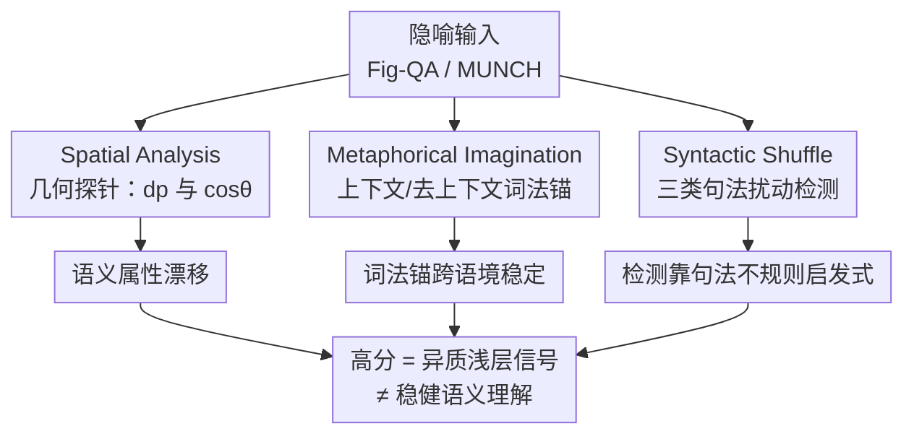

# Probing Semantic Alignment, Lexical Invariance, and Syntactic Influence in LLM Metaphor Processing

**会议**: ACL2026  
**arXiv**: [2510.04120](https://arxiv.org/abs/2510.04120)  
**代码**: 无（诊断分析论文）  
**领域**: 可解释性 / 探针分析 / 隐喻处理  
**关键词**: 隐喻处理、几何探针、词法不变性、句法扰动、诊断分析  

## 一句话总结
这是一篇诊断性分析论文：作者不比拼性能，而是从**语义属性对齐、词法不变性、句法影响**三个互补维度探针 LLM 的隐喻处理，发现"在隐喻 benchmark 上的高分"可能来自异质的浅层信号（语义漂移 + 稳定词法锚 + 对句法不规则的启发式敏感）而非稳健的整合式语义理解。

## 研究背景与动机
**领域现状**：LLM 在隐喻检测和隐喻解释任务上分数很高，被广泛当作"理解隐喻"的证据。语言学上隐喻由 SPV（选择偏好违反）、MIP（隐喻识别程序）、CMT（概念隐喻理论的跨域映射）等理论刻画，核心难点是隐喻的"映射属性"往往是隐式的。

**现有痛点**：高分到底说明了什么并不清楚。隐喻解释的核心映射是隐式的，模型可能只抓住显著特征而错过 intended 属性（如"电脑是乌龟"该映射到"慢"，模型却可能扯到"乌龟长寿"）。此外已有研究发现 **trigger word 效应**——解释被高关联词带偏（如看到 arm 就往战争义靠），说明模型可能靠稳定词法关联而非上下文整合。而过去工作大多只看多选准确率这种离散结果，看不见"生成的解释到底偏离 intended 属性多远"。

**核心矛盾**：行为层面的成功（答对题）与机制层面的理解（真正做跨域映射）之间存在鸿沟。离散的答案级评测分辨率太低，无法揭示模型处理隐喻时用的是统一语义机制还是一堆异质浅层信号。

**本文目标**：从诊断视角拆三个互补维度——（1）生成的解释是否与参考语义属性几何对齐；（2）隐喻—字面的词法关联是否跨上下文稳定（即是否依赖固定词法锚而非语境）；（3）句法扰动如何影响隐喻检测——以此区分语义对齐、词法偏置、句法敏感三种行为。

**核心 idea**：用受控探针 + 几何/词法/句法三把尺子，把"benchmark 高分"解剖成可分辨的行为信号，提醒大家别把高分直接当成稳健语义理解。

## 方法详解
本文是诊断框架，"方法"即三个互补探针实验的设计。整体思路：不改模型、不微调，而是构造受控输入与几何度量，从解释层（Spatial Analysis）和检测层（Metaphorical Imagination + Syntactic Shuffle）刻画模型行为。

### 整体框架
三个探针分别盯住隐喻处理的一个侧面，共享"诊断而非比性能"的取向：Spatial Analysis 在共享嵌入空间里量"生成解释偏离参考语义属性平面多远"；Metaphorical Imagination 比"有上下文 vs 无上下文"两种生成的词法重叠，看词法锚是否稳定；Syntactic Shuffle 对句子做三类句法扰动，看检测准确率怎么变。三者合起来回答"高分由什么信号驱动"。

### 关键设计

**1. Spatial Analysis：用"点到参考平面的几何偏离"量语义属性对齐**

针对"多选准确率看不出解释偏离 intended 属性多远"的痛点，作者把对齐变成几何量。每个目标隐喻句 $m_i$ 配一个表面不同但共享同一语义属性的隐喻 $m_i'$。先用两条人工标注解释 $R_i,R_i'$（语义锚）加一条模型生成的字面改写 $S_i$（字面锚）张成一个仿射**参考平面** $\gamma_i$；模型生成的解释记为 $M_i$。用两个互补度量刻画 $M_i$ 与 $\gamma_i$ 的关系：$d_p$ 是 $M_i$ 到 $\gamma_i$ 的垂直距离（偏离的大小），$\cos\theta$ 是参考平面 $\gamma_i$ 与解释平面 $\beta_i=\text{span}\{R_i,R_i',M_i\}$ 之间的夹角余弦（偏离的方向）。所有句子编码到 OpenAI `text-embedding-3-small` 的共享空间，平面基底由对锚点中心化后的方向向量做 SVD（$A=U\Sigma V^\top$）取 top 奇异向量得到。$d_p$ 越大或 $\cos\theta$ 越小 = 偏离参考语义属性越远。关键是作者强调 $d_p$ **没有绝对校准含义**，只作跨实例/跨模型的**相对**诊断信号。

**2. Metaphorical Imagination + Anchor Score：测词法锚是否跨上下文稳定**

针对 trigger word 效应——解释可能被固定高关联词带偏，作者比"给上下文"与"只给孤立目标词"两种生成的词法重叠。两个方向：Literal-to-Metaphor（LM，给字面输入生成隐喻对应词）和 Metaphor-to-Literal（ML，给隐喻输入生成字面对应词），每个目标词各生成 20 个候选替换词。用 **Anchor Score** 度量稳定性：若两组（上下文化 vs 去上下文）有共享词，Anchor Score $=1$（存在共享词法锚）；若无共享词，则取两组词在 300 维 GloVe 嵌入下的最大余弦相似度。Anchor Score 越高 = 词法关联越不随语境变。作者还按体裁（新闻/小说/学术/对话）和 novelty（MUNCH 的新颖度 $>0.3$ 子集）拆开看，检验稳定性是否随体裁/新颖度变化。

**3. Syntactic Shuffle：用受控句法扰动看检测靠结构还是靠浅层线索**

针对"高检测分是否真用了整合的句子结构"的疑问，作者做三类扰动，在largely保留词法内容的同时破坏句法。① **Random Shuffle**：随机重排，同时破坏句法和语义连贯（作为极端压力测试）；② **POS Shuffle**：把隐喻词换成不同词性的近义词，引入句法不规则但词义基本不变；③ **Metaphorical Word Reposition**：把隐喻词移到句首/中间随机位/句尾，测对位置的敏感。扰动用 WordNet 2020 做分词与受控词法替换。对比各条件下的检测准确率，就能判断检测是依赖整合的句子结构，还是靠"句法异常"这种浅层启发式线索。

### 一个例子：monk/lawyer 的语义漂移
拿"The monks had the honor of a knight"（intended 属性：社会荣誉/受尊敬）走一遍 Spatial Analysis：把它换成共享属性的 $m_i'$、配上人工解释 $R_i,R_i'$ 和字面锚 $S_i$ 张成参考平面。模型对"knight"版生成"were highly respected"，$d_p=0.1153$、$\cos\theta=0.9034$，几何上贴着参考平面，属性保住了。但把喻体换成"lawyer"后，模型生成"had the privilege of legal representation"，漂到了"法律权利"而非"社会荣誉"，$d_p$ 飙到 $0.7913$、$\cos\theta$ 掉到 $0.2609$——几何探针一眼看出这是 intended 映射丢失，而多选准确率根本看不出这种细粒度漂移。

## 实验关键数据

### 主结果：语义对齐与词法不变性

| 探针 / 设置 | 代表指标 | 关键观察 |
|-------------|----------|----------|
| Spatial（GPT-4o） | 最低均值 $d_p=0.1772$ | GPT-4o 几何偏离最小 |
| Spatial（V3-671B） | 最高均值 $\cos\theta=0.8207$ | V3-671B 方向最贴参考平面 |
| 多选验证（细粒度极性） | 各模型约 $46\!-\!52\%$（近随机） | 离散评测在极性/强度细分上几乎瞎 |
| Anchor Score（LM/ML） | 约 $65\%\!-\!80\%$ | 词法锚跨上下文普遍稳定，ML > LM |
| 人工核验（低 vs 高 $d_p$） | 均值 $1.96$ vs $0.84$（$\Delta=1.12$，3 分制） | $d_p$ 确实对应人类判断的语义对齐 |

几何信号自洽性也有验证：$d_p$ 与相似度信号 $A_d$ 的 Spearman $\rho=-0.62$、$\cos\theta$ 与 $d_p$ 的 $\rho=-0.64$；置换检验打破实例配对后相关性塌到近零，说明这是真实对齐而非边缘分布伪相关。

### 句法扰动下的检测准确率（节选 Table 6）

| 模型 | Original | Random | POS | Beginning | Middle | End |
|------|----------|--------|-----|-----------|--------|-----|
| GPT-4 | 34.73 | 12.93 | **43.74** | 36.07 | 37.92 | 37.60 |
| GPT-4o | 28.89 | 7.78 | **36.87** | 30.92 | 30.84 | 29.98 |
| R1-671B | 28.68 | 12.22 | **46.41** | 39.25 | 30.88 | 36.03 |
| LLaMA-3.1-8B | 53.36 | 50.33 | 53.81 | 51.75 | 53.08 | 53.67 |

### 关键发现
- **语义属性系统性漂移**：跨模型解释都偏离 intended 属性（如 monk/lawyer 例从"社会荣誉"漂到"法律权利"），且多选评测在细粒度极性差异上近随机，证明离散评测分辨率不够、几何探针能看出更细的偏离结构。
- **词法锚跨语境稳定**：Anchor Score 普遍 $65\!-\!80\%$，ML 一致高于 LM（隐喻→字面比反向更受约束）；即便在 novelty $>0.3$ 的新颖隐喻上，仍有 $>50\%$ 的样本 Anchor Score 达 1——稳定锚利于常规隐喻，却会把需要语境整合的新颖隐喻带偏（trigger word 效应）。但作者谨慎指出高 Anchor Score 不等于"无视上下文"，因为词法先验和语境证据可能恰好同向。
- **检测靠句法不规则的启发式**：多数模型在 **POS Shuffle 下反而比原句更高**（如 R1-671B 46.41 vs 28.68），因为 POS 扰动制造的异常组合恰好放大了 SPV 式线索；位置扰动（首/中/尾）影响很小，说明模型对"局部不规则"比"词位置"更敏感。LLaMA-3.1-8B 始终在 50% 随机线附近、几乎不随扰动变，配合其低 Anchor Score，说明它对这些探针响应有限。Random Shuffle 被作者明确定位为压力测试而非自然隐喻处理的证据。

## 亮点与洞察
- **几何探针把"对齐"做成连续可比的量**：用点到参考平面的 $d_p$ + 平面夹角 $\cos\theta$ 刻画解释偏离 intended 属性的"大小 + 方向"，比多选准确率细腻得多，且有人工核验（$d_p$ 低/高对应人类 1.96 vs 0.84）和置换检验背书——这套"局部参考平面 + SVD 基底"的探针可迁移到任何需要量"生成是否贴参考语义区"的任务。
- **把高分拆成三类信号**：语义漂移 + 稳定词法锚 + 句法启发式，三者合起来解释"为什么 benchmark 高但理解不稳"，这种"诊断而非刷分"的方法论很有借鉴价值。
- **POS Shuffle 反而涨分**这个反直觉发现很"啊哈"：它说明部分检测能力其实来自对句法异常的浅层敏感，而非真正的句子级语义整合——提醒做隐喻评测时要警惕这种 shortcut。

## 局限与展望
- **几何分析依赖构造的参考区与嵌入选择**：参考语义属性区是用人工解释 + LLM 生成句拼出来的行为代理，不直接反映认知表示；$d_p,\cos\theta$ 还依赖所用嵌入空间，换嵌入会改变绝对距离。第三锚 $S_i$ 也只是平衡可解释性与表达力的务实选择，不声称维度最优。
- **Metaphorical Imagination 只覆盖单词级隐喻**：MUNCH 的隐喻围绕单个标注词，结论不直接推广到多词或篇章级隐喻。
- **Random Shuffle 不是自然语言**：只能当极端压力测试，其结果不反映自然隐喻处理；可解释的证据主要来自 POS 与位置扰动。
- **只在英语数据集上做**：Fig-QA 与 MUNCH 都是英语，跨语言/文化特定隐喻的普适性待验证。人工评测仅由一名资深硕士生完成，规模偏小。

## 相关工作与启发
- **vs 只看多选准确率的评测（Li 2024、Zhao 2021）**：他们用离散答案衡量隐喻理解，本文证明这类信号在细粒度极性差异上近随机，转而用几何探针看连续偏离。
- **vs trigger word 效应研究（Wachowiak & Gromann 2023）**：他们指出解释被高关联词带偏，本文用 Anchor Score 把"词法锚是否跨上下文稳定"量化，并拆到体裁/新颖度层面。
- **vs 表示层探针（Aghazadeh 2022）**：他们探预训练模型是否编码隐喻结构，证据较间接；本文从行为层（解释/检测输出）切入，给出可对照人类判断的几何信号。
- **vs CoT/知识增强的隐喻解释（Tian 2024、Wang 2024a）**：那些工作想提升解释质量，本文不提升性能，而是诊断"现有高分由什么浅层信号驱动"。

## 评分
- 新颖性: ⭐⭐⭐⭐ 几何探针 + 三维度诊断框架是新颖且自洽的分析视角
- 实验充分度: ⭐⭐⭐⭐ 7 个模型 × 三探针 + 置换检验/人工核验，分析扎实（人工评测规模偏小）
- 写作质量: ⭐⭐⭐⭐ 诊断取向清晰，对每个信号都给出谨慎的因果 caveat
- 价值: ⭐⭐⭐⭐ 提醒社区别把隐喻 benchmark 高分当稳健理解，方法论可复用

<!-- RELATED:START -->

## 相关论文

- [\[ICLR 2026\] One Language, Two Scripts: Probing Script-Invariance in LLM Concept Representations](../../ICLR2026/interpretability/one_language_two_scripts_probing_script-invariance_in_llm_concept_representation.md)
- [\[ACL 2026\] Dual Alignment Between Language Model Layers and Human Sentence Processing](dual_alignment_between_language_model_layers_and_human_sentence_processing.md)
- [\[ACL 2026\] Rhetorical Questions in LLM Representations: A Linear Probing Study](rhetorical_questions_in_llm_representations_a_linear_probing_study.md)
- [\[ICLR 2026\] Dynamic Reflections: Probing Video Representations with Text Alignment](../../ICLR2026/interpretability/dynamic_reflections_probing_video_representations_with_text_alignment.md)
- [\[ACL 2026\] Fine-Grained Analysis of Shared Syntactic Mechanisms in Language Models](fine-grained_analysis_of_shared_syntactic_mechanisms_in_language_models.md)

<!-- RELATED:END -->
