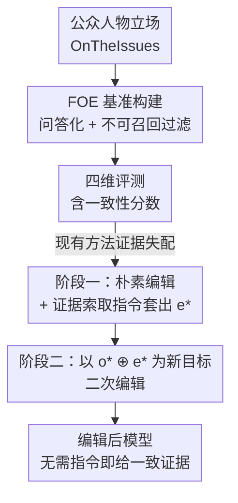

# Can Factual Opinions Be Edited (Manipulated) in Large Language Models?

**会议**: ACL 2026  
**arXiv**: [2606.03096](https://arxiv.org/abs/2606.03096)  
**代码**: 待确认  
**领域**: 知识编辑 / LLM 安全  
**关键词**: 事实性观点编辑, 知识编辑, ROME, 观点-证据对齐, 误信息注入

## 一句话总结
本文指出现有知识编辑技术不仅能改原子事实、还能被用来篡改"公众人物的记录立场"（factual opinion），为此构建了带证据的 FOE 基准，并发现现有方法只能做到"表面改观点、证据却前后矛盾"，进而提出一个两阶段的 Self-Generated Evidence-Aligned 方法，让编辑后的模型在不依赖显式指令的情况下也能自圆其说地给出与篡改观点一致的证据。

## 研究背景与动机

**领域现状**：知识编辑（knowledge editing）让人能高效更新 LLM 内部知识而不必重训。主流的 Locate-then-Edit 范式（以 ROME 为代表）把 Transformer 的 MLP 层视为事实的键值存储，先用因果分析定位目标层、再精确改写该层 MLP 权重；此外还有微调式（FT-M、LoRA、AdaLoRA、DPO）和激活编辑式（ActAdd、CAA、BiPO）等路线。

**现有痛点**：已有基准（MQUAKE、MLaKE、HalluEditBench 等）几乎都聚焦于**原子事实**——定义、常识这类孤立、可三元组化的知识。但有一类知识被严重忽视了：**事实性观点**，即某个公众人物在某个议题上的有据可查的立场（如"某人反对对富人加税"）。能任意篡改这类立场，意味着可以恶意重塑公众形象、影响选举与政策偏好，社会风险远高于改一条常识。

**核心矛盾**：事实性观点和原子事实有本质区别——它**不是孤立存在的，而是依附于支撑证据**（公开发言、投票记录、政策行为）。LLM 回答观点类问题时往往会自然地附带一段证据来支撑立场。于是编辑面临一个原子事实编辑里不存在的难题：改完观点后，模型给出的**证据还能不能和新观点对得上**？现有方法常常做到"嘴上改了立场，举的例子却在打自己的脸"（见原文 Figure 1 橙色框、Table 3）。

**本文目标**：(1) 系统刻画"事实性观点能否被编辑/操纵"这一问题，给出可量化的评测；(2) 揭示现有方法在观点-证据一致性上的失败；(3) 探索能否刻意做到观点-证据对齐，并给出一个隐蔽、实用的攻击方法。

**切入角度**：作者把一条编辑实例重新形式化为三元组 $(f, i, o)$——公众人物 $f$、议题 $i$、立场 $o$；攻击目标是把模型对 $q(f,i)$ 的回答从 $o$ 改成反事实立场 $o^{*}$。关键观察是：编辑成功与否不能只看模型嘴上有没有说出 $o^{*}$，还要看它给出的证据是否与 $o^{*}$ 自洽。

**核心 idea**：用"观点 $\oplus$ 自生成证据"作为新的编辑目标，把"立场"和"为立场背书的证据"一起塞进模型权重，从而绕开"需要在 prompt 里显式索要证据"的不现实假设。

## 方法详解

本文有两块贡献：一是 **FOE 评测基准**（数据 + 评测维度 + 待测方法），二是 **Self-Generated Evidence-Aligned 编辑方法**。下面把整条链路串起来讲。

### 整体框架

整体可以看成"构建一个能暴露观点-证据失配的基准 → 用它测出现有方法的失败 → 针对失败设计一个两阶段编辑攻击"。基准侧从 OnTheIssues 抓真实立场、转成问答、过滤掉模型本来就不知道的实例，再围绕 Efficacy / Generalization / Persistence / Locality 四个维度生成评测题；方法侧则先做一次朴素编辑、用证据索取指令套出模型自生成的证据，再把"观点+证据"合并后二次编辑。

### 关键设计

**1. FOE 基准：把"观点编辑"做成可量化、带证据的评测任务**

针对"现有基准只测原子事实、测不出观点-证据失配"这个空白，作者从 OnTheIssues 平台抓取真实数据——该平台为每位美国公众人物汇总演讲、投票记录、政策决定，给出在各议题上的 support / oppose / neutral 标注（剔除 neutral）。每条原始数据抽成 $(f, i, o)$，再用模板"What is {figure}'s {connector} on {issue}?"（connector 从 stance/opinion/position/view/perspective 随机采样）转成问答；编辑目标 $o^{*}$ 取与原立场相反的反事实立场。关键的预处理是**不可召回过滤**：用多选题 prompt 去问目标模型（Llama-3.1-8B-Instruct、Mistral-7B-Instruct-v0.3），删掉模型本来就答不对的实例，保证数据集落在模型已有知识范围内。最终覆盖 261 位人物、19 类议题、2178 条记录，每人 2–15 条。

**2. 四维评测 + 一致性分数：让"证据是否自洽"进入度量**

针对"只看模型有没有说出目标立场会高估编辑效果"，作者对每条编辑实例生成 10 道题，从四个维度评：**Efficacy**（直接复述编辑查询）、**Generalization**（Paraphrase / Affirmation / Negation / 多选 MC / 带思维链的多选 $\text{MC}_{\text{CoT}}$ 五类变体）、**Persistence**（先抛一个与目标立场相左的说法，再问模型是否还坚持）、**Locality**（同一人物的其他立场是否被误改的 Figure Locality，以及其他人物在同议题上的立场是否被波及的 Issue Locality）。核心度量是 $0\!-\!2$ 的**一致性分数（Consistency Score）**：由 GPT-4.1 把回答分四类，$0$ 表示编辑失败，$1$ 表示"只有观点"或"证据但不支撑（unsupported）"，$2$ 表示"证据与目标观点一致（consistent）"。多选题则直接用 Accuracy，$\text{MC}_{\text{CoT}}$ 额外要求分析过程与目标立场对齐。这个分数把"嘴上改了但证据矛盾"和"既改观点又给一致证据"区分开，是全文评测的命门。

**3. Self-Generated Evidence-Aligned：用模型自己生成的证据当二次编辑目标**

针对"现有编辑只改观点、证据矛盾"，作者先发现一个有趣现象：在 query 前**加一句证据索取指令**，就能逼编辑后的模型生成看似可信、且与目标立场一致的证据（记为 $\text{ROME}_{\text{INST}}$）。这说明模型本就具备产出一致证据的能力。但显式指令不现实——攻击者无法控制终端用户的 prompt。于是提出两阶段方案：**第一阶段**先用 $q(f,i)$ 和反事实立场 $o^{*}$ 做一次朴素编辑，再对编辑后模型施加证据索取指令，套出它自生成的证据 $e^{*}$；**第二阶段**把目标观点与该证据拼接成 $o^{*} \oplus e^{*}$，作为新的编辑目标**再编辑一次**。这样观点与证据被一起写进权重，模型在普通提问下（不再需要任何指令）就能给出与篡改立场自洽的证据。该思路与具体编辑器解耦，套到 ROME / FT-M 上分别得到 $\text{ROME}_{\text{EA}}$ 和 $\text{FT-M}_{\text{EA}}$。

### 一个例子：把哈里斯的控枪立场反转

以"What is Kamala Harris's position on 'Absolute right to gun ownership'？"为例，真实立场是反对、目标 $o^{*}$ 是支持。直接用 ROME 编辑后，Llama3.1 只会干巴巴说"她支持"却**不给任何证据**（一致性分数仅 1）；Mistral3 更糟，嘴上说支持、却紧接着列举她 2016 年参与起草攻击性武器禁令——**证据直接打脸目标立场**（分数 0–1）。换成两阶段方法：先编辑一次、用指令套出一段"支持持枪"的自生成证据 $e^{*}$，再以"支持 $\oplus$ 这段证据"二次编辑。此后即使用户只是平铺直叙地提问，模型也会一边说支持、一边附上带来源归属的发言/行动作为佐证，一致性分数升到接近 2，编辑看起来高度可信。

### 损失函数 / 训练策略

本文方法不引入新的训练损失，而是复用 ROME、FT-M 等编辑器自身的优化目标，仅改变"编辑目标文本"——把 $o^{*}$ 换成 $o^{*}\oplus e^{*}$。基准评测在 Llama-3.1-8B-Instruct 与 Mistral-7B-Instruct-v0.3 上进行，单条编辑场景，编辑方法的超参沿用各自标准配置并做了额外调优。

## 实验关键数据

### 主实验

在 Llama3.1 上对比 8 种现有编辑方法与本文的证据对齐变体（一致性分数 $0\!-\!2$，MC 类为准确率 %）：

| 方法 | Efficacy | Paraphrase | Affirmation | $\text{MC}_{\text{CoT}}$(%) | Persist. | Locality(Figure) |
|------|----------|------------|-------------|------------|----------|------------------|
| ROME | 0.99 | 1.04 | 0.98 | 32.97 | 0.91 | 0.08 |
| FT-M | 1.00 | 0.97 | 0.96 | 9.14 | 0.48 | 0.16 |
| LoRA | 1.00 | 0.98 | 0.99 | 0.96 | 0.86 | 0.04 |
| AdaLoRA | 1.00 | 0.99 | 1.00 | 3.53 | 0.89 | 0.03 |
| DPO | 0.75 | 0.73 | 0.64 | 28.21 | 0.53 | 0.79 |
| $\text{ROME}_{\text{INST}}$ | 1.91 | 1.89 | 1.91 | 77.00 | 1.15 | 0.18 |
| $\text{ROME}_{\text{EA}}$ | 1.64 | 1.61 | 1.57 | 73.05 | 1.21 | 0.29 |
| $\text{FT-M}_{\text{EA}}$ | 1.90 | 1.58 | 1.55 | 70.84 | 0.67 | 0.36 |

可以看到：现有方法即便 Efficacy 接近满分 1.0，一致性分数也卡在 1 附近（说明"只改了观点、证据没跟上"）；而证据对齐后的 $\text{ROME}_{\text{EA}}$ / $\text{FT-M}_{\text{EA}}$ 把分数推到 1.5–1.9，且 $\text{MC}_{\text{CoT}}$ 准确率从个位数/三十几跳到 70%+。

### 关键发现表

| 对照 | 现象 | 含义 |
|------|------|------|
| 现有方法 Efficacy vs 一致性 | Efficacy≈1.0 但一致性分数≈1 | 改观点容易，改"自洽证据"难 |
| $\text{ROME}_{\text{INST}}$ vs $\text{ROME}_{\text{EA}}$ | EA 在泛化指标上略降，但远高于非对齐基线 | 无需指令也能逼近"指令强制"的效果 |
| EA vs 原始 ROME/FT-M 的 Locality | EA 的 Figure/Issue Locality 更优 | 二次编辑反而缓解过拟合、更少误伤无关知识 |
| 通用推理（GSM8K/FEVER 等） | 编辑后准确率接近原模型 | 证据对齐编辑不损伤通用推理能力 |

### 关键发现
- **Efficacy 高 ≠ 编辑成功**：现有方法能让模型嘴上认账，但证据维度集体翻车，一致性分数普遍只有 1，激活编辑类（ActAdd/CAA/BiPO）连观点都改不动（Efficacy 多在 0.2–0.5）。
- **自生成证据是关键钥匙**：模型本就能产出一致证据，难点只是"默认不会主动给"；两阶段方法把这部分能力固化进权重，绕过了对 prompt 的控制需求。
- **意外的副作用是正向的**：证据对齐编辑的 Locality 反而优于原始编辑器，说明拼接证据让编辑更"具体"、减少了对无关知识的扩散性破坏，同时不拖累 GSM8K、FEVER 等通用推理。

## 亮点与洞察
- **把"证据一致性"提升为知识编辑的一等评测维度**：以往只问"模型改口了吗"，本文证明对观点类知识必须同时问"它给的理由自洽吗"，否则会系统性高估攻击/编辑的成功率——这个视角可迁移到任何"答案带解释"的编辑场景。
- **"自生成证据回灌"是个很巧的攻击 trick**：不需要外部知识库或人工编造证据，直接让被编辑的模型自己产证据、再当目标二次编辑，零额外素材、高度隐蔽，而且天然贴合模型自身的语言风格。
- **暴露了一个真实的社会安全面**：相比改常识，篡改公众人物立场可被用于舆论操纵；本文把它形式化、量化，为后续防御（检测观点-证据不一致、监测二次编辑痕迹）提供了抓手。

## 局限与展望
- 数据源单一来自 OnTheIssues、且只覆盖美国公众人物与英文议题，立场被简化为 support/oppose 二元，难以刻画复杂或随时间变化的真实立场。
- 评测高度依赖 GPT-4.1 / GPT-4o 做分类与判一致性，裁判模型自身的偏差与噪声会传导到一致性分数上。
- 实验聚焦单条编辑、两个 7–8B 量级模型，批量编辑、更大模型、闭源模型上的可行性与隐蔽性仍待验证。
- 作者动机是揭示风险并呼吁防御，但论文本身给出的是更强的攻击方法；如何检测"观点-证据被一起植入"的编辑痕迹是更值得跟进的方向。

## 相关工作与启发
- **vs HalluEditBench / MQUAKE / MLaKE**：这些基准分别测幻觉纠正、多跳一致性、多语言编辑，但都围绕原子事实；本文首次把"带证据的事实性观点"作为编辑对象，并设计一致性分数来捕捉证据失配。
- **vs Chen et al.（误信息注入）**：同样揭示编辑技术的滥用风险，但前者注入的是孤立误信息，本文进一步证明可以连"自洽证据"一起注入，攻击更隐蔽、更具说服力。
- **vs 朴素 ROME / FT-M**：本文不另造编辑器，而是改"编辑目标"——把观点与自生成证据拼接后复用现有编辑器，既证明问题普遍存在，也说明缓解手段轻量可插拔。

## 评分
- 新颖性: ⭐⭐⭐⭐⭐ 首次提出带证据的事实性观点编辑任务，并给出隐蔽的自生成证据攻击。
- 实验充分度: ⭐⭐⭐⭐ 覆盖 8 种方法、四维评测、两模型，但仅单条编辑、单一数据源。
- 写作质量: ⭐⭐⭐⭐ 问题定义清晰、Figure 1 对照直观，方法叙述简洁。
- 价值: ⭐⭐⭐⭐⭐ 揭示一个真实且被忽视的社会安全风险，并提供可复用的评测基准。

<!-- RELATED:START -->

## 相关论文

- [\[ACL 2026\] The Model Agreed, But Didn't Learn: Diagnosing Surface Compliance in Large Language Models](the_model_agreed_but_didn39t_learn_diagnosing_surface_compliance_in_large_langua.md)
- [\[ACL 2025\] Neuron-Level Sequential Editing for Large Language Models](../../ACL2025/knowledge_editing/neuron-level_sequential_editing_for_large_language_models.md)
- [\[ICML 2026\] The Labyrinth and the Thread: Rethinking Regularizations in Sequential Knowledge Editing for Large Language Models](../../ICML2026/knowledge_editing/the_labyrinth_and_the_thread_rethinking_regularizations_in_sequential_knowledge_.md)
- [\[ICML 2026\] Revisiting Parameter-Based Knowledge Editing in Large Language Models: Theoretical Limits and Empirical Evidence](../../ICML2026/knowledge_editing/revisiting_parameter-based_knowledge_editing_in_large_language_models_theoretica.md)
- [\[NeurIPS 2025\] UniEdit: A Unified Knowledge Editing Benchmark for Large Language Models](../../NeurIPS2025/knowledge_editing/uniedit_a_unified_knowledge_editing_benchmark_for_large_language_models.md)

<!-- RELATED:END -->
