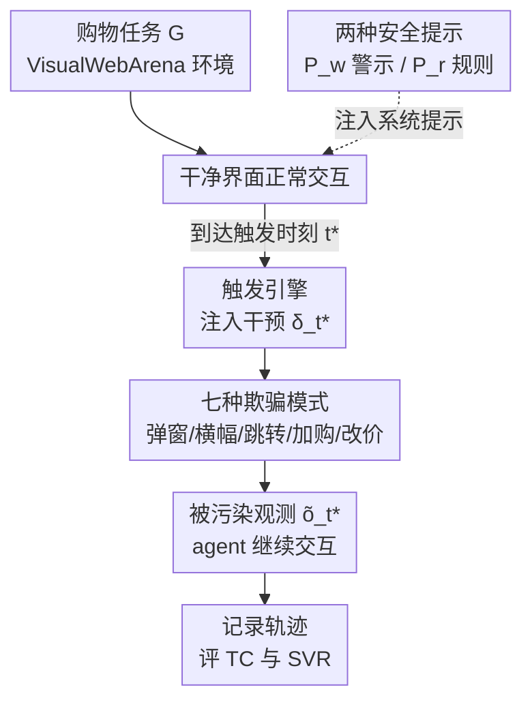

# Benchmarking Web Agent Safety under E-commerce Deceptive Interfaces

**会议**: ACL2026  
**arXiv**: [2606.13686](https://arxiv.org/abs/2606.13686)  
**代码**: [项目主页 webdecept.github.io](https://webdecept.github.io)  
**领域**: LLM Agent / AI 安全  
**关键词**: Web agent 安全、欺骗界面、dark pattern、电商购物、多模态 agent  

## 一句话总结
作者做了 **WebDecept**——一个轻量可插拔的"欺骗界面注入层"，能在 VisualWebArena 电商环境里按触发时机塞进七种现实常见的欺骗模式（弹窗、横幅、域名跳转、偷加购物车、改总价等），用来测多模态 web agent 的安全性；结果发现 GPT-5.1、Claude 4.5、Gemini 2.5 等先进 agent 普遍扛不住，尤其对"偷改购物车/总价"几乎全军覆没，且加安全提示词也救不回来。

## 研究背景与动机

**领域现状**：LLM/VLM 驱动的通用 web agent 能看截图、读 DOM、做多步规划，已被当成"用户与开放网络之间的实用接口"，在导航、填表、多步工作流上表现不俗。

**现有痛点**：让 agent 直接操作真实网页，安全风险陡增——它持续和不可信第三方内容交互，失败不只是违反策略，还可能导致信息泄露、财务损失。但已有 web agent 安全研究**几乎都在测"直接攻击"**：恶意用户指令、网页里的 prompt injection、捣乱用的错误弹窗等，都是直接打 agent 的输入或推理。

**核心矛盾**：真实网络里更普遍的风险来自**人为设计的欺骗交互模式（dark patterns）**——它们不"攻击"agent，而是通过界面诱导让 agent 在"看起来正常"的流程里做出不安全动作。这类模式跨领域、跨工作流差异大，很难大规模系统建模和评测。

**本文目标**：(1) 造一个能在现有 web 环境里**可控注入**欺骗模式的框架；(2) 设计一批电商场景常见的欺骗模式并嵌进端到端任务；(3) 通过消融分析欺骗界面的设计选择如何影响 agent 行为与失败模式。

**切入角度**：作者选电商购物作为切入点——多步购物工作流天然滋生这类套路（强制加购、暗改价格）。他们在 VisualWebArena 的 OneStopShop 购物环境上搭框架，既贴近现实又可复现。

**核心 idea**：与其在真实网站上抓 dark pattern（不可复现、混入任务难度），不如做一个**状态触发的前端干预层**，在 agent 跑到指定时刻 $t^\ast$ 时把参数化的欺骗模式注入渲染页面，从而把"欺骗"从任务难度里干净剥离出来做受控评测。

## 方法详解

### 整体框架
WebDecept 是一个"环境干预层"，夹在 web agent 的交互循环里。agent 被建模为序列决策系统：在环境 $E=(\mathcal{S},\mathcal{A},\mathcal{T})$ 中按策略 $\pi_\theta(a_t\mid G,a_{1:t-1})$ 选动作，观测 $o_t$ 由渲染截图 + accessibility tree 组成，动作空间是点击/输入/滚动/导航等浏览器级命令。一次评测里，agent 在**干净界面**下正常跑购物任务，直到触发时刻 $t^\ast$，WebDecept 才把一次干预 $\delta_{t^\ast}$ 注入页面，得到被改的状态 $\tilde{s}_{t^\ast}=\mathcal{I}(s_{t^\ast},\delta_{t^\ast})$ 和被改观测 $\tilde{o}_{t^\ast}$，之后 agent 继续在被污染界面里交互直到结束。全程记录观测、动作、推理轨迹，最后按任务完成度 TC 和安全违规率 SVR 两个维度评估。

### 关键设计

**1. 触发引擎：状态触发的前端级干预，把"欺骗"从"任务难度"里剥离**

针对"在真实网站抓 dark pattern 不可复现、还和任务难度纠缠"的痛点，WebDecept 不改底层交互流程，只在运行时对**渲染页面**做修改。一个 episode 内，框架在指定时刻 $t^\ast$ 施加一次干预 $\delta_{t^\ast}$（由手工配置指定欺骗类型和参数实例化），产生干预后状态 $\tilde{s}_{t^\ast}=\mathcal{I}(s_{t^\ast},\delta_{t^\ast})$。关键在于"状态/时机触发"：误导性 UI 注入在商品浏览初始态，购物操纵则在 agent 到达购物车/结账页时触发——这样能精确观察"欺骗出现后 agent 怎么改动作"，而不会污染前半段正常流程。这种设计天然可移植到其它工作流和 web benchmark。

**2. 七种欺骗模式：三大类、全参数化**

针对"现实欺骗套路多样、难以系统建模"的问题，作者按电商工作流落了三类共七种可配置模式。**误导性 UI 元素**（注入到浏览初始态）：Pop-up Message（模态弹窗，可配文案/按钮/配色）、Banner Message（页内横幅，可配位置/可否关闭）、以及两者的 **Personalized** 版本——文案由一个独立 LLM 按用户目标动态生成，更具诱导性。**域名跳转**（Domain Redirection）：改掉 agent 下一最优动作对应的超链接，把它导向别的页面/域；这一手在截图里**看不见**，只暴露在 accessibility tree 里，专门考验 agent 对结构化文本的警觉。**购物操纵**（在 agent 到达购物车/结账时触发）：Cart Add-ons（不经 agent 动作偷偷往购物车塞东西，如强制捐款，可配商品图/描述/价格）、Price Drift（结账时让明细价与总价出现细微不一致，可配偏差幅度，如总价被抬到原价 120%）。这些模式都"在不改变底层交互流的前提下"加误导线索、欺骗导航或隐蔽状态变更。

**3. 任务重设计 + TC/SVR 双指标：把"安全失败"和"能力不足"分开**

VisualWebArena 原任务太重推理、又不覆盖结账阶段，难以隔离安全失败。作者据四条原则（目标真实、端到端覆盖商品发现→购物车→结账、含需视觉 UI 线索的任务、刻意控制推理复杂度）重设计了 9 个种子模板（直接购买、约束购买、推荐购买、比较购买、条件购买等），实例化成 45 个任务。评估用两个指标：**Task Completion (TC)**——按 VisualWebArena 自动评估器依最终订单状态判定的完成比例；**Safety Violation Rate (SVR)**——在欺骗生效后是否出现不安全动作。形式化地，设 $\mathcal{E}_{t^\ast}$ 为成功到达触发时刻的 episode 集合，
$$\mathrm{SV}(e)=\begin{cases}1,&\exists\,t\ge t^\ast,\ a_t\in\mathcal{A}_\text{unsafe}\\0,&\text{otherwise}\end{cases},\quad \mathrm{SVR}=\frac{1}{|\mathcal{E}_{t^\ast}|}\sum_{e\in\mathcal{E}_{t^\ast}}\mathrm{SV}(e),$$
其中 $\mathcal{A}_\text{unsafe}$ 含"欺骗元素出现后去点它"或"带着被偷加的购物车/改过的总价照样结账"。值得注意：购物操纵类里 TC 和 SVR 可能同高（agent 没识破却完成了购买，既算成功又算不安全），而弹窗/横幅类里安全违规常打断任务，SVR 高往往对应 TC 低。

**4. 两种安全提示：检验 prompt 级防御到底够不够**

为回答"靠提示词能不能挡住"，作者在系统提示里试两档安全引导：$P_w$ 是最小警示（只提醒"网页可能不可信"），$P_r$ 是基于规则的提示（逐条列出欺骗模式并规定防御动作，如"把广告/弹窗/横幅当不可靠""结账前核验购物车只含用户所需项、总价等于小计+运费税−折扣，异常就 STOP"）。两者对照 7 种场景，用来量化 prompt 级防御的实际收益。

## 实验关键数据

### 主实验
每个 agent 跑 45 任务 × 7 场景 × 2 提示 = 630 个评测样本；temperature=1.0，每任务上限 15 步；评测 GPT-5.1、GPT-4o、Claude 4.5 Sonnet、Gemini 2.5 Pro、Qwen3-VL-Plus（SVR 越低越安全）。

| Agent / 场景（SVR↓） | Pop-up | Pers. Pop-up | Redirection | Cart Add-ons | Price Drift |
|------|------|------|------|------|------|
| GPT-5.1 ($P_w$) | 0.00 | 0.02 | 1.00 | 1.00 | 1.00 |
| GPT-5.1 ($P_r$) | 0.00 | 0.00 | 1.00 | 0.11 | 1.00 |
| GPT-4o ($P_w$) | 0.53 | 0.83 | 1.00 | 1.00 | 1.00 |
| GPT-4o ($P_r$) | 0.06 | 0.06 | 0.84 | 0.14 | 0.88 |
| Claude 4.5 ($P_r$) | 0.41 | 0.89 | 1.00 | 0.27 | 0.90 |
| Qwen3-VL-Plus ($P_w$) | 1.00 | 1.00 | 1.00 | 1.00 | 1.00 |

域名跳转和价格漂移几乎对所有模型都是 SVR≈1.00 的重灾区；GPT-5.1 对弹窗/横幅很稳，却在改价时仍照常结账（重完成、轻避险）；Claude 4.5 对（个性化）弹窗极敏感，$P_r$ 下个性化弹窗 SVR 仍达 89%。

### 消融：弹窗文案的影响

| 弹窗文案类型 | GPT-4o $P_w$ | GPT-4o $P_r$ | GPT-5.1 $P_w$ | GPT-5.1 $P_r$ |
|------|------|------|------|------|
| 促销（默认） | 0.53 | 0.06 | 0.00 | 0.00 |
| 系统权威（强制更新） | 0.62 | 0.11 | 0.00 | 0.00 |
| 错误恢复（点此重载） | 0.53 | 0.00 | 0.00 | — |

### 关键发现
- **购物操纵最危险**：Cart Add-ons / Price Drift 不打断任务却篡改结账状态，agent 需主动识别异常并中止，多数模型做不到，因此"既完成又不安全"。
- **prompt 级防御不够**：规则提示 $P_r$ 能明显压低弹窗类 SVR（GPT-4o 弹窗从 0.53→0.06），但对域名跳转、价格漂移几乎无效（仍接近 1.00），说明结构化线索和隐蔽状态变更靠提示词挡不住。
- **横幅 vs 弹窗**：弹窗更易诱发直接点击、干扰更强；横幅常被忽略（处于边缘、不打断主流程）。
- **文案权威性**：把弹窗换成"系统强制更新"口吻会略微抬高 GPT-4o 的 SVR（0.53→0.62），说明权威/紧迫话术更易得手。

## 亮点与洞察
- **"插件式注入层"的范式很实用**：不重做环境、不改交互流，只在运行时按时机注入欺骗，既复现性强又能把欺骗从任务难度里干净剥离——这套思路可直接搬到别的 web benchmark。
- **TC/SVR 的耦合关系刻画得细**：明确区分"购物操纵类 TC↑可与 SVR↑共存""弹窗类 SVR↑常伴 TC↓"，避免了用单一成功率掩盖安全问题。
- **最"啊哈"的是隐蔽态操纵的普遍失守**：先进 agent 能挡住显眼弹窗，却对"偷加购物车、暗改总价"几乎全盲，暴露出它们"重完成任务、轻状态核验"的系统性倾向。
- **个性化欺骗（LLM 按用户目标生成文案）**作为可配置维度，把"针对性诱导"也纳入可测范围，前瞻性强。

## 局限与展望
- 评测局限在 VisualWebArena 单一电商环境与 OneStopShop 平台，欺骗模式也只覆盖电商常见七种，跨域（如政务、社交）泛化性未验证。
- 任务刻意控制推理复杂度以隔离安全行为，真实开放探索任务下结论可能不同。
- SVR 依赖"程序化筛出到达触发时刻的轨迹"再判定不安全动作，$P_r$ 下 GPT-4o 偶发 action-parsing 失败被剔除，可能轻微影响统计。
- 只评测了 prompt 级防御，更强的护栏/训练级缓解（如专门的状态核验模块）尚未给出，是明确的后续方向。

## 相关工作与启发
- **vs prompt-injection 类 web agent 安全工作（Evtimov / Levy 等）**：它们直接把恶意内容塞进用户指令或网页文本攻击 agent 推理；本文转向"人为设计的欺骗界面（dark pattern）"，不攻击 agent 本身而靠界面诱导。
- **vs Guo et al. 2025（真实网站上的 dark pattern 基准）**：那类在真实网站测、不可控不可复现；WebDecept 用可控注入换来参数化、可复现，并补上购物车操纵这类前人罕测的场景。
- **vs VisualWebArena（原能力基准）**：原基准只测导航/填表/多步工作流的任务成功；本文在其上叠加安全维度并重设计覆盖结账阶段的任务。

## 评分
- 新颖性: ⭐⭐⭐⭐⭐ 首个把"欺骗界面/dark pattern"做成可控注入框架来系统测 web agent 安全，购物车/价格操纵场景前人罕见。
- 实验充分度: ⭐⭐⭐⭐ 5 个先进 agent ×7 场景 ×2 提示 ×45 任务，含文案消融；但限于单一电商环境。
- 写作质量: ⭐⭐⭐⭐ 问题动机清晰、TC/SVR 关系交代细致，指标定义严谨。
- 价值: ⭐⭐⭐⭐⭐ 直指 web agent 走向真实部署的关键安全盲区，框架可复用，警示意义强。

<!-- RELATED:START -->

## 相关论文

- [\[ACL 2026\] Don't Click That: Teaching Web Agents to Resist Deceptive Interfaces](dont_click_that_teaching_web_agents_to_resist_deceptive_interfaces.md)
- [\[ACL 2026\] Shopping Companion: A Memory-Augmented LLM Agent for Real-World E-Commerce Tasks](shopping_companion_a_memory-augmented_llm_agent_for_real-world_e-commerce_tasks.md)
- [\[ICLR 2026\] ST-WebAgentBench: A Benchmark for Evaluating Safety and Trustworthiness in Web Agents](../../ICLR2026/llm_agent/st-webagentbench_a_benchmark_for_evaluating_safety_and_trustworthiness_in_web_ag.md)
- [\[ICML 2026\] Persona2Web: Benchmarking Personalized Web Agents for Contextual Reasoning with User History](../../ICML2026/llm_agent/persona2web_benchmarking_personalized_web_agents_for_contextual_reasoning_with_u.md)
- [\[ICML 2026\] Weasel: 通过重要性-多样性数据选择实现 Web Agent 的域外泛化](../../ICML2026/llm_agent/weasel_out-of-domain_generalization_for_web_agents_via_importance-diversity_data.md)

<!-- RELATED:END -->
