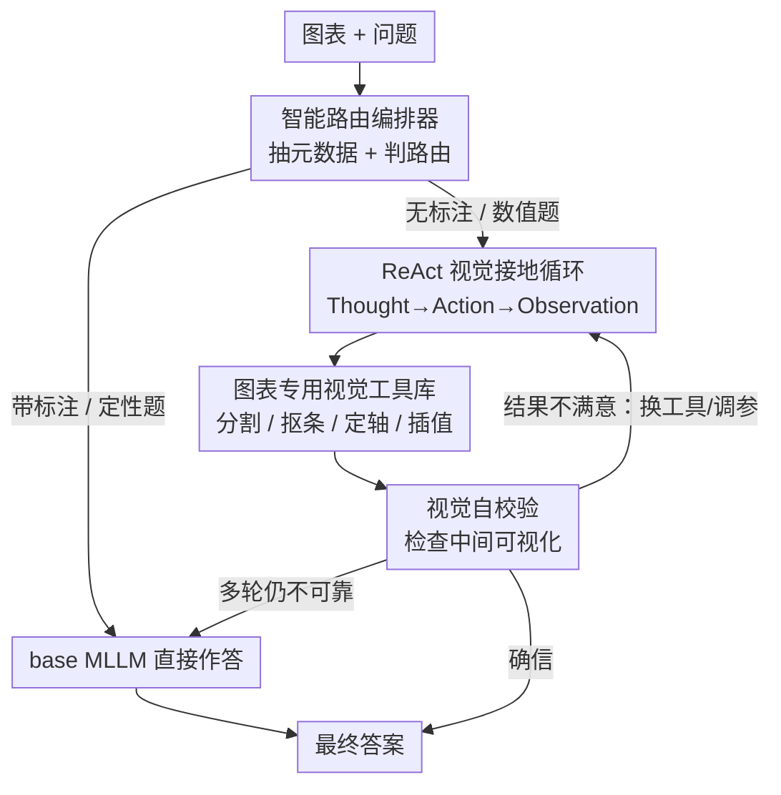

# ChartAgent: A Multimodal Agent for Visually Grounded Reasoning in Complex Chart Question Answering

**会议**: ACL2026  
**arXiv**: [2510.04514](https://arxiv.org/abs/2510.04514)  
**代码**: 待确认  
**领域**: Agent / 多模态VLM  
**关键词**: 图表问答, 视觉接地推理, 工具增强Agent, ReAct, 视觉自校验

## 一句话总结
ChartAgent 把图表问答从"文字链式推理"改成"在图像本身上动手"——用一套图表专用视觉工具（分割饼块、抠条形、定位坐标轴）在 ReAct 循环里逐步操作图表、并对中间可视化做自我校验，在 ChartBench / ChartX 上对无标注、重数值的难题整体提升最高 16.07%、无标注子集提升 17.31%。

## 研究背景与动机
**领域现状**：图表问答（Chart VQA）目前主流是把图表喂给多模态大模型（MLLM），靠 prompt 或微调让它直接给答案，或者走文字版 chain-of-thought 推理。

**现有痛点**：这些做法在**带标注图表**（数值/标签直接印在图上）上表现尚可，因为模型其实是在做 OCR 抄近路；但一旦换成**无标注图表**——需要从条形高度、饼块面积里"估"出数值——即便 GPT-4o 这类 SoTA 也大幅掉点（论文 Table 1 里 GPT-4o 在 ChartBench 无标注子集只有 36.15%）。

**核心矛盾**：文字 chain-of-thought 推理全程在语言空间里发生，而图表的关键信息是**几何/空间**的（一根条形有多高、一块饼占多大比例）。在脱离图像像素的纯文字推理里，这些量根本无从精确获得，模型只能瞎猜。

**本文目标**：让 agent 像人一样"在图上做记号"——把问题拆成一个个视觉子任务（定位图例、对齐坐标轴、量条形高度），并真正去操作图像得到中间结果，再据此推理。

**切入角度**：作者观察到人读图是**顺序、可视、可校验**的：先看坐标轴和图例，再画辅助线对比数值、圈出饼块判断比例，遇到看错了就重画。这套认知策略恰好能映射成"工具调用 + 中间可视化 + 自我检查"的 agent 回路。

**核心 idea**：用工具增强的多模态 agent，在**图表的空间域内**做视觉接地推理——不是描述图表，而是在图表上画、抠、量，并对自己画出来的东西做视觉自校验。

## 方法详解

### 整体框架
给定一张图表和一句自然语言问题，ChartAgent 的目标是输出忠实反映图表信息的答案。整条 pipeline 由一个 **LLM 编排器（orchestrator）** 起步：它先抽取图表元数据（类型、标题、图例、坐标轴刻度、是否带标注、简要视觉描述），然后做**智能路由**——带标注图表或纯定性问题直接丢给 base MLLM（省算力），无标注图表和数值题才触发**ReAct 风格的多轮视觉推理循环**。在循环里，agent 每一步生成 Thought → Action → Observation：思考下一个视觉子目标、从**图表专用工具库**里选一个工具去操作图像、再对返回的中间可视化做**视觉自校验**；若多轮仍不可靠则优雅回退到 base MLLM 直接作答。最大迭代步数设为 15。

### 关键设计

**1. 智能路由编排器：别让简单题白白烧算力，也别让难题走错路**

痛点是"一刀切"：所有图表都强行走工具循环既慢又可能在简单题上画蛇添足，全交给 MLLM 又会在无标注图上崩盘。ChartAgent 用一个 LLM 编排器（如 GPT-4o）先抽取图表元数据，关键字段是**annotation status（带标注 / 无标注）**。带标注图表里数值/标签是现成的文字近路，定性问题也不需要精确读数，这两类直接路由给 base MLLM；无标注图表则启动深层视觉推理循环。元数据同时用来检索**该图表类型专属的 few-shot ICL 示例**（如判定为饼图就只拼接饼图的 ReAct 轨迹示例，没有对应类型就不加）并为后续工具调用配参。这一步本质是把"该不该动用视觉工具"做成一个显式决策，在准确率和算力间取舍。

**2. 图表专用视觉工具库：把图表元素当成可检测、可分割的"视觉物体"**

纯靠 MLLM 的视觉编码器读不准条形高度和饼块面积，根因是它没有针对图表几何的专用感知能力。作者把自然图像里的原语任务（检测、分割、关系推理）类比到图表域，把条形、饼块、折线、图例、刻度、轴标签都当作基本"视觉物体"，设计了一套结构化工具，分两类：**通用图表工具**（分割、图例检测、坐标轴定位、数值插值，跨图表类型通用）和**图表专用工具**（针对饼图/条形/折线/箱线图各自的子任务，如饼块分割、条形隔离）。工具用 Python 函数实现，内部调用 SAM、Semantic SAM、Tesseract、EasyOCR 等成熟 CV/OCR 方法，并处理旋转文字、模糊标签匹配、过滤小/背景/重叠片段等边界情况，覆盖 40+ 种图表。每个工具被刻意限定为"清晰单一"的功能，避免过度细粒度，保证实现鲁棒。关键是这些工具**返回可解释的中间可视化**（带标签的分割掩码、给饼块上色、标条形高度、框出图例），这正是下一步自校验的依据。

**3. 视觉自校验与自适应工具使用：让 agent 检查自己画出来的东西、错了就改**

这是把人"看错了重画"那一步搬进 agent 的关键。在 Observation 阶段，agent 不是盲信工具输出，而是**视觉地检查工具生成的可视化**是否合理：分割是否完整、图例关联是否错位、饼块是否太小、颜色是否对、条形高度是否出现负值、读数是否和坐标轴自洽。状态更新为 $s_{t+1}=(s_t, g_t, a_t^{\text{chart-tool}}, o_{t+1})$，其中 $g_t$ 是当前子目标、$a_t^{\text{chart-tool}}$ 是调用的工具、$o_{t+1}$ 是新的可视化输出。若校验发现问题，agent 在下一轮自适应调整——换一个工具或调阈值等参数，形成类似人类 debug 的纠错回环。这一设计还有个"诚实"的副产品：若多轮后工具输出仍不充分，agent 能**意识到自身感知能力的边界**并回退到 base MLLM，而不是硬编一个错答案，这对可信 agent 很重要。

**4. 即插即用的多模态 agent 骨架：推理后端与工具都可独立升级**

ChartAgent 以 GPT-4o 作为 base MLLM，同时承担推理骨干和编排器角色，基于 AutoGen 实现工具编排。整个框架是 **plug-and-play** 的：感知工具和 MLLM 推理能力任一侧进步都能带来累积增益，换不同的 base MLLM 也能直接套用（论文 Section 5.2 验证了这点）。每个 ReAct 周期结束后，agent 评估更新后的多模态状态 $s_{t+1}$ 决定继续还是终止给答案。这种解耦让 ChartAgent 不是一个写死的端到端模型，而是一个能随底层模型一起"变强"的推理外壳。

### 一个完整示例
以一张无标注饼图、问"占比最大的类别是哪个"为例走一遍：编排器抽元数据，判定为无标注饼图 → 触发 ReAct 循环，检索饼图 ICL 示例。第一轮 Thought："需要分割各饼块并估面积" → Action：调用饼块分割工具 → Observation：得到带颜色叠加的分割掩码，自校验发现有两块没分开 → 第二轮调整阈值重新分割，校验通过 → Action：估算各块面积占比 → Action：图例检测把颜色对应到类别名 → 自校验确认颜色-类别映射一致 → 终止，输出占比最大的类别。整条轨迹里每一步都有可视化可供检查，错了就在下一轮改，而不是一锤定音。

## 实验关键数据

### 主实验
在 **ChartBench**（9 类 42 子类、3,800 图表-QA、76.2% 无标注、96.7% 数值题）上对比 30+ 基线，ChartAgent 整体 71.39%，比当时最强基线（Phi3-vision 55.32%）**绝对提升 16.07%**；无标注子集 60.81% 比最强基线（Qwen2-VL 43.50%）**提升 17.31%**。

| 模型 | 带标注 | 无标注 | 数值QA | 整体↑ |
|------|--------|--------|--------|-------|
| GPT-4o | 94.33 | 36.15 | 52.50 | 54.53 |
| Qwen2-VL | 78.42 | 43.50 | 52.94 | 54.53 |
| Phi3-vision | 86.92 | 40.77 | 55.89 | 55.32 |
| **ChartAgent** | **94.33** | **60.81** | **70.91** | **71.39** |

### 增益来源分析
拿 ChartAgent 与它的 base MLLM（GPT-4o）逐子集对比，能清楚看到增益**全部来自无标注/数值题**——带标注题被直接路由给 MLLM，所以分数原样保留；难题才进工具循环。这恰好印证了"智能路由 + 视觉接地"的设计动机。

| 子集 | base MLLM (GPT-4o) | ChartAgent | 提升 |
|------|-------------------|-----------|------|
| 带标注图 | 94.33 | 94.33 | 0（直接路由，不动用工具） |
| 无标注图 | 36.15 | 60.81 | +24.66 |
| 数值 QA | 52.50 | 70.91 | +18.41 |

### 关键发现
- **增益集中在"读数"难题**：带标注题分数不变（路由跳过工具），无标注图涨 24.66 个点、数值题涨 18.41 个点，说明工具+自校验真正补上的是"从几何元素估数值"这一短板，而非泛泛提升。
- **跨图表类型 + 跨复杂度都稳**：论文分析显示 ChartAgent 在 40+ 种图表类型、不同视觉/推理复杂度档位上都拿到最高分，说明把图表元素抽象成"视觉物体"的工具设计具备泛化性。
- **即插即用可迁移**：作为外壳套到不同 base MLLM 上都能提升（Section 5.2），证明增益来自框架而非某个特定模型；并附带失败模式分析指出常见错误。

## 亮点与洞察
- **"在图上动手"而非"描述图"**：核心洞察是图表推理的瓶颈是空间/几何信息，纯语言 CoT 拿不到，于是让 agent 真去分割、抠图、量高度——这是把视觉接地从"看图说话"推进到"操作图像"，思路可迁移到任何需要精确空间读数的多模态任务（如仪表盘、医学影像测量）。
- **自校验用的是 agent 自己生成的可视化**：工具刻意输出可解释的中间图（带标签掩码、上色饼块），让 agent 能"看见"自己做得对不对，这把人类 debug 闭环优雅地工程化了，比单纯堆工具更关键。
- **诚实的回退机制**：当工具多轮仍不可靠时主动承认感知边界、回退 base MLLM，避免硬编错答案，是可信 agent 设计的好范例。

## 局限与展望
- **依赖强 base MLLM + 大量外部 CV 工具**：编排、推理、自校验都靠 GPT-4o 级模型，工具又内嵌 SAM/OCR，推理成本和延迟（最多 15 轮）远高于直接问 MLLM，论文未给系统的时延/调用次数代价分析。
- **工具库是人工设计且按图表类型枚举**：覆盖 40+ 类型靠的是针对性工具，遇到全新的、罕见的图表形态可能没有对应工具，泛化上限受工具库边界约束。
- **自校验仍由同一个 MLLM 完成**：校验能力受限于 base MLLM 的视觉判断，若它本身看错了中间可视化，纠错回环可能失效或陷入反复换工具，作者的失败模式分析也提到常见错误。

## 相关工作与启发
- **vs 图表专用微调模型（ChartGemma / ChartInstruct / TinyChart 等）**：它们靠指令微调和视觉-语言对齐提升读图，但仍是端到端"看图给答案"，在无标注图上同样掉点（多在 30%~47% 整体）；ChartAgent 不微调底座，而是用工具+自校验在推理时补足感知，无标注子集大幅领先。
- **vs 通用视觉工具/视觉 prompt agent（ViperGPT / VisProg / Visual Sketchpad / Set-of-Marks）**：它们面向自然图像的结构化工具或迭代标注，ChartAgent 把同样的"迭代推理 + 视觉 prompt + 模块化工具"范式专门适配到图表域，把图表元素当视觉物体设计原语工具。
- **vs ReAct / AutoGen 等 agent 框架**：ChartAgent 复用 ReAct 的 Thought-Action-Observation 结构并基于 AutoGen 实现，创新点在于 Action 直接操作**图像像素**、Observation 阶段做**视觉自校验**，把通用 agent 范式落到了多模态视觉接地这一具体场景。

## 评分
- 新颖性: ⭐⭐⭐⭐⭐ 首个用工具增强多模态 agent 在图表空间域做视觉接地推理的工作，"操作图像+自校验"思路新。
- 实验充分度: ⭐⭐⭐⭐ 两大基准、30+ 基线、跨类型/复杂度/底座的分析完整，但缺系统的算力/时延代价对比。
- 写作质量: ⭐⭐⭐⭐ 动机-方法-实验逻辑清晰，工具库与轨迹示例多放在附录。
- 价值: ⭐⭐⭐⭐⭐ 把无标注图表读数难题整体推进 16 个点，且即插即用可随底座升级，实用价值高。

<!-- RELATED:START -->

## 相关论文

- [\[CVPR 2026\] ORCA: Orchestrated Reasoning with Collaborative Agents for Document Visual Question Answering](../../CVPR2026/llm_agent/orca_orchestrated_reasoning_with_collaborative_agents_for_document_visual_questi.md)
- [\[ACL 2026\] OctoTools: An Agentic Framework with Extensible Tools for Complex Reasoning](octotools_an_agentic_framework_with_extensible_tools_for_complex_reasoning.md)
- [\[ACL 2026\] SafeMCP: Proactive Power Regulation for LLM Agent Defense via Environment-Grounded Look-Ahead Reasoning](safemcp_proactive_power_regulation_for_llm_agent_defense_via_environment-grounde.md)
- [\[ICLR 2026\] VideoMind: A Chain-of-LoRA Agent for Temporal-Grounded Video Reasoning](../../ICLR2026/llm_agent/videomind_a_chain-of-lora_agent_for_temporal-grounded_video_reasoning.md)
- [\[ACL 2025\] A Multi-Agent Framework for Mitigating Dialect Biases in Privacy Policy Question-Answering Systems](../../ACL2025/llm_agent/multi_agent_dialect_bias_privacy_qa.md)

<!-- RELATED:END -->
