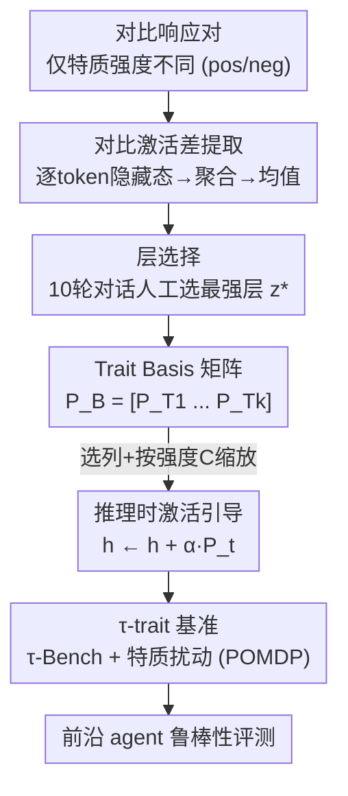

# Impatient Users Confuse AI Agents: High-fidelity Simulations of Human Traits for Testing Agents

**会议**: ACL 2026 (Oral)  
**arXiv**: [2510.04491](https://arxiv.org/abs/2510.04491)  
**代码**: https://github.com/collinear-ai/tau-trait  
**领域**: LLM Agent / 鲁棒性测试 / 激活引导  
**关键词**: AI Agent鲁棒性, 用户模拟, 激活引导, 人格向量, τ-Bench

## 一句话总结
作者提出 TraitBasis——一种无需微调、模型无关的轻量方法，用对比激活差在隐藏空间里抽出「不耐烦/困惑/怀疑/语无伦次」等用户特质方向，可在推理时缩放、组合、注入来高保真地模拟刁难型用户；把它接进 τ-Bench 得到 τ-trait 基准后，发现前沿 agent 在用户行为变化下性能平均掉 4%–20%（最高 46%），戳穿了「benchmark 高分=真鲁棒」的假象。

## 研究背景与动机
**领域现状**：多轮对话 AI agent 的首要目标是泛化，但评估通常局限于小规模 i.i.d. 任务或 τ-Bench、AgentBench、ToolBench 等 agent 基准。这些基准多用系统提示来模拟用户。

**现有痛点**：在真实部署中表现良好的 agent 经常翻车，根因往往是测试不足——尤其当用户行为偏离典型意图/人格分布时。现有基准覆盖窄、不显式测鲁棒性；即便建模多轮交互，靠系统提示模拟用户也难以在长对话中维持复杂、真实的用户行为（会出现「人格崩塌」persona collapse）。

**核心矛盾**：用户行为只要发生小漂移（更不耐烦、更语无伦次、更怀疑），agent 性能就会急剧下滑——作者观察到 τ-Bench 航空/零售域中，GPT-4o、Kimi-K2、GLM-4.5 仅因用户交互风格改变就分别掉 35%、46%、17%。但这种脆弱性被当前基准完全测不出来：标准评估下高分，现实多变场景下崩溃。

**本文目标**：填补「鲁棒性测试缺口」——造一个能系统性、可控地施加用户特质扰动的方法和基准，把 benchmark 结果与真实部署风险之间建立有原则的联系。

**切入角度**：假设每个类人特质对应模型激活空间里的一个方向（沿用 persona vector 思路）。于是不去「教」模型某个特质，而是用对比样本作为轻探针，把已经编码在预训练 LLM 里的该特质方向**isolate（分离）**出来。

**核心 idea**：用对比激活差提取可控、可缩放、可组合的「特质向量基」，推理时加法注入来高保真模拟刁难用户，进而把任意 agent 基准升级成鲁棒性压力测试。

## 方法详解

### 整体框架
TraitBasis 的核心是：把每个用户特质表示成激活空间的一个方向向量，整条流程分四步——构造仅在某特质强度上不同的对比响应对、收集逐 token 隐藏态并聚合成对话向量、对 $n$ 对取均值得到该特质向量、逐层选最优层后把多个特质向量拼成「基矩阵」；推理时按目标强度选列、缩放、逐层加进隐藏态即可。最后把它接进 τ-Bench 形成 τ-trait 鲁棒性基准。整体如下：

### 关键设计

**1. 对比激活差提取特质向量：用极少样本把特质方向从纠缠的激活里分离出来**

直接从单条响应抽特质向量很难，因为输出把多个特质、意图、属性、风格全纠缠在一起。作者对同一组 prompt $X=\{x_1,\dots,x_n\}$ 构造**仅在目标特质 $T$ 强度上不同**的对比响应对 $(Y_{pos}, Y_{neg})$（如意图与理解完全相同、只是不耐烦程度不同），对 $n$ 对取均值来抵消辅助属性、留下鲁棒的特质方向。具体地，对话 $C_i=(x_i,y_i)$ 在第 $z$ 层收集逐 token 隐藏态并聚合成单向量 $P_i^{(z)}:=\frac{1}{L_i}\sum_{t=1}^{L_i} h^{(z)}_{i,t}$，特质向量为

$$P_T^{(z)} := \frac{1}{n}\sum_{i=1}^{n}\big(P^{(z)}_{i,\text{pos}} - P^{(z)}_{i,\text{neg}}\big).$$

消融发现 $n=1$ 不够、$n=4$ 后性能饱和，故取 $n=4$。关键在于：少量样本不限制泛化——预训练 LLM 已编码丰富的交互风格表征，对比对只是「探针」而非「教学」，且向量甚至可用**人工手写**响应来激发（给个不耐烦前缀，模型就给该特质 token 高概率），从而生成它平时因预训练风格不会产出的多样高保真响应。

**2. 推理时激活引导 + 逐特质层选择：精确缩放注入又不破坏真实感**

提取出方向后，推理时在第 $z$ 层把隐藏态改写为 $h^{(z)} \leftarrow h^{(z)} + \alpha\,P_t^{(z)}$，其中 $\alpha$ 是校准后的特质强度。不同特质的最优注入层不同：作者为每层生成 10 轮对话、请 5 名标注者挑出「被引导得最清晰」的输出来选最优层 $z^*(T)$，最终特质向量取 $P_T:=P_T^{(z^*(T))}$。这套加法引导无需微调或额外数据，相比直接在系统提示里写人格（prompt-based）能在长对话中避免人格崩塌——后者随着模拟用户越来越真实反而让 agent 崩溃，而引导式注入保持稳定。用户模型用 Llama-3.1-8B，无微调即达到与 GPT-4o 相当的用户模拟性能。

**3. Trait Basis 组合：把多个特质向量拼成基矩阵实现线性可组合人格**

真实用户往往多特质叠加（如又不耐烦又怀疑）。作者把 $k$ 个最优特质向量拼成基矩阵 $P_\mathcal{B} = [\,P_{T1}\;P_{T2}\;\cdots\;P_{Tk}\,]\in\mathbb{R}^{d\times k}$，配上校准强度 $\mathbf{C}=[c_1,\dots,c_k]$。推理时对给定 $\mathbf{C}$ 选出相关列、按对应强度缩放、逐层加进隐藏态直到产出 logits。组合时只需线性叠加各特质向量并按目标强度加权——这正是「向量基」名字的由来。相比之下，prompt-based 和 SFT 只能在系统提示里直接写明特质与强度，LoRA 因混合 adapter 无效而在组合实验中被排除。

**4. τ-trait 基准：把特质向量作为新维度接进 τ-Bench 做鲁棒性压力测试**

作者把 TraitBasis 接进 τ-Bench 形成 τ-trait，并把任务形式化为带特质向量空间 $\mathcal{V}$ 的 POMDP $(\mathcal{S},\mathcal{A},\mathcal{O},\mathcal{T},\mathcal{R},\mathcal{U},\mathcal{V})$，转移函数从 $\mathcal{S}\times\mathcal{A}\times\mathcal{V}\to S\times\mathcal{O}$——即用户行为的特质扰动直接进入环境动态。用户被建模为人格 $\mathcal{P}_{\text{User}}=(P_t,P_a,\mathcal{U})$：特质 $P_t$ 用上述向量实例化，属性 $P_a$ 部分写进系统提示、部分作为只能用工具检索的隐藏属性存进数据库，$\mathcal{U}$ 是任务指令。除沿用航空/零售域外，作者新建 telecom（5 表 17 工具）和 telehealth（9 表 22 工具）两个域、共 35 个可验证任务，数据库由 Claude Sonnet 4 生成、工具人工核验。还把它应用到 BFCL 的 200 任务多轮子集，让每个任务在保持原意图下继承某特质。

## 实验关键数据

### 主结果（四维度，人工 vs LLM-judge）

| 方法 | 真实感 Elo↑ (人) | 保真度%↑ (人) | 长程一致%↑ (人) | 可组合%↑ (人) |
|------|------|------|------|------|
| Prompt-based | 1530 | 75.0 | 1.3 | 37.9 |
| SFT | 1561 | 95.0 | 5.0 | 51.9 |
| LoRA | 1285 | 68.75 | 4.5 | – |
| **TraitBasis** | **1624** | **97.5** | **24.8** | **62.5** |

TraitBasis 在人工评估上全面领先：真实感随机对局 63% 胜率（比次优 SFT 高 10%、比 prompt 高 15%）；保真度 97.5%（去弃权后升至 98.75%）；长程一致率 24.8% 且是唯一能可靠产出「真实升级」的方法（52.4% 交互中）；可组合 62.5%。**数据效率惊人**：仅用 4 个样本就达成，比 SFT（13k 样本）高 3000× 数据效率。值得注意的是 Claude 作 LLM-judge 时对可组合性的评分几乎与人工相反（错误地给关键词堆砌的 prompt-based 高分），作者据此论证人工评估才是该任务的 ground truth。

### τ-trait 上前沿 agent 的性能跌幅（部分）

| 域 | 模型 | 怀疑 | 困惑 | 不耐烦 | 语无伦次 | 平均 |
|----|------|------|------|--------|----------|------|
| 航空 | GPT-5 | -22.5 | -19.2 | -22.5 | -17.5 | **-20.4** |
| 航空 | GLM-4.5 | -11.0 | -16.9 | -12.8 | -12.2 | -13.2 |
| 航空 | GPT-4o | -6.7 | -5.0 | -4.4 | -6.7 | -5.7 |
| 零售 | Kimi K2 | -21.9 | -45.7 | -31.2 | -21.4 | **-30.0** |
| 零售 | GPT-4o | -29.2 | -34.2 | -25.9 | -22.9 | -28.1 |

### 关键发现
- **前沿 agent 普遍脆弱**：仅改变用户特质就让前沿模型平均掉 4%–20%、最高达 46%，且连 GPT-5 这种最新模型在航空域也掉 ~20%，说明规模/后训练没解决鲁棒性。
- **困惑/不耐烦最致命**：零售域 Kimi K2 在「困惑」下掉 45.7%，是单项最大跌幅。
- **prompt 模拟会人格崩塌**：模拟用户越真实，prompt-based 让 agent 崩得越狠（图 1），而向量引导保持稳定——这正是「为何 agent 在真实特质漂移下失败」的直接可视化。
- **自动评估在此任务上不可靠**：LLM-judge 对可组合性的判断几乎与人类相反，凸显该任务必须以人工评估为准。

## 亮点与洞察
- **「4 个样本 vs 13k 样本」的数据效率对比**极具说服力：把鲁棒性测试的成本从大规模数据微调降到几条对比对，让任意团队都能快速 QA 自己的 agent。
- **把特质做成「向量基」**是最巧的设计——可缩放（$\alpha$）、可组合（线性叠加）、可控（按强度选列），把离散的人格扰动变成连续可调的测试旋钮。
- **用人工手写响应也能激发向量**说明特质方向本就在预训练模型里，方法只是「点亮」而非「注入」——这一观察可迁移到任何需要可控行为引导的场景。
- **把鲁棒性失败显式归因到用户行为**：τ-trait 通过控制特质扰动，隔离出「纯粹由用户行为导致」的失败，在 benchmark 分数与真实部署风险之间建立了有原则的桥梁。

## 局限与展望
- **用户模型固定为 Llama-3.1-8B**：虽与 GPT-4o 相当，但向量提取依赖该模型的激活空间，跨模型族迁移性需更多验证（作者已在 Llama/Qwen 上验证特质优势可泛化）。
- **仅四个特质**：impatience/confusion/skepticism/incoherence 覆盖有限，真实用户行为维度远不止于此。
- **层选择依赖人工标注**：每个特质的最优层 $z^*$ 靠 5 名标注者挑选，自动化与可扩展性受限。
- **LLM-judge 不可用于本任务**：可组合性评估上自动判官几乎与人相反，意味着大规模评测仍重度依赖人工，成本难降。

## 相关工作与启发
- **vs τ-Bench / AgentBench / ToolBench**：它们测固定 i.i.d. 任务、靠系统提示模拟用户、不显式测鲁棒性；本文用特质向量引入可控扰动，把基准升级成鲁棒性压力测试并新增 telecom/telehealth 域。
- **vs prompt-based / 全量 SFT / LoRA 用户模拟**：prompt 控制弱且长对话崩塌，SFT 要 13k 样本、LoRA 混合 adapter 无效；TraitBasis 仅 4 样本、推理时引导、可组合，全面更优。
- **vs persona vector / 激活引导（Chen et al. 2025 等）**：前人多把激活引导用于情感/毒性/话题等简单特质；本文把范式扩到复杂多面的类人特质，并强调核心贡献不是「引导向量存在」而是「无人格崩塌的高保真多轮用户模拟 + 完整评估套件 + τ-trait 上的鲁棒性退化证据」。
- **vs SAE 稀疏特征发现**：同样追求可解释的低维行为方向，但 TraitBasis 用对比激活差而非学习稀疏字典。

## 评分
- 新颖性: ⭐⭐⭐⭐⭐ 把激活引导从简单特质扩到多面人格，并造出可控扰动的 agent 鲁棒性基准，视角新。
- 实验充分度: ⭐⭐⭐⭐⭐ 四 RQ + 人工/LLM 双评 + 多模型多域 τ-trait + BFCL，证据链完整。
- 写作质量: ⭐⭐⭐⭐ 论证清晰、图 1 直观，但符号较密、benchmark 命名（τ-trait）在正文中略显跳跃。
- 价值: ⭐⭐⭐⭐⭐ 戳穿「benchmark 高分=鲁棒」的假象，给社区一个低成本、可组合的 agent 压力测试工具并开源。

<!-- RELATED:START -->

## 相关论文

- [\[ACL 2026\] MAGMA: A Multi-Graph based Agentic Memory Architecture for AI Agents](magma_a_multi-graph_based_agentic_memory_architecture_for_ai_agents.md)
- [\[ACL 2026\] Your LLM Agents are Temporally Blind: The Misalignment Between Tool Use Decisions and Human Time Perception](your_llm_agents_are_temporally_blind_the_misalignment_between_tool_use_decisions.md)
- [\[ICLR 2026\] Judge Reliability Harness: Stress Testing the Reliability of LLM Judges](../../ICLR2026/llm_agent/judge_reliability_harness_stress_testing_the_reliability_of_llm_judges.md)
- [\[ICML 2026\] EvoClaw: Evaluating AI Agents on Continuous Software Evolution](../../ICML2026/llm_agent/evoclaw_evaluating_ai_agents_on_continuous_software_evolution.md)
- [\[ICLR 2026\] The Controllability Trap: A Governance Framework for Military AI Agents](../../ICLR2026/llm_agent/the_controllability_trap_a_governance_framework_for_military_ai_systems.md)

<!-- RELATED:END -->
