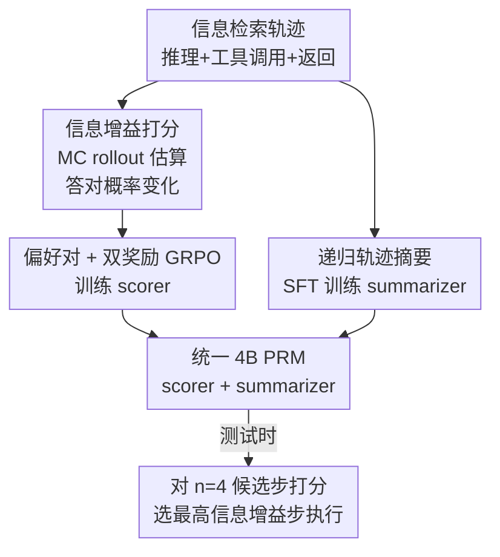

# PRInTS: 面向长程信息检索的过程奖励建模

**会议**: ACL 2026  
**arXiv**: [2511.19314](https://arxiv.org/abs/2511.19314)  
**代码**: https://github.com/G-JWLee/PRInTS  
**领域**: Agent / 过程奖励建模 / 测试时扩展  
**关键词**: 过程奖励模型, 信息检索 Agent, 信息增益, 轨迹摘要, GRPO

## 一句话总结
PRInTS 把"过程奖励模型（PRM）"从短数学推理搬到长程信息检索 Agent：用一个 4B 模型同时学会"按信息增益给每一步打稠密分"和"递归压缩不断膨胀的轨迹上下文"，靠测试时 best-of-$n$ 选步，就让 32B 量级 Agent 平均提升 9.3%、甚至让 30B+4B 的组合在 GAIA 上超过 671B 的 DeepSeek-V3.1。

## 研究背景与动机

**领域现状**：让 LLM Agent 用 ReAct 范式交替"推理 + 调工具"去回答需要多步检索的问题，是当前主流。提升它有两条路——要么微调 Agent 本身（需要海量数据、绑定特定模型家族、还要昂贵的在线 RL），要么训练一个与模型无关的奖励模型，在测试时给候选步骤排序、选出更好的动作。后者更轻量，而过程奖励模型（PRM）正是其中给"每一步"打分的代表。

**现有痛点**：现成的 PRM 都是为数学/逻辑推理设计的，搬到长程信息检索上有两个硬伤。其一是**评估粒度不匹配**：数学 PRM 评判的是一两句话的短推理单元，给的是"对/错"二元判断；而信息检索里"一步"是「推理 + 工具调用 + 工具返回」的完整组合，质量由多个维度决定（工具输出解读得对不对、这次检索信息量大不大、下一步计划合不合理），二元分根本刻画不了。其二是**上下文爆炸**：信息检索轨迹里每一步的工具返回都很长，历史会迅速膨胀，模型处理长噪声上下文时打分会变得不可靠。

**核心矛盾**：要给一步"打准分"，既需要把这一步放进完整轨迹上下文里看（否则缺信息），又不能把越堆越长的原始历史直接喂进去（噪声会淹没判断）——信息充分性与上下文噪声之间存在直接冲突。

**本文目标**：训练一个统一的生成式 PRM，既能对"推理+工具"的复合步骤给出多维度的稠密分，又能在轨迹任意增长时保持评估准确。

**切入角度**：作者把"一步好不好"重新定义为**信息增益**——这一步把"最终答对"的概率提高了多少，从而把模糊的质量评判变成一个可用蒙特卡洛 rollout 估计、可用 RL 训练的标量目标；同时让同一个模型兼任"摘要器"，把长轨迹递归压成定长摘要再去打分。

**核心 idea**：用"信息增益打分 + 递归轨迹摘要"双能力武装一个 4B 生成式 PRM，纯靠测试时选步引导，不动底层 Agent 的一根权重。

## 方法详解

### 整体框架

PRInTS 是**一个模型身兼两职**：既是 scorer（给候选下一步打信息增益分），又是 summarizer（把历史轨迹递归压成紧凑摘要）。整条管线分"离线造数据 + 训练"和"在线测试时引导"两段。离线阶段先用蒙特卡洛 rollout 给每一步标注信息增益分、构造"赢/输"偏好对，并为每一步生成一份递归摘要；训练阶段用 GRPO 学打分（score reward + comparison reward + 自适应权重）、用 SFT 学摘要，两种能力在同一个 PRM 里联合习得。测试时，Agent 每步先生成 $n=4$ 个候选下一步，PRInTS 基于"当前摘要 + 最新工具返回"给每个候选生成一段 CoT 分析并输出稠密分，选最高分那一步执行，然后把新步并入摘要、进入下一轮。

### 关键设计

**1. 信息增益打分：把"这一步好不好"量化成"它把答对概率提了多少"**

数学 PRM 给二元对错，但信息检索里一步的好坏没有客观对错，只有"对达成最终答案有没有帮助"。作者据此把当前步 $(s_t, a_t)$ 的质量定义为**信息增益**——执行这一步前后"最终答对"期望概率的变化。具体用蒙特卡洛估计：从某个前缀出发跑 $M$ 次 rollout 到出答案，统计平均准确率 $m_t = \frac{1}{M}\sum_{j=1}^{M}\mathbb{1}(o_{T_j}^{(j)}=a^*)$，再令信息增益分

$$g_t = (m_t - m_{t-1}) \times M/2$$

缩放系数 $M/2$ 把分数映到 $[-M/2, M/2]$、以 0.5 为步长离散化，便于直观比较各步相对质量。$g_t>0$ 表示这步（比如一次解决了不确定性的检索）提升了答对概率，$g_t<0$ 表示这步（比如做了未经验证的假设、调了无关工具）反而拖累。把质量锚到这个可估、可训的标量上，是后续 RL 训练的根基。

**2. 偏好对 + 双奖励 GRPO：让 PRM 既会估绝对分、又会比优劣**

光有标注分还不够稳。作者在 $M$ 次 rollout 里，先挑出能导向正确轨迹的那一步当"潜在赢家"，再从剩余步里随机采一个当"对照（较差）步"，组成候选偏好对；接着对这一对各自再跑 $M$ 次 rollout 估其信息增益分，按分高分低**重新打标**为赢样本 $(s^+,a^+)$、输样本 $(s^-,a^-)$。训练时给 PRInTS（先生成 CoT 分析、再吐标量 $\hat{g}_t$）施加两路奖励：score reward $r_s^k = 1-\left|\frac{g^k-\hat{g}^k}{M}\right|$ 逼近真值绝对分；comparison reward $r_c^k$ 用 $\mathrm{sgn}$ 强制赢样本得分高于输样本，学成对偏好。两路用**自适应权重**合成 $r^k = r_s^k + w\cdot r_c^k$，其中 $w = \frac{g^+-g^-}{M}$：分差大的对更可靠、权重更高，分差小的对很可能是标注噪声、权重压低。这样"估准绝对分"和"比对相对优劣"互补，既给细粒度反馈又抗噪。

**3. 递归轨迹摘要：把爆炸式增长的上下文压成定长摘要再打分**

直接拿原始长历史去打分，噪声会淹没判断。作者让同一个 PRM 兼任摘要器：每一步递归生成/更新一份紧凑摘要 $h_t = \text{LLM}(q, h_{t-1}, o_{t-1}, s_t, a_t)$，即把"查询 + 上一份摘要 + 最新工具返回 + 当前步"压成新摘要，捕获截至当前的关键发现与计划。这个递归式让 $h_t$ 始终是整条轨迹 $H_t$ 的压缩形态、输入长度有界。摘要器用 SFT 在标注摘要上训练（模仿压缩），与打分能力在同一模型里联合习得——打分时喂的正是 $h_{t-1}$ 而非原始历史，从而在轨迹任意变长时仍能稳定评估。

### 一个完整示例

设 Agent 在回答一个多跳问题，已检索了 6 步、原始历史很长。PRInTS 不把这 6 步原文喂进去，而是维护一份摘要 $h_6$（"已确认 X 公司 2019 年 CEO 是甲、甲此前任职乙公司，待查乙公司成立年份"）。第 7 步 Agent 生成 $n=4$ 个候选：①再搜一次甲的履历、②直接搜乙公司成立年份、③做无依据假设直接作答、④调一个无关计算器。PRInTS 基于"$h_6$ + 最新工具返回"对四者各生成 CoT 分析、输出稠密分：②信息增益最高（直击缺口）、①次之（冗余）、③④为负（假设/无关）。选②执行，拿到结果后更新出 $h_7$，进入第 8 步。整条交互里输入长度始终被摘要钉在定长，而不是随步数线性膨胀。

### 损失函数 / 训练策略

打分能力用 GRPO 优化，单 rollout 奖励为 $r^k = r_s^k + w\cdot r_c^k$（公式 4–5）；摘要能力用 SFT 在递归摘要标注上训练。两者按"SFT（摘要）→ GRPO（打分）"循环若干轮迭代联合训练。PRInTS 以 Qwen3-4B 初始化，标注用 Qwen3-32B 生成信息增益分与摘要；测试时取 $n=4$、按 best-of-$n$ 选最高分步。整套只需 2k+ 偏好对、不需工具交互式在线 rollout，比微调 Agent 动辄 10k–100k+ 样本便宜得多。

## 实验关键数据

### 主实验

在 FRAMES、GAIA（Level 1-3）、WebWalkerQA（易-难）三个长程信息检索基准上，用 LLM-as-Judge（GPT-5 评判）的 Avg@3 衡量。PRInTS 是 4B PRM，给三类不同 Agent 都带来一致、可观的测试时增益（绝对平均准确率）：

| Agent 主干 | Base Agent | 最优 PRM 基线 | PRInTS | 绝对提升 |
|--------|------|----------|--------|------|
| Qwen3-32B（开源） | 29.5 | 32.8（Confidence） | **38.8** | +9.3% |
| Tongyi DeepResearch-30B-A3B（专用检索 Agent） | 62.9 | 64.2（Verbal-progress） | **66.8** | +3.9% |
| Gemini-2.5-Flash（闭源前沿，仅 GAIA） | 40.0 | 41.5（StepWiser） | **44.0** | +4.0% |

关键看点：在 GAIA 上 PRInTS 把 DeepResearch-30B-A3B 从 61.9% 抬到 64.4%，让"30B Agent + 4B PRM"的组合**超过 20 倍大的 DeepSeek-V3.1-671B（63.1%）**、并逼近 OpenAI DeepResearch（67.4%）。同数据同主干下，输出二元判断的 StepWiser 只带来 1.5% 增益（vs PRInTS 9.3%），说明粗粒度监督是瓶颈；而输出更丰富的 Verbal-progress（标量）、Web-Shepherd（清单）也只 +0.2%/+0.5%，说明"光有表达力不够，得有信息增益 + 偏好训练的稠密分"。

### 消融实验

在 Qwen3-32B 上、FRAMES + GAIA(L1,L2) 验证两个核心组件：

| 维度 | 配置 | Avg | 说明 |
|------|------|-----|------|
| 上下文表示 | 原始全历史 $H_t$ | 39.5 | 噪声多，最差 |
| 上下文表示 | 最近 2 步 $H_{-2:}$ | 44.1 | 优于 1 步/4 步，原始历史越长越差 |
| 上下文表示 | **递归摘要 $h_t$（本文）** | **47.2** | 比全历史高 7.7% |
| 奖励设计 | 仅 score $r_s$ | 44.2 | 缺相对偏好 |
| 奖励设计 | 仅 comparison $r_c$ | — | 缺绝对锚 |
| 奖励设计 | $r_s + r_c$ | — | 比单项分别 +2.0% / +3.1% |
| 奖励设计 | **$r_s + w\cdot r_c$（自适应）** | — | 再 +1.0%，抗标注噪声 |

### 关键发现
- **摘要 > 原始历史**：把全轨迹喂进去（$H_t$，39.5）反而最差，加长历史不涨点；递归摘要（47.2）最好，证实"长历史引入噪声、压缩才利于打分"。
- **两路奖励互补**：信息增益估计（绝对分）与偏好预测（相对序）分别覆盖不同侧面，合用比单用任一项都好；自适应权重靠"分差大→权重高"过滤噪声对，再稳一截。
- **越强的 Agent 越能体现差距**：现成 PRM 在强 Agent 上增益缩水甚至不稳，PRInTS 在 DeepResearch 这种专用强 Agent 上仍能持续提升。

## 亮点与洞察
- **把"步质量"重定义为信息增益**：用"答对概率前后变化"这一可 MC 估计、可 RL 训练的标量，绕开了信息检索里"没有客观对错"的难题——这是把数学 PRM 思路迁到 Agent 的关键转译。
- **一个模型身兼 scorer + summarizer**：摘要不是外挂模块，而是和打分联合训练、且打分直接吃摘要，让"上下文管理"内生地服务于"准确评估"。
- **测试时扩展的性价比**：4B PRM + 2k 偏好对、无需在线工具 rollout，就把 30B Agent 推到能压 671B 的水平，给"小模型引导大任务"提供了便宜的范式。
- **可迁移**：信息增益打分 + 递归摘要这套"造数据→双奖励 GRPO→SFT 摘要"的组合，原则上能搬到任何长程、工具密集的 Agent 任务（代码、科研检索）。

## 局限与展望
- **依赖 MC rollout 造数据**：信息增益分要靠多次 rollout 估计，标注成本随 $M$ 和轨迹长度上升；偏好对仍可能含噪（作者用自适应权重缓解但未根除）。
- **训练迭代轮数留白**：原文 SFT-GRPO 循环写作"重复 X 轮"（⚠️ 以原文为准，具体轮数未在正文给出），复现时需查附录。
- **评测依赖 LLM-as-Judge**：用 GPT-5 判对错是该领域惯例，但裁判模型本身的偏差会传导到所有方法的绝对数值上；不同基准难度/轮次预算不同，横向数值不宜直接比大小。
- **改进方向**：把摘要质量也纳入可学习的奖励、或让 scorer 与 Agent 在线协同更新，可能进一步压缩"标注—训练—部署"的链路。

## 相关工作与启发
- **vs 数学/逻辑 PRM（StepWiser、GenPRM）**：它们评判一两句短推理、给二元/局部分；PRInTS 评判"推理+工具"的复合步、给信息增益稠密分。同数据同主干下 StepWiser 仅 +1.5% vs PRInTS +9.3%，差距来自监督粒度。
- **vs Agent 微调（WebSailor、DeepResearch）**：它们直接训 Agent，需 10k–100k+ 样本、绑模型家族、还要在线 RL；PRInTS 是与模型无关的测试时引导，2k+ 偏好对即可，且与微调正交、可叠加。
- **vs 启发式打分（Confidence、Relevance、Verbal-progress）**：这些靠现成置信度/相关性信号，表达力或有或无但都只带边际增益；PRInTS 的稠密分由信息增益 + 偏好学习显式训练而来，能识别细微但关键的质量差异。

## 评分
- 新颖性: ⭐⭐⭐⭐⭐ 把信息增益打分 + 递归摘要统一进一个生成式 PRM，是 PRM 向长程 Agent 迁移的实质创新
- 实验充分度: ⭐⭐⭐⭐⭐ 三类 Agent ×三基准 + 两组核心消融，且有"30B+4B 超 671B"的硬证据
- 写作质量: ⭐⭐⭐⭐ 动机—公式—实验链条清晰，个别训练细节（迭代轮数）留在附录
- 价值: ⭐⭐⭐⭐⭐ 给"低成本提升长程信息检索 Agent"提供了可复用、与模型无关的测试时方案

<!-- RELATED:START -->

## 相关论文

- [\[ACL 2026\] How Adversarial Environments Mislead Agentic AI](how_adversarial_environments_mislead_agentic_ai.md)
- [\[ACL 2026\] AnchorMem: Anchored Facts with Associative Contexts for Building Memory in Large Language Models](anchormem_anchored_facts_with_associative_contexts_for_building_memory_in_large_.md)
- [\[ACL 2026\] OctoTools: An Agentic Framework with Extensible Tools for Complex Reasoning](octotools_an_agentic_framework_with_extensible_tools_for_complex_reasoning.md)
- [\[ACL 2026\] AVA: Attentive VLM Agent for Mastering StarCraft II](ava_attentive_vlm_agent_for_mastering_starcraft_ii.md)
- [\[ACL 2026\] Mem²Evolve: Towards Self-Evolving Agents via Co-Evolutionary Capability Expansion and Experience Distillation](mem2evolve_towards_self-evolving_agents_via_co-evolutionary_capability_expansion.md)

<!-- RELATED:END -->
