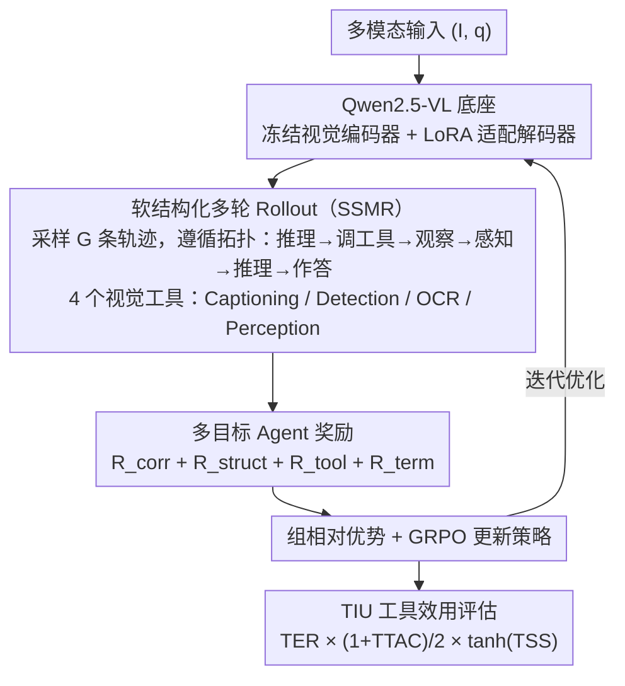

# Waking Up Blind: Cold-Start Optimization of Supervision-Free Agentic Trajectories

**会议**: ACL 2026 Findings  
**arXiv**: [2604.17475](https://arxiv.org/abs/2604.17475)  
**代码**: [GitHub](https://github.com/ab-iitd/spectra)  
**领域**: 多模态Agent / 视觉推理  
**关键词**: 小型VLM, 工具调用, 冷启动强化学习, 多目标奖励, Agent轨迹优化

## 一句话总结

本文提出 SPECTRA，一种无需监督轨迹的框架——通过冷启动强化学习（GRPO）和软结构化多轮 rollout 拓扑约束，让小型视觉语言模型（SVLM）在纯环境交互中自行发现有效的工具调用和视觉推理行为，在 4 个多模态 benchmark 上提升任务准确率达 5% 和工具效率 9%，同时提出 Tool Instrumental Utility（TIU）指标量化无监督下的工具效能。

## 研究背景与动机

**领域现状**：小型视觉语言模型（SVLM，如 Qwen2.5-VL-7B）因延迟低、部署成本小而适合作为 Agent 控制器，但在长程推理、细粒度视觉感知和工具编排上落后于大模型。现有改进方法分两条路线：(1) 轨迹微调——用合成的工具调用数据（如 T3-Agent 的 MM-Traj）进行监督微调，可提升约 20%；(2) 强化学习——如 Tool-R1 通过 RL 优化工具调用的采样效率。

**现有痛点**：(1) 轨迹微调依赖昂贵的合成监督数据（通常由大模型蒸馏），限制了可扩展性和泛化；(2) 现有方法优化工具调用推理时没有直接改善视觉感知——工具使用和视觉理解是脱节的；(3) 缺乏在没有标注轨迹标签时评估工具效能的指标——现有 Tool Accuracy 依赖 ground truth 轨迹。

**核心矛盾**：让 SVLM 学会有效的多步工具调用需要高质量的监督轨迹，但获取这些轨迹本身就昂贵且限制泛化。能否让模型从零开始（cold-start），仅通过环境反馈自行发现有效的工具使用策略？

**本文目标**：(1) 设计无监督的 Agent 策略优化方法，绕过监督轨迹的依赖；(2) 通过结构化 rollout 约束改善 SVLM 的视觉感知；(3) 提出不依赖 ground truth 的工具效能评估指标。

**切入角度**：观察到 SVLM 的"视觉盲区"可以通过强制工具调用-观察-感知的结构化序列来缓解——让模型先用工具获取视觉证据，再基于证据推理，而非直接从原始图像推理。这种拓扑约束可以作为 RL 的结构先验。

**核心 idea**：用 GRPO 强化学习 + 软结构化 rollout 拓扑约束 + 多目标奖励（正确性+结构完整性+工具效用），让 SVLM 在冷启动条件下自行发现工具驱动的视觉推理策略。

## 方法详解

### 整体框架

SPECTRA 想让小型视觉语言模型在没有任何监督轨迹的冷启动条件下，仅靠环境反馈自行学会"先用工具取证、再据证推理"的策略。它以 Qwen2.5-VL 为底座，冻结视觉编码器、用 LoRA 适配语言解码器；对每个多模态输入 $(I, q)$ 采样 $G$ 条结构化 rollout 轨迹，用一个多目标奖励（正确性+结构完整性+工具效用+终止）打分，算出组相对优势后用 GRPO 更新策略。动作空间是自然语言 token 加上四个视觉工具原语（Image Captioning、Object Detection、OCR、Visual Perception），而软结构化的拓扑约束则像一根"训练轮"，把模型从盲目直接推理引导到工具驱动的推理路径上。训练收敛后，再用 TIU 指标在无 ground truth 的条件下评估工具到底用得好不好。

### 关键设计

**1. 软结构化多轮 Rollout（SSMR）：用拓扑先验把推理锚定到视觉证据**

SVLM 直接看图推理容易产生视觉幻觉，根因是它跳过了取证环节、凭印象作答。SSMR 规定最优轨迹应遵循拓扑序列 $\tau = \langle reason \to tool \to obs \to percep \to reason \to ans \rangle$——先推理选工具、拿到工具输出（Observation）、把输出与视觉特征综合（Perception），再推理后作答，从而强迫模型把结论建立在工具提供的证据之上。

这个约束是"软"的：偏离不会被一刀切禁止，而是通过结构完整性奖励 $R_{struct} = \alpha \cdot \gamma^{\phi(\tau)}$ 渐进惩罚（$\alpha=2.0$，$\gamma=0.75$，$\phi(\tau)$ 衡量偏离程度），偏得越远奖励指数级衰减。软约束既给了足够的归纳偏置让冷启动学习能起步，又保留了探索空间——消融显示去掉它在 ScienceQA 上掉超过 5%。

**2. 多目标 Agent 奖励：让模型学会"答对"也学会"过程对"**

只用正确性奖励会让模型走捷径，比如不调工具直接猜答案，或反复只用 OCR 一种工具。SPECTRA 把奖励拆成四块：$R_{total} = \lambda_1 R_{corr} + \lambda_2 R_{struct} + \lambda_3 R_{tool} + \lambda_4 R_{term}$。其中任务正确性 $R_{corr} = C_1 \cdot \mathbb{1}(y_{pred} = y_{gt})$ 管答案对错，$R_{struct}$ 管轨迹是否合拓扑，终止标记 $R_{term}$ 确保推理收敛到明确答案。

工具效用项最见巧思：$R_{tool} = \mathbb{1}_{syntax} + \mathbb{1}_{success} + R_{div}$ 同时奖励调用合法、执行成功、以及工具使用的多样性，而多样性项 $R_{div}$ 配了 per-tool 饱和上限 $\kappa$ 和全局上限 $\eta$，既鼓励用多种工具又防止刷工具次数的 reward hacking。所有项最终归一化为 $R_{Total} = S \times R_{total} / N_{norm}$，让多目标信号在同一尺度上协同。

**3. Tool Instrumental Utility（TIU）：无 ground truth 也能量化工具效能**

现有 Tool Accuracy 依赖标注好的正确工具序列，在无监督设置下根本用不了。TIU 改从三个不需要标注的维度合成度量：$TIU = TER \times \frac{1+TTAC}{2} \times \tanh(TSS)$。其中 Tool Execution Reliability（TER）是工具调用的成功执行率，反映可靠性；Task-Tool Alignment Coefficient（TTAC）是工具使用与任务成功之间的 point-biserial 相关，正值意味着用工具确实有助于答对；Tool Selectivity Score（TSS）是工具使用分布与均匀分布的 KL 散度，高值表示有策略地挑工具而非乱调。

三者相乘时各做了有界处理——$(1+TTAC)/2$ 把相关系数归一到 $[0,1]$，$\tanh(TSS)$ 把选择性压到有界区间，使得任一维度塌陷都会拖低总分。这样 TIU 不依赖任何 ground truth 轨迹，就能从可靠、相关、选择三个角度综合判断工具到底用得好不好。

### 损失函数 / 训练策略

GRPO 目标：$\mathcal{J}_{SPECTRA}(\theta) = \mathbb{E}[\frac{1}{G}\sum_i \frac{1}{|\tau_i|}\sum_t \min(\rho_{i,t} \hat{A}_{i,t}, \text{clip}(\rho_{i,t}, 1-\epsilon_l, 1+\epsilon_h)\hat{A}_{i,t})] - \psi D_{KL}(\pi_\theta \| \pi_{\theta_{ref}})$。使用 VERL 框架 + vLLM 引擎，LoRA 微调 Qwen2.5-VL（3B/7B），每个数据集 1000 训练 + 200 测试样本。

## 实验关键数据

### 主实验

**Benchmark 比较（Accuracy %）**

| 模型 | AI2D | TQA | OK-VQA | ScienceQA | Avg. | MMMU-Pro(OOD) |
|------|------|-----|--------|-----------|------|-------------|
| GPT-4o | 76.5 | 77.0 | 88.5 | 86.0 | 82.0 | 61.8 |
| Qwen2.5-VL [7B] (base) | 63.8 | 74.6 | 71.5 | 73.5 | 70.9 | 40.5 |
| VERL Baseline [7B] | 67.5 | 73.3 | 74.6 | 78.3 | 73.4 | 44.3 |
| **SPECTRA [7B]** | **71.1** | **77.5** | **79.6** | **83.1** | **77.8** | **46.7** |

**Tool Instrumental Utility（TIU，7B 变体）**

| 配置 | TER(%) | TTAC | TSS | TIU(%) |
|------|--------|------|-----|--------|
| Baseline Agent | 77.30 | -0.003 | 2.05 | 35.63 |
| **SPECTRA** | **88.69** | **0.009** | **2.98** | **44.66** |

### 消融实验

**Leave-one-out 奖励消融（SPECTRA 7B）**

| 配置 | AI2D | TQA | OK-VQA | ScienceQA | Avg. |
|------|------|-----|--------|-----------|------|
| Full $R_{total}$ | 71.1 | 77.5 | 79.7 | 83.2 | 77.8 |
| w/o $R_{corr}$ | 68.5 | 78.5 | 80.5 | 77.5 | 76.2 |
| w/o $R_{struct}$ | 66.0 | 77.5 | 82.5 | 77.0 | 75.7 |
| w/o $R_{tool}$ | 74.5 | 74.0 | 79.5 | 78.0 | 76.5 |
| w/o $R_{term}$ | 72.0 | 75.5 | 77.5 | 78.0 | 75.7 |

### 关键发现

- SPECTRA 7B 比最强 VERL 基线平均提升 4.4 个百分点，在 OOD (MMMU-Pro) 上也提升 2.4 点
- TIU 从 35.63% 提升到 44.66%——TER 提升 11.4%（工具调用成功率），TTAC 从负转正（工具使用从"无关"变为"正相关"）
- 轨迹分析：SPECTRA 显著增加了 Reasoning→Terminal 正确路径（+48），减少了 Tool_Call→Tool_Call 的递归循环（-103）
- ScienceQA 上去掉任何奖励组件都导致 >5% 下降，完整多目标框架对复杂推理最关键
- 3B 变体也有一致提升（60.3→63.9），证明方法对小模型同样有效

## 亮点与洞察

- "冷启动 RL"的概念很有价值——无需监督轨迹就能让模型自行发现工具使用策略，大幅降低了数据成本。关键在于结构先验（SSMR）提供了足够的归纳偏置
- TIU 指标的三维分解（可靠性-对齐性-选择性）为无监督 Agent 评估提供了一个可复用的框架——可以直接迁移到其他工具调用场景
- 奖励多样性项 $R_{div}$ 的饱和设计是一个实用的 trick——既鼓励工具多样性又防止 reward hacking，比简单的计数奖励更稳健

## 局限与展望

- 仅集成 4 个视觉工具，缺乏代码执行和搜索引擎等通用工具——限制了对需要外部知识的复杂任务的适用性
- 尽管最终结果正确，中间推理步骤偶尔出现幻觉（如幻想不存在的工具）
- 训练和评估仅在 MCQ 场景下进行，开放式生成任务的表现未知
- 冷启动学习的效率依赖于合理的奖励设计——新任务需要重新设计奖励信号

## 相关工作与启发

- **vs T3-Agent**: T3-Agent 使用自动生成的监督轨迹（MM-Traj）微调，SPECTRA 完全无监督——降低了数据成本，但 T3-Agent 在有充分监督数据时可能上限更高
- **vs Tool-R1**: Tool-R1 用 RL 优化工具调用但未直接改善视觉感知，SPECTRA 通过 SSMR 将工具输出锚定到视觉理解
- **vs RL4VLM**: RL4VLM 使用环境奖励但无结构先验，SPECTRA 的拓扑约束为冷启动提供了关键的归纳偏置

## 评分

- 新颖性: ⭐⭐⭐⭐ 冷启动 RL + 软拓扑约束 + TIU 指标三重贡献，但各单元技术（GRPO、LoRA）本身不新
- 实验充分度: ⭐⭐⭐⭐ 4 个 benchmark + OOD + 消融 + 轨迹分析 + 定性分析，统计检验完整
- 写作质量: ⭐⭐⭐⭐ 动机清晰，公式推导完整，但符号较多需要仔细阅读
- 价值: ⭐⭐⭐⭐ 为无监督 Agent 训练提供了实用框架，TIU 指标可独立使用

<!-- RELATED:START -->

## 相关论文

- [\[ACL 2026\] SynthAgent: Adapting Web Agents with Synthetic Supervision](synthagent_adapting_web_agents_with_synthetic_supervision.md)
- [\[ACL 2026\] BAPO: Boundary-Aware Policy Optimization for Reliable Agentic Search](bapo_boundary-aware_policy_optimization_for_reliable_agentic_search.md)
- [\[ICLR 2026\] Towards Scalable Oversight via Partitioned Human Supervision](../../ICLR2026/llm_agent/towards_scalable_oversight_via_partitioned_human_supervision.md)
- [\[ACL 2026\] Your LLM Agents are Temporally Blind: The Misalignment Between Tool Use Decisions and Human Time Perception](your_llm_agents_are_temporally_blind_the_misalignment_between_tool_use_decisions.md)
- [\[CVPR 2026\] BAMI: Training-Free Bias Mitigation in GUI Grounding](../../CVPR2026/llm_agent/bami_training-free_bias_mitigation_in_gui_grounding.md)

<!-- RELATED:END -->
