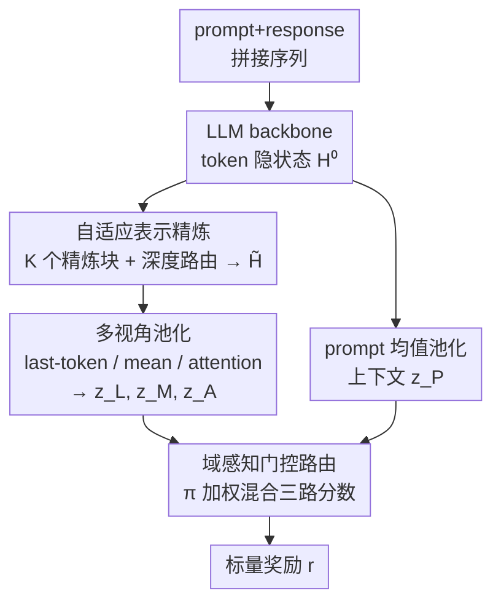

# AdaJudge: Adaptive Multi-Perspective Judging for Reward Modeling

**会议**: ACL 2026  
**arXiv**: [2601.08097](https://arxiv.org/abs/2601.08097)  
**代码**: 待确认  
**领域**: 对齐RLHF  
**关键词**: 奖励模型, 自适应池化, Mixture-of-Pooling, 表示精炼, 偏好学习

## 一句话总结
针对奖励模型普遍用「固定池化（如 last-token）把整条序列压成一个标量」带来的两个结构性缺陷——固定的空间归纳偏置与生成式 backbone 表示不适配判别——AdaJudge 先用门控精炼块把 backbone 表示重塑到判别空间，再用「域感知门控的多视角池化」按 prompt 动态融合 last-token / mean / attention 三种池化证据，在 RM-Bench 和 JudgeBench 上让 4B/8B 模型超过 27B 的 off-the-shelf 强奖励模型。

## 研究背景与动机
**领域现状**：主流奖励模型（RM）的架构高度统一——一个 causal transformer backbone 把拼接好的「prompt+response」编码成 token 级隐状态，然后用一个**固定的池化操作**（最常见是取最后一个 token 的隐状态，即 last-token pooling）压成单个标量分数，配 Bradley-Terry 损失训练。这套范式简单高效，近年的改进几乎都堆在「数据质量」和「backbone 规模」上，打分头本身一直没动。

**现有痛点**：论文指出固定池化有一个被忽视的问题——**验证证据的空间分布是随任务变化的**。数学/代码题的对错信号往往局部、集中在最终答案附近（适合 last-token），而安全、连贯性、风格这类整体属性则分散在全序列（适合 mean pooling）。强行让一个通用 RM 只用一种池化，等于逼它在「检测推理错误所需的高频局部敏感」和「评估安全所需的低频全局整合」之间做系统性取舍。论文 Figure 1 实测：last-token 善于抓结尾信号但会漏掉藏在前文里的缺陷；mean pooling 抓全局属性但信号会被冗长前文稀释。

**核心矛盾**：除了聚合方式的固定偏置，还有第二个更深的问题——**表示错配**。backbone 的隐状态是为 next-token 预测优化的，而偏好判别需要的是在含噪、序列级监督下做细粒度成对区分。逻辑一致性、轻微约束违背这类微妙偏好线索，在原始表示空间里跟成对排序目标对不齐，且不同样本需要的抽象层级差异很大。

**核心 idea**：用一个**两阶段自适应**过程同时改造「表示」和「聚合」——先把 backbone 表示精炼到判别导向空间（且精炼深度按样本难度自适应），再用一个 prompt 条件化的门控网络，把多种池化专家的证据动态混合，而不是固定承诺某一种。

## 方法详解

### 整体框架
AdaJudge 接在任意 LLM backbone 之后，输入是「prompt+response」拼接序列经 backbone 得到的 token 级隐状态 $\mathbf{H}^{(0)}\in\mathbb{R}^{L\times d}$，输出是单个标量奖励 $r(\mathbf{x},\mathbf{y})$。中间分两个阶段：Stage I「自适应表示精炼」用 $K$ 个轻量 transformer 块逐步增强表示，并用一个深度路由器把各层中间态自适应加权融合成精炼表示 $\tilde{\mathbf{H}}$；Stage II「多视角聚合」从 $\tilde{\mathbf{H}}$ 上抽 last-token、mean、attention 三种互补特征 $\mathbf{z}_L,\mathbf{z}_M,\mathbf{z}_A$，各自经 MLP 头打出一个分数，再由一个以 prompt 上下文 $\mathbf{z}_P$ 为条件的池化路由器输出混合权重 $\boldsymbol{\pi}$，把三个分数门控加权成最终奖励。整套额外模块都很轻，用 LoRA 训练，不需要 token 级或过程级监督。

### 关键设计

**1. 自适应表示精炼：把生成式表示重塑成判别空间，并按样本难度调精炼深度**

这一步直击「表示错配」痛点。backbone 隐状态 $\mathbf{H}^{(0)}$ 是为生成优化的，论文在其后接 $K$ 个串行的轻量 transformer 块 $\mathcal{T}_k$，让表示逐层演化：$\mathbf{H}^{(k)}=\mathcal{T}_k(\mathbf{H}^{(k-1)})$，目的是放大那些在标准语言建模特征里被淹没的微妙偏好信号（逻辑不一致、轻微约束违背）。但「需要精炼几层」其实因样本而异——简单样本浅层线索就够，难样本要累积更深的推理痕迹。于是论文引入**深度门控**：对 backbone 特征做均值池化得到一个序列级上下文向量，经线性投影 + softmax 得到混合系数 $\boldsymbol{\alpha}\in\Delta^K$，精炼表示是所有中间态的凸组合：

$$\tilde{\mathbf{H}}=\sum_{k=1}^{K}\alpha_k\,\mathbf{H}^{(k)}.$$

这样模型可以对简单样本偏重浅层、对难样本累积深层，而不是所有样本统一过固定深度。实验里 $K$ 取得很小（Phi-3.5-mini 用 2，Qwen3-4B/8B 用 3），所以开销很轻。

**2. 多视角池化：三种互补池化专家覆盖不同空间粒度的证据**

为了不被单一池化的信息瓶颈卡住，AdaJudge 从精炼表示 $\tilde{\mathbf{H}}$ 上同时抽三种特征，刻意对应不同的空间敏感性。**Last-token 池化** 取最后一个 response token 的隐状态 $\mathbf{z}_L=\tilde{\mathbf{H}}_\tau$（$\tau=\max\{t\mid m_t=1\}$，$\mathbf{m}$ 是区分 response/prompt 的二值掩码），捕捉结论敏感信号；**Mean 池化** 对所有 response token 取掩码均值 $\mathbf{z}_M=\frac{\sum_t m_t\tilde{\mathbf{H}}_t}{\sum_t m_t}$，捕捉全局风格与连贯性；**Attention 池化** 用一个单层线性打分器 $\mathbf{W}_a\in\mathbb{R}^{1\times d}$ 算注意力权重再加权求和，专门检测散落在任意位置的稀疏异常：

$$\beta_t=\frac{\exp(\mathbf{W}_a\tilde{\mathbf{H}}_t+b_a)}{\sum_j\exp(\mathbf{W}_a\tilde{\mathbf{H}}_j+b_a)},\quad \mathbf{z}_A=\sum_t\beta_t\tilde{\mathbf{H}}_t.$$

三路特征覆盖「结尾局部 / 全局整体 / 任意位置稀疏」三种证据分布，给后面的门控提供多样化的「视角」。

**3. 域感知门控路由：以 prompt 上下文为条件动态选聚合策略**

光有三个视角不够，还得知道「这条样本该信哪个视角」。每个视角向量 $\mathbf{z}_v$（$v\in\{L,M,A\}$）先经独立 MLP 头打出标量分数 $s_v$。关键在于路由的条件：论文额外对 **prompt token** 做均值池化得到 $\mathbf{z}_P$，作为「任务与意图」的上下文信号——它和具体 response 实现解耦，只反映这道题属于什么领域、想考什么。路由网络吃拼接向量 $[\mathbf{z}_L;\mathbf{z}_M;\mathbf{z}_A;\mathbf{z}_P]$，经 softmax 输出混合权重 $\boldsymbol{\pi}\in\Delta^3$，最终奖励是三路分数的门控混合：

$$r(\mathbf{x},\mathbf{y})=\pi_L s_L+\pi_M s_M+\pi_A s_A.$$

以 $\mathbf{z}_P$ 为条件，等于鼓励模型先**推断 prompt 的领域特性和评估意图**，再挑选归纳偏置最匹配该任务证据分布的聚合策略。这把原本「固定的架构选择」变成了「动态的任务推断」——数学题就偏 last-token 的局部精度，安全题就偏 mean 的全局整合，避免了固定池化的强制取舍。

### 损失函数 / 训练策略
训练用 **Focal Bradley-Terry 目标**。设 $p=\sigma((r^+-r^-)/\tau_{bt})$ 是「偏好回复 $\mathbf{y}^+$ 排在 $\mathbf{y}^-$ 之前」的预测概率，损失为：

$$\mathcal{L}=-w_m(1-p)^\gamma\log(p)+\lambda\max\big(0,\eta-\mathcal{H}(\boldsymbol{\pi})\big)^2.$$

其中 $(1-p)^\gamma$ 是 focal 项，强调难样本；$w_m$ 是按偏好幅度（用平方根缩放）给每对样本的非负权重；后一项是对路由分布 $\boldsymbol{\pi}$ 的熵正则，当熵低于阈值 $\eta$ 时惩罚，防止路由塌缩到单一视角（退化回固定池化）。训练数据是 HelpSteer3 偏好分割（约 40.5K 偏好对，真实对话 prompt + 人工标注），backbone 用 LoRA 微调。

## 实验关键数据

### 主实验
在 RM-Bench（chat/math/code/safety + Easy/Normal/Hard 难度）和 JudgeBench（knowledge/reasoning/math/code）上评测，指标是成对判断准确率。最亮眼的是 **Qwen3-8B + AdaJudge 在 RM-Bench 上 71.1，超过 27B 的 Skywork-Reward-Gemma-2（70.5）**，而同 backbone 的固定池化只有 67.3。

| 模型 / 配置 | RM-Bench Overall | JudgeBench Overall | 说明 |
|------|------|------|------|
| Skywork-Reward-Gemma-2-27B（off-the-shelf） | 70.5 | 64.3 | RM-Bench 榜首参考 |
| Skywork-Reward-Llama-3.1-8B（off-the-shelf） | 70.1 | 62.3 | JudgeBench 榜首参考 |
| Phi-3.5-mini + last-token | 58.0 | 55.1 | 紧凑模型固定池化 |
| Phi-3.5-mini + **AdaJudge** | 59.8 | 59.4 | 两榜同时提升 |
| Qwen3-4B + last-token | 67.6 | 62.3 | |
| Qwen3-4B + **AdaJudge** | 70.8 | 66.0 | |
| Qwen3-8B + last-token | 67.3 | 63.1 | |
| Qwen3-8B + **AdaJudge** | **71.1** | 66.0 | 超过 27B off-the-shelf |

控制实验设计很干净：off-the-shelf 模型用海量数据训练只作参考；真正可比的是「同 backbone、同数据、同损失，只换聚合策略」的 last-token / mean 基线，把性能差异完全归因到架构设计。

### 消融实验
论文在 Qwen3-4B 上做了两组消融。第一组对比四种聚合策略（Table 2），第二组验证 Stage-I 精炼模块（Table 3）。

| 配置 | RM-Bench Avg | RM-Bench Hard | JudgeBench Avg | 说明 |
|------|------|------|------|------|
| Last-Token | 69.2 | 37.0 | 65.1 | 单视角 |
| Mean-Pool | 67.4 | 34.8 | 64.3 | 单视角 |
| Attn-Pool | 69.5 | 38.7 | 65.1 | 单视角 |
| **AdaJudge（完整）** | **70.8** | **43.7** | **66.0** | 多视角门控 |
| w/o Refinement（去 Stage I） | 69.8 | 39.6 | 62.6 | 直接用 backbone 特征 |

### 关键发现
- **AdaJudge 在最难的子集上提升最大**：RM-Bench Hard 从单视角的 37.0/34.8/38.7 拉到 43.7，正是「证据分布最不确定、固定池化最容易崩」的场景——last-token 在 Hard 上只有 34.8，印证它抓不住分散的细微错误。
- **去掉 Stage-I 精炼掉点集中在复杂任务**：w/o Refinement 在 JudgeBench Avg 从 66.0 掉到 62.6、RM-Bench Hard 从 43.7 掉到 39.6，说明表示精炼对 Math/Code/Hard 这类需要细粒度判别的任务贡献最大。
- **紧凑模型受益更明显**：Phi-3.5-mini 这种小模型本就缺乏把多样偏好语义压进单一视角的容量，固定池化下 mean 在 Math/Code 崩（48.7/50.7）、last-token 在 JudgeBench 崩（55.1）；AdaJudge 把证据抽取卸载到显式多视角，让有限 backbone 维持通用表示，两榜各提约 1.4–4 分且没有灾难性遗忘。
- **实现了真正的 Pareto 改进**：Qwen3-8B 上 Math 保持 80.4、Safety 拉到 87.5、Hard 提到 43.0，三个原本互相拉扯的维度同时变好，验证了「按 prompt 动态调整感受野」的有效性。

## 亮点与洞察
- **把「池化方式」从超参数变成可学习的任务推断**：传统做法是工程师拍板用哪种池化，AdaJudge 用 prompt 条件化的门控让模型自己按任务挑，且用熵正则防止塌缩——这是个可迁移到任何「聚合策略随任务变」场景的思路（如多任务句向量、多领域检索）。
- **prompt 上下文 $\mathbf{z}_P$ 与 response 解耦做路由条件很巧妙**：路由决策只看「这是什么任务」而不被具体回复内容污染，避免了路由器学到「按答案好坏选视角」的捷径泄漏。
- **轻量 + 不需过程监督**：相比 ArmoRM 这类多目标头或多模型集成，AdaJudge 只加几个小 transformer 块和几个 MLP 头，用 LoRA 就能训，没有多模型集成的巨大延迟开销，却拿到了类似的自适应收益。

## 局限与展望
- 三种池化专家（last-token/mean/attention）是人工固定选的，覆盖面有限——若某任务的证据分布不落在这三种模式里（如需要段落级层次聚合），门控也无能为力；专家集合本身能否也自适应是开放问题。
- 实验只在 3 个 ≤8B 的 backbone、单一训练集（HelpSteer3 ~40.5K 对）上验证，更大规模、跨数据集的泛化与稳定性未充分检验。
- 自定义的 focal 权重 $w_m$、熵阈值 $\eta$、精炼层数 $K$ 等超参的敏感性论文正文着墨不多，实际部署需要调参成本。
- 论文强调「不需要 token/过程级监督」，但多视角 + 路由是否在长序列、多轮对话上仍稳定（attention 池化在超长序列的权重弥散）值得进一步看。

## 相关工作与启发
- **vs ArmoRM / 多目标分支头**: 它们用多个独立目标分支或对比头来解耦冲突偏好信号，AdaJudge 则在「聚合层」做文章——保留单一标量输出，但用多视角池化 + 门控混合，更轻量且直接针对「证据空间分布」这个角度。
- **vs 多模型集成 / defer-to-stronger-judge**: STAR、过程监督验证器、把不确定 query 转给更强 judge 的方案，靠跨独立模型聚合获得自适应，但有 prohibitive 的算力开销；AdaJudge 用单模型内的条件计算（depth-adaptive + pooling 路由）拿到类似自适应，避免多模型延迟。
- **vs 固定 last-token / mean pooling 基线**: 这是论文最直接的对照，证明在完全相同 backbone/数据/损失下，仅把固定读出换成自适应混合就能在最难子集上显著提升，说明打分头的结构性偏置长期被低估。

## 评分
- 新颖性: ⭐⭐⭐⭐ 把「池化策略」从固定超参变成 prompt 条件化的可学习混合，角度新且切中固定池化的结构盲点
- 实验充分度: ⭐⭐⭐⭐ 双 benchmark + 三 backbone + 干净的同源控制基线 + 两组消融，但 backbone 规模和数据集偏单一
- 写作质量: ⭐⭐⭐⭐ 动机（两个结构性错配）讲得清楚，公式与图对应整齐
- 价值: ⭐⭐⭐⭐ 让 4B/8B 奖励模型超过 27B off-the-shelf，工程上即插即用、轻量，对 RLHF 实践有直接价值

<!-- RELATED:START -->

## 相关论文

- [\[ACL 2026\] AgentV-RL: Scaling Reward Modeling with Agentic Verifier](agentv-rl_scaling_reward_modeling_with_agentic_verifier.md)
- [\[ACL 2026\] Aligning Agents via Planning: A Benchmark for Trajectory-Level Reward Modeling](aligning_agents_via_planning_a_benchmark_for_trajectory-level_reward_modeling.md)
- [\[ACL 2025\] AMoPO: Adaptive Multi-objective Preference Optimization without Reward Models and Reference Models](../../ACL2025/llm_alignment/amopo_adaptive_multi-objective_preference_optimization_without_reward_models_and.md)
- [\[ACL 2026\] ARES: Adaptive Red-Teaming and End-to-End Repair of Policy-Reward System](ares_adaptive_red-teaming_and_end-to-end_repair_of_policy-reward_system.md)
- [\[ACL 2026\] MAESTRO: Meta-learning Adaptive Estimation of Scalarization Trade-offs for Reward Optimization](maestro_meta-learning_adaptive_estimation_of_scalarization_trade-offs_for_reward.md)

<!-- RELATED:END -->
