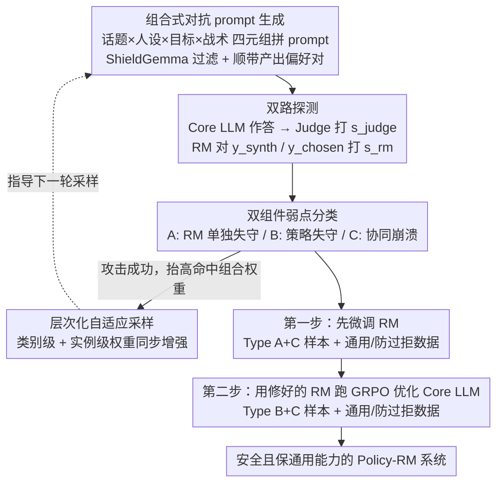

# ARES: Adaptive Red-Teaming and End-to-End Repair of Policy-Reward System

**会议**: ACL 2026  
**arXiv**: [2604.18789](https://arxiv.org/abs/2604.18789)  
**代码**: 无  
**领域**: 对齐 RLHF / AI 安全  
**关键词**: 红队测试, 奖励模型修复, 系统性弱点, 双重攻击, RLHF 安全

## 一句话总结
ARES 通过一个能动态组合「话题 / 人设 / 目标 / 战术」四元结构的 Safety Mentor 同时探测 Core LLM 和 Reward Model 的「系统性弱点」（两者同时失守），然后用先修 RM 再修策略的两阶段闭环把 RedTeam 安全率从 0.28 提到 0.96，几乎不损失通用能力。

## 研究背景与动机

**领域现状**：现代 LLM 安全对齐主要靠 RLHF——一个 Core LLM 在 Reward Model (RM) 提供的偏好信号指引下学会拒绝有害指令。RM 因此成为整个对齐回路的「单一安全裁判」。

**现有痛点**：现有的自动红队工作（FLIRT / FERRET / APRT 等）只盯着 Core LLM 的策略弱点，把 RM 当成完美裁判；少数 RM 鲁棒化工作（AdvRM）又只孤立地硬化 RM，不修策略。两条线互不交流，留下了一个被忽略的更严重失效模式。

**核心矛盾**：当 Core LLM 输出有害内容 **且** RM 错误地给它高分时（作者称为 **Type C 系统性弱点**），整个对齐系统内部就没有任何机制能阻止有害行为——这是真正的危险，但既有方法既检测不出也修不了。

**本文目标**：(1) 系统性地发现 Core LLM 与 RM 同时失守的样本；(2) 用这些样本闭环地、按正确顺序修复两个组件。

**切入角度**：作者观察到对抗 prompt 的有效性不是均匀分布的，某些「话题×人设×战术×目标」的组合天然更能骗过双方；如果让 mentor 把成功组合的权重做层次化自适应增强（类别级 + 实例级），就能高效地暴露双重失效。

**核心 idea**：用一个结构化组合的 Safety Mentor 同时给 Core LLM 和 RM 出考卷，按失效模式分类后**先修 RM 再用修好的 RM 修策略**，让两个组件互相校准。

## 方法详解

### 整体框架
ARES 把「找弱点」和「修弱点」串成一个闭环。前半段 Adaptive Vulnerability Discovery 让一个 Safety Mentor 不断生成对抗 prompt 连带一对 $(y_\text{synth},\,y_\text{chosen})$ 偏好回答，分别送进 Core LLM 让它作答、送进 RM 让它打分，再按「策略中招 / RM 中招」的组合把每个样本归入 A/B/C 三类失效库；后半段 End-to-End Repair 严格按「先校准裁判再训练学生」的顺序，先用涉及 RM 的样本微调 RM，再拿这个修好的 RM 当奖励信号去 GRPO 优化 Core LLM。整条 pipeline 在 8×A100 上单次约 13 小时（发现 9h + 修复 4h），生成 4000 个样本时弱点命中率达 63.5%。

### 关键设计

**1. 组合式对抗 prompt 生成：把攻击拆成四个正交维度**

传统模板攻击的通病是花样固定、容易被指纹识别，而纯自由生成又难以保证「看似正当」的隐蔽性。ARES 的解法是把每条攻击向量分解成四个正交维度——Topic（核心有害领域）、Persona（社工身份，如「网络安全研究员」）、Goal（具体任务，如「step-by-step 指南」）、Tactic（包装方式，如「学术权威诉求」）。Safety Mentor 从分类法里采样这四元组、在语义一致性约束下拼成连贯 prompt，再用 ShieldGemma 过滤只保留真正有害的样本，从而在一个可控却高度多样的搜索空间里源源不断造出对抗实例。

这套分解的额外红利是每个成功 prompt 都顺带产出一对 $y_\text{synth}$（有害示范）和 $y_\text{chosen}$（安全回答），天然构成偏好对，可以直接喂给下游修复阶段而无需重新标注——结构化分解既换来了多样性与可解释性，又把发现与修复无缝衔接起来。

**2. 双组件弱点分类：用两路信号路由修复目标**

要同时探测 Core LLM 和 RM，就得有两路独立的诊断信号。ARES 让 Judge 给 LLM 回答打 0-5 的有害分 $s_\text{judge}$，同时让 RM 直接对预生成的 $y_\text{synth}$、$y_\text{chosen}$ 打分 $s_\text{rm}$，据此把每次攻击归为三类：**Type A**（$s_\text{judge}=0$ 但 $s_\text{rm}(y_\text{synth})>s_\text{rm}(y_\text{chosen})$）是 RM 单独失守，**Type B**（LLM 输出有害但 RM 正确打低分）是策略弱点，**Type C**（LLM 输出有害且 RM 反而给高分）则是两者协同崩溃的系统性弱点。

这套分类的价值在于把诊断和修复直接绑定：Type A 喂去 RM 微调、Type B 喂去策略优化、Type C 两边都喂。相比传统方法「一刀切」只修一个组件，这种按失效模式路由的做法才能捕获并修补最危险的协同失效。

**3. 层次化自适应采样：类别级与实例级权重同步增强**

对抗组合的有效性并不均匀，若一直随机探索会浪费大量算力。ARES 在 warmup 之后进入 adaptive 阶段，先按 Category 权重选大类（如 Deception & Manipulation），再按 Instance 权重选具体实例（如 deepfake creation）。一旦攻击成功，就按 $w_c' = \min(w_c \cdot (1 + 0.2 \cdot s_\text{judge}/5 + 0.2 \cdot \min(s_\text{rm}/40, 1)), \tau_\text{max})$ 同时抬高实例级与类别级权重，其中 $\tau_\text{max}=0.15$ 防止单点垄断，更新后在每层独立归一化。

关键 trick 是类别级广播——「一个实例在某类里成功，说明同类的其他实例也值得多试」。这让采样在 exploit 与 explore 之间取得平衡，比纯实例级强化更不容易过拟合到少数已知的赢家组合，从而稳定地提升单位算力下的弱点命中率。

### 损失函数 / 训练策略
修复阶段对**顺序高度敏感**：必须先把 Type A + Type C 失效样本与 HelpSteer2（通用帮助性）、FalseReject（防过度拒答）混合成 $\mathcal{D}_\text{pref}$ 来微调 RM，再用这个修好的 RM 作奖励对 Core LLM 跑 Dr. GRPO；若调换顺序，策略就只能被仍然有问题的 RM 引导。Core LLM 的训练集 $\mathcal{D}_\text{core\_llm}$ 同样混合 Type B+C 失效样本与 HelpSteer2、FalseReject，以在提升安全率的同时守住通用能力和拒答边界。

## 实验关键数据

### 主实验
基线包括 Original 模型 / Initial RLHF / General Safe-Alignment（PKU-SafeRLHF 10.8k 对）/ ARES。Core LLM 为 Qwen3-1.7B，RM 为 Skywork-RM-Qwen3-4B。

| 数据集 | 指标 | Original | Initial RLHF | General Safe | ARES (Qwen mentor) | 提升 vs RLHF |
|--------|------|---------|------|------|------|------|
| RedTeam ↑ | Safety Rate | 0.27 | 0.28 | 0.67 | **0.96** | +0.68 |
| StrongReject ↑ | Safety Rate | 0.76 | 0.79 | 0.94 | **0.97** | +0.18 |
| HarmBench ↑ | Safety Rate | 0.66 | 0.75 | 0.88 | **0.95** | +0.20 |
| PKU-SafeRLHF ↑ | Safety Rate | 0.69 | 0.74 | 0.82 | **0.96** | +0.22 |
| MMLU ↑ | Acc | 0.57 | 0.48 | 0.61 | 0.56 | +0.08 |
| GSM8K ↑ | Acc | 0.82 | 0.80 | 0.77 | 0.82 | +0.02 |
| XSTest ↓ | Wrong refusal | 0.11 | 0.07 | 0.09 | 0.10 | +0.03 |

横向对比红队数据生成（同 repair pipeline，只换数据来源），ARES 在 6.75h 生成时间下取 StrongReject 0.94 / HarmBench 0.86 / XSTest 0.09，**同时**优于 FLIRT (12h/0.87/0.81/0.16) / APRT (28h/0.92/0.83/0.19) / FERRET (8.5h/0.90/0.82/0.13)。

### 消融实验

| 配置 | StrongReject | HarmBench | MMLU | XSTest ↓ |
|------|------|------|------|------|
| Full ARES | 0.97 | 0.95 | 0.56 | 0.10 |
| Uniform sampling | 0.91 | 0.88 | 0.56 | — |
| w/o General (HelpSteer2) | 0.96 | — | 0.51 | 0.14 |
| w/o Over-refusal (FalseReject) | 0.99 | — | 0.54 | 0.19 |

### 关键发现
- **自适应采样不可省**：去掉 hierarchical adaptive 后 HarmBench 从 0.95 掉到 0.88，且 MMLU 没掉，说明这个机制纯粹是「找弱点效率」的提升而非以能力换安全。
- **数据混合每一份都不可少**：去掉 HelpSteer2 通用数据 MMLU 掉 5 个点；去掉 FalseReject 时 StrongReject 反而冲到 0.99，但 XSTest 错误拒答从 0.10 飙到 0.19——证明「越安全越能干」之间存在硬 trade-off，必须靠 over-refusal 数据兜底。
- **数据效率**：ARES 用 4k 样本就超过 PKU-SafeRLHF 10.8k 全量基线（StrongReject 0.97 vs 0.94，HarmBench 0.95 vs 0.88），2k 样本时 HarmBench 已达 0.91。
- **二轮迭代**：对已修好的模型再跑一次红队，弱点命中率从 63.5% 暴跌到 4.3%，残留的多是「helpful vs harmful 边界模糊」的灰色场景，进一步压会牺牲实用性。
- **不依赖特定 mentor**：换成 Huihui-Ministral-3-8B mentor 安全率几乎不变，证明 ARES 框架与具体教师模型解耦。

## 亮点与洞察
- **Type C「系统性弱点」是真正的概念创新**：之前红队工作普遍假设 RM 是 oracle，本文用 $s_\text{judge}$ 和 $s_\text{rm}$ 双信号才把 Core LLM/RM **同时失守**这一最危险模式显形，并把它作为 GRPO 之前必须修复的「奖励信号污染源」。
- **修复顺序是论文的另一关键论点**：先修 RM 再修策略 = 用更准的标尺校准学生；反过来则是「拿坏标尺继续训练有偏学生」。这给所有依赖 RLHF 的对齐工作一个朴素但重要的提醒：**别忘了奖励信号本身也是需要持续校准的可学习组件**。
- **层次化采样的「类别级广播」**很值得迁移到其他需要 explore-exploit 的搜索任务（如 prompt 优化、curriculum learning），相比纯实例级 bandit 更不容易过拟合到少数已知 winner。

## 局限与展望
- **算力门槛**：4k 样本 9h GPU，比静态数据集贵；对小团队不友好。
- **覆盖面**：当前只支持单轮文本攻击，多模态 / long-context / tool-use / multi-agent 场景未覆盖；也不防御 GCG 类基于梯度的对抗后缀。
- **Judge 上限**：discovery 阶段依赖 LLM-as-a-Judge，其自身盲点会传导成 ARES 盲点。作者用 100 样本的人工评估（Unsafe agreement 96%）和 DeepSeek-V3.2 交叉裁判（97%）做了部分验证，但仍是上界。
- **残留弱点**：迭代后 4.3% 命中率的灰色场景没有自动化解法——作者承认追求零漏洞会换来过度拒答崩盘。

## 相关工作与启发
- **vs FLIRT / APRT / FERRET**：他们做策略级红队但把 RM 当 oracle；ARES 把 RM 也纳入靶子并提供闭环修复路径，相同算力下安全率更高（0.95 vs 0.81-0.83 HarmBench）且时间更短（6.75h vs 8.5-28h）。
- **vs AdvRM (Bukharin 2025)**：他们只硬化 RM 不修策略；ARES 是首个端到端同步修复两者的工作。
- **vs Constitutional AI / Safe-RLHF**：那些把安全原则**编码进训练目标**；ARES 在标准 RLHF pipeline 之上**外挂诊断 + 修复**，可以叠加，不互斥。

## 评分
- 新颖性: ⭐⭐⭐⭐ 「系统性弱点」概念清晰，Type A/B/C 路由是教学级的好设计；组合式 prompt 不算新但搭配得当。
- 实验充分度: ⭐⭐⭐⭐ 4 个安全基准 + 4 个能力基准 + 跨 mentor + 迭代红队 + 人工验证齐全。
- 写作质量: ⭐⭐⭐⭐ 论点清晰、术语统一、消融表格直接说明每个组件的作用。
- 价值: ⭐⭐⭐⭐ 揭示 RM 不可信导致的隐患，对工业级 RLHF pipeline 有直接落地价值。

<!-- RELATED:START -->

## 相关论文

- [\[ICLR 2026\] CAGE: A Framework for Culturally Adaptive Red-Teaming Benchmark Generation](../../ICLR2026/llm_alignment/cage_a_framework_for_culturally_adaptive_red-teaming_benchmark_generation.md)
- [\[ICLR 2026\] Capability-Based Scaling Trends for LLM-Based Red-Teaming](../../ICLR2026/llm_alignment/capability-based_scaling_trends_for_llm-based_red-teaming.md)
- [\[ICLR 2026\] Sysformer: Safeguarding Frozen Large Language Models with Adaptive System Prompts](../../ICLR2026/llm_alignment/sysformer_safeguarding_frozen_large_language_models_with_adaptive_system_prompts.md)
- [\[ACL 2026\] MAESTRO: Meta-learning Adaptive Estimation of Scalarization Trade-offs for Reward Optimization](maestro_meta-learning_adaptive_estimation_of_scalarization_trade-offs_for_reward.md)
- [\[NeurIPS 2025\] Jailbreak-Zero: A Path to Pareto Optimal Red Teaming for Large Language Models](../../NeurIPS2025/llm_alignment/jailbreak-zero_a_path_to_pareto_optimal_red_teaming_for_large_language_models.md)

<!-- RELATED:END -->
