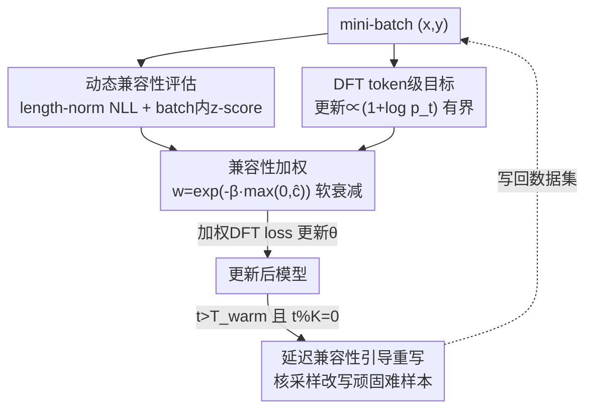

# Compatibility-Aware Dynamic Fine-Tuning for Large Language Models

**会议**: ACL 2026  
**arXiv**: [2606.11206](https://arxiv.org/abs/2606.11206)  
**代码**: 待确认  
**领域**: 对齐RLHF / LLM训练  
**关键词**: 监督微调, 梯度方差控制, 样本级兼容性, DFT, 冷启动RL

## 一句话总结
CADFT 在 token 级稳定化方法 DFT 的基础上，引入一个由模型自身似然算出的"样本级兼容性"信号去重加权监督梯度，再配一个延迟、低频的"兼容性引导重写"把顽固难学的样本改写成可学目标，从而在不引入任何奖励模型/RL 的前提下，把高方差梯度压下去，同时提升微调稳定性、泛化和冷启动 RL 初始化质量。

## 研究背景与动机

**领域现状**：监督微调（SFT）是把大模型对齐到下游任务和指令跟随行为的主流范式——在 teacher-forcing 下最大化专家示范的似然，简单、稳定、可扩展。

**现有痛点**：近期工作发现标准 SFT 有一个根本性的优化病理：从策略优化视角看，SFT 的梯度等价于一个被扭曲的目标，其中低概率 token 会诱导出不成比例的巨大梯度更新（梯度幅度与 $\pi_\theta(y_t|\cdot)$ 成反比）。这种"逆概率放大"导致梯度方差高、训练不稳、在分布漂移下的推理任务上泛化差。Dynamic Fine-Tuning（DFT）针对这一点，把 SFT 改写成概率感知目标，让更新正比于 $(1+\log p_t)$，在 $p_t\to 0$ 时保持有界，从而在 **token 级** 把病理放大中和掉。

**核心矛盾**：DFT 隐含假设数据集里**所有示范都同样适合作为学习目标**。但真实大规模指令数据高度异质——有些示范与模型当前的归纳偏置和能力相匹配，有些则过于复杂、结构混乱或语义错配。即使 token 级梯度稳定了，这种"示范-策略错配"仍会在 **样本级** 诱导高方差更新：模型被迫去记它当前根本无法可靠内化的模式。换句话说，DFT 只管了"每个 token 的梯度怎么缩放"，没管"哪些示范该对参数更新施加多大影响"。

**本文目标 + 切入角度**：作者主张稳定 SFT 不仅要控制 token 级梯度缩放，还要调控**样本级**的示范-策略兼容性。关键观察是：兼容性应该是一个**相对的、依赖当前模型状态**的量——用模型自己的似然来度量，而不是某种绝对难度。

**核心 idea**：用模型当前似然算出一个归一化的兼容性分，去**软加权** DFT 的样本级更新（压低不兼容样本的高方差梯度），并对持续不兼容的样本做保守的延迟重写，把它们投影回模型当前的"可行域"。整套方法仍是纯监督，不碰奖励模型、on-policy 采样或策略优化。

## 方法详解

### 整体框架
CADFT 的输入是一个指令-回复对数据集 $\mathcal{D}=\{(x,y)\}$ 和一个待微调的策略模型 $\pi_\theta$，输出是更稳定、泛化更好的微调模型。它在 DFT 的训练循环里插入三件事：每个 mini-batch 先**前向算兼容性分**（无梯度），再把分数在 batch 内**自适应归一化**得到 $\hat c$，然后用一个指数衰减权重 $w(\hat c)$ 去**缩放每个样本的 DFT loss**；训练进入后期后，周期性地挑出一小撮"持续不兼容"的样本做**延迟重写**。整条流水线下来，token 级稳定（DFT 负责）和样本级稳定（兼容性加权负责）被统一在一个纯监督框架里。

### 关键设计

**1. 动态兼容性评估：用模型自己的似然衡量"这条示范现在适不适合学"**

DFT 把所有示范一视同仁，但异质数据里有的示范对当前模型就是太难、太错配。CADFT 先给每个样本算一个**原始兼容性分**——长度归一化的负对数似然：

$$c_{\text{raw}}(x,y;\theta)=\frac{1}{|y|}\sum_{t=1}^{|y|}-\log\pi_\theta(y_t\mid x,y_{<t})$$

值越低代表越兼容（模型越"愿意"生成它）。但训练过程中 $c_{\text{raw}}$ 的绝对尺度会随模型变强而整体下移，固定阈值会失效。于是作者在**有效全局 mini-batch** $\mathcal{B}$ 内做自适应归一化：用 batch 的均值 $\mu_\mathcal{B}$ 和标准差 $\sigma_\mathcal{B}$（跨数据并行 worker 用 all-reduce 同步，保证与分片策略无关）做 z-score：

$$\hat c_i=\frac{c_{\text{raw}}(x_i,y_i)-\mu_\mathcal{B}}{\sigma_\mathcal{B}+\epsilon}$$

关键点在于 $\hat c$ 是**相对的、依赖模型状态**的：它衡量的是"相对于这一批其他样本，这条示范跟当前模型对不对得上"，而不是某种绝对难度。整个兼容性统计量从梯度图里 detach（stop-grad），只当权重用，不参与反传。

**2. 兼容性感知目标：把不兼容样本的梯度软软压下去，而不是一刀切丢掉**

有了归一化分 $\hat c_i$，CADFT 用一个软指数衰减权重去调制每个样本的监督强度：

$$w(\hat c_i)=\exp\!\big(-\beta\cdot\max(0,\hat c_i)\big)$$

其中 $\beta\ge 0$ 控制敏感度（实验取 $\beta=1.0$）。这个设计很讲究：对兼容性**不差于 batch 平均**（$\hat c_i\le 0$）的样本，权重恒为 1，保留全部监督信号；只对**比平均更差**（$\hat c_i>0$）的样本才逐步降权。于是最终目标是

$$\mathcal{L}_{\text{CADFT}}(\mathcal{B})=\frac{1}{|\mathcal{B}|}\sum_{(x,y)\in\mathcal{B}}w(\hat c(x,y))\cdot\mathcal{L}_{\text{DFT}}(x,y)$$

它和自步学习/课程学习精神相通：兼容性高的样本对参数更新影响更强，难/错配的样本被更保守地纳入。与 Focal Loss 等"强调难样本"的启发式正相反——CADFT 是要**削弱**难样本的影响来做方差校正，而不是去强化它们。理论上作者证明：在"不兼容样本梯度范数过大"这一常见假设下，加权后的二阶矩 $\mathbb{E}[\|\tilde g\|^2]$（$\tilde g_i=w(\hat c_i)g_i$）相对标准 DFT 被压低，因此 CADFT 是一个**方差受控的估计器**，靠语义兼容性而非任意范数裁剪来稳优化。

**3. 延迟兼容性引导重写：把顽固难学的样本投影回模型的可行域**

降权只是"少学一点"，但有些示范本身是**正确的、只是远超模型当前能力**，一直降权等于白白浪费这部分数据。CADFT 因此加了一个保守的延迟重写机制，分两阶段避免过早自我强化：**热身阶段**（$t<T_{\text{warm}}$，实验 3000 步）只用兼容性感知目标训练，先让模型获得稳定的指令跟随能力；**重写阶段**（$t\ge T_{\text{warm}}$）每隔 $K$ 步（实验 1000 步）挑出一小撮（每次约 0.5% 数据）**滑动平均兼容性持续很高**（即持续难学）的样本，以一定替换概率（0.5）把它们的原目标换成模型自己用核采样生成的版本：

$$\hat y\sim\text{NucleusSampling}(\pi_\theta(\cdot|x);p=0.9,T=0.7)$$

这等于把"过难的示范投影到模型当前的假设类里"，把高方差监督转成稳定但被简化的学习信号。低频 + 延迟 + 小比例 + 概率替换这几个保守设置，是为了防止模型陷入"只学自己说得出的东西"的自我强化退化。

### 损失函数 / 训练策略
核心目标即上面的 $\mathcal{L}_{\text{CADFT}}$。训练完全沿用 DFT 协议：相同的 batch size、优化器、学习率、训练步数。有效全局 batch size 为 256（数据并行同步 + 梯度累积）；归一化用 per-mini-batch z-score，$\epsilon=10^{-6}$，$\beta=1.0$。重写相关超参：$T_{\text{warm}}=3000$、$K=1000$、每次重写 0.5% 数据、替换概率 0.5、核采样 $p=0.9$/$T=0.7$。整个流程不引入任何 RL 组件。

## 实验关键数据

### 主实验
在数学推理（Math500 / Minerva / OlympiadBench / AIME24 / AMC23，Average@16）、代码生成（HumanEval/+ 与 MultiPL-E 九语言，pass@1）、多模态推理（MathVerse / MathVision / WeMath）上，CADFT 在所有 backbone 上都稳定超过 SFT 和 DFT。数学推理主结果（平均列）：

| Backbone | Base | w/ SFT | w/ DFT | w/ CADFT |
|----------|------|--------|--------|----------|
| LLaMA-3.2-3B | 1.19 | 3.24 | 4.65 | **5.40** |
| LLaMA-3.1-8B | 1.00 | 6.33 | 11.02 | **12.73** |
| DeepSeekMath-7B | 2.64 | 9.82 | 18.15 | **20.15** |
| Qwen2.5-Math-1.5B | 15.92 | 18.01 | 31.58 | **33.42** |
| Qwen2.5-Math-7B | 21.25 | 23.62 | 37.15 | **41.44** |

可以看到无论小模型还是 7B、无论通用还是数学专精 backbone，CADFT 都在已经很强的 DFT 之上再涨 1.8~4.3 个点（如 Qwen2.5-Math-7B 37.15 → 41.44）。单看 Math500 提升更明显（Qwen2.5-Math-7B 68.20 → 75.50）。

### 兼容性/重写的作用与适用范围

| 维度 | 现象 | 说明 |
|------|------|------|
| 样本级方差 | 低兼容性样本梯度范数过大 | 是高方差的主要来源，降权后二阶矩下降 |
| 加权 vs 丢弃 | 软衰减保留 $\hat c\le 0$ 全信号 | 只压 batch 内更差的样本，不一刀切 |
| 延迟重写 | 仅 $t\ge T_{\text{warm}}$ 低频小比例触发 | 防止过早自我强化退化 |
| 冷启动 RL | 作为 RL 初始化 | 比 SFT/DFT 初始化更好的下游 RL 起点 |

### 关键发现
- CADFT 的增益**在 DFT 之上叠加**：token 级稳定（DFT）和样本级稳定（兼容性加权）是正交且互补的两件事，统一后才同时压住两个层次的方差。
- 兼容性是**相对量**：z-score 归一化让信号随训练自适应，避免了"模型变强后绝对似然整体下移、固定阈值失效"的问题。
- 重写是双刃剑，必须保守：作者用热身 + 低频 + 小比例 + 概率替换四重约束，核心顾虑是模型只学自己生成得出来的简化目标会自我强化退化。

## 亮点与洞察
- **把 DFT 从 token 级"抬"到样本级**：同一套"方差受控"哲学，在两个粒度上各做一次，论证清晰且工程上几乎零额外成本（兼容性分就是一次无梯度前向）。
- **兼容性用模型自身似然定义、且做 batch 内归一化**：既避免了引入外部奖励模型，又解决了绝对似然随训练漂移的难题，是个可直接复用到任何 SFT/DFT 流程的 trick。
- **软加权 + 延迟重写的组合拳**：先"少学难样本"再"把顽固难样本改写成能学的"，比单纯丢弃数据更充分地利用了异质指令数据。
- 这套思路可迁移到知识蒸馏、课程学习、数据筛选等任何"示范质量异质"的监督场景——把"该不该学这条数据"变成一个依赖当前模型状态的连续权重。

## 局限与展望
- 重写依赖模型自采样，若 backbone 本身弱，改写出的目标质量存疑，可能把"难但正确"的监督简化成"易但平庸"，作者用低频小比例缓解但未根除。
- 兼容性归一化在 mini-batch 内做，batch 较小时统计量噪声大；论文用有效全局 batch 256 + all-reduce 同步缓解，但对极小 batch 场景的鲁棒性未充分讨论。
- $\beta$、$T_{\text{warm}}$、$K$、重写比例等超参较多，论文给了一组固定值但缺系统敏感性分析（⚠️ 部分超参取值以原文为准）。
- 理论方差缩减建立在"不兼容样本梯度范数过大"这一假设上，属"常见观察"而非严格证明。

## 相关工作与启发
- **vs DFT**：DFT 只在 token 级用模型概率重缩放梯度、修逆概率放大；CADFT 在其上加样本级兼容性加权，把方差控制扩展到"哪些示范该施加多大影响"，并补了延迟重写。本文是 DFT 的严格扩展。
- **vs Focal Loss**：Focal Loss 上调难样本权重去"强调难例"；CADFT 恰好相反，**下调**不兼容（难/错配）样本权重做方差校正——目标是稳定而非攻坚。
- **vs RLHF / DPO / GRPO**：这些都靠奖励模型或偏好数据引入 RL 信号；CADFT 全程纯监督、无奖励建模，却能给下游 RL 提供更好的冷启动初始化。
- **vs 课程学习 / 知识蒸馏中的样本降权**：精神相通（监督有效性取决于样本难度与模型能力的对齐），但 CADFT 把它落到一个 batch 内归一化、可微调权重的统一目标里，且首次与 token 级稳定统一。

## 评分
- 新颖性: ⭐⭐⭐⭐ 把 DFT 的方差控制从 token 级干净地推广到样本级，并补上延迟重写，扩展明确但属顺势而为
- 实验充分度: ⭐⭐⭐⭐ 覆盖数学/代码/多模态多 backbone 多尺度，稳定超 DFT；超参敏感性与重写质量分析略欠
- 写作质量: ⭐⭐⭐⭐ 动机-方法-理论链条清晰，公式与算法完整
- 价值: ⭐⭐⭐⭐ 纯监督、零额外成本、可直接叠加在 DFT 流程上，且利好冷启动 RL，落地性强

<!-- RELATED:START -->

## 相关论文

- [\[ACL 2026\] Why Supervised Fine-Tuning Fails to Learn: A Systematic Study of Incomplete Learning in Large Language Models](why_supervised_fine-tuning_fails_to_learn_a_systematic_study_of_incomplete_learn.md)
- [\[ACL 2026\] Mitigating Selection Bias in Large Language Models via Permutation-Aware GRPO](mitigating_selection_bias_in_large_language_models_via_permutation-aware_grpo.md)
- [\[CVPR 2026\] Uncertainty-Aware Exploratory Direct Preference Optimization for Multimodal Large Language Models](../../CVPR2026/llm_alignment/uncertainty-aware_exploratory_direct_preference_optimization_for_multimodal_larg.md)
- [\[ACL 2026\] S2H-DPO: Hardness-Aware Preference Optimization for Vision-Language Models](s2h-dpo_hardness-aware_preference_optimization_for_vision-language_models.md)
- [\[ACL 2026\] Large Language Models Are Overconfident in Their Own Responses](large_language_models_are_overconfident_in_their_own_responses.md)

<!-- RELATED:END -->
