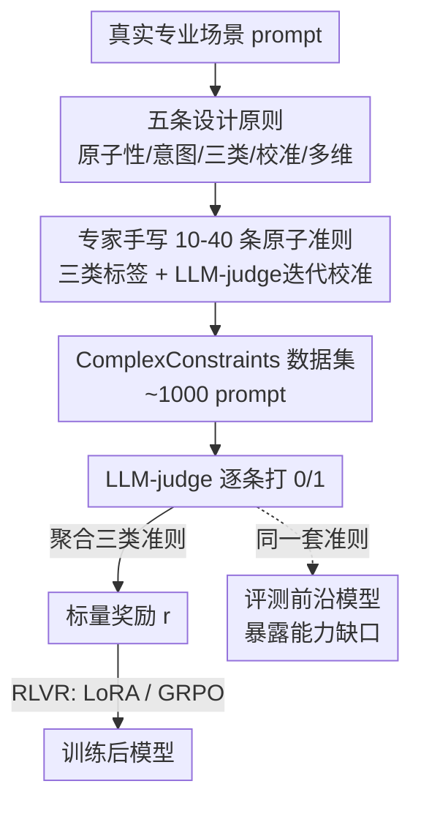

# ComplexConstraints and Beyond: Expert Rubrics for RLVR

**会议**: ACL 2026  
**arXiv**: [2606.09118](https://arxiv.org/abs/2606.09118)  
**代码**: 待确认  
**领域**: 对齐RLHF / RLVR奖励设计  
**关键词**: 专家评分量表, RLVR, 指令跟随, 可验证奖励, Agent评测

## 一句话总结
这篇论文系统论证了"专家手写的细粒度评分量表（rubric）"既是更靠谱的前沿大模型评测工具，也是数据高效的 RLVR 奖励信号：它先给出构造高质量 rubric 的五条设计原则，配套放出每条 prompt 带 10–40 条原子准则的 ComplexConstraints 数据集，然后实证只用约 1000 条专家样本做 RLVR，就能让 4B 模型指令跟随涨 +15.5 pp、235B 涨 +12.2 pp，且单 epoch 的 agentic 训练能迁移到模型从没训过的 OOD benchmark（BFCL +4.5 / τ²-Bench +7.4 / Toolathlon +6.8 pp）。

## 研究背景与动机

**领域现状**：指令跟随评测一路从 IFEval 的"程序化可验证约束"（25 种字数/禁用字符/格式规则，能脚本自动判）发展到 ComplexBench 的层级约束分类，再到 AdvancedIF 的专家手写 rubric。RLVR（可验证奖励的强化学习）被 DeepSeek-R1 带火、Tülu 3 开源推广，并已被尝试用 rubric 奖励扩展到指令跟随。

**现有痛点**：传统 benchmark 正在饱和、被数据污染侵蚀可信度，更根本的是它们测的东西和真实部署需求错位。IFEval 把这个问题暴露得淋漓尽致——它的程序化可验证性是用**构念效度**换来的：一个模型可以输出语无伦次的废话，只要它不用逗号、不出现字母"c"，照样能通过。benchmark 反而围着评测方法塑形，而不是围着它声称要测的能力塑形。

**核心矛盾**：评测准则越有表达力（越能区分模型能力），就越难被可靠地自动化。程序化检查能自动跑但抓不住"语用意图""上下文依赖行为"这些真实任务的核心；专家 rubric 能抓住却难自动化。

**本文目标**：把"专家手写 rubric"这条路彻底讲清——既论证它作为评测工具更有效，又论证**同一套 rubric 可以直接当 RLVR 的奖励信号**来训模型；为此要给出可操作的构造原则、放出数据集、并拿出跨指令跟随和 agentic 两域的实证。

**切入角度 + 核心 idea**：作者主张让领域专家把"任务成功"分解成**原子化、可验证**的准则，每条 prompt 配 10–40 条，由 LLM-judge 逐条打 0/1。这种密集 rubric 一举两得：作评测时给出"满足了哪几条/差哪几条"的细粒度诊断；作 RLVR 奖励时，密集准则天然提供**连续的奖励梯度**（满足 28/30 条 vs 15/30 条得分明显不同），credit assignment 比二元 pass/fail 精确得多。一句话：rubric 丰富到能评测前沿模型，就丰富到能训练它们。

## 方法详解

### 整体框架
全文不是提一个新模型，而是提一套"专家 rubric → 评测 + RLVR 奖励"的方法论 + 数据集 + 实证。输入是一条真实专业场景的 prompt，专家按五条设计原则把"任务成功"拆成 10–40 条带类别标签（Primary Intent / Extra Credit / Dodged Bullet）的原子准则，每条经 LLM-judge 迭代校准；这些准则一方面用来评测前沿模型（暴露能力缺口），另一方面被聚合成一个标量奖励 $r$ 喂给 RLVR（指令跟随用 LoRA，agentic 用 GRPO）。

### 关键设计

**1. 五条专家 rubric 设计原则：让 rubric 既测得准又训得动**

这是全文方法的内核，五条原则环环相扣。**① 最大可行原子性（Maximum Viable Atomicity）**：每条准则应对应 prompt"最小有意义单元"，而非机械地拆到不能再拆。举例：C7 和弦应含 C/E/G/B♭，若把每个音独立判，一个答 C/E/G/B♮（其实是完全不同的 Cmaj7 和弦）的回答会拿到 75% 分——这在 RL 里会给"根本错的回答"奖励、产生误导性梯度。**② 意图感知（Intent-Aware）**：准则要反映用户的语用意图而非字面措辞；作者要求标注者先看多个模型回复、用自己的话写出用户意图（既写"what"也写"why"）。比如用户说"想提升西班牙语"但提到已在读西语经济学文章，字面 rubric 会奖励初级词汇表，意图感知 rubric 则奖励进阶课程——在 RL 里前者等于教模型"重表面措辞、轻语用意图"。**③ 三类准则分类法（见设计 2）**。**④ LLM-judge 迭代校准（见设计 3）**。**⑤ 领域扎根的任务复杂度**：agentic 任务的 rubric 沿真实职业工作流多维分解，在 CoreCraft 里分 completeness / correctness / constraint satisfaction / format compliance 四类，给 RL 优化器**逐准则的稠密反馈**，让它定位并修正具体失败模式，而非把任务失败当成一个铁板一块的信号。

**2. 三类准则分类法：用不对称加权把"该满足/该加分/该避坑"分开**

把所有准则一视同仁会丢失信息。作者按准则与用户体验的关系分三类（内部叫法对应"标准/奖励/只罚"）。**Primary Intent**：直接源于 prompt、用户预期被满足的要求，构成多数准则、是奖励信号主来源。**Extra Credit（只奖不罚）**：未被要求但能提升体验的元素（如历史价格旁附通胀调整后数字），不满足不罚、满足则加分。**Dodged Bullet（只罚不奖）**：检查回答有没有避开用户可能没意识到的常见误区，违反则罚、满足不奖。这种不对称加权直接编码进 RLVR 奖励函数：给定 rubric $C=C_{\text{PI}}\cup C_{\text{EC}}\cup C_{\text{DB}}$ 和 LLM-judge 给的逐条满足判断 $s_c\in\{0,1\}$，

$$r=\frac{1}{|C_{\text{PI}}|}\sum_{c\in C_{\text{PI}}}s_c+\alpha\frac{1}{|C_{\text{EC}}|}\sum_{c\in C_{\text{EC}}}s_c-\beta\frac{1}{|C_{\text{DB}}|}\sum_{c\in C_{\text{DB}}}(1-s_c)$$

其中 $\alpha,\beta\ge 0$ 缩放奖励项与惩罚项，空准则集的项定义为 0。当 $\alpha=\beta=0$ 时奖励退化为 Primary Intent 满足比例；不对称结构让 Extra Credit 满足才加分、Dodged Bullet 违反才扣分。相比二元任务成败，它给"部分满足"也给信用，形成围绕回答质量和可避免错误塑形的**稠密学习信号**。

**3. LLM-judge 迭代校准：把准则措辞打磨到人和 judge 都不会误判**

由于 rubric 在评测和 RL 训练时都靠 LLM-judge 逐条判，准则语言必须人和 judge 都能一致解读。每条准则走一个迭代验证流程：作者起草准则并对参考回答打分 → LLM verifier 评估 → 诊断并通过改写准则措辞消解分歧 → 作者再把参考回答改成应触发相反判断的版本，验证 verifier 能跟着翻转。这个流程能暴露微妙歧义，比如"避免头韵（alliteration）"会让 verifier 把"his heart"误标为头韵，改写成"诗歌头韵（重复词首重读辅音）"即可在保意图的前提下消除分歧。对 RL 而言这一步至关重要：模糊准则会往奖励信号里注入噪声，引发 reward hacking 或不稳定的训练动态。论文还专门监控了两类 reward hacking（口头满足准则而无实质内容、利用 judge 的冗长偏好），并用"judge 模型与策略模型不同"进一步限制共享表征漏洞。

### 一个完整示例
以"提升西班牙语"那条 prompt 走一遍：专家先看几份模型回复，写出真实意图——"用户已在读西语经济学文章，要的是进阶、领域化的提升"。于是写出 Primary Intent 准则如"推荐进阶西语课程""建议经济学相关西语阅读"，Extra Credit 如"用西语进行讨论式课堂"，Dodged Bullet 如"不要把用户当初学者推基础词汇表"。LLM-judge 对某回答逐条判：满足进阶课程（+1/|PI|）、推了基础词汇表（触发 Dodged Bullet 惩罚 −β/|DB|）。最终 $r$ 不是非黑即白，而是把"对了几条、踩了哪个坑、有没有惊喜"全揉进一个连续标量——RL 优化器据此知道**具体哪里该改**，而不是只知道"这题失败了"。

## 实验关键数据

### 主实验：rubric 当奖励信号的训练效果
指令跟随用 ComplexConstraints（约 900 条训练样本、LoRA），agentic 用 CoreCraft（GRPO、每 prompt 16 rollouts、judge 为 GPT-5-mini）。

| 设置 | 模型/benchmark | Base | Trained | Δ |
|------|----------------|------|---------|------|
| 指令跟随（in-dist） | Qwen3-4B 每条准则通过率 | 57.9% | 73.4% | +15.5 pp |
| 指令跟随（in-dist） | Qwen3-235B 每条准则通过率 | 73.9% | 86.1% | +12.2 pp |
| 迁移 AdvancedIF | Qwen3-4B Overall | 28.2% | 36.6% | +8.5 pp |
| 迁移 AdvancedIF | Qwen3-4B System Steerability | 22.5% | 34.9% | +12.4 pp |
| agentic OOD | GLM 4.6 BFCL Parallel | 91.0% | 95.5% | +4.5 pp |
| agentic OOD | GLM 4.6 τ²-Bench Retail | 68.7% | 76.1% | +7.4 pp |
| agentic OOD | GLM 4.6 Toolathlon Pass@1 | 18.8% | 25.6% | +6.8 pp |

两个亮眼的现象：训练后的 4B 模型（73.4%）逼近 50× 大的 235B 基线（73.9%）；ComplexConstraints **只含单轮数据**，却让多轮上下文（+7.1 pp）和系统可控性（+12.4 pp）都涨——作者推测"同时满足 10–40 条约束"练出的约束跟踪能力迁移到了跨轮指令保持。

### 评测侧：rubric 暴露能力缺口

| benchmark | 指标 | 最强前沿模型 | 说明 |
|-----------|------|--------------|------|
| ComplexConstraints | Perfect Task %（全准则满足） | GPT-5.1 仅 16.55% | 弱模型 <5%，难度天然来自约束相乘 |
| CoreCraft | Task Pass % | GPT-5.2 仅 42.6% | 最强模型也解不到一半 agentic 任务 |

密集 rubric 的价值在于：一个 20 准则的任务要全满足，每条小失败概率会相乘放大，因此 Perfect Task 率很低；但这恰好在部分对/全对之间制造了**连续梯度**，给 RL 比二元 pass/fail 丰富得多的奖励地形。

### 关键发现
- **数据高效**：约 1000 条专家样本就在独立编写的 AdvancedIF 上拿到 8.45% 提升，高于 RIFL 用合成 rubric 的 6.7%（非严格可比，但与"专家 rubric 提供异常稠密且可泛化监督"一致），呼应"表面对齐假设"——训练分布卡在能力前沿时，少量高质量数据就够。
- **跨域迁移**：CoreCraft（客服域）训出的能力迁到 Toolathlon（K8s 管理、Canvas 评分、数据库同步）这种差异极大的长程工具任务，且 Pass³（三次独立运行全过的可靠性变体）从 9.3% 近乎翻倍到 17.6%——训的不只是峰值能力还有可靠性。
- **三大有效性来源**：rubric 粒度带来的稠密奖励（10–40 条精确 credit assignment）、专家校准的最优任务难度（卡在 17%/43% 的"信息最丰富"区间）、专家策展的数据效率。

## 亮点与洞察
- **"评测即训练"的双重红利**：同一套专家 rubric 既是更有效度的评测仪器又是数据高效的 RL 奖励，论文用两域实证把这个观点钉死，方法论可直接复用。
- **三类准则不对称奖励函数**：用一个简洁公式把"该满足/锦上添花/避坑"编码进 RLVR 奖励，比统一打分更细腻，是可迁移到任何 rubric-based RL 的设计。
- **IFEval 的"避逗号也能通过"反例**极具说服力地点出程序化评测的构念效度问题，是支撑全文动机的好故事。
- **Agentic 能力分层（5 级）**：从工具调用→规划→适应→扎根→常识推理，给 rubric 准则提供了"该往哪个能力层级设计"的结构，让 RL 反馈更局部化。

## 局限与展望
- **单种子、单轮**：指令跟随结果是单种子训练，作者明确未量化种子间方差，建议看 Δ 的量级而非精确值；ComplexConstraints 全是单轮，多轮收益靠迁移推测、机制未受控验证。
- **专家成本高**：手写 10–40 条原子准则、双人复审、迭代校准的人力成本不低，是该范式规模化的主要瓶颈（论文也提到 RubricRAG 等用检索/合成降本的并行工作）。
- **judge 依赖**：奖励信号质量受 LLM-judge 影响，虽用迭代校准 + judge≠policy 缓解 reward hacking，但 judge 偏差仍是潜在噪声源。
- **可比性 caveat**：与 RIFL 等的对比因 base 模型和管线不同属"启发性而非受控"，不应过度解读绝对数值。

## 相关工作与启发
- **vs IFEval / FollowBench / ComplexBench**：它们走程序化可验证或层级约束路线；本文走专家手写原子 rubric，明确为换取构念效度而牺牲全自动化，且额外让 rubric 兼作训练信号。
- **vs AdvancedIF / HealthBench**：同为专家 rubric，但本文从一开始就为"评测 + RLVR 双用途"设计，并把指令跟随高约束密度（10–40 条/prompt）补进这条线。
- **vs RIFL / VerIF / RLCF / ToolRL**：这些用 rubric 做 RL 奖励但多依赖合成/规则 rubric 或微调 verifier；本文强调**专家手写**能捕捉合成 rubric 漏掉的语用意图，并系统化出五原则。
- **vs RubricRAG（并行工作）**：RubricRAG 靠检索领域知识在推理时生成 query-specific rubric 降人力成本；本文恰相反，主张专家手写以保意图保真，二者在"作者身份 × 用途"二维上互补。

## 评分
- 新颖性: ⭐⭐⭐⭐ "同一套专家 rubric 评测+训练双用"的论证清晰，但 rubric-based RLVR 本身是活跃方向，更多是系统化与高质量实证
- 实验充分度: ⭐⭐⭐⭐ 跨指令跟随/agentic 两域、多模型、含 OOD 迁移与可靠性指标；但单种子、缺方差量化
- 写作质量: ⭐⭐⭐⭐⭐ 五原则结构清楚、IFEval 反例与各类举例极具说服力，奖励函数与三类法讲得透
- 价值: ⭐⭐⭐⭐⭐ 给出可操作原则 + 公开数据集 + 强迁移实证，对做 RLVR 奖励设计与前沿评测都很实用

<!-- RELATED:START -->

## 相关论文

- [\[ICML 2026\] SFT Overtraining Predicts Rank Inversion via Entropy Collapse Under RLVR](../../ICML2026/llm_alignment/sft_overtraining_predicts_rank_inversion_via_entropy_collapse_under_rlvr.md)
- [\[ICLR 2026\] Beyond Pairwise: Empowering LLM Alignment With Ranked Choice Modeling](../../ICLR2026/llm_alignment/beyond_pairwise_empowering_llm_alignment_with_ranked_choice_modeling.md)
- [\[ICLR 2026\] Beyond RLHF and NLHF: Population-Proportional Alignment under an Axiomatic Framework](../../ICLR2026/llm_alignment/beyond_rlhf_and_nlhf_population-proportional_alignment_under_an_axiomatic_framew.md)
- [\[ICLR 2026\] Beyond Binary Preferences: A Principled Framework for Reward Modeling with Ordinal Feedback](../../ICLR2026/llm_alignment/beyond_binary_preferences_a_principled_framework_for_reward_modeling_with_ordina.md)
- [\[ICML 2026\] Steering Beyond the Support: Adversarial Training on Unsupervised Jailbroken Activation Simulation](../../ICML2026/llm_alignment/steering_beyond_the_support_adversarial_training_on_unsupervised_jailbroken_acti.md)

<!-- RELATED:END -->
