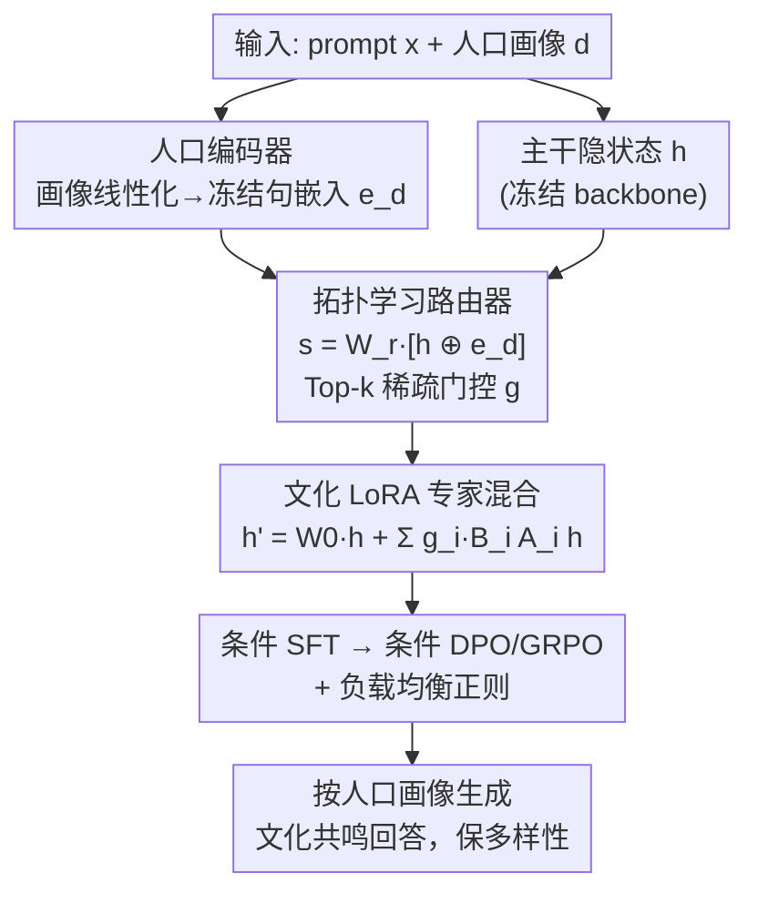

# CuMA: Aligning LLMs with Sparse Cultural Values via Demographic-Aware Mixture of Adapters

**会议**: ACL 2026  
**arXiv**: [2601.04885](https://arxiv.org/abs/2601.04885)  
**代码**: https://github.com/Throll/CuMA  
**领域**: 对齐RLHF / 文化多元对齐  
**关键词**: 文化对齐, 价值多元, 混合专家, LoRA, 人口画像路由

## 一句话总结
CuMA 指出稠密模型在拟合相互冲突的文化价值时会"均值坍塌"成谁都不像的稀泥，于是用"人口画像 + 语义"联合路由的 LoRA 专家混合，把冲突梯度拆进各自的专家子空间，从而在多个文化对齐基准上既提精度又保留价值多样性。

## 研究背景与动机
**领域现状**：LLM 的对齐主流是 RLHF——用一个单一奖励模型刻画人类偏好。这套范式在"有共识"的任务上很好用：安全合规、代码、数学，这些地方存在一个全局最优答案。

**现有痛点**：但 LLM 面向全球用户，价值类问题往往**没有共识**——一个在某社区被视为深刻的回答，在另一社区可能毫无意义。现有方法用一套稠密参数去拟合这些相互冲突的价值分布，隐含假设了统一价值体系。当模型要在冲突模式间最小化总误差时，它会滑向统计平均，作者称之为 **Mean Collapse（均值坍塌）**：把分歧的价值压成一个主导表示，抹掉少数群体视角。更糟的是这个"平均"并不中立——预训练语料和标注者同质化让它往往偏向 WEIRD（西方、受教育、工业化、富裕、民主）规范。

**核心矛盾**：作者把根因归结为**梯度干涉**。人类价值本质上是**稀疏**的——聚成一个个相互冲突的离散模式，而非连续光谱（论文称之为 **Cultural Sparsity 文化稀疏性**）。一套稠密参数几何上无法同时覆盖这些不相交的模式，只能收敛到"被稀释的中间"。

**本文目标**：把文化对齐重新表述为一个**条件容量分离**问题——不再用一套参数硬塞所有冲突价值，而是按"谁在问"把容量分配到专门的子空间。

**切入角度**：标准 MoE 只看内部隐状态（语义内容）路由，区分不了"相似上下文里相互冲突的偏好"。作者的洞察是：文化差异由**语义 + 人口画像**两类代理共同驱动，因此路由必须同时看"问什么"和"谁在问"。

**核心 idea**：CuMA（Cultural Mixture of Adapters）——用**人口画像感知路由**把 LoRA 专家混合起来，让模型学到一张"潜在文化拓扑图"，把冲突梯度显式解耦进各自的专家，从而避免均值坍塌、保住文化多样性。

## 方法详解

### 整体框架
CuMA 冻结 backbone，在其上挂一组 LoRA 专家，核心是把"该激活哪些专家"这件事**同时**条件化在语义隐状态 $h$ 和用户人口画像 $e_d$ 上。流程是：把结构化的人口画像（国家/宗教/年龄等）线性化成自然语言，过一个**冻结**的句嵌入模型得到 $e_d$；路由器把 $h$ 与 $e_d$ 拼接算路由 logits，Top-$k$ 稀疏激活；被选中的 LoRA 专家按门控权重加权，给冻结主干打一个"随人口画像变化"的低秩增量。这样"问什么"由 $h$ 决定、"谁在问"由 $e_d$ 决定，冲突的文化模式被导向不同的专家子集，梯度被结构性隔离。训练上用条件 SFT 打底，有偏好标注时再叠条件偏好优化（DPO/GRPO），外加一个负载均衡正则。

### 关键设计

**1. 文化稀疏性与均值坍塌：给"对齐为什么失败"一个几何刻画**

这是全篇的理论地基，把模糊的"模型回答太平庸"变成可证的几何命题。**文化稀疏性**定义为：两个人口群体的价值分布中心间的 Mahalanobis 距离远超表示空间维度 $m$，即 $(\mu_i-\mu_j)^{\top}\bar{\Sigma}_{ij}^{-1}(\mu_i-\mu_j)\gg m$，意味着群间分歧主导群内离散，分布是多峰、不相交的。在此前提下，作者证明 **Mean Collapse 定理**：稠密估计器（单分量指数族，如高斯）在最小化前向 KL $D_{KL}(P_{data}\parallel P_\theta)$ 时，其最优均值参数 $\mu_\theta^*=\mathbb{E}_{P_{data}}[y]$ 严格收敛到全局混合均值——也就是把概率质量堆在"被稀释的中间"，统计上最小化全局误差，却抓不住价值的多元性。这条理论直接解释了为什么单纯加参数、加数据救不了稠密模型：根子在参数共享导致的梯度干涉，必须靠**条件路由**做容量分离才能解。

**2. 人口画像编码器：借冻结句嵌入空间获得可泛化的文化拓扑先验**

要让路由"看人下菜"，先得把人口画像编码成稳定可比的向量。作者不从头学 embedding，而是把结构化画像（如 `{Country: Thailand, Religion: Buddhism, Age: 55}`）线性化成一句自然语言描述 $t_d$（"一位 55 岁、信仰佛教、居住泰国的人"），再过一个**冻结**的预训练句嵌入模型 $E(\cdot)$ 得到 $e_d=E(t_d)$。用冻结空间的好处是保住了预训练里的语义拓扑——地理、宗教相近的群体天然聚到一起，给路由器提供稳定的相似度信号，从而能**泛化到训练时没见过的人口群体**。这是把"文化先验"从外部嵌入空间引进来、而不是从对齐数据里硬学的巧思。

**3. 拓扑学习路由器：把路由条件化在"语义 + 画像"的联合表示上**

普通 MoE 路由器只吃隐状态 $h$，在相似上下文里区分不了冲突偏好。CuMA 的路由器把层输入 $h$ 与画像 $e_d$ **拼接**后算 logits：$s=W_r\cdot[h\oplus e_d]$，再用 Top-$k$ 稀疏 softmax 得门控 $g_i=\frac{\exp(s_i)\cdot\mathbb{1}[i\in\text{Top-}k(s)]}{\sum_j \exp(s_j)\cdot\mathbb{1}[j\in\text{Top-}k(s)]}$。这一拼接让路由器能把"问什么"（$h$）和"谁在问"（$e_d$）解耦，$W_r$ 里学到的就是那张潜在文化拓扑图——它把分歧的文化模式导向不同的专家子集，从而在参数层面隔离冲突梯度、防止干涉。这正是"语义路由不够、必须显式人口条件化"这一核心论点的落地。

**4. 文化 LoRA 专家混合：用低秩专家实现"随画像而变"的参数增量**

为了细粒度适配又不毁掉通用推理，CuMA 冻结主干 $W_0$，把专家池实例化成 $N$ 个 LoRA 模块 $\{(A_i,B_i)\}$（选 LoRA 是因其大规模微调下的稳定与高效）。前向时按稀疏门控加权：$h'=W_0 h+\sum_{i=1}^N g_i\cdot(B_i A_i h)$，等价于构造了一个**依赖人口画像**的增量 $\Delta W(d)=\sum g_i(d)B_i A_i$。冲突的文化价值因此被不同的参数组合处理，从机制上掐断造成均值坍塌的梯度干涉。训练目标 $\mathcal{L}=\mathcal{L}_{task}+\lambda_{lb}\mathcal{L}_{lb}$，$\mathcal{L}_{task}$ 按训练阶段在 SFT/DPO/GRPO 间切换，$\mathcal{L}_{lb}$ 是负载均衡正则防专家塌缩。

### 损失函数 / 训练策略
两 backbone：Llama-3.1-8B-Instruct 与 Qwen3-8B；人口编码器用冻结的 Qwen3-Embedding-0.6B。专家数 $N=8$、Top-$k=2$，LoRA 秩 $r=8/64$。AdamW + 余弦衰减。训练分阶段：条件 SFT 建立基础对齐，有偏好数据时再用条件 DPO 或 GRPO 精修。

## 实验关键数据

### 主实验
在 WorldValuesBench(WVB)、Community Alignment(CA)、PRISM 三个基准上（10:1 训练/测试切分），CuMA 在两个 backbone 上都拿到 SOTA。下表为 Llama-3.1-8B 部分代表结果（WVB 用 Acc/Macro-F1/EMD，CA 用 Acc/Macro-F1，生成任务用对 base 的胜率）：

| 类别 / 方法 | 可训参数 | WVB Acc↑ | WVB EMD↓ | CA Acc↑ | CA 生成胜率(GRPO) |
|---|---|---|---|---|---|
| Vanilla Baseline | 0% | 32.42 | 0.3967 | 26.70 | - |
| Full Fine-Tuning | 100% | 45.25 | 0.2205 | 45.15 | 65.2% |
| LoRA | 0.37% | 34.30 | 0.2537 | 38.53 | 62.1% |
| MixLoRA (语义路由) | 3.01% | 45.20 | 0.2440 | 46.80 | 68.2% |
| HydraLoRA (语义路由) | 2.31% | 46.50 | 0.2350 | 47.90 | 69.5% |
| **CuMA (r=8)** | 1.53% | 48.90 | 0.1903 | 50.12 | 73.8% |
| **CuMA (r=64)** | 4.15% | **50.46** | **0.1870** | **52.45** | **74.5%** |

三个观察：一是稠密方法有明显天花板，连 100% 参数的 FFT（45.25 Acc）也落后 CuMA（50.46），印证"一刀切"参数化被梯度干涉卡住；二是 CuMA 的低秩版（$r=8$，1.53% 参数）就超过更大的 HydraLoRA（2.31% 参数），说明**路由精度比参数规模更重要**；三是语义路由 MoE 出现"高 Acc、高 EMD"的刻板印象现象（MixLoRA/HydraLoRA EMD 约 0.24 vs CuMA 0.19），即只猜中众数却没建出价值的概率分布形状。

### 消融 / 跨 backbone
Qwen3-8B 上结论一致，CuMA(r=64) 把 CA Acc 推到 57.20、生成胜率 78.2%、PRISM 76.8%，远超稠密 baseline（≈65%）。

| 配置 (Qwen3) | WVB Acc | WVB EMD | CA Acc | CA 胜率(GRPO) |
|---|---|---|---|---|
| HydraLoRA(语义路由) | 45.36 | 0.2793 | 52.80 | 73.6% |
| CuMA (r=8) | 49.02 | 0.1980 | 55.40 | 76.5% |
| CuMA (r=64) | **50.64** | **0.1876** | **57.20** | **78.2%** |

### 关键发现
- **EMD 是分辨"对齐"与"刻板"的关键指标**：Acc 高不代表对齐好，CuMA 显著更低的 EMD（Wasserstein-1 距离）说明它建出了人类价值分布的形状，而非记住众数。
- **人口条件化是必要的，不是锦上添花**：同为稀疏 MoE，只看语义的 MixLoRA/HydraLoRA 救不了文化冲突，加上人口路由后精度与多样性同时改善。
- **缓解均值坍塌可量化**：作者用预测熵（WVB）和 Distinct-2（CA 生成/PRISM）诊断坍塌，CuMA 在保留生成多样性上明显优于稠密模型。
- **可泛化到未见群体**：冻结句嵌入空间提供的稳定拓扑，让路由器对训练时没见过的人口画像也能给出合理的专家分配。

## 亮点与洞察
- **把"对齐失败"做成几何定理**：用文化稀疏性 + Mean Collapse 定理，把"模型回答太平庸"从经验吐槽升级为可证命题，根因落到梯度干涉，干净有力。
- **路由条件化 = 谁在问 + 问什么**：在 MoE 路由里显式注入人口画像，是个简单却切中要害的改动，直接解决语义路由分不清相似上下文里冲突偏好的问题。
- **借冻结嵌入空间拿文化先验**：不从对齐数据硬学画像表示，而是复用预训练句嵌入的语义拓扑，既稳又能泛化到未见群体，思路可迁移到任何需要"群体条件化"的对齐场景。
- **用 EMD 衡量对齐**：跳出"只看 Acc"的惯性，强调分布层面的保真度，对多元价值对齐的评测范式是个有益提醒。

## 局限与展望
- **依赖可得且准确的人口画像**：方法的前提是有结构化人口属性，真实部署中画像可能缺失、噪声大或涉及隐私敏感，论文未深入讨论这点。
- **人口画像的伦理风险**：按"谁在问"分配回答，若画像被滥用可能强化群体刻板印象或被用于操纵，需要配套治理。
- **文化由人口代理近似**：把文化等同于国家/宗教/年龄等可观测代理是一种简化，个体内部的价值异质性可能被忽略。
- **专家数与 Top-k 的选择**：$N=8$、Top-$k=2$ 的设定对文化模式数量是否够用、如何随覆盖文化扩展，缺少系统性敏感性分析。

## 相关工作与启发
- **vs 稠密对齐（RLHF/FFT/LoRA/DoRA）**：它们用一套全局参数拟合冲突价值，结构上必然均值坍塌；CuMA 用条件容量分离把冲突拆进不同专家，绕开干涉。
- **vs 语义路由 MoE（MixLoRA / HydraLoRA）**：同样稀疏激活，但只看隐状态路由，分不清相似语境下的文化冲突；CuMA 加入人口画像条件，精度与 EMD 双双更优、且参数更省。
- **vs 推理期方法（Persona Prompting / Prompt Steering）**：靠提示词或少样本引导、不更新参数，增益有限（胜率约 55-59%）；CuMA 通过训练把文化拓扑内化进参数，胜率显著更高。

## 评分
- 新颖性: ⭐⭐⭐⭐⭐ 把文化对齐重述为条件容量分离、并用人口路由的 MoE-LoRA 落地，理论与方法都新。
- 实验充分度: ⭐⭐⭐⭐⭐ 三基准 × 两 backbone × 三类 baseline，外加均值坍塌诊断与泛化分析，论证扎实。
- 写作质量: ⭐⭐⭐⭐⭐ 从几何直觉到定理到架构层层递进，图文配合清晰。
- 价值: ⭐⭐⭐⭐⭐ 直指多元价值对齐这一关键议题，方法参数高效、可与 DPO/GRPO 叠加，落地与启发兼具。

<!-- RELATED:START -->

## 相关论文

- [\[ICML 2026\] Quantifying the Salience of Geo-Cultural Values for Pluralistic Safety Alignment](../../ICML2026/llm_alignment/quantifying_the_salience_of_geo-cultural_values_for_pluralistic_safety_alignment.md)
- [\[ACL 2026\] WildFeedback: Aligning LLMs With In-situ User Interactions And Feedback](wildfeedback_aligning_llms_with_in-situ_user_interactions_and_feedback.md)
- [\[ACL 2026\] BACH-V: Bridging Abstract and Concrete Human-Values in Large Language Models](bach-v_bridging_abstract_and_concrete_human-values_in_large_language_models.md)
- [\[ACL 2026\] Aligning Agents via Planning: A Benchmark for Trajectory-Level Reward Modeling](aligning_agents_via_planning_a_benchmark_for_trajectory-level_reward_modeling.md)
- [\[ICML 2026\] Korean Culture into LLM Alignment: Toward Cultural Coherence](../../ICML2026/llm_alignment/korean_culture_into_llm_alignment_toward_cultural_coherence.md)

<!-- RELATED:END -->
