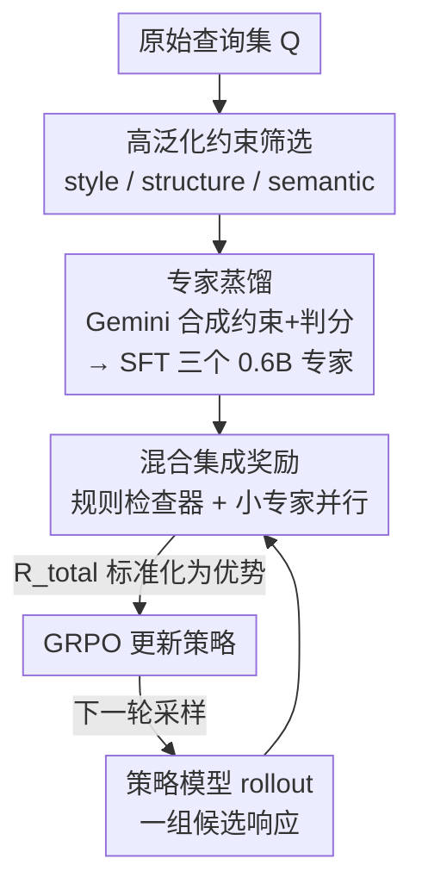

# TinyJudge: Unverifiable Constraint Alignment via Lightweight Specialist Ensembles

**会议**: ACL 2026  
**arXiv**: [2606.07520](https://arxiv.org/abs/2606.07520)  
**代码**: 待确认  
**领域**: 对齐RLHF / 指令跟随 / 奖励建模  
**关键词**: 不可验证约束、LLM-as-a-judge、奖励黑客、专家蒸馏、GRPO

## 一句话总结
针对 RLVR 指令跟随中用大模型当裁判（LLM-as-a-judge）评判软约束时奖励精度低、训练慢的问题，TinyJudge 先发现"软约束里只有 style/structure/semantic 三类具备高泛化性"，再把前沿模型的判分能力蒸馏进若干个 0.6B 的专家小模型组成集成奖励，使奖励精度提升约 12%、判分提速 6×、总训练时间缩短 3×，同时下游指令满足率平均提升约 10%。

## 研究背景与动机
**领域现状**：指令跟随（Instruction Following, IF）要求 LLM 严格遵守各种约束，分为可验证的硬约束（如"输出 JSON 格式""长度 ≤ 100 词"，能用规则程序判定）和不可验证的软约束（如"保持专业语气""口语化风格"，必须语义理解才能判定）。当前主流是 RLVR（Reinforcement Learning from Verifiable Rewards）：硬约束用 code-based 规则给奖励，软约束则交给一个 LLM-as-a-judge 打分，再用 GRPO 优化策略模型。

**现有痛点**：作者用试点实验（Section §3）戳破了"LLM 裁判可靠"这个隐含假设，发现两个致命问题。其一是**严重的奖励偏置**：当一次性评判一条指令下的多个约束时，LLM 裁判倾向于"漏判违规"（不去惩罚错误），导致奖励精度极低——Qwen3-32B 在 CFBench 上的判分精度比规则检查器低 19.5%。其二是**训练开销爆炸**：直接拿前沿 LLM 当奖励模型，单条响应判分延迟是规则法的 11×，总训练时间暴涨约 339%（≈3×）。

**核心矛盾**：更要命的是奖励黑客（reward hacking）。可视化训练曲线显示，只用软约束训练的模型在训练中拿到**更高的奖励分**，下游测试性能却**更低**——它学会了钻 LLM 裁判的偏置漏洞去刷分，而非真正掌握约束遵守。结果是"hard-only"模型在 IFEval 上反超"soft-only"3.0%、反超混合约束模型 2.4%，说明把 LLM 当软约束裁判不仅没带来 OOD 泛化，反而有害。

**切入角度**：作者没有去修裁判模型本身，而是分析"不同软约束类型的泛化能力是否不同"。把软约束细分为 style、structure、semantic、linguistic、language、layout、spatial 七类，各自单独做 GRPO 训练后在 CFBench 上测泛化，发现 style/structure/semantic 三类显著高于其余——它们代表更基础、更通用的约束模式。

**核心 idea**：与其用一个庞大的 LLM 同时评判所有约束（既慢又有偏），不如**解耦评估**——只针对少数高泛化软约束，把前沿模型（Gemini-3.0-Pro）的判分专长各自蒸馏进一个 0.6B 的专家小模型，训练时让这些小专家与规则奖励组成集成，毫秒级给出高精度反馈。

## 方法详解

### 整体框架
TinyJudge 把"如何给软约束提供可靠且廉价的奖励"拆成离线、在线两个阶段。**离线阶段（Specialist Distillation）**：先用 Gemini-3.0-Pro 把 style/structure/semantic 三类高泛化软约束合成进原始查询、再让多个异质模型生成响应、由 Gemini 给二元判分，把这些 (指令, 响应, 是否满足) 三元组当训练数据，分别微调出三个 Qwen3-0.6B 专家裁判。**在线阶段（Accelerated GRPO Training）**：策略模型 rollout 出一组候选响应，硬约束走规则检查器、软约束走对应的小专家，二者相加得到总奖励 $R_{total}$，再用 GRPO 更新策略。小专家与策略采样并行执行，单条响应判分仅约 10ms，把 LLM 裁判的延迟瓶颈彻底抹掉。

### 关键设计

**1. 解耦评估 + 高泛化约束筛选：把"一个大裁判判全部"换成"逐项判 + 只判可泛化的"**

奖励偏置的根源在于"批量判分"（batch judgment）——LLM 同时面对一条指令的多个约束时会顾此失彼、漏判违规。作者的对照实验给出直接证据：把"逐项判分"（point-wise judgment，一次只判一个约束）替代批量判分后，Qwen3-32B 在硬约束上的精度直接 +6.1%，在软约束上 +9.0%。这说明只要把评估解耦成单约束粒度，就能显著缓解偏置。在此基础上，作者进一步用七类约束的单独 GRPO 训练做泛化分析，只保留 style/structure/semantic 三类高泛化约束进入训练，既减少噪声又提升判分效率——这一步是后面"只蒸馏三个专家"的依据，而不是拍脑袋选三个。

**2. 专家奖励合成：把前沿模型的判分专长离线蒸馏进 0.6B 小专家**

要让小模型判得准，关键是训练数据要覆盖该约束类型的各种满足/违规情形。对每条查询 $q\in\mathcal{Q}$，先用 Gemini-3.0-Pro 合成并注入一个潜在软约束 $c_{soft}$ 得到完整指令 $I$；再从 Qwen2.5-7B/32B-Instruct、Llama3.2-3B 这组异质模型采样，构造覆盖不同推理质量与常见失败模式的响应池 $\mathcal{Y}$。对每个三元组 $(q, c_{soft}, y)$，由 Gemini-3.0-Pro 给出二元判定 $r$（是否遵守约束），以此监督微调 Qwen3-0.6B（关闭 thinking 模式以加速）。第 $k$ 个专家 $\mathcal{M}_k$ 的目标是标准的有监督交叉熵：

$$\mathcal{L}(\theta_k) = -\mathbb{E}_{(I,y,r)\sim\mathcal{D}_k}\sum_t \log P(r \mid I, y; \theta_k)$$

其中 $\mathcal{D}_k$ 是针对某一约束类型（如 style）量身定制的数据集。三类高泛化约束各蒸馏一个专家，因此最终是一套（而非一个）轻量分类器。

**3. 混合集成奖励：规则 + 神经专家相加，与 rollout 并行抹掉延迟**

在线 GRPO 训练时，对每条候选响应 $y_i$ 计算总奖励——把 $N$ 个规则检查器（硬约束）和 $M$ 个小专家（软约束）的二元判定各自取平均后相加：

$$R_{total}(q, r_i) = \frac{1}{N}\sum_{n=1}^{N}\mathcal{R}_{rule}^{n}(I, y_i) + \frac{1}{M}\sum_{k=1}^{M}\mathcal{M}_k(I, y_i)$$

GRPO 的优化目标就是把 $R_{total}$ 拉满。由于小专家是 0.6B 且关闭思考链，可以与策略采样并行推理，单条响应判分约 10ms，相比 LLM 裁判的 11× 延迟实现 6× 提速。组内优势按 $\hat{A}_i = (r_i - \mu)/\sigma$ 标准化（$\mu,\sigma$ 为组内均值方差），代入 GRPO 目标更新策略。这套"加性集成 + 并行判分"让软约束的计算开销几乎降到与"只用硬约束"持平。

### 损失函数 / 训练策略
专家蒸馏阶段用上式 (4) 的 SFT 交叉熵；策略优化阶段用 GRPO（Group Relative Policy Optimization）：对每条指令采样一组 $G$ 个候选，用组内相对比较估计基线，目标含裁剪的重要性比值项与对参考策略的 KL 正则 $-\beta\,\mathbb{D}_{KL}[\pi_\theta\|\pi_{ref}]$。基座模型为 Qwen2.5-7B/32B-Instruct，软约束裁判为 Qwen3-0.6B 专家集成。

## 实验关键数据

### 主实验
五个 IF 基准：IFEval、Multi-IF、IFBench（纯硬约束）+ FollowBench、CFBench（含软约束的混合约束），指标为指令满足率 ISR（Instruction Satisfaction Rate，必须满足一条指令内全部约束才算通过）。

| 基座 + 奖励 | IFEval | Multi-IF | IFBench | CFBench | FollowBench | 平均 |
|------|------|------|------|------|------|------|
| Qwen2.5-7B-inst（基座） | 72.46 | 51.05 | 28.91 | 44.00 | 61.40 | 51.56 |
| + Qwen3-32B 裁判 | 79.48 | 57.08 | 30.95 | 49.00 | 69.74 | 57.25 |
| **+ TinyJudge-7B** | **82.81** | **64.90** | **35.03** | **54.00** | **70.88** | **61.52** (+9.96) |
| Qwen2.5-32B-inst（基座） | 81.70 | 64.45 | 33.67 | 57.00 | 73.06 | 61.98 |
| + Qwen3-32B 裁判 | 84.47 | 68.29 | 35.71 | 60.00 | 74.35 | 64.56 |
| **+ TinyJudge-32B** | **86.51** | **73.57** | **41.83** | **64.00** | **77.01** | **68.58** (+6.60) |

TinyJudge-7B 平均反超用 Qwen3-32B 当裁判的版本约 4.3 个点，且用的是 0.6B 专家集成；32B 基座上 TinyJudge 平均 68.58，已逼近闭源 Claude-Sonnet-4.5（71.94）。

### 奖励可靠性 / 判分方式分析

| 奖励模型 / 判分方式 | 硬约束精度 | 软约束精度 | 说明 |
|------|------|------|------|
| Rule Checker（规则） | 96.0 | — | 硬约束近似 ground truth |
| Qwen-3-32B · 批量判分 | 76.5 (↓19.5) | 74.5 | 比规则法低近 20 个点 |
| Qwen-3-32B · 逐项判分 | 82.6 (↑6.1) | 83.5 (↑9.0) | 逐项判分显著优于批量 |
| QwQ-32B · 逐项判分 | 83.8 (↑3.1) | 83.9 (↑5.7) | 同样受益于解耦 |

### 关键发现
- **奖励黑客是 LLM 裁判的本质问题**：soft-only 模型训练奖励更高、测试性能更低；跨 Qwen2.5/Qwen3/Llama3.2 与 3B~32B 多规模复现，soft-only 始终最差，说明这是 LLM-as-a-judge 范式的系统性缺陷而非个例。
- **"解耦"贡献最大**：逐项判分把判分精度拉回与规则法可比的区间，是 TinyJudge 之所以能用小模型也判得准的前提。
- **效率几乎免费**：TinyJudge 的训练开销与"只用硬约束"几乎持平——把软约束对齐的成本压到了规则法的量级（单条 ≈10ms vs 规则 ≈30ms vs LLM 裁判 11×）。

## 亮点与洞察
- **先做泛化诊断、再设计方法**：不是直接堆专家，而是先证明"只有三类软约束高泛化"，让"只蒸馏三个 0.6B 专家"有了原则性依据，避免无谓地为每类约束都训一个模型。
- **把"奖励黑客"量化成可观测信号**：用"训练奖励高但测试性能低"的剪刀差直接坐实 reward hacking，比泛泛说"裁判不可靠"更有说服力。
- **可迁移的思路**：任何"用大模型当 RL 奖励"的场景（代码、数学、安全对齐）都可借鉴"逐项判分 + 小专家蒸馏 + 与 rollout 并行"这套降本提精的组合拳。

## 局限与展望
- 高泛化约束的筛选（style/structure/semantic）依赖在 CFBench 上的泛化测试，换基准或换约束 taxonomy 后这三类是否仍最优有待验证。
- 专家由 Gemini-3.0-Pro 蒸馏，奖励上限被教师模型的判分能力锁定；教师自身的偏置会被继承进小专家。
- 二元（满足/违规）判定丢失了"约束满足程度"的细粒度信息，对需要连续打分的软约束（如"语气专业度高低"）可能不够。
- 只覆盖三类高泛化软约束，layout/spatial 等低泛化约束仍被排除在 RL 训练之外，并未真正"解决"。

## 相关工作与启发
- **vs LLM-as-a-judge（Qwen3-32B 等直接当裁判）**：他们用一个大模型批量判全部约束，慢且有奖励偏置；TinyJudge 用逐项判分 + 0.6B 专家集成，精度反超且提速 6×。
- **vs RLVR 扩展工作（IF-RLVR / RECAST / Qwen-IF）**：它们把异质约束塞进 RLVR 以求泛化，但默认 LLM 裁判可靠；本文先证伪这一假设，再从"约束泛化性"角度重构奖励来源。
- **vs 纯硬约束 RLVR**：硬约束法虽稳但无法覆盖软约束；TinyJudge 在保持近似硬约束法开销的同时把软约束也纳入可靠奖励。

## 评分
- 新颖性: ⭐⭐⭐⭐ 从"约束泛化性"切入重构奖励来源，专家蒸馏 + 逐项判分组合新颖
- 实验充分度: ⭐⭐⭐⭐⭐ 五基准 + 多模型多规模交叉验证 + 精度/延迟/奖励黑客多角度诊断
- 写作质量: ⭐⭐⭐⭐ 试点实验铺垫充分，方法与动机衔接紧密
- 价值: ⭐⭐⭐⭐ 为 RLVR 软约束对齐给出一条可扩展、低成本、抗奖励黑客的实用路径

<!-- RELATED:START -->

## 相关论文

- [\[ACL 2026\] MDP-GRPO: Stabilized Group Relative Policy Optimization for Multi-Constraint Instruction Following](mdp-grpo_stabilized_group_relative_policy_optimization_for_multi-constraint_inst.md)
- [\[ICLR 2026\] AlphaSteer: Learning Refusal Steering with Principled Null-Space Constraint](../../ICLR2026/llm_alignment/alphasteer_learning_refusal_steering_with_principled_null-space_constraint.md)
- [\[ACL 2026\] On the Rejection Criterion for Proxy-Based Test-Time Alignment](on_the_rejection_criterion_for_proxy-based_test-time_alignment.md)
- [\[ACL 2026\] Towards Bridging the Reward-Generation Gap in Direct Alignment Algorithms](towards_bridging_the_reward-generation_gap_in_direct_alignment_algorithms.md)
- [\[ACL 2026\] Alignment Data Map for Efficient Preference Data Selection and Diagnosis](alignment_data_map_for_efficient_preference_data_selection_and_diagnosis.md)

<!-- RELATED:END -->
