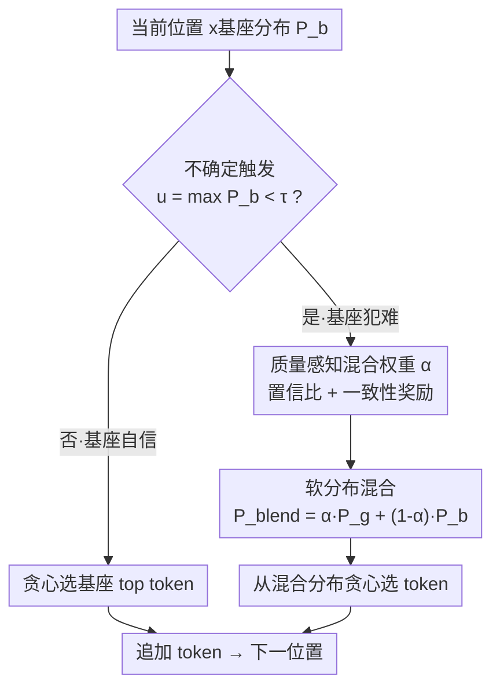

# To Intervene or Not: Guiding Inference-time Alignment with Probabilistic Model Blending

**会议**: ACL 2026  
**arXiv**: [2606.11201](https://arxiv.org/abs/2606.11201)  
**代码**: https://github.com/DecayingSeart/BlendIn  
**领域**: 对齐RLHF / 推理时对齐 / 解码策略  
**关键词**: 推理时对齐、分布混合、质量盲区、干预悖论、引导模型

## 一句话总结
针对推理时对齐里"用对齐模型逐 token 引导未对齐基座"时存在的质量盲区——现有方法一律二元接受/拒绝引导、无法分辨好坏建议，导致越干预性能越差的"干预悖论"——BlendIn 改用质量感知的概率分布混合：在基座不确定的位置按两模型置信度自适应加权融合二者的分布再贪心选 token，从而保留有益引导、压低不可靠引导，在最难的高干预模型对上取得最高 50% 的一致提升。

## 研究背景与动机
**领域现状**：让 LLM 对齐（安全、跟随指令）传统靠 SFT/RLHF 微调，但每训一个新模型都要单独对齐，成本高。**推理时对齐**因此兴起：不更新参数，只在解码时用一个已对齐的引导模型 $M_g$（或其抽取的信号）去校正未对齐的基座模型 $M_b$。代表工作如 NUDGING（引导模型在基座 top-1 概率低于阈值时提议 token）、IVG（用价值函数挑分最高的候选）、InferAligner（检测到有害 query 时平移激活）。

**现有痛点**：这些方法机制各异，却共享一个隐含假设——**所有引导都是有益的**，因此一律做二元决策（接受引导的 top token，或拒绝、回退基座）。但作者跨 9 个模型、3 个家族、6 个基准的系统评测推翻了这个假设：引导效果在不同模型对之间剧烈波动，有的组合大成功、有的灾难性失败。更反直觉的是出现了**干预悖论**——干预率越高、整体性能越差（在 GSM8K、TruthfulQA、XSTest 上负相关显著），当引导生成超过约 20% 的 token 时系统性掉点。

**核心矛盾**：当基座在某个困难位置做出错误/不安全预测时，引导模型往往**也在同一位置犯难**，给出同样错误的建议；二元接受会把这个错误 token 传播下去，制造更多不确定位置、触发更多干预，形成级联失败。现有方法对"自信的好建议"和"错误的坏建议"一视同仁，这就是**质量盲区（quality blindness）**。作者还排除了表层解释：词表重叠率与性能无显著相关（高重叠的 Qwen→Llama 可能惨败、低重叠的 Gemma→Llama 反而成功），说明根因更深；直接把干预率硬性封顶到 15% 也无效，反而更差——证明问题在引导**质量**而非**数量**。

**核心 idea**：把"二元接受/拒绝"换成"按质量比例软融合"——在每个基座不确定的位置，把引导模型与基座模型的**完整概率分布**按一个反映各自可靠度的权重 $\alpha$ 加权混合，再从混合分布贪心选 token，既保留有益引导、又自动压低不可靠建议。

## 方法详解

### 整体框架
BlendIn 把自己定位为推理时对齐的**稳定器**：不替换、不覆盖基座的生成，而是在基座"拿不准"的位置把引导**软性**地掺进来，防止级联失败。逐 token 解码时，先看基座对当前 token 的最大概率 $u=\max_w P_b(w\mid x_{<t})$：若 $u\ge\tau$（默认 $\tau=0.4$）说明基座自信，直接贪心选基座 top token，不触发引导；只有 $u<\tau$ 才查询引导模型分布、计算混合权重 $\alpha$、融合两分布并从中贪心选 token。这样既把干预限定在真正需要的位置，又用质量感知的权重决定"听引导几分"。

### 关键设计

**1. 软分布混合替代二元决策：让两个模型按比例共同发言**

二元决策的死结在于：引导不可靠时，要么接受有害建议（掉性能）、要么全盘拒绝（丢掉潜在收益），两头不讨好。BlendIn 在基座不确定的位置（$u<\tau$）不再二选一，而是构造一个混合分布让两模型同时贡献：

$$P_{blend}(w\mid x_{<t}) = \alpha\cdot P_g(w\mid x_{<t}) + (1-\alpha)\cdot P_b(w\mid x_{<t}),\qquad w_t = \arg\max_{w\in\mathcal{V}} P_{blend}(w\mid x_{<t})$$

即便引导模型整体不可靠，它的分布里仍可能含有用信号，被适当降权后能改进单用基座；反之基座因能力更强也常能提供有效信息。混合后再贪心选 token，等于把"接受/拒绝"这个 0/1 开关换成了一个连续旋钮——当引导错得离谱时它的贡献被压低，实现优雅回退（graceful fallback）。为省算力，完整分布可用 top-k（k 取很大值）近似；跨家族模型对的平均词表重叠约 50%，对共享 token 加权后重归一化即可，无需对齐 tokenizer。

**2. 质量感知的混合权重 α：置信比 + 一致性奖励**

混合权重 $\alpha\in[0,1]$ 才是"质量感知"的核心，它决定每一步听引导几分：

$$\alpha = \mathrm{clip}\!\left(\frac{\hat{p}_g}{\hat{p}_b + \hat{p}_g} + \lambda\cdot P_b(t_g),\ 0,\ 1\right)$$

其中 $\hat{p}_b=\max_w P_b(w\mid x_{<t})$、$\hat{p}_g=\max_w P_g(w\mid x_{<t})$ 是两模型各自的 top-1 概率，$t_g=\arg\max_w P_g$ 是引导模型的首选 token，$\lambda=0.1$。第一项**置信比** $\hat{p}_g/(\hat{p}_b+\hat{p}_g)$ 在"引导很自信而基座很犹豫"时取大值，天然地按需放大干预强度；第二项**一致性奖励** $\lambda\cdot P_b(t_g)$ 表示——若引导的首选 token 在基座分布里本就有一定支持，就再加点权重，降低分布失配的风险（$\lambda=0.1$ 上限只贡献 0.1，保证置信比始终是主导）。这套自适应权重让"越不确定的位置引导越强、越自信的位置越靠基座"，把干预自动收敛到真正有价值处；$\alpha$ 也可按任务手动调优。

**3. 干预率作为诊断信号：把失败前移到小样本预判**

这既是分析也是可落地的工具。作者证明干预率与性能负相关（干预悖论），于是**高干预率反过来成为引导质量差的诊断信号**：无需在完整基准上跑完，只用一小撮数据观察干预率，就能提前预判某个"基座↔引导"组合是否不兼容，省掉昂贵的全量试错。值得强调的是，作者特意区分了 BlendIn 与"基于置信度的集成"（confidence-based ensembling）：后者在多个对等模型间用置信度仲裁分歧、无方向性；而推理时对齐是**有方向**的——把基座分布往一个对齐目标推。干预悖论正是这种方向性施压独有的失败模式（推太狠会破坏基座能力），普通集成里不会出现，这也凸显了本文问题的独特性。

### 一个例子：'+' vs '-' 的级联失败如何被混合化解
原文 Figure 1 给了一个算术生成的例子：某个位置正确 token 是 '-'，但不可靠的引导建议 '+'。在二元接受下，这个错误 token 被直接采纳并传播到后续步骤，制造一连串不确定位置，触发高达 28% 的干预率、最终算错。而在 BlendIn 下，由于 '-' 在基座分布里仍有较强支持、'+' 的置信比与一致性奖励都不足以让 $\alpha$ 压倒基座，混合分布的 $\arg\max$ 仍落在 '-'，干预率降到约 12%、得到正确答案。同一对引导，二元法和软混合法走向相反结果——这正是"质量感知"的价值所在。

## 实验关键数据

### 主实验
在 GSM8K、TruthfulQA、XSTest 等基准上，按"基座→引导"模型对比较：Base（仅基座）、Guid.（仅引导）、Alig.（理想对齐上界）、NUDG.（NUDGING 二元基线）、Ours（BlendIn），Int.% 为干预率。L/G/Q 分别指 Llama/Gemma/Qwen。

| 模型对 | 基准 | Base | NUDGING | BlendIn | 相对 NUDGING |
|------|------|------|------|------|------|
| Q→L | GSM8K | 0.11 | 0.27 | 0.31 | +15% |
| G→L | TruthfulQA | 0.58 | 0.45 | 0.50 | +11% |
| L→G | XSTest | 0.01 | 0.10 | 0.15 | +50% |
| G→G | XSTest | 0.01 | 0.10 | 0.14 | +40% |
| Q→L | XSTest | 0.00 | 0.03 | 0.04 | +33% |

BlendIn 在跨家族与同家族模型对上均一致改进、几乎不掉点，在最难的高干预对上提升最高达 50%。

### 诊断与消融分析

| 分析 | 结论 |
|------|------|
| 干预率 vs 性能 | 负相关，在 GSM8K/TruthfulQA/XSTest 上统计显著；>20% token 干预系统性掉点 |
| 词表重叠 vs 性能 | 无显著相关（高重叠也可惨败），排除"tokenization 失配"假设 |
| 硬性封顶干预率到 15% | 性能反而更差——好坏引导被一刀切丢弃，证明问题在质量非数量 |

### 关键发现
- **质量盲区是现有方法的共性缺陷**：同一基座仅因换引导模型，性能就大幅波动；二元方法无法分辨。
- **干预率是"症状"不是"病因"**：高干预反映引导在犯难，封顶治标不治本；软混合直接降权坏建议才治本。
- **方向性是与普通集成的本质区别**：BlendIn 是把基座往对齐目标"推"，因此独有干预悖论这一失败模式。

## 亮点与洞察
- **把"何时该干预"从经验玄学变成有原则的诊断**：干预率既是被解释的现象（悖论），又被反用为小样本预判不兼容的工具，一举两得。
- **训练无关、即插即用**：BlendIn 不训练任何额外模型/价值函数，只改解码时的概率融合，跨家族无需对齐 tokenizer，落地成本极低。
- **可迁移的设计**：speculative decoding、model ensembling、多教师蒸馏等"多源信号融合"场景，都能借鉴"用置信比 + 一致性奖励做自适应软加权"替代硬选择。

## 局限与展望
- 自适应 $\alpha$ 的两个超参（$\tau=0.4$、$\lambda=0.1$）虽给了原则性默认值，但作者也承认需按任务手动调优才能取得最优，普适性待验证。
- 实验集中在 GSM8K/TruthfulQA/XSTest 等以准确率/安全分衡量的任务，对开放式生成、长文本写作等任务的稳定性尚未充分展示。
- 软混合需要每个不确定位置都查询引导模型的完整（或 top-k）分布，相比纯基座解码仍有额外前向开销。
- "质量感知"完全建立在两模型的 top-1 置信度上，当引导模型自信地犯错（高置信但错误）时，置信比可能误导 $\alpha$ 偏大。

## 相关工作与启发
- **vs NUDGING（Fei et al. 2025）**：它在基座 top-1 低于阈值时二元接受引导 token；BlendIn 在同样的触发条件下改为软分布混合，保留收益、压低风险。
- **vs IVG / InferAligner**：分别用价值函数挑 token、用激活平移做干预，本质都是"硬选择/硬改写"且默认引导有益；BlendIn 用质量感知权重做软融合，直面质量盲区。
- **vs 基于置信度的集成（Lakshminarayanan et al. 2017）**：后者在对等模型间无方向地仲裁，不会出现干预悖论；BlendIn 是有方向地向对齐目标施压，置信度用于"调节干预强度以防能力退化"，问题设定本质不同。

## 评分
- 新颖性: ⭐⭐⭐⭐ 揭示"干预悖论"与"质量盲区"并用软分布混合化解，视角新颖
- 实验充分度: ⭐⭐⭐⭐ 9 模型 3 家族 6 基准系统评测，含词表重叠/封顶等反事实分析
- 写作质量: ⭐⭐⭐⭐⭐ 问题动机层层递进，证伪表层假设的论证链清晰有力
- 价值: ⭐⭐⭐⭐ 训练无关、即插即用，且把干预率变成可诊断信号，实用价值高

<!-- RELATED:START -->

## 相关论文

- [\[NeurIPS 2025\] Inference-time Alignment in Continuous Space](../../NeurIPS2025/llm_alignment/inference-time_alignment_in_continuous_space.md)
- [\[ACL 2026\] Debiasing Reward Models via Causally Motivated Inference-Time Intervention](debiasing_reward_models_via_causally_motivated_inference-time_intervention.md)
- [\[ICML 2026\] Reward Shaping for (Inference-Time) Alignment: A Stackelberg Game Perspective](../../ICML2026/llm_alignment/reward_shaping_for_inference-time_alignment_a_stackelberg_game_perspective.md)
- [\[ACL 2026\] On the Rejection Criterion for Proxy-Based Test-Time Alignment](on_the_rejection_criterion_for_proxy-based_test-time_alignment.md)
- [\[AAAI 2026\] W2S-AlignTree: Weak-to-Strong Inference-Time Alignment for Large Language Models via Monte Carlo Tree Search](../../AAAI2026/llm_alignment/w2s-aligntree_weak-to-strong_inference-time_alignment_for_large_language_models_.md)

<!-- RELATED:END -->
