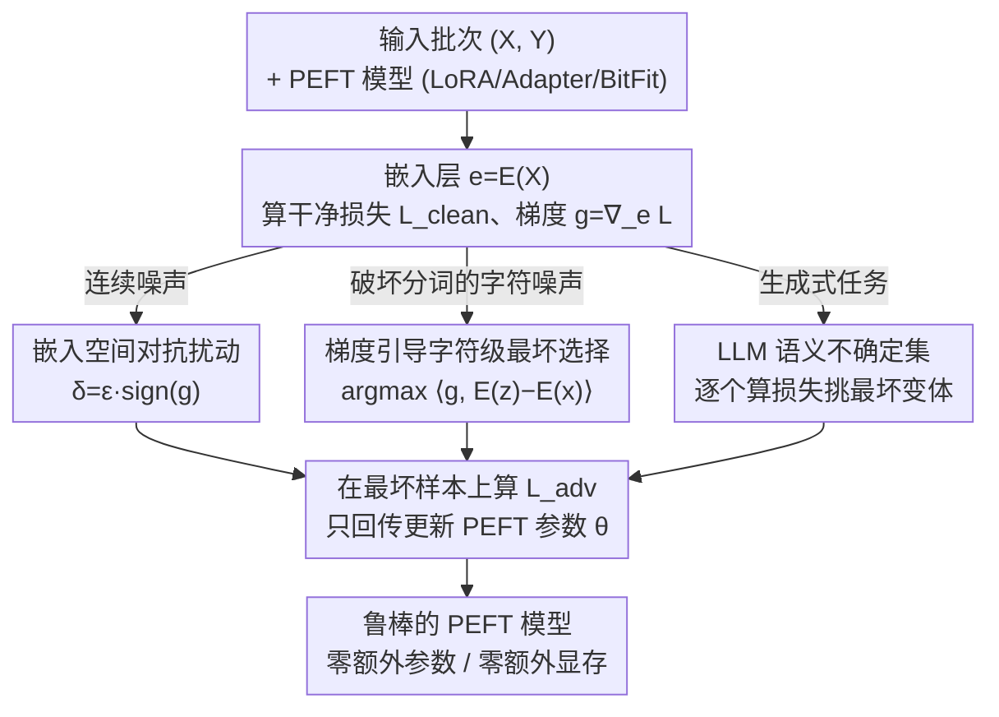

# Small Data, Big Noise: Adversarial Training for Robust Parameter-Efficient Fine-Tuning

**会议**: ACL 2026  
**arXiv**: [2606.10610](https://arxiv.org/abs/2606.10610)  
**代码**: https://github.com/shaham-lab/SDBN  
**领域**: LLM效率 / 参数高效微调 / 对抗训练 / 鲁棒优化  
**关键词**: PEFT, LoRA, 对抗训练, 鲁棒优化, 低资源, 字符级噪声

## 一句话总结
把对抗训练接进参数高效微调（PEFT），用一个统一的鲁棒优化框架 SDBN 在嵌入空间生成最坏扰动，并针对"破坏分词的字符噪声"和"生成式任务"各补一套离散不确定集，在小数据 + 噪声场景下显著提升 LoRA/Adapter/BitFit 的鲁棒性，且不增加任何可训练参数或显存。

## 研究背景与动机
**领域现状**：PEFT（LoRA、Adapter、BitFit 等）已成为把大模型适配到下游任务的事实标准——只训练极小一部分参数，大幅降低算力和存储开销。在小数据集上，PEFT 甚至常常比全量微调更高效、更不容易过拟合。

**现有痛点**：但 PEFT 在两类现实条件下会明显掉点。一是**输入噪声**：真实文本里充斥着拼写错、大小写不一致、方言变体等"语义不变但表面变化"的扰动；论文图 1 显示，当 Banking77 干净训练样本降到 1000 以下时，Adapter/BitFit/LoRA 在带词替换噪声的测试集上准确率最多能掉一半以上。二是**域偏移**：部署环境与训练分布在风格、话题上略有差异时性能也会退化。这两个问题在**低资源**场景下尤其严重，因为小语料本身缺乏腐蚀、方言、领域术语的多样性，模型没机会"见过"这些变化。

**核心矛盾**：标准 PEFT 的优化目标只盯着干净训练样本的平均损失，从没把"最坏情况下的输入"纳入优化；而低资源恰恰让模型缺少自然的语言多样性来兜底。已有的对抗训练（FreeLB、SMART、VAT）虽然能提鲁棒性，但都假设全量微调，没在 PEFT 设定里被验证过；少数把对抗和 LoRA 结合的工作（LoFT、AdvLoRA）又主要在视觉任务上，NLP 这条线基本空白。

**本文目标**：在不破坏 PEFT 参数效率的前提下，让它同时扛住词级噪声、破坏分词的字符级噪声、以及未知域偏移，并且在低资源下增益最大。

**切入角度**：作者把"语言变体 / 域偏移"统一看作干净样本周围**不确定区域**里的点（论文图 2 用 PCA / t-SNE 可视化：词级扰动和源域样本的不确定椭圆能覆盖到目标域样本）。只要训练时主动在这些区域里找最坏点优化，就能泛化到没见过的扰动。

**核心 idea**：用**鲁棒优化（对抗训练）**替换 PEFT 的普通经验风险最小化——在嵌入空间用梯度找最坏扰动，把损失在"最坏邻域"上压平；并针对梯度线性近似失效的两种情形（字符级破坏分词、生成式大改写）换用**离散不确定集**。

## 方法详解

### 整体框架
SDBN（Small Data Big Noise）本质是一个**统一的鲁棒优化框架**，目标函数是经典的 min–max：

$$\min_{\theta}\ \mathbb{E}_{(x,y)\sim\mathcal{D}}\Big[\max_{x+\delta\in\mathcal{S}_x}\mathcal{L}(x+\delta;\theta,y)\Big].$$

内层 max 在每个样本 $x$ 的**不确定集 $\mathcal{S}_x$**（所有"小幅、保语义"的编辑得到的句子）里找让损失最大的最坏样本，外层 min 只更新 PEFT 的少量可训练参数 $\theta$。整个框架的可变之处只有一个——**$\mathcal{S}_x$ 怎么定义**。SDBN 给出三种实例化：(i) 连续 $\ell_\infty$ 范数球（默认 SDBN）；(ii) 破坏分词的离散字符级编辑集（SDBN-h）；(iii) LLM 生成的离散语义变体集（SDBN-p）。三者共用同一套"找最坏样本 → 在最坏样本上回传梯度更新 PEFT"的循环，区别只是不确定集的构造与最坏样本的挑选规则。

### 关键设计

**1. 嵌入空间的对抗扰动：把 min–max 装进 PEFT 而不动文本符号**

文本是离散符号序列，没法像图像那样直接给像素加连续扰动 $x+\delta$（$x$ 是离散符号，$\delta$ 是连续数值，根本不在一个空间）。SDBN 沿用 NLP 对抗训练的惯例——**在嵌入层注入扰动**而非改原始文本。设 $E(\cdot)$ 是嵌入抽取器、$f(\cdot;\theta)$ 是接 PEFT 的后续网络：先算干净损失 $\mathcal{L}_{\text{clean}}=\mathcal{L}(f_\theta(\mathbf{e}),Y)$，对嵌入求梯度 $\mathbf{g}=\nabla_{\mathbf{e}}\mathcal{L}_{\text{clean}}$，再用 FGSM 式的符号扰动 $\delta=\epsilon\cdot\operatorname{sign}(\mathbf{g})$ 得到对抗嵌入 $\mathbf{e}_{\text{adv}}=\mathbf{e}+\delta$，最后**只在 $\mathcal{L}_{\text{adv}}=\mathcal{L}(f_\theta(\mathbf{e}_{\text{adv}}),Y)$ 上回传更新 PEFT 参数**。实验中扰动取自 $\ell_\infty$ 范数球、$\epsilon=10^{-4}$ 时效果最好。

之所以"梯度对抗"比"随机加噪"（如 NEFTune）更有效，作者给了高维几何上的解释：损失变化的一阶近似是 $\mathcal{L}_{\theta,y}(x+\delta)\approx\mathcal{L}_{\theta,y}(x)+\langle\nabla\mathcal{L}_{\theta,y}(x),\delta\rangle$；高维空间里随机向量几乎与任意固定方向正交，所以 $\mathbb{E}[\langle\mathbf{g},\delta_{\text{random}}\rangle]\approx 0$——随机噪声对损失几乎没有一致影响，只是无方向的弱正则。而对抗扰动显式最大化 $\langle\mathbf{g},\delta\rangle$，专挑模型最敏感的方向制造最坏样本，逼着优化把"最陡的地方"压平，从而在真正需要鲁棒的方向上扩大决策间隔。

**2. SDBN-h：梯度引导的离散字符级最坏选择，专治破坏分词的字符噪声**

设计 1 的连续 $\ell_p$ 球有个覆盖盲区：删一个字母这类**破坏分词**的字符编辑会改变 tokenization（拆词 / 变 UNK），把嵌入推到离干净区域很远的地方，根本不在小半径球内（论文图 2a 里字符级编辑的三角点大量落在不确定椭圆之外）。SDBN-h 为此定义一个**离散不确定集** $\mathcal{S}_x$——句子 $x$ 的所有单字符变体。因为集合是有限的、不可微，没法直接做投影梯度下降，于是作者复用干净嵌入处的梯度 $g=\nabla_e\mathcal{L}(f_\theta(e),y)$，按一阶内积挑最坏变体：

$$z^{*}=\arg\max_{z\in\mathcal{S}_x}\ \langle g,\ E(z)-E(x)\rangle.$$

关键在于**梯度只用来"挑选"而不用来"生成"扰动**——扰动本身是离散的真实字符编辑。训练时每个 mini-batch 一分为二：一半走设计 1 的 $\ell_\infty$ FGSM，一半走 $z^{*}$，且复用同一份梯度，所以额外开销极小。这样模型同时对连续嵌入扰动和离散字符畸变都鲁棒。

**3. SDBN-p：LLM 生成的离散语义不确定集，面向生成式任务**

作者实验发现连续嵌入扰动在生成式任务上反而不灵。原因是设计 1/2 都依赖"扰动足够小、可用干净输入梯度做泰勒近似"，而生成任务需要的是改写、口语化、风格变化这类**大幅结构性改动**，早已跳出局部线性区。SDBN-p 改用 LLM（实验里是 GPT-5.2）对每个训练样本 $x$ 生成 $k$ 个保语义的对抗变体（含改写、错字、风格变体），构成离散集 $S_x^{\text{prompt}}=\{z_1,\dots,z_k\}$。由于梯度选择规则失效，这里**直接对 $k$ 个变体各算一次损失，取损失最大的那个**：

$$z^{*}=\arg\max_{z\in S_x^{\text{prompt}}}\ \mathcal{L}(f(E(z);\theta),y).$$

代价是 $k$ 次前向，但换来对生成任务真正的"最坏语义变体"做鲁棒优化，能自然覆盖算法难以枚举的改写和语境重写。

### 损失函数 / 训练策略
训练协议：先 3 个 epoch 标准 warm-up，再 10–20 个 epoch 跑 SDBN（或不加扰动的 baseline）。三种变体都只用 $\mathcal{L}_{\text{adv}}$ 回传到 PEFT 参数。整个过程**不新增可训练参数、不增加 GPU 显存**，唯一开销是每个 mini-batch 多一次前向 + 反向求 $\mathbf{g}$。低资源用 5%–100% 训练数据，测试时叠加词级 / 字符级噪声。

## 实验关键数据

### 主实验
模型：分类用 BERT-base、DeBERTa-v3；生成用 LLaMA-3.2-1B、LLaMA-2-7B、Qwen-2.5-7B。数据集：20Newsgroups / Banking77 / TREC / IMDB / BLESS（分类）+ SQuAD / TweetQA（生成）。PEFT：Adapter / BitFit / LoRA / QLoRA。Baseline：NEFTune、EDA、FreeLB、SMART。

BLESS 字符级噪声（DeBERTa-v3 + LoRA，1000 干净样本训练）——SDBN-h 在破坏分词的扰动上最强，同时不掉干净准确率：

| 方法 | Clean | Delete-char | Swap-char | Double-char |
|------|-------|-------------|-----------|-------------|
| Vanilla | 89.81 | 60.67 | 56.82 | 68.51 |
| SDBN | 89.83 | 60.84 | 57.22 | 68.66 |
| NEFTune | 89.08 | 61.19 | 57.22 | 69.42 |
| **SDBN-h** | 89.61 | **65.14** | **62.80** | **72.54** |

生成式任务（SDBN-p 用 LLM 生成变体训练）：

| 任务 / 模型 | 指标 | 噪声 | Vanilla | FreeLB | SDBN-p |
|-------------|------|------|---------|--------|--------|
| SQuAD / LLaMA-3.2-1B | EM | Clean | 58.92 | 57.00 | **59.84** |
| SQuAD / LLaMA-3.2-1B | EM | Swap-Word | 32.44 | 31.64 | **35.08** |
| SQuAD / LLaMA-3.2-1B | EM | Homophone | 47.28 | 44.04 | **52.20** |
| TweetQA / LLaMA-2-7B | F1 | Clean | 68.09 | 76.57 | **80.81** |
| TweetQA / LLaMA-2-7B | F1 | Delete-Char | 51.56 | 60.59 | **65.55** |
| TweetQA / LLaMA-2-7B | F1 | Delete-Word | 56.06 | 60.79 | **64.15** |

### 消融 / 分析实验
SDBN 加到不同训练方法上的**绝对准确率增益**（Banking77 低资源子集，DeBERTa-v3）——对 PEFT 增益巨大、对全量微调几乎无用：

| 训练方法 | Clean | Replace | Delete | Swap | 平均增益 |
|----------|-------|---------|--------|------|----------|
| LoRA | +23.6 | +18.8 | +18.7 | +17.1 | **+19.6** |
| BitFit | +16.0 | +11.2 | +12.8 | +11.3 | +12.8 |
| Adapter | +13.3 | +9.4 | +9.8 | +6.2 | +9.7 |
| Full FT | +1.3 | +0.9 | +0.5 | +0.8 | +0.9 |

### 关键发现
- **增益随数据变少而变大**：SDBN 不仅不掉干净准确率，还常常提升；训练集越小，相对增益越显著（论文图 3），印证"鲁棒优化在低资源最有价值"的假设。
- **对抗信号在 PEFT 的受限参数子空间里更聚焦**：同样加 SDBN，LoRA 平均涨 +19.6 个点而全量微调只涨 +0.9。作者解释为全量微调参数太多，更容易在对抗样本上过拟合；PEFT 的小参数空间反而让对抗信号更集中有效。
- **三套不确定集各司其职**：连续 $\ell_\infty$ 适合词级噪声与域偏移，字符级离散集（SDBN-h）专治破坏分词的字符畸变（+4~7 个点），LLM 语义集（SDBN-p）在生成任务上全面超越 FreeLB/SMART。

## 亮点与洞察
- **"一个框架、三套不确定集"的拆法很干净**：用同一个 min–max 目标统一了连续扰动、离散字符编辑、LLM 语义改写，按"梯度泰勒近似是否成立"决定用梯度生成、梯度选择、还是纯损失选择，逻辑自洽。
- **梯度对抗 vs 随机噪声的高维几何论证**：用 $\mathbb{E}[\langle g,\delta_{\text{random}}\rangle]\approx 0$ 一句话点破 NEFTune 这类随机加噪为何只是弱正则，很有说服力，也是可迁移的判据。
- **"梯度只选不造"的技巧**：在离散集上复用干净梯度做最坏选择，绕开了离散不可微的难题，几乎零额外开销——这套思路可迁移到任何"候选集有限但想做对抗优化"的场景。
- **PEFT × 对抗的非对称增益**是最反直觉的发现：对抗训练对小参数空间帮助远大于全参数，给"低资源就该用 PEFT + 鲁棒优化"提供了实证依据。

## 局限与展望
- **额外算力开销**：每个 mini-batch 要多一次前向 + 反向求梯度，虽然不增显存，但拉高了单批耗时，扩到超大模型 / 超大语料时可能成瓶颈；SDBN-p 还要 $k$ 次前向。
- **$\epsilon$ 敏感**：扰动半径在不同数据集上敏感，论文只给了经验默认值（$\ell_\infty$、$\epsilon=10^{-4}$），缺自适应 / 自动调参。
- **自己发现的局限**：SDBN-p 依赖外部强 LLM（GPT-5.2）生成变体，引入了对闭源模型的依赖和成本，变体质量也会左右最终鲁棒性；分类与生成用了不同变体，泛化到更长文本 / 更复杂生成任务的效果尚未充分验证。

## 相关工作与启发
- **vs NEFTune**：都在嵌入空间加噪，但 NEFTune 加的是均匀随机噪声、只提平均性能；SDBN 加梯度引导的最坏扰动，针对性更强，在低资源 + 噪声下显著更优。
- **vs FreeLB / SMART / VAT**：这些经典对抗训练默认全量微调；SDBN 首次系统验证对抗训练在 PEFT 上的价值，并发现 PEFT 下增益反而更大。
- **vs LoFT / AdvLoRA**：它们把对抗训练 + LoRA 用在视觉 / 视觉-语言任务；SDBN 填补了 NLP 文本任务这条线，并扩展出字符级与 LLM 语义两套离散不确定集。
- **vs HotFlip / EDA**：HotFlip 的梯度引导字符编辑是攻击工具、EDA 是随机数据增强；SDBN-h 把字符级编辑放进对抗训练框架、用梯度挑最坏，目标是防御鲁棒性而非攻击。

## 评分
- 新颖性: ⭐⭐⭐⭐ 把对抗训练系统接进 PEFT 并补两套离散不确定集，填补了 NLP 低资源鲁棒 PEFT 的空白
- 实验充分度: ⭐⭐⭐⭐ 覆盖分类 + 生成、5 个模型、4 种 PEFT、词级/字符级噪声与域偏移，但部分结果挪到附录
- 写作质量: ⭐⭐⭐⭐ 框架统一、动机与几何论证清晰，三套变体的取舍讲得明白
- 价值: ⭐⭐⭐⭐ 零额外参数/显存即可提鲁棒性，对真实低资源、噪声多的 NLP 部署很实用

<!-- RELATED:START -->

## 相关论文

- [\[ICML 2026\] TuneAhead: Predicting Fine-tuning Performance Before Full Training Begins](../../ICML2026/llm_efficiency/tuneahead_predicting_fine-tuning_performance_before_full_training_begins.md)
- [\[ICLR 2026\] TokenSeek: Memory Efficient Fine Tuning via Instance-Aware Token Selection](../../ICLR2026/llm_efficiency/tokenseek_memory_efficient_fine_tuning_via_instance-aware_token_selection.md)
- [\[ACL 2026\] Tandem: Riding Together with Large and Small Language Models for Efficient Reasoning](tandem_riding_together_with_large_and_small_language_models_for_efficient_reason.md)
- [\[ICML 2026\] A Risk Decomposition Framework for Pre-Hoc Fine-Tuning Prediction](../../ICML2026/llm_efficiency/a_risk_decomposition_framework_for_pre-hoc_fine-tuning_prediction.md)
- [\[NeurIPS 2025\] Hierarchical Balance Packing: Towards Efficient Supervised Fine-tuning for Long-Context LLM](../../NeurIPS2025/llm_efficiency/hierarchical_balance_packing_towards_efficient_supervised_fine-tuning_for_long-c.md)

<!-- RELATED:END -->
