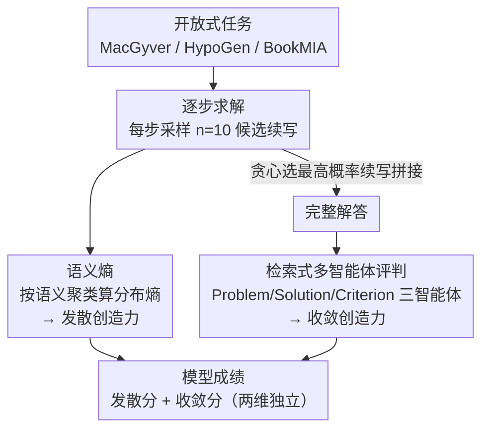

# Automated Creativity Evaluation of Language Models Across Open-Ended Tasks

**会议**: ACL 2026  
**arXiv**: [2606.11762](https://arxiv.org/abs/2606.11762)  
**代码**: https://github.com/tanminsen/creativity-eval  
**领域**: LLM 评测 / 创造力评估  
**关键词**: 创造力评测, 语义熵, 多智能体评判, 发散思维, 收敛思维

## 一句话总结
这篇论文提出一套**与任务解耦、无需参考答案**的自动化框架来量化 LLM 的创造力：用「语义熵」衡量发散创造力（想法的新颖与多样），用「基于检索的多智能体评判」衡量收敛创造力（解答是否真正解决问题），并在解题、科研构思、创意写作三个领域上系统刷出了模型规模、温度、推理能力对创造力的影响规律。

## 研究背景与动机
**领域现状**：随着 LLM 在推理、生成上越来越强，大家开始关心它们的「创造力」——能不能提出非常规方案、发现新模式、自动设计实验。要研究这件事，前提是有一套能跨任务、可规模化测量创造力的方法。

**现有痛点**：现有的创造力评测几乎都是**任务绑定**的。要么沿用人类创造力测验（如 TTCT、CAT），靠大量人工标注，没法自动化也没法规模化；要么为某个具体任务（数学、硬件设计、隐喻生成、代码）量身定做评分细则、准备标准答案集。这些方法把领域假设硬编码进了评测流程，换个任务就失效，主观、昂贵、难以系统化。

**核心矛盾**：评测装置和创造任务**纠缠在一起**。只要测量方法依赖"这个任务的正确答案长什么样"，就不可能在开放式、没有唯一解的任务上通用。

**本文目标**：把测量装置从具体任务里**拆出来**，造一个 reference-free（不需要标准答案）、domain-agnostic（不绑定领域）、全自动的框架，并且要能分别测量创造力的两个侧面。

**切入角度**：作者借认知科学对创造力的经典二分——**发散思维**（产生多样、新颖的想法）与**收敛思维**（把想法收敛成真正可行、贴合目标的解）。这两件事必须分开测：模型可能产出一堆五花八门但语无伦次的输出，若只看多样性会被误判为"有创造力"。

**核心 idea**：发散侧用**语义熵**（把原本用于幻觉检测的指标重新诠释成"探索广度"的无参考度量）；收敛侧用**检索式多智能体评判**（在保住多视角讨论质量的同时，把传统多智能体讨论的算力成本砍掉 60%+）。

## 方法详解

### 整体框架
框架的核心思想是**把"怎么测"和"测什么任务"彻底解耦**：同一套测量装置（语义熵 + 多智能体评判）原封不动地套到任意开放式任务上。对每个问题，模型按 step 逐步求解；在**每一步**采样 $n=10$ 个候选续写，用这批候选算语义熵作为发散创造力，再用贪心解码选出最高概率的续写拼进解答，重复直到完成；最后把**完整解答**交给多智能体评判，得到收敛创造力分数。一篇模型成绩 = 发散分（平均语义熵）+ 收敛分（评判分）两个独立维度。

### 关键设计

**1. 语义熵：用无参考的分布熵量化发散创造力**

发散创造力的难点在于"新颖、多样"很难不靠人工、不靠标准答案去打分。作者的观察是：开放式任务往往有多个同时成立的合理解，一个有创造力的模型应该能从同一题面**探索出语义上彼此不同的解题方向**。于是把幻觉检测里的语义熵（Semantic Entropy, SE）搬过来重新诠释——在单答案 QA 里，概率分散代表模型不确定、是幻觉信号；但在开放式任务里，概率分散到**语义上不同的想法**上反而代表模型在探索多条解题路径。

具体做法分三步：先采样候选续写，再做**语义聚类**（按双向蕴含 bi-directional entailment 贪心归类：和已有类语义等价就并入，否则新建一类，这样只看"意思"不看"措辞"），最后对类的概率分布求熵。一个续写 $s$（token 序列 $t_1,\dots,t_i$）的对数概率为

$$\log P(s|x) = \sum_i \log P(t_i \mid t_{<i}, x)$$

某语义类 $c$ 的概率是落入该类的所有续写概率之和 $P(c|x) = \sum_{s\in c} P(s|x)$，语义熵就是类分布的熵：

$$H(x) = -\sum_{i=1}^{|C|} P(C_i|x)\,\log P(C_i|x)$$

每步采 $n=10$ 个候选聚类算 SE。关键在于它工作在**语义层**而非表面字符层，能抓住真正的概念差异，避免被换词改写（paraphrase）灌水——这正是 cosine 相似度、Self-BLEU、Distinct-n 这类表面度量的软肋。

**2. 检索式多智能体评判：把收敛创造力评判的算力砍到可规模化**

收敛创造力要判断"解答是否在可行性、连贯性、相关性、领域正确性等多个维度上真正满足任务要求"，这种多维、主观的评判，单一评委不如多个分工智能体讨论来得全面、贴近人类。但现有多智能体框架（以 ChatEval 为代表）每一轮都把**完整讨论历史**重新拼进 prompt，token 成本随讨论轮数无界增长，benchmark 规模下贵到用不起——瓶颈不是评判质量而是可扩展性。

作者的做法是：三个专职智能体（Problem / Solution / Criterion，分别从问题、解答、评价标准三个视角分析），把中间分析写成**可检索的 fragment** 存进向量库，每一轮**只检索 top-$k$ 个最相关的历史 fragment**（按 cosine 相似度），而不是回放整段讨论。这样上下文不再无界膨胀，又保住了智能体分工，最终收敛到一个二元裁决。配合基于置信度的提前停止，相比传统多智能体讨论 **token 用量降约 63%、整体算力省 60%+**，精度却不掉，使大规模、可重复的收敛评测变得可行。

**3. 两阶段逐步评测协议：发散用采样、收敛用贪心，各取所需**

把发散和收敛塞进同一条求解轨迹会互相干扰，于是作者设计了一个有意为之的两阶段协议。**发散侧**在每个推理步采样 $n=10$ 个候选续写来估计模型"考虑过的下一步范围"——这借鉴了 Tree-of-Thoughts 的思路，用局部分支行为近似模型的探索空间，因为发散创造力关心的是"探索了多少种走法"而非单条最终轨迹的创造力。**收敛侧**则对续写做**贪心解码**拼出最高概率的解题路径，因为收敛创造力关心的是"能不能挑出并打磨出一个有效正确的解"，最适合用模型最自信的答案来评。两侧各跑 300 题/领域，发散分取全步平均 SE，收敛分由多智能体评判给出。

### 损失函数 / 训练策略
本文是**评测框架**而非训练方法，不涉及模型训练。语义聚类用蕴含模型判定语义等价（细节在附录 C.3 校验过与人工标注的一致性）；多智能体评判用置信度阈值控制何时停止讨论。

## 实验关键数据

### 主实验
在 MacGyver（非常规物理解题）、HypoGen（科研假设构思）、BookMIA（创意写作）三领域、每域 300 题上验证。

发散侧——语义熵与人类判断的一致性（MacGyver 上 50 题、3 名标注者多数投票为金标，Cohen's $\kappa$）：

| 多样性指标 | 与人类判断一致性 (κ) |
|------|------|
| **Semantic Entropy（本文）** | **0.56** |
| Cosine similarity | 0.49 |
| Distinct-1 | 0.37 |
| Self-BLEU | 0.35 |
| Distinct-2 | 0.34 |

语义熵显著超过所有表面字符级多样性度量，说明它更忠实地抓住了人类认可的"语义广度"。

收敛侧——多智能体评判与人类标注的准确率对比（对多数投票金标，准确率越高越贴近人）：

| 框架 | MacGyver | BookMIA |
|------|------|------|
| GPT-4o One-shot | 64.7% | – |
| GPT-4o CoT | 67.3% | – |
| ChatEval | 76.7% | 73.3% |
| **本文框架 (GPT-4o)** | **84.7%** | **83.0%** |
| 本文框架 (GPT-4o-mini) | 55.3% | – |
| 人类标注者（区间） | 80.0–84.7% | 74.7–87.0% |

用 GPT-4o 时本文评判达到人类标注者水平，并大幅超过 ChatEval；但换成 GPT-4o-mini 准确率掉到 55.3%，说明评判质量强依赖底座模型能力。

### 消融 / 分析

| 分析 | 关键发现 |
|------|------|
| SE vs 语义簇数 | 强正相关，反映 TTCT 的"灵活性（flexibility）"维度 |
| SE vs 采样温度 | 随温度升高而增大，符合"高温→更强探索"的直觉 |
| SE vs 候选间 cosine 相似度 | 负相关，高 SE 模型产出的候选确实更不相似 |
| solution-level SE vs LLM 新颖性判断 | 正相关（LLM 评委先用 30 题对人工排序校验，Spearman $\rho=0.80$）|
| 发散 vs 模型规模/新旧 | **不单调**，甚至更大/更新的模型 SE 反而略降（LLaMA 3→3.3、Vicuna 7B→33B）|
| 收敛 vs 模型规模/新旧/推理 | **单调提升**，更大、更新、带推理（R1-70B）的模型收敛分更高 |
| 发散 vs 收敛相关性 | Spearman 一致偏弱，两维**经验上可分离** |

### 关键发现
- **发散和收敛是两个独立维度**：SE 与收敛指标相关性始终很弱。如果 SE 在开放式任务里仍主要反映"出错/幻觉"，本该和任务完成度强负相关——没有这种关系，反过来证明了 SE 测的是**生成广度**而非错误。
- **当前训练范式只长收敛、不长发散**：收敛创造力随规模/新旧/推理稳步提升，发散创造力却不随规模 scale，甚至略降。作者推测当代训练过度强调"答案正确"，反而压缩了大模型的发散探索空间。这暗示两个维度**可以被独立优化**。
- **温度是发散的直接旋钮**：SE 随温度升高，给"想拉高模型创造力探索"提供了可操作的调参方向。

## 亮点与洞察
- **把幻觉检测指标"反转"成创造力度量**很巧：同一个语义熵，在单答案 QA 里是"模型不确定/出错"的信号，在开放式任务里就成了"模型在探索多条合理路径"的信号——换个 regime 换个解释，零额外训练成本。
- **检索式多智能体把评测从"贵到不能用"救回"可规模化"**：用向量检索 top-k fragment 替代回放全讨论历史，是把 RAG 思路迁到"多智能体评判"上的漂亮一招，token 降 63% 而精度不掉，这个 trick 可直接迁移到任何多轮多智能体讨论系统。
- **发散/收敛可分离**这个实证结论本身很有价值：它把"创造力"这个模糊概念拆成两个可独立测量、可独立优化的旋钮，为后续"如何专门提升模型发散能力"指明方向。

## 局限与展望
- **收敛分由 LLM 评委产出**：虽然在 MacGyver/BookMIA 上与人类高度一致，但 HypoGen 因需要专业领域知识无法做人工校验，相关结论需谨慎解读；评判质量也强依赖底座模型（GPT-4o-mini 掉到 55.3%）。
- **发散侧的"创造力"等同于"语义多样性"**：SE 高只代表语义分散，未必等于"好的、有价值的新颖"，可能把语无伦次的发散也算成高发散——这也是为什么必须配收敛侧一起看。
- **两阶段协议把发散估计绑在"局部分支"上**：用每步 10 个候选近似探索空间，是 ToT 式的近似，可能低估了模型在更长程、跨步组合上的创造性。
- 跨模型/跨任务横比 SE 大小需 caveat：不同任务难度、不同采样配置下的 SE 不宜直接比绝对值。

## 相关工作与启发
- **vs 人类创造力测验（TTCT / CAT）**：它们靠大量人工标注、不可规模化，且 fluency/elaboration 这类指标对 LLM 不可靠（想法数和长度可被采样轻易调高）；本文只取 originality/flexibility 维度并全自动化，发散用 SE、收敛用独立评委。
- **vs 任务绑定的创造力 benchmark**（数学/硬件/隐喻/代码）：它们硬编码领域假设、要标准答案集；本文 task-agnostic、reference-free，同一套装置跨三个截然不同领域。
- **vs 语义熵原作（Farquhar et al. 2024，幻觉检测）**：原作在单答案 QA 上把 SE 当幻觉指标；本文把它**重新诠释**为开放式生成里的发散创造力度量，并用弱相关性证明在开放式 regime 下它测的不是错误。
- **vs ChatEval（多智能体讨论评判）**：ChatEval 每轮回放全历史导致 token 无界增长；本文用检索 top-k fragment + 置信度停止，省 60%+ 算力而精度持平。

## 评分
- 新颖性: ⭐⭐⭐⭐⭐ 把幻觉指标反转成创造力度量 + 检索式多智能体评判，两个角度都新
- 实验充分度: ⭐⭐⭐⭐ 三领域 × 多模型 × 多分析，发散收敛都做了人工校验，但 HypoGen 缺人工金标
- 写作质量: ⭐⭐⭐⭐ 概念二分清晰、动机扎实，公式与验证链条完整
- 价值: ⭐⭐⭐⭐⭐ 提供了可复现、可规模化、跨领域的 LLM 创造力评测标准，且揭示发散/收敛可分离

<!-- RELATED:START -->

## 相关论文

- [\[ICLR 2026\] AutoLibra: Agent Metric Induction from Open-Ended Human Feedback](../../ICLR2026/llm_evaluation/autolibra_agent_metric_induction_from_open-ended_human_feedback.md)
- [\[ACL 2026\] Enhancing Linguistic Competence of Language Models through Pre-training with Language Learning Tasks](enhancing_linguistic_competence_of_language_models_through_pre-training_with_lan.md)
- [\[ACL 2025\] ONEBench to Test Them All: Sample-Level Benchmarking Over Open-Ended Capabilities](../../ACL2025/llm_evaluation/onebench_to_test_them_all_sample-level_benchmarking_over_open-ended_capabilities.md)
- [\[ICLR 2026\] BiasScope: Towards Automated Detection of Bias in LLM-as-a-Judge Evaluation](../../ICLR2026/llm_evaluation/biasscope_towards_automated_detection_of_bias_in_llm-as-a-judge_evaluation.md)
- [\[ACL 2026\] SciCustom: A Framework for Custom Evaluation of Scientific Capabilities in Large Language Models](scicustom_a_framework_for_custom_evaluation_of_scientific_capabilities_in_large_.md)

<!-- RELATED:END -->
