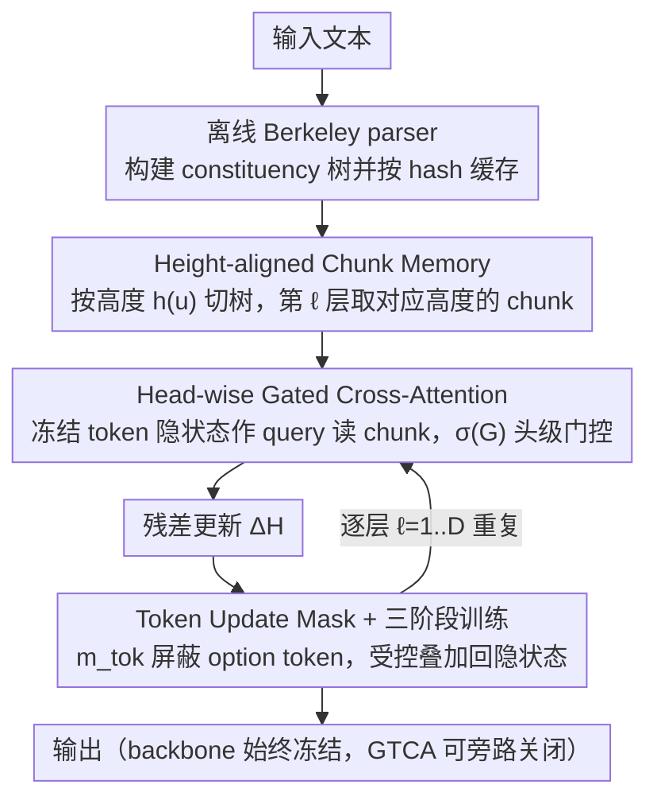

# Gated Tree Cross-Attention for Checkpoint-Compatible Syntax Injection in Decoder-Only LLMs

**会议**: ACL 2026  
**arXiv**: [2602.15846](https://arxiv.org/abs/2602.15846)  
**代码**: <https://github.com/Pineandgrass/GatedTreeCrossAttention>  
**领域**: LLM 架构 / 句法注入 / 检查点兼容  
**关键词**: GTCA、句法注入、checkpoint-compatible、constituency chunk memory、token update mask

## 一句话总结
作者给冻结的 decoder-only LLM（Qwen-2.5-7B、Llama-3-8B）外挂一个 Gated Tree Cross-Attention 侧支路 —— 离线 Berkeley parser 预算 constituency 树并按高度索引成 chunk memory，token 隐状态通过 head-wise 门控 cross-attention 读它得到残差更新，再配合 token update mask + 三阶段训练防止干扰；BLiMP 准确率从 78.58/79.95 提升到 83.12/84.61，同时 MCQA、HellaSwag、WinoGrande 完全不退步。

## 研究背景与动机
**领域现状**：decoder-only LLM 在聚合 benchmark 上分数很高，但在细粒度语法压力测试（BLiMP、HANS、CoLA）上常常翻车 —— 用户体验是"同一意思、不同写法、得到完全相反的答案"，这种脆性还会级联到下游推理。probing 工作已经反复证明 LLM 内部隐状态能恢复出依存几何（Hewitt & Manning 2019），即句法是"被编码"的。

**现有痛点**：① "encoding ≠ usage"，可恢复不等于真在用 —— BLiMP 上 GPT-2 离人类水平仍远；② 主流的句法注入方法（修改 attention bias、tree-RNN、加 dependency-aware attention）通常需要重写架构或全量再训练，对已经训好的 LLM 不友好，naive 注入还会触发灾难性遗忘；③ LoRA/QLoRA 之类参数高效方法不改变 attention 结构，没法引入"显式树结构"这种 inductive bias。

**核心矛盾**：想给一个已训好的 checkpoint 引入显式句法层级信号，但又不能动 backbone 也不能干扰 pretrained competence；同时不能影响 likelihood-based MCQA 评分（如果改了选项 token 的隐状态，选项之间的相对似然就被污染了）。

**本文目标**：构造一条"可装可卸、随时旁路"的句法注入路径，让模型自己学会什么时候信、信多少，并能在保持 backbone 不变的前提下，在句法 benchmark 上稳定提升，同时不伤其他能力。

**切入角度**：作者把 constituency parse 树**离线**算好并按 hash 缓存（消除训练时 parser 开销），按 tree height 切成 chunk memory，并用 layer-aligned 方式喂给对应 transformer 层 —— 高层喂高 chunk、低层喂叶 chunk，让层级 inductive bias 与 transformer 自然分层对齐。

**核心 idea**：把树结构作为一份**外部缓存 + 门控注意力源**塞给 decoder-only LLM —— 像 RAG 一样，但 retrieve 的是句法 chunk 而不是文档 —— 然后用 head-wise gate 把"用还是不用"完全交给模型自学。

## 方法详解

### 整体框架
GTCA 的整体思路是给一个已经训好的 decoder-only LLM 挂一条"可装可卸"的句法侧支路，而完全不去改写 backbone 本身。输入文本先在离线阶段被 Berkeley Neural Parser 解析成 constituency 树并按 hash 缓存，训练时不再付出 parser 开销；这棵树被按高度切成多层 chunk memory，逐层喂给对应的 transformer 层。在第 $\ell$ 层，当前 token 的隐状态作 query、通过一条头级门控的 cross-attention 去读这一层的 chunk memory，得到一个残差更新 $\Delta H^\ell$，再经一道 token update mask 过滤后才叠加回隐状态、送入下一层。整条路径从输入端的离线解析、到中间的逐层门控读取、到输出端的受控残差注入，backbone 参数始终可冻结，GTCA 分支随时可旁路关闭。

### 关键设计

**1. Height-aligned Chunk Memory：让树的高度对齐 transformer 的层**

朴素地把整棵 parse 树一股脑塞给每一层，会让高层 token 反复被叶级噪声打扰，也违背了 transformer "低层抓局部句法、高层抓全句语义"这一被 probing 工作反复证实的分层规律。GTCA 顺着这个规律来切树：定义 chunk 高度 $h(u)=D-\text{depth}(u)$，叶 token 高度为 0、根节点最高；每个 chunk 先对其 span 内 token 做 mean-pool 得 $p_u=\text{MeanPool}(E^i, i\in S(u))$，再过一个 height-specific 投影矩阵 $W_{h(u)}\in\mathbb{R}^{d\times d}$ 加 LayerNorm 得到 $c_u$。第 $\ell$ 层只取 $h(u)=\min(\ell, D)$ 的 chunk，按左到右 BFS 顺序最多保留 $K=64$ 个。这样低层喂局部短语、高层喂全句结构，外部树信息进入的"接口"与 backbone 自身的句法分层天然吻合，模型最容易把它接住。height-specific 投影而非共享投影也是有意为之——消融显示一次性投影会让 BLiMP 略降，层级耦合是必要的。

**2. Head-wise Gated Cross-Attention：把"用不用句法"交给每个 head 自己学**

句法注入最怕硬来：无门控地强制 backbone 在每层都吸收 chunk 信号，会直接污染 pretrained 表征。GTCA 在标准 cross-attention（$Q=H_{\text{pre}}^\ell W_Q^\ell$，$K=C^\ell W_K^\ell$，$V=C^\ell W_V^\ell$）之上额外学一个头级门 logit $G^\ell = H_{\text{pre}}^\ell W_G^\ell$，attention 输出再乘上 sigmoid 门 $\text{Gated\_Attn}^\ell = \text{Attn}^\ell \odot \sigma(G^\ell)$——注意这是每个 head 一个标量门、而非 element-wise，参数更少、训练更稳。同时加一道 causal mask 屏蔽右边界超过当前 token 的 chunk，保证自回归性不被破坏，最终残差为 $\Delta H^\ell = \text{Merge}(\text{Gated\_Attn}^\ell)W_O^{ca,\ell}$。门控的意义在于把"显式树是 hard constraint"变成"显式树是可选 prior"：每个 head 自己学会"我现在这个查询到底需不需要句法"，等价于一套自学习的 sparse routing，既能在需要时选择性引入结构、又能在不需要时保留原表征。消融里去掉门控（硬注入）会显著掉点，正印证了这一点。

**3. Token Update Mask + 三阶段训练：从空间和时间两条轴守住 pretrained 能力**

"checkpoint-compatible"这一核心约束意味着任何对 hidden state 的改动都可能毁掉已学好的能力，GTCA 为此设了两道互补的安全闸。空间维度上，用一个二值 mask $m_{\text{tok}}\in\{0,1\}^n$ 控制残差作用范围，$H_{\text{post}}^\ell \leftarrow H_{\text{pre}}^\ell + \alpha_{\text{struct}}(m_{\text{tok}} \odot \Delta H^\ell)$；其中 MCQA 输入里的 option token 被强制 $m_{\text{tok}}=0$，因为 likelihood-based 评分依赖 option token 的 logprob，一旦改动这些 token 的隐状态就等于直接篡改答案的概率分布。时间维度上，训练走三阶段 schedule：先冻结 backbone 只训 GTCA 投影与 gate，再联合开放与 GTCA 直接交互的受影响子模块，最后全量但以低学习率收敛——这样避免冷启动时一个过大的 $\Delta H$ 把已学好的 token 状态一次推飞。mask 锁住空间作用域、schedule 锁住时间作用域，两者叠加才让"加了 GTCA 后 MCQA 不退步"成为可能；消融里任意去掉一道，要么 MCQA 退步、要么训练失稳。

### 损失函数 / 训练策略
继续训练采用语言建模 loss + MCQA-friendly 格式。三阶段 schedule 第一阶段冻结 backbone 只训 GTCA 投影与 gate，第二阶段开放与 GTCA 直接交互的子模块，第三阶段全量但用低学习率收敛。chunk 数量上限 $K=64$，scaling factor $\alpha_{\text{struct}}$ 控制残差幅值；offline parse 用 Berkeley Neural Parser 并按 token ID hash 缓存，训练时零 parser 开销。

## 实验关键数据

### 主实验（BLiMP 句法能力）

| 模型 | Baseline BLiMP | + GTCA | $\Delta$ |
|------|---------------|--------|----------|
| Qwen-2.5-7B | 78.58 | **83.12** | **+4.54** |
| Llama-3-8B | 79.95 | **84.61** | **+4.66** |

| 类别 | 任务 | Baseline | + GTCA | 说明 |
|------|------|----------|--------|------|
| 句法 | BLiMP | 78.58-79.95 | 83.12-84.61 | 提升 4-5 pp |
| 句法 | CoLA (GLUE) | — | 一致提升 | 语法接受度判断 |
| MCQA | CLOTH | — | 持平或微升 | 完形填空，不退 |
| MCQA | MMLU | — | 持平或微升 | 知识 QA，不退 |
| 常识 | HellaSwag | — | 持平 | 常识续写 |
| 常识 | WinoGrande | — | 持平 | 共指消解 |

### 消融实验

| 配置 | 关键指标 | 解读 |
|------|---------|------|
| Full GTCA (height-aligned + gated + mask + stage) | BLiMP 83.12 | 完整模型 |
| w/o head-wise gate (硬注入) | 显著掉点 | backbone 表征被污染 |
| w/o token update mask（也改 option token）| MCQA 退步 | option likelihood 漂移 |
| w/o 三阶段 staged training | 训练不稳 / 性能掉 | 冷启动大 $\Delta H$ 毁 pretrained |
| 一次性投影（替代 height-specific $W_{h(u)}$）| BLiMP 略降 | 层级耦合是必要的 |

### 关键发现
- **门控是注入成功的关键**：head-wise gate 让模型自己决定每个 head 该不该信任 chunk memory，相比硬注入既保留 pretrained 能力又能选择性使用结构 —— 这把"显式句法 vs 隐式 LLM 能力"的 trade-off 从架构选择问题变成了自学习问题。
- **option token 必须 read-only**：MCQA 任务下，把句法更新施加到 option token 上会改变它们的 logprob，从而漂移答案选择；这条工程经验对所有想在 likelihood-based MCQA 上做继续训练的方法都有警示意义。
- **layer-aligned chunk memory 给出可解释的层级利用**：UUAS probe 显示注入 GTCA 后内部隐状态的 unlabeled undirected attachment 一致性增强，且高层依赖更高 chunk、低层依赖叶 chunk —— 与 transformer 自身的句法分层共识吻合。
- **句法提升不以广义能力为代价**：所有 MCQA / 常识任务持平或微升，说明三道安全机制（gate + mask + staged）确实成功隔离了干扰范围。

## 亮点与洞察
- **"句法当作外部检索源"的范式**：把 parse tree 视为可缓存、可旁路、可门控的外部记忆，使句法注入和 RAG 在工程哲学上对齐 —— LLM 永远不被改写，外部知识源永远是 hot-swappable。这套范式可以原样套到"形态学外挂"、"逻辑表达式外挂"、"领域本体外挂"。
- **checkpoint-compatible 是工业最关心的属性**：现代 LLM 训练成本极高，任何要求"重写 backbone 或重新预训练"的方法在实际部署里几乎都过不了立项；GTCA 用一条 forward wrapper + 三道安全机制让句法增强进可攻退可守，这种"加挂式"思路值得所有后续可微外挂模块借鉴。
- **token update mask 是被忽视的关键 detail**：很多继续训练方法都没区分"哪些 token 可以被改、哪些不能"，本文用 MCQA option token 这个具体例子展示了 hidden state 改动如何泄漏到 likelihood-based 评分，是工程实践的好教材。
- **height-specific 投影 + layer alignment**：把"tree height ↔ transformer layer"做硬绑定是一个很自然但少有人系统验证的选择；本文给出消融证据并配合 UUAS probe 解释，比直觉断言更扎实。

## 局限与展望
- 只在两个 ~7-8B 的 decoder-only 上做：14B/70B、MoE、混合架构未测；不同 backbone 的 attention 几何不同，GTCA 的 height-alignment 是否还适用未知。
- 依赖外部 constituency parser：parser 的错误会被缓存并永久注入，作者没有讨论 parser 噪声鲁棒性；对低资源语言或非英语，parser 质量本身就是瓶颈。
- 训练阶段 chunk memory 缓存对存储和工程链路有要求（hash 索引、span alignment）；对在线 / streaming 场景如何重算缓存未给方案。
- BLiMP 是英语句法压力测试，提升 4-5 pp 看上去显著但仍远低于 95+ 人类水平；GTCA 对 long-range syntactic dependency（如 island、binding）是否有提升、提升多少，未在文中拆解。
- 没有与 LoRA / Adapter 等 PEFT 方法做"参数预算等价对比"，GTCA 加的可训参数量是多少、与同等预算的 LoRA 对句法增益谁更高，缺少对照。

## 相关工作与启发
- **vs Strubell et al. 2018 / Bugliarello & Okazaki 2020**：他们改 self-attention bias 注入依存信息，需要从零或全量微调；GTCA 不动 backbone 自注意力，仅加旁路 cross-attention，工程上对已发布 checkpoint 友好得多。
- **vs Bai et al. 2021（plug-in syntax）**：相似的"plug-in"哲学但用在 encoder-only PLM 上；GTCA 把这一思路带到 decoder-only 并解决 MCQA-likelihood 干扰这个 decoder 特有的痛点。
- **vs Iwamoto et al. 2023（continued training with syntactic knowledge）**：他们明确讨论了灾难性遗忘问题；GTCA 的 token update mask + staged training 可以视为对这一遗忘问题的具体工程化解决方案。
- **vs LoRA / QLoRA / prefix-tuning**：那些是结构无关的参数高效微调；GTCA 是"结构感知 + 检查点兼容"的注入路径，两条路径正交，原则上可叠加（GTCA + LoRA backbone）。
- **vs Hewitt & Manning 2019 probing**：probing 只能证明"语法在那"，本文用 UUAS probe 在加 GTCA 前后做对比，给出"加了显式注入后内部 attachment 更一致"的因果证据，是 probing 到 intervention 的延伸。

## 评分
- 新颖性: ⭐⭐⭐⭐ 把树结构外挂 + 头级门控 + 双安全机制组合是新颖且工程上扎实
- 实验充分度: ⭐⭐⭐⭐ 两个 backbone + 6 个 benchmark + UUAS probe + 消融，但 backbone 规模偏小
- 写作质量: ⭐⭐⭐⭐ 方法部分公式与符号清晰，三道安全机制讲得很透
- 价值: ⭐⭐⭐⭐ checkpoint-compatible 这条线对工业部署很实用；句法外挂范式有迁移潜力

<!-- RELATED:START -->

## 相关论文

- [\[ACL 2026\] Evaluating Legal Reasoning Traces with Legal Issue Tree Rubrics](evaluating_legal_reasoning_traces_with_legal_issue_tree_rubrics.md)
- [\[ACL 2026\] HoWToBench: Holistic Evaluation for LLM's Capability in Human-level Writing using Tree of Writing](howtobench_holistic_evaluation_for_llms_capability_in_human-level_writing_using_.md)
- [\[ACL 2025\] CuLEmo: Cultural Lenses on Emotion - Benchmarking LLMs for Cross-Cultural Emotion Understanding](../../ACL2025/llm_evaluation/culemo_cultural_lenses_on_emotion_-_benchmarking_llms_for_cross-cultural_emotion.md)
- [\[NeurIPS 2025\] PARROT: A Benchmark for Evaluating LLMs in Cross-System SQL Translation](../../NeurIPS2025/llm_evaluation/parrot_a_benchmark_for_evaluating_llms_in_cross-system_sql_translation.md)
- [\[ICML 2026\] Who Flips? Self- and Cross-Model Counterarguments Reveal Answer Instability in LLMs](../../ICML2026/llm_evaluation/who_flips_self-_and_cross-model_counterarguments_reveal_answer_instability_in_ll.md)

<!-- RELATED:END -->
