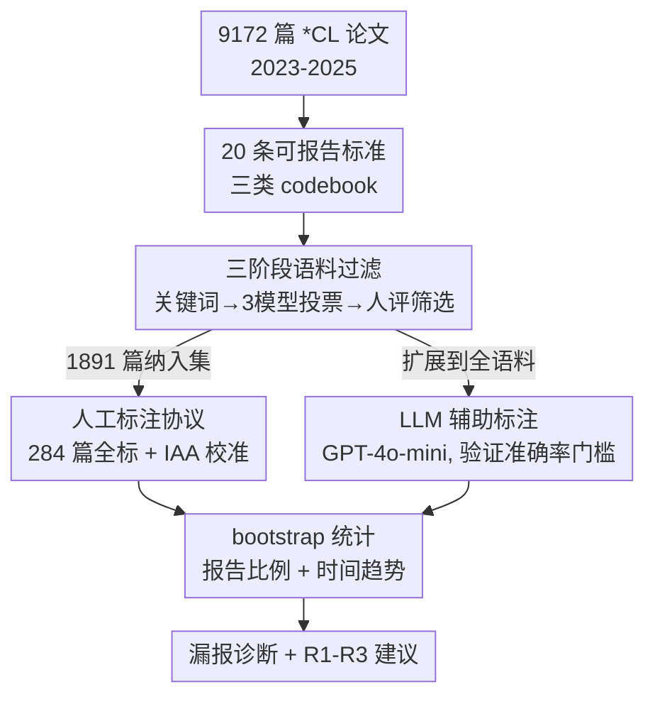

# Illusions of the Gold Standard: A Large-scale Analysis of Human Evaluation Protocols for Long-form Text Generation

**会议**: ACL 2026  
**arXiv**: [2606.07936](https://arxiv.org/abs/2606.07936)  
**代码**: https://github.com/larchlab/Illusions-of-the-Gold-Standard  
**领域**: LLM评估 / NLP生成 / 可复现性  
**关键词**: 人工评估, 可复现性, 报告规范, 长文本生成, LLM-as-judge

## 一句话总结
作者把研究镜头对准 NLP 社区自己：用一套 20 条「可报告标准」的 codebook，对 2023–2025 年 *CL 会议 9100+ 篇论文做大规模审查（284 篇全人工标注 + 1800+ 篇 LLM 辅助标注），证明被奉为「黄金标准」的人工评估其实普遍报告缺失——超半数论文只报告了 20 条里的 ≤7 条，统计显著性几乎没人报、power analysis 零人用，黄金标准更像是一种「错觉」。

## 研究背景与动机
**领域现状**：随着 LLM 普及，长文本/开放式生成已成为 NLP 研究主流（2025 年约一半 *CL 论文研究长文本生成）。这类任务缺乏可靠的自动指标，人工评估被默认当成「黄金标准」，在医疗、科学、法律、政策、谣言检测等高专业度领域尤其如此。

**现有痛点**：人工评估的可信度依赖于透明、可复现的协议，但这些细节在实践中频繁缺失。读者常常搞不清楚一项评估到底「测了什么、怎么测的、谁来判的、判断该如何解读」。已有的可复现性框架（会议 checklist、评估表、model/data card）作用有限——checklist 由作者自填、几乎不在评审中被核验，重要的设计细节照样漏报。

**核心矛盾**：人工评估正在被赋予越来越关键的角色——不仅直接评估模型，还日益承担「元评估」职责，去校验 LLM-as-judge 的可靠性。可一旦人工评估本身记录潦草、跨研究无法比较，它就撑不起黄金标准这个名号：地基松动，上层结构必塌。

**本文目标**：不是去批评某一篇具体论文，而是刻画整个社区的报告规范现状，量化「漏报」到底有多严重，并给出可落地的改进建议。具体拆成：① 该报告哪些东西？② 现状报告了多少？③ 时间趋势怎么变？

**切入角度**：把科学方法的核心操作阶段（设计、数据收集、分析解读）映射成作者可报告的具体决策，形成一套刻意「宽松」的判定标准——只要论文报告了某项信息的任何内容就算通过，不评判内容是否充分。这样得到的是一幅保守的漏报图景，意味着真实情况只会更糟。

**核心 idea**：用「20 条可报告标准 + 三阶段语料过滤 + 人工/LLM 双轨标注」对社区做一次大规模实证审计，把「黄金标准的错觉」用数据钉死。

## 方法详解

### 整体框架
这篇论文不提新模型，它的「方法」是一条**审计流水线**：先用文献调研把人工评估该报告什么凝练成一套 codebook（37 题，其中 20 条为核心可报告标准），再从 9172 篇 *CL 论文里层层过滤出「研究长文本生成 + 含人工评估」的目标集（1891 篇），抽样 356 篇做全人工标注（最终 284 篇满足纳入条件），其余用 LLM 辅助标注扩展到全语料，最后做 bootstrap 统计估计每条标准的报告比例与时间趋势。整条管线如下：

### 关键设计

**1. 20 条可报告标准 codebook：把「该报告什么」固化成可勾选的清单**

针对「漏报谁也说不清漏了啥」这个痛点，作者把可复现科学的三个操作阶段映射成 37 个问题，其中 20 条是核心可报告标准（binary，论文要么报告了=Yes，要么没有=No/N/A），分三类：**任务文档（4 条）**——评估了哪些维度（偏好/准确性/事实性…）、为何选这些维度、给标注者的指引；**标注设计（9 条）**——标注界面、样本量、质量保证流程，以及标注者的招募平台、纳入/排除标准、报酬、人数；**分析与解读（7 条）**——标注者人口学信息、一致性（IAA）、是否做分歧消解/数据过滤、统计指标、是否讨论局限。codebook 由两位 lead + 两位资深作者经四轮归纳-演绎迭代开发，每轮独立编码 5 篇再讨论收敛。作者强调并非所有 20 条都适用于每个场景（如分歧已用讨论消解，IAA 可能就没必要），但预期多数研究应能报告其中约 15–16 条。

**2. 三阶段渐进式语料过滤：从 9172 篇精确锁定 1891 篇目标集**

要做社区级审计，第一难关是从海量论文里捞出「长文本生成 + 人工评估」的子集。作者设计三步漏斗：**Step 1 关键词过滤**——用 GPT-4 扩展种子词（summarize、dialogue、long-form 等）做带词干还原的大小写不敏感匹配，9172→8408；**Step 2 LLM 过滤**——用 Gemini-2.5-Pro、Claude-3.7-Sonnet、GPT-4o-mini 三模型多数投票回答两个二元筛选题（是否长文本生成、是否含人工评估），至少两模型对两条都答 Yes 才保留，得到 3620 篇长文本生成、其中 1891 篇含人工评估；人工抽检 50 篇被否决样本估出假阴率约 6%；**Step 3 分层抽样**——从 1891 篇里按会议分层抽 356 篇做人工标注（聚焦 2024–2025 的近期实践）。长文本生成定义为自由形式自然语言生成，排除机器翻译和代码生成。

**3. 人工标注协议：刻意宽松 + 多周校准，换来保守但可信的漏报估计**

两位 lead + 三位 contributor（1 本科 + 2 硕士）标注 284 篇。设计上有两个关键选择：其一**刻意宽松**——只要论文报告了某项的任何信息就给分，不判断内容是否充分，这让最终结果成为漏报的**下界**（真实漏报只会更多）；其二**严格校准**——三周 onboarding（讲解 codebook→独立标 10 篇→与 lead 比对一对一反馈→再标 5 篇复评），所有人在最终 onboarding 集上达到 73% 一致率后才分配各自不重叠的批次，每人标 50–138 篇，一位 lead 还对 60%（105 篇）做随机质检。IAA 在 5 篇保留集上计算：二元题一致率 81%、Cohen's $\kappa=0.51$，单标签多选题一致率 69%、$\kappa=0.52$。数值/多选/定性答案还被构造成二元 dummy 变量（如从数值 IAA 派生 `IAA_reported`），再用 $n=500$ 的 bootstrap 有放回重采样估计每条标准的真实报告比例与标准误。

**4. LLM 辅助标注：把审计从 284 篇放大到全语料，并用验证门槛守住可信度**

人工标不完全部，作者用 GPT-4o-mini 对剩余论文做标注。输入上下文由摘要、引言和用关键词定位的人工评估相关章节（正文+附录）拼成，按 codebook 分块提问、做类型检查与「数值或 NA」约束，块级或全文校验失败则最多重跑两次。用 26 篇做 prompt 调优、125 篇做独立验证集。关键是只汇报**验证准确率 >0.75** 的那些问题的 LLM 结果，把可疑题挡在外面——这保证了大规模自动标注不至于污染结论，人工结果仍作为主要发现、LLM 结果只作补充证据。

## 实验关键数据

### 语料过滤与抽样规模

| 阶段 | 论文数 | 说明 |
|------|--------|------|
| 起始语料（*CL 2023–2025） | 9172 | ACL/EMNLP/NAACL/EACL/AACL |
| Step 1 关键词过滤 | 8408 (92%) | 长文本生成候选 |
| Step 2A LLM 过滤：长文本生成 | 3620 (39%) | 三模型多数投票 |
| Step 2B LLM 过滤：+ 人工评估 | 1891 (21%) | 纳入集 |
| Step 3 抽样人工标注 | 356 | 最终 284 篇满足纳入条件 |

### 核心发现：报告比例（20 条标准的代表项）

| 报告项 | 报告比例 | 解读 |
|--------|---------|------|
| 评估维度 | 98% | 几乎都报告 |
| 标注样本量 | 85% | 较常报告 |
| 标注者人数 | 77% | 较常报告 |
| 维度选择的理由 | ~50% | 一半论文给不出依据 |
| 任务指引 | ~50% | 标注者怎么判常不写 |
| 报酬信息 | 29% | 罕见 |
| 局限讨论 | 19% | 极少 |
| IRB 判定 | 11% | 罕见 |
| 统计指标 | 9% | 触目惊心地低 |
| Power analysis 定样本量 | 0% | 无人使用 |

### 关键发现
- **「黄金标准」名不副实**：报告标准数的众数是 7/20，过半论文 ≤7 条（中位数 7，SD 3），仅 5 篇 >13 条，**没有一篇报告全部 20 条**。
- **样本量/标注人数有「惯例」但无依据**：报告的样本量从 10 到 23040 横跨三个数量级（中位 170），标注者中位 3 人（32% 用 3 人、20% 用 2 人）；报告 >1 名标注者的论文里只有 51% 报告 IAA（占总体 46%）。
- **标注者信息普遍缺失**：29% 完全不报告人口学信息，65% 不报告招募平台；报告了的论文中 50% 招专家、31% 招学生、13% 直接拿论文作者当标注者。
- **质量控制稀缺**：仅 6% 做数据过滤、22% 有质量保证流程；30% 报告分歧消解（多数投票 38% 最常见）。
- **时间趋势耐人寻味**：研究长文本生成的论文比例从约 30% 升到 2025 年的 50%，但其中用人工评估的比例稳定在约 20%（即相对在降）；用人工评估去**元评估 LLM-judge** 的比例上升（EMNLP'23 的 4% → EMNLP'24 的 30%），但这些论文的报告质量并未见明显改善。

## 亮点与洞察
- **把审计工具本身也做成可复现范本**：作者在 R1 建议里直接给出一段「示范性报告文字」，把 20 条标准压进一小段话——证明充分报告并不需要占很多篇幅，反驳了「报告太占地方」的常见借口。
- **「宽松判定」是方法论上的妙手**：只要报告任何信息就算过，使得所有结论都是漏报的下界，任何人都无法用「你判太严」来反驳——这把一个易争议的主观标注任务变成了不可辩驳的保守证据。
- **人工/LLM 双轨 + 0.75 验证门槛**可迁移到任何大规模文献计量审计：既要规模又要可信时，用人工标注的小集合去验证 LLM 标注，只采信高准确率的题目。
- **最深的洞察是「元评估悖论」**：当社区越来越用人工评估去校验 LLM-judge，人工评估反而更需要严格——你不能用一把没刻度的尺子去校准另一把尺子。

## 局限与展望
- **仅限 *CL 会议、近三年**：未覆盖其他会议/期刊或相邻社区，外推性存疑。
- **IAA 只报整体层面**：标注任务实为多个子任务（抽 IAA、识别主任务等）的组合，难度差异被整体 IAA 掩盖，item 级估计又太不稳定。
- **「可报告」本身依任务而异**：什么算该报告会随任务/评估角色变化，作者刻意留出解释空间，未来可做更细粒度或自适应的标准清单。
- **报告开销 vs 迭代速度的张力**：作者也承认快速模型迭代场景下额外文档是负担，但主张涉及人工评估时需有基线文档，权衡应被显式写出而非默默省略。

## 相关工作与启发
- **vs 可复现性框架（checklist / 评估表 / model card）**：已有框架靠作者自填、几乎不被评审核验；本文不止提框架，还做了大规模实证审计，量化了这些框架未能堵住的漏洞。
- **vs Fleisig et al. (2024) 等人工评估缺陷研究**：他们针对特定任务/维度（如分歧报告）提倡更细记录；本文把这些洞见吸收进 codebook（如不仅记 IAA、还记是否说明分歧如何消解），并扩到社区尺度。
- **vs Howcroft et al. (2020) 等早期报告批评**：从轶事和小规模批评，升级为 9100+ 篇的系统量化，使「漏报严重」从印象变成证据。

## 评分
- 新颖性: ⭐⭐⭐⭐ 不提新模型，但「把镜头对准社区自身」的大规模实证审计视角新颖且必要。
- 实验充分度: ⭐⭐⭐⭐⭐ 9100+ 篇语料、284 篇全人工标注 + LLM 辅助、bootstrap 统计与 IAA 校准齐备。
- 写作质量: ⭐⭐⭐⭐⭐ codebook、过滤管线、发现与建议层层递进，论证克制且自洽。
- 价值: ⭐⭐⭐⭐⭐ 直击「黄金标准」可信度，给出可立即采用的报告模板，对整个 NLP 评估生态有规范意义。

<!-- RELATED:START -->

## 相关论文

- [\[ACL 2026\] Comprehensiveness Metrics for Automatic Evaluation of Factual Recall in Text Generation](comprehensiveness_metrics_for_automatic_evaluation_of_factual_recall_in_text_gen.md)
- [\[ACL 2026\] Minos: A Multimodal Evaluation Model for Bidirectional Generation Between Image and Text](minos_a_multimodal_evaluation_model_for_bidirectional_generation_between_image_a.md)
- [\[ACL 2026\] Attribution, Citation, and Quotation: A Survey of Evidence-based Text Generation with Large Language Models](attribution_citation_and_quotation_a_survey_of_evidence-based_text_generation_wi.md)
- [\[ACL 2025\] Atomic Calibration of LLMs in Long-Form Generations](../../ACL2025/llm_evaluation/atomic_calibration_of_llms_in_long-form_generations.md)
- [\[ACL 2025\] Pap2Pat: Benchmarking Outline-Guided Long-Text Patent Generation with Patent-Paper Pairs](../../ACL2025/llm_evaluation/pap2pat_benchmarking_outline-guided_long-text_patent_generation_with_patent-pape.md)

<!-- RELATED:END -->
