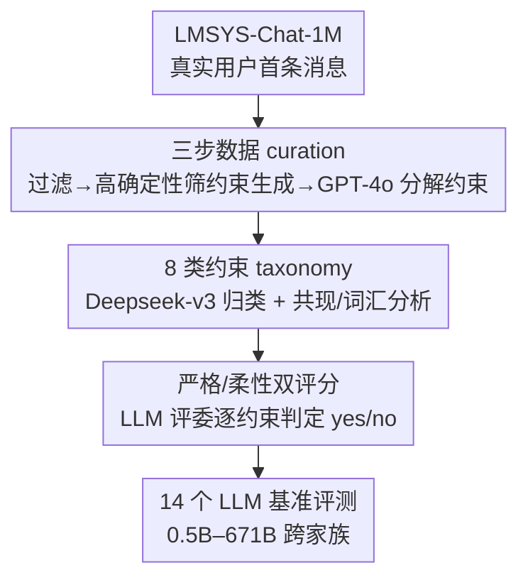

# WildIFEval: Instruction Following in the Wild

**会议**: ACL2026  
**arXiv**: [2503.06573](https://arxiv.org/abs/2503.06573)  
**代码**: https://github.com/gililior/wild-if-eval-code  
**领域**: LLM 评测 / 指令遵循  
**关键词**: 指令遵循, 约束生成, 真实用户数据, 约束分解, LLM-as-judge

## 一句话总结
WildIFEval 是一个从真实用户对话里抽取、规模达 7,523 个任务 / 24,731 条约束的单轮约束生成基准：它把每个用户指令自动分解成细粒度约束、归入 8 大类别，并用 LLM 评委做"严格/柔性"双评分，从而首次大规模刻画真实指令里约束的分布与共现，并揭示出"约束数一多、模型整体成功率骤降但单约束成功率几乎不变"的容量瓶颈。

## 研究背景与动机
**领域现状**：随着 LLM 越来越会遵循指令，用户的指令本身也在变复杂——一句"总结这段文字"如今常变成"用两段总结这篇影评，第一段讲剧情、第二段讲值不值得看"。这类个性化任务自带显式或隐式的约束，模型必须在生成时同时满足一组要求。

**现有痛点**：现有指令遵循 benchmark（IFEval、FollowBench、InFoBench）大多是"自底向上"造出来的——先定一批可机械验证的约束或一套约束类型 taxonomy，再人工/合成地生成指令。这种做法可能根本捕捉不到真实用户提出的约束类型、组合和复杂度；而且规模小、只覆盖容易验证的"硬约束"，对内容/质量/风格这类"软约束"束手无策。

**核心矛盾**：合成数据的"可验证性"与真实数据的"多样性、真实性"之间存在张力——越追求规则可验证，就越偏离真实用户在野外（in the wild）实际怎么提约束。

**本文目标**：构建一个源自真实用户、规模远超现有英文数据集、且对 SOTA 模型仍有挑战的多约束指令基准，并支持细粒度（逐约束）评测。

**切入角度**：从 Chatbot Arena 的真实对话日志（LMSYS-Chat-1M）里捞约束生成任务，再把每个任务自动**分解成单个约束**，这样既保留了真实用户语言的多样性，又获得了逐约束打分所需的粒度。

**核心 idea**：用"真实日志 → 高确定性筛选约束生成任务 → LLM 分解约束 → 8 类 taxonomy + 严格/柔性双评分"这条流水线，把"野外的约束遵循能力"变成可量化、可分析的基准。

## 方法详解
WildIFEval 的"方法"是一条数据构建 + 评测协议流水线，而非新模型。它的价值在于：怎么从噪声极大的真实日志里干净地抽出约束、怎么验证抽取质量、以及怎么把"满足约束"量化成可比的分数。

### 整体框架
从 LMSYS-Chat-1M 取每段对话的首条用户消息，经三步 curation 得到 7,523 个约束生成任务、每个任务带一份约束清单（共 24,731 条不重复约束、平均 3.25 条/任务）；再用 Deepseek-v3 把所有约束分到 8 个类别；评测时对 14 个 LLM 的回答，用 LLM 评委逐约束判断是否满足，聚合成严格分（全满足才算过）与柔性分（满足比例）。

### 关键设计

**1. 三步数据 curation：从真实日志里高精度地捞出"带约束"的任务并拆成原子约束**

针对"合成数据捕捉不到真实约束多样性"的痛点，作者设计三步流水线。第一步过滤：取每段对话首条用户消息，剔除非英文、编程任务和含毒性语言的样本（用 detoxify 检测）。第二步筛约束生成任务：沿用 Ferraz 等人的定义和提示，让 Llama3.1-405B 回答 yes/no，但**不是简单解析字符串，而是用模型给 "yes" token 的概率当确定性分**，只保留确定性最高的前 10%（阈值约 0.94，而全体得分均值仅 0.29、中位 0.07，说明绝大多数任务并非约束生成）——这刻意做成高精度、保守的子集。第三步分解：用 GPT-4o 把每个任务拆成单个约束，对出现超过 40 次的高频约束做下采样（仅影响 15 条、<0.15%），并滤掉约束超过 8 条的极端任务。

**2. 8 类约束 taxonomy：用数据驱动方式补齐现有分类的空白**

针对"现有工作要么类别太细（如'词性规则'）要么太泛（如'内容约束'）、缺统一 taxonomy"，作者结合既有分类与数据驱动观察（看约束里最高频的词及其语境），归纳出 8 个主类别：Include/Avoid（包含/排除内容）、Editing（编辑已有文本）、Ensure Quality（质量要求）、Length（长度限制）、Format and Structure（格式与结构）、Focus/Emphasis（侧重点）、Persona and Role（角色扮演）、Style and Tone（风格与语气）。最常见的是内容类约束 Include/Avoid 与 Focus/Emphasis。tSNE 可视化显示一个直观规律：内容相关约束（Include/Avoid、Focus/Emphasis）在语义空间里弥散分布，而形式相关约束（Length、Format）聚成清晰簇——前者天然多样、后者高度模板化。作者还用 PMI 分析共现，发现只有少数组合超出预期（如 Persona 与 Style/Tone 倾向同现）。

**3. 严格/柔性双评分 + LLM-as-judge：把"满足约束"量化成两个互补的分**

针对"约束既有可机械验证的硬约束、又有主观的软约束"，作者用 LLM 评委 $J$ 对任务 $t_i$、模型回答 $r_i=M(t_i)$ 和单个约束 $c_i^j$ 做 yes/no 判断 $J(t_i,r_i,c_i^j)\in\{0,1\}$（贪心解码保证一致）。两个分数定义为：

$$soft(r_i\mid t_i)=\frac{1}{N(t_i)}\sum_{j=1}^{N(t_i)}J(t_i,r_i,c_i^j), \qquad strict(r_i\mid t_i)=\prod_{j=1}^{N(t_i)}J(t_i,r_i,c_i^j)$$

其中 $N(t_i)$ 是约束数。柔性分是"满足约束的比例"，严格分是"全满足才算 1"（连乘）。评委选 Deepseek-v3——它在 500 个任务上与 GPT-4o 评委一致性最高；且基准与 IFEval/MMLU/GPQA 的 Kendall's Tau 相关性 >0.82，说明评测信号可靠。

## 实验关键数据

整个流水线先经人工验证：在两个各 100 任务的随机子集上，分解质量按正确性/完整性/独立性三维 1–5 Likert 打分，均分分别为 4.71 / 4.64 / 4.77；筛选有效性方面，前 10% 确定性阈值与人工判断一致性达 75.8%（最优可达 77.9%），且假阴远多于假阳（仅 1 个任务被模型单独判为约束生成、22 个被人工单独判为），证明筛选保守、高精度。模型评测覆盖 5 个家族、14 个指令微调 LLM，规模从 0.5B 到 671B，零样本设定。

### 基准规模对比

| 基准 | 数据来源 | 评测方式 | 任务数 | 约束数 |
|------|----------|----------|--------|--------|
| IFEval | 合成 | 规则 | 541 | - |
| FollowBench | 众包+合成 | 模型/规则 | 1,852 | - |
| InFoBench | 众包 | 模型/规则 | 500 | 2,217 |
| **WildIFEval (本文)** | **真实用户** | **模型** | **7,523** | **24,731** |

WildIFEval 是目前最大的、由真实用户指令构成的英文指令遵循基准，平均每任务 3.25 条约束。

### 模型评测与分析

| 分析维度 | 关键观察 |
|----------|----------|
| 整体难度 | 最强模型严格分约 0.7；Deepseek-v3、Llama3.3-70B 仍在 25–30% 任务上无法满足全部约束 |
| 规模效应 | 同家族内大模型一致优于小模型（例外：Llama3.3-70B 反超 Llama3.1-405B） |
| 约束数增加 | 严格分随约束数骤降，但柔性分（单约束满足率）几乎不变 |
| 约束类型难度 | 模型在 Length 上最吃力、Format and Structure 次之；Focus/Emphasis 这类软约束反而容易 |
| 分解质量（人工） | 正确性 4.71 / 完整性 4.64 / 独立性 4.77（满分 5） |

### 关键发现
- **容量瓶颈而非能力退化**：约束一多，严格分掉得很快，但柔性分稳定——说明模型不是"变得不会遵循指令了"，而是"同时兼顾多条约束时顾此失彼"，这是 juggling 多约束的容量瓶颈。
- **硬约束比软约束难**：模型在 Length（尤其要求精确字数/音节数）和 Format 这类刚性、形式化约束上失败最多；错误分析显示绝大多数失败案例属 Length 类。
- **长度约束可被 LLM 评委可靠评判**：作者额外比对了 LLM 评委与"正则抽 700 条长度约束 + 空格计词"启发式的吻合度，Deepseek-v3 评委达 86.66%，说明 LLM-as-judge 在长度约束上并不输给启发式，且能应对复杂措辞。
- **类型间排名相关但有差异**：按各约束类型给模型排名后发现，多数类型排名相互一致（暗示共享底层能力），但 Length 诱导的排名明显不同于 Persona/Style，提示不同技能维度。

## 亮点与洞察
- **"用 yes-token 概率当确定性、只取前 10%"是聪明的高精度筛选**：相比直接解析 yes/no 字符串，用概率阈值能换来保守、高纯度的约束生成子集，并用人工标注证明其保守性（假阴远多于假阳）。
- **严格/柔性双分数把"多约束难题"诊断得很清楚**：连乘的严格分对约束数极敏感、平均的柔性分对约束数不敏感，两者一对照就把"容量瓶颈 vs 能力退化"这个混淆点干净地分开了，这个诊断思路可迁移到任何多约束/多目标评测。
- **真实日志 + 自动分解的范式可复用**：从 Chatbot Arena 这类真实日志里捞任务、再用 LLM 拆成原子单元做细粒度评测，是把"野外行为"变成可量化基准的通用配方。

## 局限与展望
- **数据来源单一**：全部来自 Chatbot Arena 用户，反映的是该平台用户的任务偏好，可能有人群/话题偏置，对全体 LLM 使用场景未必有代表性。
- **部分约束本质主观**：如"故事要适合九岁小孩"这类约束难以客观判定，会给评测引入噪声或偏置。
- **约束与任务边界模糊**：分解时有些约束其实就接近任务本身，可能让最终分数把"完成任务"和"满足约束"混在一起。
- **评委自偏置疑虑**：最佳模型 Deepseek-v3 恰好也是评委，虽然作者用 GPT-4o/Llama3.3-70B/Qwen-2.5-72B 多评委交叉验证它仍排第一来缓解，但自偏置仍是潜在隐患。
- **改进思路**：可引入更多真实数据源削弱平台偏置、对主观约束设计人机协同评判、并把"约束数 vs 容量"做成专门的压力测试集。

## 相关工作与启发
- **vs IFEval（Zhou et al., 2023）**：IFEval 用合成指令 + 规则验证，只覆盖可机械验证的硬约束；WildIFEval 用真实用户数据 + LLM 评委，能评软约束，且规模大一个量级。
- **vs FollowBench / InFoBench（Jiang/Qin et al., 2024）**：它们用众包 + LLM 评测但规模小、约束多样性不足；WildIFEval 首次给出真实约束的分布、共现、词汇长尾的大规模分析。
- **vs RealInstruct（Ferraz et al., 2024）**：同样用真实用户指令但未公开发布；WildIFEval 额外贡献了约束 taxonomy 与首个大规模约束分布分析，并公开数据。
- **vs CFBench（中文）**：从真实场景取约束但反映不同文化/语言约束模式，与本文的英文设定互补而非直接可比。

## 评分
- 新颖性: ⭐⭐⭐⭐ 首个大规模真实多约束英文基准 + 约束分布/共现分析，范式扎实但属基准类工作。
- 实验充分度: ⭐⭐⭐⭐⭐ 14 个跨家族模型、双评分、人工验证、评委选型与长度约束验证都做全了。
- 写作质量: ⭐⭐⭐⭐⭐ 从动机到 curation 到分析层层递进，图表与人工验证支撑充分。
- 价值: ⭐⭐⭐⭐⭐ 公开数据 + 揭示"多约束容量瓶颈"，对指令遵循的训练与评测都有直接价值。

<!-- RELATED:START -->

## 相关论文

- [\[ACL 2026\] Revisiting the Reliability of Language Models in Instruction-Following](revisiting_the_reliability_of_language_models_in_instruction-following.md)
- [\[ACL 2026\] IF-RewardBench: Benchmarking Judge Models for Instruction-Following Evaluation](if-rewardbench_benchmarking_judge_models_for_instruction-following_evaluation.md)
- [\[ACL 2026\] IF-Critic: Towards a Fine-Grained LLM Critic for Instruction-Following Evaluation](if-critic_towards_a_fine-grained_llm_critic_for_instruction-following_evaluation.md)
- [\[ACL 2025\] StructFlowBench: A Structured Flow Benchmark for Multi-turn Instruction Following](../../ACL2025/llm_evaluation/structflowbench_a_structured_flow_benchmark_for_multi-turn_instruction_following.md)
- [\[ICLR 2026\] Benchmarking LLM Tool-Use in the Wild](../../ICLR2026/llm_evaluation/benchmarking_llm_tool-use_in_the_wild.md)

<!-- RELATED:END -->
