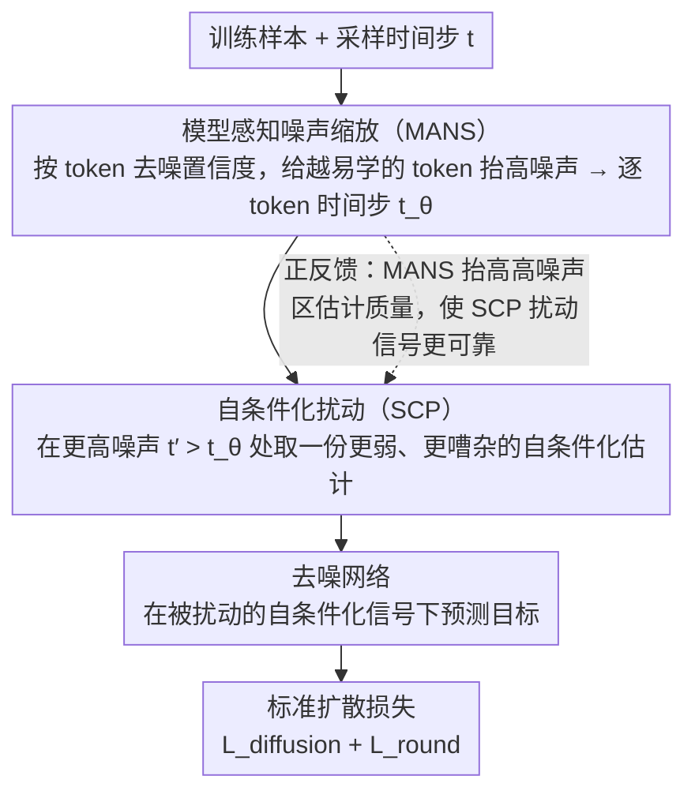

# FastDiSS: Few-step Match Many-step Diffusion Language Model on Sequence-to-Sequence Generation

**会议**: ACL 2026 Findings  
**arXiv**: [2604.05551](https://arxiv.org/abs/2604.05551)  
**代码**: 无  
**领域**: LLM/NLP  
**关键词**: 扩散语言模型、少步采样、自条件化扰动、噪声缩放、序列到序列

## 一句话总结
本文分析了连续扩散语言模型在少步采样时自条件化信号的不匹配和训练饱和两个瓶颈，提出FastDiSS框架通过自条件化扰动（SCP）和模型感知噪声缩放（MANS）来改善鲁棒性，在6个基准上实现4×-400×加速同时保持质量。

## 研究背景与动机

**领域现状**：扩散模型作为自回归文本生成的替代方案，通过并行生成所有token实现线性时间解码。自条件化（self-conditioning）技术通过复用上一步预测作为条件信号来改善少步采样效果，但引入了未被充分认识的失败模式。

**现有痛点**：(1) 训练-推理自条件化不匹配——训练时可用真实目标条件化，推理时只能用自身不完美的预测，少步设置下这种分布偏移更严重，高噪声步的预测与低噪声步差异大，重用的信号成为偏差条件；(2) 后期训练饱和——模型快速拟合早期目标后出现明显的loss平台，均匀噪声采样对已高置信度预测的token不提供有效学习信号。

**核心矛盾**：扩散模型的部署吸引力恰恰在于少步快速推理，但自条件化——这一改善少步采样的关键技术——在少步设置下引入的误差反而最大。

**本文目标**：设计训练框架使扩散语言模型在少步采样下质量接近多步采样。

**切入角度**：直接在训练中模拟推理时的噪声条件——通过扰动自条件化信号来匹配推理时的误差分布，通过动态调整每个token的噪声来避免训练饱和。

**核心 idea**：SCP在训练时故意用更嘈杂的估计作为自条件化信号，MANS根据去噪置信度动态为高置信度token分配更高噪声。

## 方法详解

### 整体框架

FastDiSS 不改动连续扩散语言模型的网络结构，而是从训练侧动手，让模型在少步采样时也能逼近多步质量。它针对两个被忽视的瓶颈各下一味药：自条件化扰动（SCP）专治"训练—推理不匹配"，让训练时拿到的自条件化信号像推理时那样带噪；模型感知噪声缩放（MANS）专治"后期训练饱和"，按每个 token 的去噪置信度动态分配噪声。一次训练迭代里，先采样时间步、用 MANS 调整出逐 token 的噪声级别，再用 SCP 在更高噪声处取一份较弱的自条件化估计喂回网络，最后用标准扩散损失监督——两味药协同作用，使少步推理时复用的自条件化信号不再成为偏差来源。

### 关键设计

**1. 自条件化扰动（SCP）：在训练里预演推理时的"信号变质"**

少步采样的痛点在于训练用真实目标做条件、推理却只能复用上一步那份更高噪声、更不完美的预测，步数越少这种分布偏移越严重。SCP 的对策是故意把训练时的自条件化信号"弄差"：获取该信号时不在当前噪声级别 $t$ 跑去噪网络，而是在更高的 $t' > t$ 处跑，得到一份更弱、更嘈杂的估计，正好模拟推理时从上一步传来的退化信号。网络随后被要求在这份被扰动的条件下仍然准确去噪，于是学会了对有噪声的自条件化信号鲁棒，少步推理时复用信号的代价被提前消化在训练里。

**2. 模型感知噪声缩放（MANS）：把训练信号让给"难"的 token**

均匀噪声采样有个隐性浪费——模型早早学会的高置信度 token 仍在反复被以同样的噪声分布训练，贡献不了有效梯度，于是 loss 很快撞上平台。MANS 改为按 token 自适应：对每个 token $i$ 计算模型预测与真实嵌入的距离作为置信度，对越"容易"（置信度越高）的 token 反而施加越高的噪声、提高其时间步，逼模型去啃这些原本被掌握的位置。这一招一举两得，既把学习信号集中到真正有价值的地方避免后期饱和，又顺带改善了高噪声区域的去噪估计质量。

**3. 端到端训练框架：让两味药相互增益**

SCP 与 MANS 被整合进同一条标准扩散训练流水线，且保持训练稳定。一次迭代的顺序是：先采样时间步 $t$，经 MANS 得到逐 token 调整后的时间步 $t_\theta$，再由 SCP 在 $t_\theta$ 对应的（更高）噪声级别取扰动后的自条件化信号，最后以标准扩散损失收尾。两个组件既能独立使用也能联合启用，而联合时存在正反馈——MANS 提升了高噪声区域的估计质量，恰好抬高了 SCP 所依赖的扰动信号的质量，因此两者叠加优于各自单用。

### 损失函数 / 训练策略

整体目标沿用标准扩散建模的两项之和 $\mathcal{L}_{\text{total}} = \mathcal{L}_{\text{diffusion}} + \mathcal{L}_{\text{round}}$（去噪损失加 rounding 损失），SCP 与 MANS 只改变送入损失的噪声条件与自条件化信号、不引入额外损失项，训练时交替优化扩散损失与自条件化损失。

## 实验关键数据

### 主实验

| 设置 | 模型 | 5步BLEU | 速度提升 |
|------|------|---------|---------|
| IWSLT14 De-En | 标准扩散 | 27.85 | 1× |
| IWSLT14 De-En | FastDiSS | **29.70** | 200×-400× |
| 正确自条件化上限 | — | 29.70 | — |

### 消融实验

| 配置 | 5步BLEU | 说明 |
|------|---------|------|
| 标准自条件化 | 27.85 | 基线 |
| + SCP only | 29.1+ | 减少训练-推理不匹配 |
| + MANS only | 28.5+ | 避免训练饱和 |
| + SCP + MANS | **29.70** | 两者协同最优 |

### 关键发现
- 5步采样时自条件化不匹配造成约2 BLEU的损失，FastDiSS几乎完全弥补了这个差距
- SCP使少步采样质量接近使用"正确"自条件化的理论上限
- MANS的token级噪声调整比均匀噪声采样有效，避免了后期训练饱和
- 在6个seq2seq基准上一致改善，包括翻译、摘要等任务
- 相比其他单步扩散框架也保持竞争力

## 亮点与洞察
- **训练中模拟推理误差**：SCP的核心思想——在训练中故意引入推理时的不完美性来提升鲁棒性——可以推广到任何存在训练-推理不匹配的场景（如teacher forcing vs 自回归推理）。
- **困难样本感知训练**：MANS动态为"容易"token增加噪声，是curriculum learning和hard example mining思想在扩散模型中的自然应用。
- **分析驱动的设计**：通过对比"正确"vs"复用"自条件化的性能差距，精确量化了问题的严重程度，然后针对性设计解决方案。

## 局限与展望
- 仅在连续扩散语言模型上验证，未测试离散扩散模型
- 6个基准主要是翻译和摘要任务，未测试更复杂的生成任务
- SCP的噪声级别选择可能需要针对不同任务调整
- 与最新的自回归LLM相比，扩散语言模型的绝对质量仍有差距

## 相关工作与启发
- **vs DiffusionLM**：DiffusionLM定义了连续扩散语言建模的基础框架，FastDiSS解决其少步采样的效率瓶颈
- **vs CDCD**：CDCD引入自条件化加速扩散，FastDiSS解决了自条件化在少步设置下引入的新问题
- **vs 一步扩散方法**：FastDiSS的少步策略在质量和效率之间提供了更灵活的trade-off

## 评分
- 新颖性: ⭐⭐⭐⭐ SCP的"训练中模拟推理误差"思路简洁有效
- 实验充分度: ⭐⭐⭐⭐ 6个基准、详细的消融、多步数对比
- 写作质量: ⭐⭐⭐⭐ 问题分析透彻，方法描述清晰
- 价值: ⭐⭐⭐⭐ 为扩散语言模型的实际部署移除了关键效率障碍

<!-- RELATED:START -->

## 相关论文

- [\[CVPR 2026\] Single-step Diffusion-based Video Coding with Semantic-Temporal Guidance](../../CVPR2026/llm_nlp/single-step_diffusion-based_video_coding_with_semantic-temporal_guidance.md)
- [\[AAAI 2026\] TransMamba: A Sequence-Level Hybrid Transformer-Mamba Language Model](../../AAAI2026/llm_nlp/transmamba_a_sequence-level_hybrid_transformer-mamba_language_model.md)
- [\[ACL 2025\] Automated CAD Modeling Sequence Generation from Text Descriptions via Transformer-Based Large Language Models](../../ACL2025/llm_nlp/cadllm_cad_modeling_from_text.md)
- [\[ACL 2026\] Automatic Combination of Sample Selection Strategies for Few-Shot Learning](automatic_combination_of_sample_selection_strategies_for_few-shot_learning.md)
- [\[ACL 2026\] Unlocking the Potential of Diffusion Language Models through Template Infilling](unlocking_the_potential_of_diffusion_language_models_through_template_infilling.md)

<!-- RELATED:END -->
