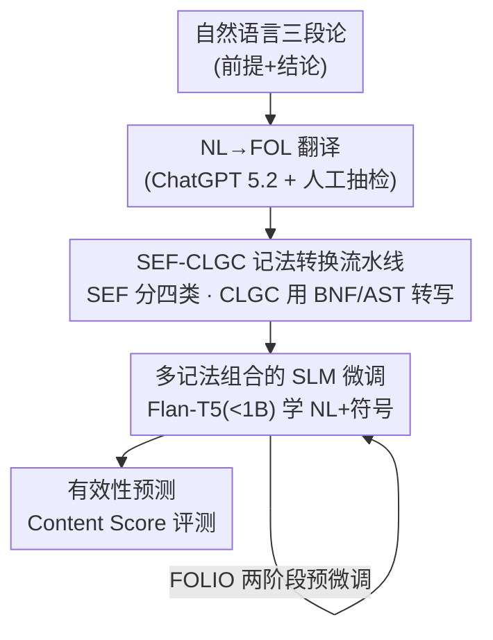

# SEF-CLGC at SemEval-2026 Task 11: Logical Notation Impact on Language Model Performance

**会议**: ACL 2026  
**arXiv**: [2606.09157](https://arxiv.org/abs/2606.09157)  
**代码**: 模型权重已开源（HuggingFace: HannaAbiAkl/LOGIC-NL-CLIF-Flan-T5-Large 等）  
**领域**: NLP理解 / 神经符号推理  
**关键词**: 三段论验证, 小语言模型, 形式逻辑记法, 神经符号, 内容偏置

## 一句话总结
这篇 SemEval-2026 Task 11 参赛系统论文把自然语言三段论翻译成多种形式逻辑记法（FOL、CLIF、CLINGO 等），再用参数量 <1B 的小语言模型（Flan-T5）做监督微调来判断三段论是否有效，证明给自然语言配上 FOL 这类"模型见过的"形式记法能在保持极低算力的同时显著压低推理中的内容偏置。

## 研究背景与动机
**领域现状**：判断一个三段论（syllogism）是否在逻辑上成立，是检验语言模型"形式推理 vs 内容记忆"能力的经典探针。当下主流是堆大模型，但小语言模型（SLM）正重新被发现具备复杂推理潜力，且有神经（纯 prompt/微调）与神经符号（把规则、形式逻辑注入）两条增强路线。

**现有痛点**：已有研究反复发现，模型越大错得越少，但**仍会犯和人类一样的三段论谬误**——当前提的"内容"（是否符合常识）和"形式有效性"冲突时，模型倾向跟着常识走。比如"所有车是交通工具，没有动物是车，所以没有动物是交通工具"，结论形式上无效但听起来合理，模型容易判错。这种被内容带偏的现象叫**内容效应（Content Effect）**。

**核心矛盾**：SemEval-2026 Task 11 Subtask 1 的目标正是"解耦内容推理与形式推理"。问题在于：模型在预训练里见惯了自然语言，对纯符号逻辑记法又陌生；既想借符号记法的严谨性压住内容偏置，又不想让模型因为读不懂陌生语法而崩盘。

**本文目标**：在**只用很小的模型**（<1B 参数，追求"节俭"frugal）的约束下，系统研究"喂给模型什么形式逻辑记法 / 什么记法组合"会怎样影响三段论判定的准确率和内容偏置。

**切入角度**：作者复用自己先前的 SEF-CLGC 流水线（Akl 2025），把同一批三段论批量转写成多种知识表示（KR）记法，做成可控对照实验——同一个模型、同一份数据，只改输入记法，看哪种记法最有利于"形式推理"。

**核心 idea**：不是把所有三段论喂成一种语言，而是**把自然语言（NL）和形式记法拼接**（如 NL-FOL）一起微调小模型；自然语言提供模型熟悉的语义锚点，形式记法提供抑制内容偏置的结构信号，二者互补。

## 方法详解
SEF-CLGC 本质是一条"数据生成 + 微调评测"的流水线：先把 NL 三段论逐级转成各种形式逻辑记法，再拿这些不同记法（或它们的组合）去监督微调一个极小的 Flan-T5，最后用专门设计的 Content Score 衡量它判定三段论有效性的水平。

### 整体框架
输入是一条自然语言三段论（两个前提 + 一个结论），输出是 true/false 的有效性标签。中间经过四个阶段：① 用 ChatGPT 5.2 把 NL 翻译成一阶逻辑（FOL）；② SEF-CLGC 框架把 FOL 转写成 CLIF、CGIF、TFL+、CLINGO、MINIFOL2 等多种记法，得到一份"同一题、多语言版本"的数据集；③ 选某种记法或几种记法的拼接，连同标签一起 SFT 给 <1B 的 Flan-T5；④ 盲测集上只给三段论让模型预测标签，用 Content Score 打分。

### 关键设计

**1. SEF-CLGC 记法转换流水线：把自然语言三段论可靠地翻成多种形式逻辑**

痛点是：要做"换记法看效果"的对照实验，就得保证同一题在所有记法下语义一致、语法合法，纯靠 LLM 翻译会引入噪声。SEF-CLGC 分两步解决。**SEF（Syllogistic Evaluation Framework）** 先把每条三段论按结构归入 4 类：Hypothetical（含蕴含）、Disjunctive（含析取）、Categorical（两前提一结论、不属前两类）、Complex（都不属于）。**CLGC（Common Logic Grammar Construction）** 则对每种逻辑记法用其 Backus-Naur 范式（BNF）文法构建抽象语法树（AST），先用语法解析器校验 FOL 表达式合法，再从 AST + 目标记法的 BNF 文法机械地转写到目标记法。这样转换是文法驱动、可解析校验的，而不是让 LLM 自由发挥，保证了 CLIF、CGIF、TFL+ 这些记法版本的语法正确性。起点的 NL→FOL 一步仍依赖 ChatGPT 5.2，作者对训练集随机 20% 和整个评测集做人工校验来控制翻译误差。

**2. 多记法组合的小模型微调：用自然语言锚点 + 形式记法结构一起喂**

这是论文的核心实验变量。作者把输入设成单一记法（NL、FOL、CLIF…）或多记法拼接（NL-FOL、NL-CLIF、FOL-CLIF-CGIF…），以 `(syllogism, validity label)` 对做 SFT。直觉是：纯 NL 让模型靠语义/常识判断、易被内容带偏；纯陌生符号记法模型读不懂；而 **NL + 一种模型预训练时见过的形式记法（FOL/CLIF）拼接**，既保留语义可读性又注入形式结构，最能兼顾准确率和低内容偏置。实验证实这个直觉：越是模型预训练里常见的记法（NL、FOL）效果越好，越抽象（TFL+）或越"四不像"（MINIFOL2，把 FOL 语法和布尔算符混用）的越容易崩。注意"加更多记法 ≠ 更好"——NL-FOL-CLIF 反而打不过 NL-FOL，说明信号过载会稀释收益。

**3. Content Score：把"内容偏置"从形式推理成绩里剥出来**

只看准确率无法分辨"模型真会形式推理"还是"刚好蒙对常识题"。论文用任务官方的 Content Score（CS）：

$$CS = \frac{ACC}{1 + \log(1 + CE)}$$

其中 $ACC$ 是总体准确率，$CE$ 是**内容效应（Content Effect）**——定义为"可信（Plausible）"与"不可信（Implausible）"两类三段论上的平均准确率之差。一条三段论按有效性（Valid/Invalid）× 可信性（Plausible/Implausible）有四象限，$CE$ 越大说明模型越是"前提符合常识就判对、不符合就判错"，即越被内容带偏。CS 用 $\log(1+CE)$ 作分母惩罚高内容效应，于是一个准确率略低但内容偏置很小的模型，可能反而拿到更高的 CS。这正是 Subtask"解耦内容与形式推理"的量化抓手。

**4. FOLIO 两阶段预微调：先在形式逻辑数据集上"热身"再做任务微调**

作者设了两个模型家族：**SEMEVAL** 是 vanilla Flan-T5 直接在任务数据上微调；**FOLIO-SEMEVAL** 则先在 FOLIO（一阶逻辑推理数据集）上微调过、再做任务微调。动机是让模型先建立对形式逻辑记法的基础"语感"。效果很明显：NL-CLIF 在 vanilla 版打不过 NL，但经 FOLIO 预微调后反超并击败 NL，说明 CLIF 这类记法是"可学的资产"，只要先给模型一点形式逻辑暴露，神经符号组合就能真正发挥增益。

### 一个完整示例
拿摘要里的反例走一遍：输入"All cars are a type of vehicle. No animal is a car. Therefore, no animal can be a vehicle."（有效性 = False，可信性 = True，即结论符合常识但形式无效）。① ChatGPT 5.2 翻成 FOL；② SEF 把它归入 Categorical 类，CLGC 按 BNF 解析建 AST 并校验，再转出 CLIF/CLINGO 等版本；③ 取 NL-FOL 拼接版连同 False 标签微调 Flan-T5-large；④ 盲测时模型需顶住"animal 不是 vehicle 听起来挺对"的常识诱惑，判成 False。纯 NL 输入时模型更容易被这条常识带偏判错，而 NL-FOL 的形式结构帮它压住了内容效应——这正是 CS 想奖励的行为。

### 损失函数 / 训练策略
标准 SFT，无特殊损失。SEMEVAL 模型在合并后的 pilot+training 集（冻结的 train/val/test 划分）上训练，5 个 epoch、学习率 $10^{-5}$、batch size 4，其余默认；backbone 为 Flan-T5-small（T4 GPU）与 Flan-T5-large（A100 GPU），推理在 A100。FOLIO-SEMEVAL 模型在相同超参下先过 FOLIO 再过任务数据。

## 实验关键数据

### 主实验
官方盲评集（191 条三段论）上，FOLIO-SEMEVAL 家族 Flan-T5-large 的评测结果（Acc/CE 为百分制，CS 为综合分）：

| 记法 | Acc | CE（内容效应↓） | CS（综合分↑） |
|------|-----|------|------|
| **NL-FOL** | 90.57 | 8.55 | **27.80** |
| NL | 93.19 | 9.57 | 27.74 |
| FOL | 66.49 | **3.50** | 26.54 |
| NL-CLIF | 89.00 | 13.85 | 24.06 |
| CLINGO | 74.34 | 16.66 | 19.20 |
| TFL+ | 59.16 | 10.41 | 16.91 |
| CLIF | 80.00 | 50.00 | 16.22 |

最佳 CS 来自 NL-FOL（27.80%）：它的准确率略低于纯 NL，但 CE 更小，综合分反超。值得注意的是纯 FOL 虽然准确率只有 66.49%，CE 却低到 3.50，说明形式记法天然能压内容偏置——只是单独用会牺牲太多准确率。该最佳模型在 Subtask 1 总榜准确率排第 10、CE 排第 7。

### 消融实验
对比两个模型家族（vanilla SEMEVAL vs FOLIO 预微调），看 FOLIO 热身对各记法的影响（训练集准确率，Flan-T5-large）：

| 记法 | SEMEVAL Acc | FOLIO-SEMEVAL Acc | 说明 |
|------|------|------|------|
| NL-CLIF | 0.88 | **0.95** | 预微调后反超 NL，CLIF 可学 |
| NL | 0.92 | 0.93 | 模型最熟悉的记法，基本饱和 |
| NL-FOL | 0.91 | 0.92 | 神经符号组合稳健 |
| CLIF | 0.74 | 0.85 | 形式记法靠 FOLIO 热身大涨 |
| MINIFOL2 | 0.72 | 0.75 | 布尔混 FOL 语法，始终偏弱 |
| TFL+ | 0.61 | 0.55 | 太抽象，学不动甚至更差 |

### 关键发现
- **记法是否"被模型见过"几乎决定上限**：NL、FOL 这类预训练高频记法成绩最好；TFL+ 太抽象、MINIFOL2 把 FOL 语法和布尔算符混用导致"语法崩溃"，都垫底。
- **多记法拼接有边际递减**：NL-FOL-CLIF 打不过 NL-FOL 或 NL-CLIF，堆记法不等于堆收益。
- **FOLIO 预微调是关键放大器**：让 CLIF 这类"陌生但规整"的记法从打不过 NL 变成击败 NL，证明先做形式逻辑暴露能解锁神经符号增益。
- **形式记法以准确率换低内容偏置**：FOL、TFL+ 显著降 CE 但也降 Acc；NL+形式记法的拼接是在两者间取到较好平衡点的实用解。

## 亮点与洞察
- **极致节俭路线**：全程只用 <1B 的 Flan-T5，却能在解耦内容/形式推理的任务上拿到有竞争力的排名，给"小模型 + 神经符号"路线提供了正面证据。
- **CS 指标值得借鉴**：用 $ACC/(1+\log(1+CE))$ 把"被常识带偏的程度"折进总分，这种"准确率 ÷ 偏置惩罚"的设计可迁移到任何需要剥离捷径学习的评测。
- **文法驱动的记法转换**：用 BNF + AST + 解析器机械转写，而非让 LLM 自由翻译，保证多记法数据集语法正确——这是做"换记法对照实验"可复现的基础设施。
- **"模型见过没"是神经符号的隐藏开关**：同一条神经符号思路，记法熟悉度不同，结果可以从崩盘到 SOTA，提示该方向应优先选预训练高频的形式语言。

## 局限与展望
- **NL→FOL 翻译是单点依赖**：起点全靠 ChatGPT 5.2 翻译，作者也承认翻译错误会沿流水线传播放大；只对 20% 训练集做了人工校验。
- **绝对分数仍低**：最佳 CS 仅 27.80%、总榜第 10，说明小模型 + 形式记法离真正稳健的形式推理还有距离。
- **记法选择偏经验**：哪种记法/组合好主要靠试出来，缺少先验的"记法可学性"理论刻画；MINIFOL2 在评测平台甚至打分超时（N/A）。
- **改进方向**：换更强/多样的翻译模型并量化翻译误差；探索重训分词器以适配陌生记法（作者提到小规模有效但随规模崩溃）；把 SEF 的四类结构信息显式注入训练而非仅用于分析。

## 相关工作与启发
- **vs 纯 prompt/ICL 方法（Dasgupta et al., Bertolazzi et al.）**：他们比较 SFT 与 ICL，结论是 SFT 对中小模型抑制偏置更有效；本文沿用 SFT 路线，并进一步引入多形式记法作为输入变量。
- **vs 提示内注入规则的神经符号系统（Seals & Shalin, Valentino et al.）**：他们把规则塞进 prompt 控偏置；本文走"把整条三段论转写成形式记法再微调"的更彻底的符号化路线。
- **vs NL→FOL + 定理证明的多阶段系统（Ranaldi et al., Kim et al.）**：他们用形式语言配定理证明器提升判定；本文不接定理证明器，而是研究"喂哪种记法给小模型微调"本身的影响，方向互补。

## 评分
- 新颖性: ⭐⭐⭐ 复用已有 SEF-CLGC 流水线，主要新意是系统性的"记法 × 模型家族"对照与两个新记法（CLINGO/MINIFOL2）。
- 实验充分度: ⭐⭐⭐⭐ 覆盖 12 种记法/组合 × 两个模型家族 × 训练/盲评，对照充分但只在 Flan-T5 一族上做。
- 写作质量: ⭐⭐⭐⭐ 流水线、指标、结论交代清楚，表格信息密度高。
- 价值: ⭐⭐⭐⭐ 为"小模型 + 神经符号 + 记法选择"提供了扎实的经验证据和可复用的 CS 评测思路。

<!-- RELATED:START -->

## 相关论文

- [\[ACL 2025\] Logical Forms Complement Probability in Understanding Language Model (and Human) Performance](../../ACL2025/llm_nlp/logical_forms_complement_probability_in_understanding_language_model_and_human_p.md)
- [\[ICML 2026\] On the Limits of LLM Adaptability: Impact of Model-Internalized Priors on Annotation](../../ICML2026/llm_nlp/on_the_limits_of_llm_adaptability_impact_of_model-internalized_priors_on_annotat.md)
- [\[ACL 2025\] The Impact of Token Granularity on the Predictive Power of Language Model Surprisal](../../ACL2025/llm_nlp/token_granularity_impact.md)
- [\[ACL 2026\] DeCoVec: Building Decoding Space based Task Vector for Large Language Models via In-Context Learning](decovec_building_decoding_space_based_task_vector_for_large_language_models_via_.md)
- [\[ACL 2025\] Cheaper and Better Diffusion Language Model via Task-Specific Training](../../ACL2025/llm_nlp/cheaper_and_better_diffusion_language_model_via_task-specific_training.md)

<!-- RELATED:END -->
