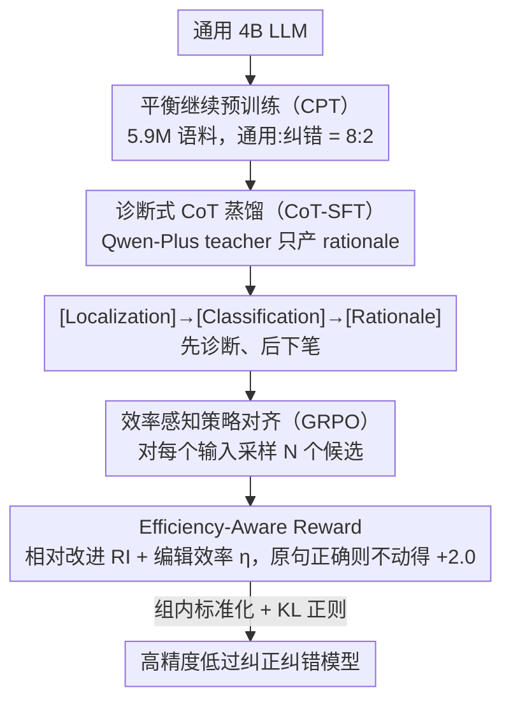

# CSRP: Chain-of-Thought Reasoning for Chinese Text Correction via Reinforcement Learning with Efficiency-Aware Rewards

**会议**: ACL2026  
**arXiv**: [2606.00020](https://arxiv.org/abs/2606.00020)  
**代码**: https://github.com/TW-NLP/ChineseErrorCorrector  
**领域**: LLM推理 / 中文文本纠错  
**关键词**: 中文语法纠错, 强化学习, CoT蒸馏, 过纠正抑制, 编辑效率奖励  

## 一句话总结
CSRP 用 CPT、带 CoT rationale 的 SFT 和带 Efficiency-Aware Reward 的 GRPO 三阶段训练中文文本纠错模型，在 NACGEC 上达到 50.99 $F_{0.5}$、在 CSCD 上达到 59.61 F1，并通过显式奖励编辑效率显著缓解 LLM 纠错中的过纠正问题。

## 研究背景与动机
**领域现状**：中文文本纠错包括中文语法错误纠正和拼写检查。LLM 具备强生成能力，但在纠错任务上不能只追求流畅改写，还必须遵守“最小编辑”原则，尽量只改真正错误的地方。

**现有痛点**：通用 LLM 对学习者错误分布、同音/形近字、虚词冗余等中文非规范错误缺少专门先验。传统 SFT 用 MLE 学习 source 到 target 的映射，容易把正确或轻微异常句子改写成更高概率表达，造成系统性 over-correction。

**核心矛盾**：纠错模型既要有足够语言知识识别错误，又要足够保守避免误改。单纯扩大模型或数据容易提高改写能力，却不一定能校准“该不该改”的决策边界。

**本文目标**：作者希望训练一个高精度、低过纠正的中文纠错模型，让模型先内化中文语言先验，再学会显式诊断错误，最后用强化学习优化编辑效率。

**切入角度**：论文把能力构建拆成三阶段：CPT 负责知识内化，CoT-SFT 负责诊断透明性，GRPO + Efficiency-Aware Reward 负责策略对齐和最小编辑。

**核心 idea**：用继续预训练解决“知道什么是错”，用 CoT-SFT 解决“为什么要改”，用效率感知奖励解决“什么时候不要改”。

## 方法详解
CSRP 是一个 CPT-SFT-RL 三阶段 pipeline，目标是把通用 4B LLM 转成高精度中文纠错模型。相比只做 SFT，CSRP 额外强调两件事：第一，纠错前要有中文错误分布和语言约束先验；第二，强化学习奖励不只看是否接近答案，还要惩罚不必要编辑。

### 整体框架
Phase I 使用 5.9M 样本继续预训练，其中通用数据和纠错相关数据按 8:2 混合。Phase II 使用 Qwen-Plus 作为 teacher，在固定 source 和 gold target 之间蒸馏结构化 rationale，格式为 [Localization] → [Classification] → [Rationale]，让学生模型在输出修正前先诊断错误。Phase III 使用保留的 RL 数据运行 GRPO，并引入 Efficiency-Aware Reward，让模型偏好“少而准”的编辑。三个阶段依次回答“知道什么是错”“为什么要改”“什么时候不要改”，前一阶段的产出是后一阶段的初始策略。

### 关键设计

**1. Balanced Continued Pre-training：先把中文规范和错误分布喂进参数，再谈纠错**

直接 SFT 的困境在于，通用 4B 模型对中文非规范错误——同音字、形近字、虚词冗余、学习者特有的错误模式——几乎没有先验，硬学 source→target 映射等于让一个不懂中文写作规范的人去当批改老师。CPT 阶段先补这块知识：从 wiki-zh-25、wiki-zh-23、cci2、lang8+HSK 等来源汇集原始语料，经 MinHash 去重和启发式过滤后从 7,287,295 条压到 5,901,700 条高质量样本，再以约 4.72M 通用样本配 1.18M 纠错样本的 8:2 比例混合训练。8:2 的用意是既保住通用语言能力不退化，又让模型对"什么是错、错往哪个方向"有底层的统计直觉，为后两个阶段铺好地基。

**2. Rationale-Augmented SFT：让模型先诊断、后下笔，而不是把纠错当黑盒翻译**

普通 SFT 把纠错当成一次性的句子翻译，模型只学会"看到一句话就改成另一句话"，没有"为什么改"的约束，自然容易把正确句子也顺手改得更流畅。CSRP 改成诊断式 CoT：用 Qwen-Plus 作 teacher，但 teacher 不直接给最终纠错答案，只在固定的 source 与 gold target 之间生成中间 rationale，格式为 [Localization] → [Classification] → [Rationale]，并要求符合 `<think>...</think>` 结构、经过滤后保留。学生因此学到"先定位哪里错、归到哪一类、解释为何要改"再输出修正。让 teacher 只产 rationale 而非 corrector，是为了切断 teacher 自身过纠正习惯对学生最终输出的直接污染——1,000 条随机 rationale 的双盲人工评估中 95.2% 被判为 linguistically faithful，Cohen's $\kappa=0.81$，说明这层解释本身是可信的。

**3. Efficiency-Aware Policy Alignment：用强化学习把"该不该改"的决策边界校准回保守一侧**

CSRP 把过纠正重新定义成一个 policy alignment 问题：GEC 的主指标 $F_{0.5}$ 偏重 precision，所以奖励不能只看"输出像不像 gold"，否则模型会为了流畅而乱改。GRPO 阶段引入两个显式量：相对改进 $RI=\frac{d(S,G)-d(P,G)}{d(S,G)+\epsilon}$ 衡量预测 $P$ 比原句 $S$ 离 gold $G$ 近了多少，编辑效率比 $\eta=\frac{d(S,G)-d(P,G)}{d(S,P)+\epsilon}$ 衡量每一步编辑的"性价比"，其中 $d$ 是 Levenshtein 距离。奖励对接近 gold 的高效编辑给高分，对无效编辑和空输出施罚；尤其当原句本来正确时，保持不变得 +2.0、任何修改得 -2.0——这条把"不动"显式地变成了高回报选择，正是缓解过纠正的关键。

### 损失函数 / 训练策略
CPT 使用语言建模负对数似然 $\mathcal{L}_{CPT}(\theta)=-\mathbb{E}_{x\sim\mathcal{D}_{CPT}}[\sum_t \log P_{\theta}(x_t|x_{<t})]$。SFT 使用 rationale 与 correction 拼接后的自回归交叉熵 $\mathcal{L}_{SFT}$。RL 阶段使用 GRPO，对每个输入采样 $N$ 个候选，通过组内标准化奖励优化 $\log \pi_{\theta}(P_i|S)$，并加入相对 SFT reference policy 的 KL 正则。

数据上，SFT 和 RL 共使用过滤后的 336K correction samples，其中 269K 用于 SFT，67K 作为 RL hold-out。评估使用 NACGEC 5.8K 和 CSCD-test 5.0K。

## 实验关键数据

### 主实验

| 模型 | NACGEC P | NACGEC R | NACGEC $F_{0.5}$ | 说明 |
|------|----------|----------|------------------|------|
| BART | 34.67 | 41.88 | 35.91 | seq2seq baseline |
| HW-CGEC | 50.95 | 32.29 | 45.26 | 强专用系统 |
| ScholarGEC 14B | 45.08 | 59.33 | 47.35 | 大模型，高召回 |
| CEC3 4B | 54.20 | 34.75 | 48.74 | 前一代 4B SOTA |
| CSRP 4B | 57.17 | 35.60 | 50.99 | 本文方法 |

CSRP 相比 CEC3 提升 +2.25 $F_{0.5}$，相比 ScholarGEC 14B 提升 +3.64，尽管参数量不到后者三分之一。它的 precision 57.17 是主表最高，说明模型确实更保守、更少误改。

| 模型 | CSCD F1 | 说明 |
|------|---------|------|
| BERT | 25.49 | 基础 PLM |
| SoftMask | 44.48 | CSC 专用模型 |
| SMBERT | 44.67 | CSC 专用模型 |
| MDCSpell+ARM | 48.93 | 强 discriminative baseline |
| PGT (BERT) | 48.57 | BERT 系方法 |
| GPT-4 | 54.41 | 通用大模型 |
| CSRP 4B | 59.61 | 本文方法 |

CSRP 在 CSCD 上比 GPT-4 高 +5.20 F1，比 MDCSpell+ARM 高 +10.68 F1，说明面向纠错的 curriculum 和 RL alignment 比单纯通用规模更有效。

### 消融实验

| 配置 | NACGEC P | NACGEC R | NACGEC $F_{0.5}$ | CSCD F1 | 解释 |
|------|----------|----------|------------------|---------|------|
| SFT only | 42.13 | 34.02 | 40.21 | 49.71 | 只合并监督数据 |
| SFT + GRPO, w/o CPT | 50.54 | 33.75 | 45.97 | 52.96 | RL 可独立提高 precision |
| CPT + SFT, no CoT | 44.90 | 35.50 | 42.64 | 52.01 | 无诊断 rationale |
| CPT + SFT | 48.73 | 35.80 | 45.45 | 56.28 | 加入 CoT rationale |
| CPT + SFT, w/ RL data | 52.20 | 36.00 | 47.21 | 57.92 | 用同等数据量做 SFT 对照 |
| Full CSRP | 57.17 | 35.60 | 50.99 | 59.61 | 完整 CPT-SFT-RL |

### 关键发现
- CPT 不能被简单合并监督数据替代。SFT only 到 CPT+SFT 的 $F_{0.5}$ 从 40.21 到 45.45，CSCD F1 从 49.71 到 56.28。
- CoT rationale 明显有用。CPT+SFT(no CoT) 到 CPT+SFT 带来 +2.81 $F_{0.5}$ 和 +4.27 CSCD F1。
- RL 的作用主要是提升 precision，而不是一味减少所有编辑。CPT+SFT 到 CPT+SFT+GRPO 在 NACGEC 上 precision +8.44，recall 只 -0.20，$F_{0.5}$ +5.54；CSCD 上 precision +7.37，recall -0.72，F1 +3.33。
- GRPO 和 CPT 贡献正交。SFT+GRPO(w/o CPT) 的 $F_{0.5}$ 为 45.97，接近 CPT+SFT 的 45.45，但仍比 Full CSRP 低 5.02，说明“知道什么错”和“什么时候改”都必需。

## 亮点与洞察
- 论文最强的洞察是把中文纠错拆成知识、诊断和策略三个问题。很多纠错工作只做 SFT，但 CSRP 指出过纠正本质上是 policy alignment 问题。
- Efficiency-Aware Reward 很贴合 GEC。它不是只奖励接近 gold，而是把编辑距离和改进幅度结合起来，显式鼓励“手术刀式”修改。
- Teacher CoT 的使用比较克制。Qwen-Plus 不直接当 corrector，而是生成 source-gold 之间的解释，这降低了 teacher 过纠正对学生最终输出的直接污染。
- 实验清楚地区分了数据量收益和 RL 收益。CPT+SFT(w/ RL data) 与 Full CSRP 使用同等数据量，后者仍高 +3.78 $F_{0.5}$，说明不是多看数据这么简单。

## 局限与展望
- CoT rationale 依赖 Qwen-Plus teacher。虽然作者做了格式过滤和 1,000 条人工验证，但 teacher 的解释偏差仍可能传给学生。
- GRPO 训练成本较高，因为每个输入需要采样多个候选。论文提到把 $N=8$ 降到 $N=4$ 可以把 RL sampling cost 减半，$F_{0.5}$ 仅从 50.99 降到 50.61，是一个可行折中。
- 当前主要验证句子级纠错，未来还需要文档级纠错、交互式 refinement 和跨语言迁移。
- 低 recall 仍是一个可讨论点。CSRP 为了 precision 和 $F_{0.5}$ 主动保守，但对需要高召回的教学批改场景，可能还需要可调节的编辑激进度。

## 相关工作与启发
- **vs BERT/SoftMask/SMBERT**: 早期 CSC 方法多依赖局部字符和判别式建模，CSRP 通过生成式 LLM 和 curriculum 学到更强上下文纠错能力。
- **vs ScholarGEC**: ScholarGEC 14B 召回很高，但 precision 低于 CSRP；CSRP 更符合 NACGEC 的 precision-focused $F_{0.5}$。
- **vs GPT-4 prompting**: GPT-4 通用能力强，但没有专门的最小编辑对齐，在 CSCD 上低于 CSRP 5.20 F1。
- **对后续研究的启发**: 文本纠错的 RL reward 不应只模拟终局分数，还要把编辑效率、保持原句和过纠正惩罚显式写进去。

## 评分
- 新颖性: ⭐⭐⭐⭐ CPT、CoT-SFT、GRPO 都不是全新组件，但 Efficiency-Aware Reward 对中文纠错问题非常贴合。
- 实验充分度: ⭐⭐⭐⭐⭐ 主结果、CSCD、逐阶段消融、precision-recall 分析和 teacher rationale 验证都比较完整。
- 写作质量: ⭐⭐⭐⭐ 动机清晰，实验解释充分；奖励公式和阶段关系略多，读者需要耐心对齐。
- 价值: ⭐⭐⭐⭐⭐ 对中文纠错落地价值很高，尤其适合需要低误改、高精度的教育和写作辅助系统。

<!-- RELATED:START -->

## 相关论文

- [\[ACL 2026\] HISR: Hindsight Information Modulated Segmental Process Rewards for Multi-turn Agentic Reinforcement Learning](hisr_hindsight_information_modulated_segmental_process_rewards_for_multi-turn_ag.md)
- [\[NeurIPS 2025\] SQL-of-Thought: Multi-agentic Text-to-SQL with Guided Error Correction](../../NeurIPS2025/llm_reasoning/sql-of-thought_multi-agentic_text-to-sql_with_guided_error_correction.md)
- [\[ACL 2026\] TemplateRL: Structured Template-Guided Reinforcement Learning for LLM Reasoning](templaterl_structured_template-guided_reinforcement_learning_for_llm_reasoning.md)
- [\[NeurIPS 2025\] SRPO: Enhancing Multimodal LLM Reasoning via Reflection-Aware Reinforcement Learning](../../NeurIPS2025/llm_reasoning/srpo_enhancing_multimodal_llm_reasoning_via_reflection-aware_reinforcement_learn.md)
- [\[ACL 2026\] Revisiting Entropy in Reinforcement Learning for Large Reasoning Models](revisiting_entropy_in_reinforcement_learning_for_large_reasoning_models.md)

<!-- RELATED:END -->
