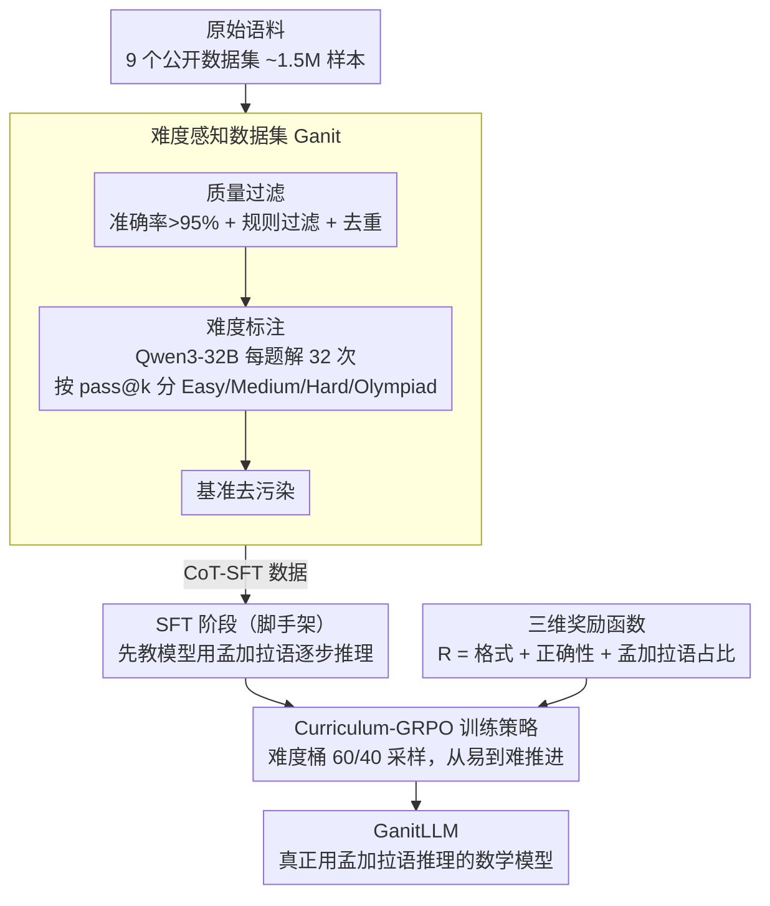

# GanitLLM: Difficulty-Aware Bengali Mathematical Reasoning through Curriculum-GRPO

**会议**: ACL 2026 Findings  
**arXiv**: [2601.06767](https://arxiv.org/abs/2601.06767)  
**代码**: [网站](https://dipta007.github.io/GanitLLM/)  
**领域**: 低资源语言推理 / 数学推理  
**关键词**: 孟加拉语数学推理, 课程学习, GRPO冷启动, 难度感知, 低资源语言

## 一句话总结

本文提出 GanitLLM，首个真正用孟加拉语进行推理（而非翻译或用英语推理）的数学推理模型，构建了难度标注的孟加拉语数学数据集 Ganit，并提出 Curriculum-GRPO 解决低资源语言 GRPO 训练中的冷启动问题，4B 模型在 Bn-MGSM 上提升 8 个准确率百分点，孟加拉语推理 token 从 14% 提升至 88%。

## 研究背景与动机

**领域现状**：LLM 在高资源语言（英语）的数学推理上取得显著进展（DeepSeek-R1、OpenAI o1），GRPO 等 RL 方法已被证明可有效提升数学推理能力。然而，低资源语言的推理进展严重滞后——孟加拉语是全球第七大语言，但现有 LLM 对孟加拉语数学问题要么用英语推理再翻译答案，要么直接失败。

**现有痛点**：(1) 现有 LLM 即使被显式要求用孟加拉语推理，仍倾向于用英语推理再输出孟加拉语答案——这对母语用户的可理解性极差；(2) 标准 GRPO 训练在低资源语言上遭遇"冷启动问题"——策略模型因目标语言能力不足无法在 rollout 组中生成任何正确解，导致零奖励、零梯度、无效训练；(3) 孟加拉语数学数据集质量参差不齐，缺乏难度标注和系统的质量过滤。

**核心矛盾**：GRPO 需要在 rollout 组中至少有部分正确答案来计算有效的优势值，但低资源语言模型在困难问题上完全无法生成正确答案——"需要先会才能学会"的鸡生蛋问题。

**本文目标**：构建高质量难度标注的孟加拉语数学数据集，设计解决冷启动问题的训练策略，使模型真正用孟加拉语推理而非英语。

**切入角度**：将问题分解为三步——(1) 数据：构建质量过滤+难度标注的数据集；(2) SFT：先教模型用孟加拉语推理（而非追求正确性）；(3) GRPO：用课程学习策略从易到难逐步训练。

**核心 idea**：通过 Curriculum-GRPO 按难度从易到难排列训练数据，确保模型在每个阶段都能生成部分正确答案以获得有效梯度，避免冷启动。

## 方法详解

### 整体框架

两阶段训练：(1) SFT 阶段——在 CoT-SFT 数据上教模型用孟加拉语逐步推理，关注语言而非正确性；(2) Curriculum-GRPO 阶段——在难度排序的 RL 数据上用 GRPO 训练，从简单问题开始逐步增加难度。数据集 Ganit 从 ~1.5M 原始样本经多阶段过滤和难度标注得到，其难度信号同时供 GRPO 阶段排课程；GRPO 的优化方向则由三维奖励函数控制，把「答对」和「用孟加拉语想」一起写进目标。

### 关键设计

**1. 难度感知数据集 Ganit：把质量参差的原始语料炼成有难度刻度的训练集**

现有孟加拉语数学数据集质量良莠不齐，而且标准评估集 Bn-MGSM / Bn-MSVAMP 对现代 LLM 太简单（77-86% 的题都是 Easy 级别），既训不出能力也测不出差异。Ganit 用一条多级流水线解决这两件事：先从 9 个公开数据集收集约 1.5M 样本，再做人工评估、只保留准确率 >95% 的数据集（降到约 1.1M），接着用规则过滤（仅保留数值解、孟加拉字符占比 >99%、排除选择题），并做模糊去重 + MinHash 去重。最关键的一步是难度标注：用 Qwen3-32B 对每道题独立生成 32 次解答，按 pass@k 把题目分成 Easy / Medium / Hard / Olympiad 四级——一道题被解对的次数越少，难度越高。最后对评估基准做去污染，保证测试题不泄漏进训练集。这样得到的不只是干净数据，而是带有连续难度信号的数据，为后面的课程训练提供刻度。

**2. Curriculum-GRPO 训练策略：用从易到难的混合采样躲开低资源语言的冷启动**

标准 GRPO 需要 rollout 组里至少出现部分正确答案才能算出有效优势，但孟加拉语弱模型在难题上一道都解不对，就会零奖励、零梯度、空转——这就是冷启动。Curriculum-GRPO 复用上一步的细粒度难度信号（1-32 的正确生成次数）：把题目分进难度桶，每个训练批次 60% 取自当前桶、40% 从其余 31 个桶各取 3 个，再按主桶难度从易到难排序推进。这套 60/40 的设计同时照顾三件事——模型先在简单题上攒到正确经验从而拿到非零梯度；混入的 40% 杂样本防止只刷一个难度导致遗忘；混合比例本身在「课程信号够强」和「样本够多样」之间取平衡。对比之下，100% 严格按难度的全排序会让模型早期在简单题上过拟合，而完全随机打乱又会让难题过早出现、直接触发冷启动。

**3. 三维奖励函数：把「用孟加拉语推理」直接写进奖励，而不只奖励答对**

传统 GRPO 只看最终答案对不对，于是模型学会一条捷径——用英语推理、最后翻译出孟加拉语答案，对母语用户毫无可读性。本文把奖励拆成三项相加：

$$R = R_{format} + R_{correctness} + R_{bengali}$$

其中 $R_{format} \in \{0,1\}$ 检查输出格式是否合规，$R_{correctness} \in \{0,1,2\}$ 奖励答案正确、且用孟加拉语作答额外加一分，$R_{bengali} \in \{0,1\}$ 在推理过程中孟加拉语 token 占比 ≥80% 时给奖励。80% 而非 100% 的阈值留出了数学符号、公式这些语言无关成分的空间。三项合力把「答对」和「用目标语言想」绑在一起优化，正是把基座模型 14% 的孟加拉语推理比例拉到 88% 的直接动力。

### 损失函数 / 训练策略

SFT 阶段使用标准交叉熵损失。GRPO 阶段使用标准 GRPO 损失 + 超长过滤器 + token 级损失。基座模型 Qwen3-4B。

## 实验关键数据

### 主实验

| 模型 | Bn-MGSM | Bn-MSVAMP | 孟加拉语% | 平均长度(词) |
|------|---------|-----------|----------|------------|
| Qwen3-4B (基座) | 69 | 78 | 14% | 943 |
| + SFT only | 73 | 81 | 82% | 210 |
| + Curriculum-GRPO | **77** | **84** | **88%** | **193** |
| Qwen3-8B | 76 | 83 | 18% | 876 |
| GPT-5-mini | 82 | 88 | 45% | 520 |

### 消融实验

| 训练策略 | Bn-MGSM | 冷启动率 |
|---------|---------|---------|
| 随机打乱 GRPO | 72 | 35% |
| 全排序（易→难） | 74 | 12% |
| **Curriculum-GRPO (60/40)** | **77** | **5%** |

### 关键发现

- Curriculum-GRPO 将冷启动率从 35% 降至 5%，是解决低资源语言 GRPO 训练的关键
- SFT 阶段对语言切换至关重要——仅靠 GRPO 的孟加拉语奖励无法将推理语言从英语转为孟加拉语
- 4B 模型通过 Curriculum-GRPO 达到了 8B 基座模型的准确率水平，同时推理 token 减少 79.5%
- Ganit-Dev 的难度分布远比标准评估集均衡（各级约 21-29% vs 标准集 77-86% 是 Easy），提供了更有区分度的评估

## 亮点与洞察

- "冷启动问题"的识别和解决对所有低资源语言的 RL 训练都有参考价值
- 三维奖励函数的设计优雅——不仅优化正确性，还显式激励目标语言推理
- 80% 的孟加拉语阈值设计考虑了数学符号的语言无关性，体现了领域理解

## 局限与展望

- 仅在 4B 模型上验证，更大模型上冷启动问题可能不同
- Curriculum 的 60/40 比例是经验调优的，缺乏理论指导
- 难度标签依赖于 Qwen3-32B 的能力，随评估模型能力变化可能需要更新
- 仅在数学推理上验证，对逻辑推理、常识推理等其他推理任务的适用性未知

## 相关工作与启发

- **vs Confucius3-Math**: 中文 K-12 数学模型使用标准 RL；GanitLLM 需要解决孟加拉语训练数据量级更小的冷启动问题
- **vs mCoT**: mCoT 多语言 CoT 调优但不强制目标语言推理；GanitLLM 通过专门的孟加拉语奖励实现 88% 的母语推理
- **vs MathOctopus**: 使用平行语料但推理仍在英语；GanitLLM 实现真正的母语推理

## 评分

- 新颖性: ⭐⭐⭐⭐ Curriculum-GRPO 和冷启动问题的识别是新颖的贡献
- 实验充分度: ⭐⭐⭐⭐ 详细的消融+数据集质量分析+语言比例统计
- 写作质量: ⭐⭐⭐⭐ 问题定义清晰，数据构建过程详尽
- 价值: ⭐⭐⭐⭐ 对低资源语言 RL 训练提供了实用的解决方案

<!-- RELATED:START -->

## 相关论文

- [\[ICLR 2026\] Harder Is Better: Boosting Mathematical Reasoning via Difficulty-Aware GRPO and Multi-Aspect Question Reformulation](../../ICLR2026/llm_reasoning/harder_is_better_boosting_mathematical_reasoning_via_difficulty-aware_grpo_and_m.md)
- [\[ACL 2026\] Budget-Aware Anytime Reasoning with LLM-Synthesized Preference Data](budget-aware_anytime_reasoning_with_llm-synthesized_preference_data.md)
- [\[ACL 2026\] DELTA: Dynamic Layer-Aware Token Attention for Efficient Long-Context Reasoning](delta_dynamic_layer-aware_token_attention_for_efficient_long-context_reasoning.md)
- [\[ACL 2026\] Distilling Long-CoT Reasoning through Collaborative Step-wise Multi-Teacher Decoding (CoRD)](distilling_long-cot_reasoning_through_collaborative_step-wise_multi-teacher_deco.md)
- [\[NeurIPS 2025\] Curriculum Abductive Learning](../../NeurIPS2025/llm_reasoning/curriculum_abductive_learning.md)

<!-- RELATED:END -->
