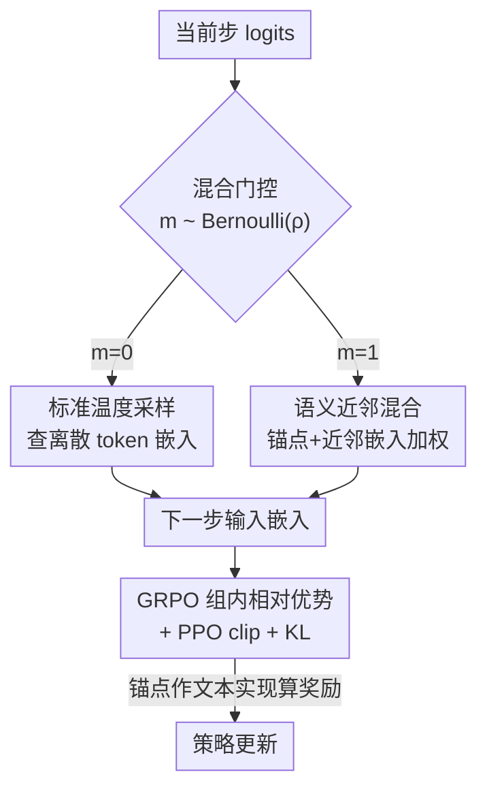

# N-GRPO: Embedding-Level Neighbor Mixing for Enhanced Policy Optimization

**会议**: ACL 2026  
**arXiv**: [2606.10768](https://arxiv.org/abs/2606.10768)  
**代码**: 待确认  
**领域**: LLM 推理 / 强化学习策略优化  
**关键词**: GRPO, 数学推理, 嵌入级探索, 语义近邻混合, rollout 多样性

## 一句话总结
N-GRPO 在 GRPO 的 rollout 阶段把「采样 token 再查嵌入」换成「锚点 token + 其语义近邻的嵌入加权混合」，用受控的嵌入级扰动注入探索多样性而不偏离语义流形，在 DeepSeek-R1-Distill-Qwen 等多个底座的数学推理 Pass@16/Pass@32 上稳定超过 GRPO 与高斯噪声基线。

## 研究背景与动机
**领域现状**：用 RL（尤其是 GRPO）提升大模型数学推理已成主流范式。GRPO 对每个问题采一组 G 条轨迹，按组内相对优势更新策略，rollout 阶段能不能采到「多样且有效」的解题路径，直接决定训练效果。

**现有痛点**：现有探索手段卡在一个根本权衡里。**token 级采样**（min-p、温度采样、COPO 等）只在离散 token 上抖动，产出的轨迹常常只是「换个说法」或「1+2 vs 2+1」这种交换重排——底层推理逻辑没变，等于一堆冗余轨迹。**嵌入级方法**想换条路：要么像 HRPO/Soft Thinking 把连续表示混进去，但随机性最终还是来自离散 token 采样，本质仍是离散探索、照样冗余；要么像 STHT（Soft Tokens, Hard Truths）直接往嵌入/logits 上打高斯噪声。

**核心矛盾**：直接加高斯噪声会**破坏语义一致性**。作者做了个预实验：给 10 个随机 token（数学符号 + 常见功能词）的嵌入加各向同性高斯噪声，再解码回最近邻词，PCA 可视化（Figure 1）显示扰动经常把表示**推出语义流形**，原 token 变成毫不相关的词，直接让 rollout 轨迹脱轨。根因在于 Transformer 嵌入空间是**强各向异性**的——同样大小的噪声在不同方向上语义后果天差地别，所以扰动必须自适应于局部语义上下文，而非无差别地撒噪声。

**本文目标**：设计一种**嵌入级、但受语义约束**的扰动，既要有足够随机性来扩大探索，又要始终待在合法语义区域内。

**核心 idea**：不撒随机噪声，而是把采样 token 的嵌入与它在嵌入空间里的**最近邻 token 嵌入混合**。近邻按嵌入相似度检索，天然和锚点处在同一语义方向上，所以混合后的嵌入仍被困在合法语义邻域内，又提供了离散采样够不到的连续探索空间。

## 方法详解

### 整体框架
N-GRPO 不动 GRPO 的优势估计和优化目标，只改 rollout 阶段「下一步输入怎么来」这一环。标准自回归生成是：算 logits → 采一个离散 token → 查它的嵌入当作下一步输入。N-GRPO 在每一步用一个伯努利门控掩码 $m_{i,t}\sim\text{Bernoulli}(\rho)$ 决定走哪条路：掩码命中（概率 $\rho$）就触发**语义近邻混合**——取当前最优 token 作锚点、检索 $k$ 个语义近邻、用本步 logits 在这个小集合上重新归一化得权重、加权求出一个连续混合嵌入喂给下一步；没命中就退回标准温度采样、查离散 token 嵌入。算优势和奖励时，混合步用锚点 token 作为它的「文本实现」，从而仍能复用标准的离散文本奖励。

### 关键设计

**1. 语义近邻混合：在锚点的语义邻域里做连续扰动**

这是论文的核心机制，专治「token 采样冗余」和「高斯噪声脱轨」两个毛病。给定温度缩放后的 logits $\tilde{z}_t$，先取 **argmax** 作语义锚点 $v_t^*=\arg\max_v \tilde{z}_t(v)$——用 argmax 而非随机采样，是为了让探索中心牢牢对准模型当前的最优推理路径，避免拿低概率 token 当锚点带来的不稳定。再用余弦相似度 $s(u,v)=\frac{E[u]\cdot E[v]}{\|E[u]\|_2\|E[v]\|_2}$ 检索与锚点最相似的 $k-1$ 个 token，连同锚点组成近邻集 $\mathcal{C}_t$。接着**只在这个集合内**对 logits 重新 softmax 归一化得混合权重 $\alpha_t(c)=\frac{\exp(\tilde{z}_t(c))}{\sum_{u\in\mathcal{C}_t}\exp(\tilde{z}_t(u))}$，最后构造混合嵌入：

$$\tilde{e}_{t+1}=\sum_{c\in\mathcal{C}_t}\alpha_t(c)\,E[c]$$

因为近邻是按嵌入相似度选的，它们与锚点聚在同一语义方向上，混合结果不会被推出流形；而扰动的方向和强度又由当前 logits 自适应调制，既扩大探索又贴合模型语义偏好。这正好绕开高斯噪声「各向同性、不管局部各向异性」的硬伤。

**2. 伯努利门控混合率 ρ：给探索留间歇，防止脱轨累积**

如果每一步都做嵌入混合，连续扰动会累积、把 rollout 整体带偏。作者用一个固定混合率 $\rho$ 的伯努利掩码当「过滤阀」：只有少数步（默认 $\rho=0.1$）触发混合，大部分步仍用离散 token，从而保住生成的语义稳定性，又给探索注入必要的「间歇性」，避免策略过度依赖连续扰动而训练失稳。下一步输入按掩码取值：

$$e_{i,t+1}=\begin{cases}\sum_{c\in\mathcal{C}_{i,t}}\alpha_{i,t}(c)E[c], & m_{i,t}=1\\ E[o_{i,t}], & m_{i,t}=0\end{cases}$$

消融证实这个阀很关键：把混合率拿掉、对**所有 token** 都混合（N-GRPO w/o rate），平均 Pass@32 从 79.17 掉到 77.32，说明全程混合引入了过量噪声。

**3. 嵌套进 GRPO：保留原目标，只重建可复现的轨迹**

混合机制要插进 GRPO 而不破坏它的优势估计与 PPO 式裁剪目标。两个工程关键点：其一，为保证训练阶段轨迹可复现，rollout 时把每步的近邻集与权重 $\{(\mathcal{C}_{i,t},\alpha_{i,t})\}$ 记进 buffer，训练时按记录查表重建输入表示 $e_{i,t}$，让概率和 loss 的计算与 rollout 生成完全一致。其二，奖励和答案校验需要离散文本，于是混合步统一用锚点 $v_t^*$ 作其文本实现，得到离散序列 $\tilde{o}_i$，优势按它的奖励算 $\hat{A}_i=\frac{r(\tilde{o}_i)-\text{mean}(r)}{\text{std}(r)}$。优化仍是标准 GRPO 目标（PPO clip + KL 正则），重要性比率 $r_{i,t}(\theta)$ 在重建出的历史 $h_{i,t}$ 上计算。这样就在连续嵌入空间探索的同时，复用了成熟的离散奖励管线。

### 损失函数 / 训练策略
优化目标即标准 GRPO：$J_{\text{GRPO}}(\theta)$ 对每组 G 条轨迹取 PPO 裁剪后的 $\min(r_{i,t}\hat{A}_i, \text{clip}(r_{i,t},1-\epsilon,1+\epsilon)\hat{A}_i)$ 再减 KL 惩罚 $\beta D_{\text{KL}}(\pi_\theta\|\pi_{\text{ref}})$。训练用 verl 框架、DeepScaleR 数据集，过滤掉 prompt 超 4096 token 的样本，最大生成长度 8192；学习率 1e-6，全局 batch 64，8×H20-3e GPU 训 1 epoch；默认 $\rho=0.1$、$k=3$，按 AIME24 验证集选最优 checkpoint。

## 实验关键数据

### 主实验
四个底座（DeepSeek-R1-Distill-Qwen-1.5B/7B、Llama-3.2-1B、Qwen3-1.7B-Base）× 三个数学基准（AIME25、AMC23、MATH500），主看 Pass@16/Pass@32。下表摘平均 Pass@32：

| 模型 | Base | GRPO | GRPO+SoftThink | STHT | N-GRPO |
|------|------|------|----------------|------|--------|
| DS-Qwen-1.5B (avg Pass@32) | 74.62 | 77.41 | 77.53 | 78.05 | **79.17** |
| DS-Qwen-7B (avg Pass@32) | 81.23 | 81.94 | 82.21 | 82.53 | **84.20** |
| DS-Qwen-1.5B AIME25 Pass@32 | 41.19 | 47.31 | 45.94 | 46.73 | **50.28** |
| Llama-3.2-1B (avg Pass@32) | 41.61 | 44.77 | — | 44.17 | **46.34** |
| Qwen3-1.7B-Base AIME25 Pass@32 | 23.18 | 23.47 | — | 25.78 | **28.47** |

亮点在最难的 AIME25：1.5B 上 Pass@32 从 GRPO 的 47.31 升到 50.28；Qwen3-1.7B 上比 GRPO 高 5.00 分。对比同样做嵌入扰动的 STHT（高斯噪声），N-GRPO 在 1.5B 平均 Pass@32 把 78.05 提到 79.17、7B 把 82.53 提到 84.20，印证「语义约束的扰动优于无结构噪声」。在 AMC23/MATH500 这种基线已经很高的题上，GRPO 有时仍更强，说明近邻混合在「还有探索空间」的难题上收益最大。

### 消融实验
均在 DeepSeek-R1-Distill-Qwen-1.5B、数学基准平均上：

| 配置 | Mean@32 | Pass@16 | Pass@32 | 说明 |
|------|---------|---------|---------|------|
| 基线 | 53.28 | 73.05 | 74.62 | 未训练 |
| +Gumbel Soft-Thinking | 53.87 | 74.58 | 76.89 | logits 加 Gumbel 噪声 top-k |
| +N-GRPO w/o rate | 53.56 | 75.16 | 77.32 | 对所有 token 混合，去掉混合率 |
| +N-GRPO (完整) | **54.11** | **76.82** | **79.17** | 锚点近邻混合 + ρ 门控 |
| 距离度量 L2 | 53.77 | 75.26 | 77.68 | 余弦换 L2 |
| 距离度量 L1 | 53.07 | 72.98 | 75.16 | 余弦换 L1 |

### 关键发现
- **混合率 ρ 是关键过滤阀**：对所有 token 混合（w/o rate）会引入过量噪声、掉点（Pass@32 79.17→77.32）；混合率整体不敏感，但 1.5B 在 AIME25 上 ρ 升到 0.2 时 Pass@32 显著下滑，印证「探索-稳定」权衡。
- **余弦距离明显最优**：余弦 > L2 > L1。因为高维嵌入的语义主要编码在向量**方向**而非模长上，余弦抓的是方向对齐，L2 对模长敏感会引入无关方差。
- **OOD 不退化反提升**：在 GPQA-Diamond 科学推理上，1.5B Pass@32 从基线 90.79 升到 92.87，7B 各指标也最高，说明不是过拟合训练分布。
- **跨算法可迁移**：把语义近邻混合搬到 GSPO（记 N-GSPO），1.5B 平均 Pass@32 从 77.34 升到 79.04、AIME25 +7.66，说明机制不绑定 GRPO 的优势归一化方式。
- **混合只该用在训练 rollout**：把语义近邻混合用在推理阶段反而掉点（1.5B Pass@32 79.17→77.05），它是训练期的探索工具而非推理期解码策略。

## 亮点与洞察
- **一张 PCA 图（Figure 1）把动机讲透**：先实证「高斯噪声把 token 推出语义流形」，再顺势提出「沿语义近邻方向混合」，问题诊断与解法一一对应，叙事很有说服力。
- **argmax 锚点 + 集合内重归一化**很巧：锚点用 argmax 锁住最优路径保稳定，权重又只在近邻小集合上 softmax，等于在「贴着主路径」的前提下做受控抖动，天然平衡探索与稳定。
- **buffer 记录近邻集与权重保证可复现**：这是把连续探索塞进离散 RL 管线还能正确算 loss 的工程关键，可复用到任何「rollout 含连续扰动」的 RL 训练里。
- **混合率门控的思路可迁移**：用伯努利掩码给「激进探索算子」留间歇、防止累积偏移，是个通用的稳定化 trick。

## 局限与展望
- **近邻数 k 与混合率 ρ 仍是超参**：默认 k=3、ρ=0.1，论文未在 k 上做完整扫描，最优值是否随模型规模/任务变化未知。
- **额外开销**：每个混合步要检索近邻并记 buffer，相比纯 token 采样有额外算力与存储成本，论文未给出明确的训练吞吐对比。
- **收益场景受限**：在 AMC23/MATH500 等基线已高的任务上，GRPO 有时仍更强，方法主要在「有探索空间」的难题上发力。
- **近邻基于静态嵌入矩阵**：近邻集按固定嵌入矩阵 $E$ 检索，随训练推进策略变化但近邻几何不更新，是否会逐渐失配值得探究。

## 相关工作与启发
- **vs GRPO**: 完全复用 GRPO 的优势估计与目标，只在 rollout 把离散查表换成嵌入混合；在数学推理 Pass@k 上稳定超过 GRPO。
- **vs STHT (Soft Tokens, Hard Truths)**: 都做嵌入级扰动，但 STHT 撒无约束高斯噪声会脱轨，N-GRPO 沿语义近邻混合保持在流形内，平均 Pass@32 更高。
- **vs HRPO / Soft Thinking**: 它们的随机性最终仍源自离散 token 采样、本质是离散探索，N-GRPO 在连续嵌入邻域内真正做连续探索。
- **vs Gumbel Soft-Thinking (SofT-GRPO)**: 它往 logits 注 Gumbel 噪声做 top-k 加权，属「原生噪声」一类；N-GRPO 用语义近邻提供更有效的探索引导，消融中更优。

## 评分
- 新颖性: ⭐⭐⭐⭐ 「语义近邻混合」把嵌入级探索约束在流形内，角度新且诊断扎实
- 实验充分度: ⭐⭐⭐⭐ 四底座 × 三数学基准 + OOD + GSPO 迁移 + 距离/混合率/混合机制消融，覆盖全面
- 写作质量: ⭐⭐⭐⭐ 从噪声脱轨的 PCA 诊断到方法到消融逻辑清晰，公式完整
- 价值: ⭐⭐⭐⭐ 给 GRPO 类 RL 提供了即插即用、可迁移的受控嵌入级探索模块

<!-- RELATED:START -->

## 相关论文

- [\[ICLR 2026\] Scaf-GRPO: Scaffolded Group Relative Policy Optimization for Enhancing LLM Reasoning](../../ICLR2026/llm_reasoning/scaf-grpo_scaffolded_group_relative_policy_optimization_for_enhancing_llm_reason.md)
- [\[ACL 2026\] Think Outside the Policy: In-Context Steered Policy Optimization](think_outside_the_policy_in-context_steered_policy_optimization.md)
- [\[ACL 2026\] Calibration-Aware Policy Optimization for Reasoning LLMs](calibration-aware_policy_optimization_for_reasoning_llms.md)
- [\[ACL 2026\] Adapt to Thrive! Adaptive Power-Mean Policy Optimization for Improved LLM Reasoning](adapt_to_thrive_adaptive_power-mean_policy_optimization_for_improved_llm_reasoni.md)
- [\[NeurIPS 2025\] Segment Policy Optimization: Effective Segment-Level Credit Assignment in RL for Large Language Models](../../NeurIPS2025/llm_reasoning/segment_policy_optimization_effective_segment-level_credit_assignment_in_rl_for_.md)

<!-- RELATED:END -->
