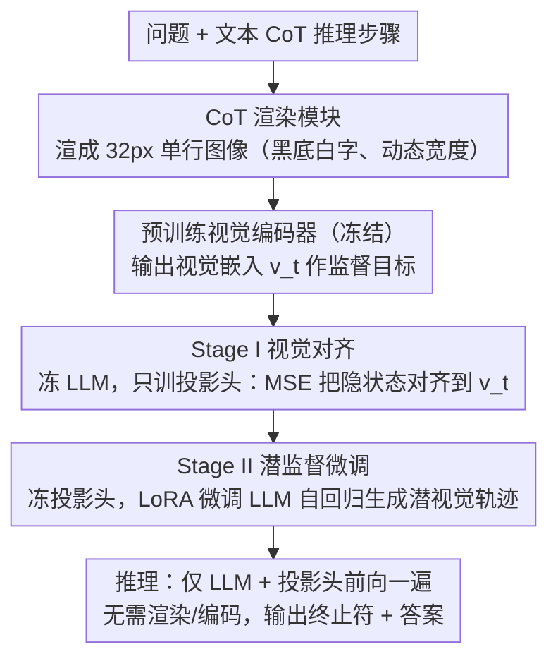

# Render-of-Thought: Rendering Textual Chain-of-Thought as Images for Visual Latent Reasoning

**会议**: ACL 2026  
**arXiv**: [2601.14750](https://arxiv.org/abs/2601.14750)  
**代码**: [TencentBAC/RoT](https://github.com/TencentBAC/RoT)  
**领域**: LLM推理  
**关键词**: 链式思维压缩, 视觉潜空间推理, 文本渲染为图像, CoT token压缩, 自蒸馏

## 一句话总结

提出 Render-of-Thought（RoT），首次将文本 CoT 推理步骤渲染为图像，利用预训练视觉编码器作为语义锚点将 LLM 隐状态对齐到视觉嵌入空间，实现 3-4 倍 token 压缩和显著推理加速，同时保持推理链的可分析性。

## 研究背景与动机

**领域现状**：Chain-of-Thought 提示已成为解锁 LLM 复杂推理能力的基础范式，但 CoT 的冗长特性导致严重的推理延迟和内存消耗问题。现有压缩方法主要分为两条路线：显式压缩（token 筛选、RL 激励短路径）和隐式推理（在潜空间中编码推理过程）。

**现有痛点**：显式压缩仍受限于稀疏 token 表示。隐式推理方法（如 Coconut、CODI、CoLaR）将思维压缩到不透明的连续向量中，但通常只关注结果对齐而缺乏对中间推理过程的监督，导致推理链的可分析性丧失——难以追踪模型的推理逻辑或诊断逻辑错误。此外许多方法采用复杂架构，影响训练稳定性。

**核心矛盾**：压缩效率与可解释性之间的矛盾——高压缩率的潜空间推理牺牲了推理过程的可追踪性，而保持可解释性的显式 CoT 又太冗长。

**本文目标**：找到一种既能大幅压缩 CoT 又能保持推理过程可观测的表示方式。

**切入角度**：视觉模态天然具有高信息密度——一张图像可以编码大量文本信息。如果将 CoT 文本渲染成图像，就能用视觉编码器的少量 token 表示完整的推理过程，而且渲染后的图像本身是可视化的，保留了可分析性。

**核心 idea**：将文本 CoT 渲染为单行图像，用预训练视觉编码器提取嵌入作为监督目标，训练 LLM 在视觉潜空间中自回归生成推理轨迹，推理时无需实际渲染和编码，仅需 LLM 前向传播。

## 方法详解

### 整体框架

RoT 想同时拿到两样平时鱼与熊掌的东西：把冗长 CoT 大幅压短，又不丢掉推理过程的可观测性。它的思路是借视觉模态的高信息密度——一张图能塞下大段文字。训练时它把文本 CoT 渲染成一张单行图像，过预训练视觉编码器得到一串嵌入，再让 LLM 通过一个投影头把自己的隐状态对齐到这串视觉嵌入上，从而学会在"视觉潜空间"里自回归地生成推理轨迹。整个训练分两步走：先冻住 LLM 和视觉编码器、只练投影头把两边对齐，再冻住投影头和视觉编码器、用 LoRA 微调 LLM 学会自主生成轨迹。关键是推理时根本不需要真的去渲染图像和跑视觉编码器，只靠 LLM + 投影头前向一遍就行，省下的就是被压掉的那几倍 token。

### 关键设计

**1. CoT 渲染模块：把推理文本压成单行图像，而不是方块图**

要用视觉编码器的少量 token 表示整段推理，先得把文本变成一张"好编码"的图。RoT 选择单行渲染：高度固定 32px、宽度随文本长度动态伸缩，黑底白字、20px 字号、4px 填充。之所以不用更直觉的方形图，是因为方形会带来两个麻烦——文本排不满留下大片空白区域（产生无意义嵌入）、长文本又得换行（多行之间引入空间歧义）。单行动态宽度把这两个问题一并消掉：图像 patch 严格从左到右一字排开，天然和文本顺序对齐，编码器读到的每个 patch 都对应实打实的推理内容。

**2. Stage I 视觉对齐：先把 LLM 的隐状态搬到视觉编码器现成的语义空间里**

潜空间推理最怕从零学一套表示空间、训练不稳。RoT 的取巧之处是不让 LLM 自己造空间，而是借预训练视觉编码器已经组织好的结构化表示当"语义锚点"。这一阶段冻住 LLM 和视觉编码器，只训一个轻量投影头（两层 MLP + SwiGLU）：在问题后面接一个 `<img_begin>` token 触发视觉推理，投影头把 LLM 的隐状态映到视觉嵌入空间，用 MSE 损失逼近视觉编码器的输出

$$\mathcal{L}_{align} = \frac{1}{K}\sum_{t=1}^{K}\|\hat{v}_t - v_t\|_2^2,$$

同时用交叉熵训练 `<img_end>` 终止 token 和最终答案的预测。注意这和典型 MLLM 的"视觉→LLM"方向正好相反，做的是"LLM→视觉"的投影，等于让 LLM 学着把思考结果写进视觉编码器看得懂的坐标系。

**3. Stage II 潜监督微调：在对齐好的空间里教 LLM 自己走完推理**

光对齐还不够，LLM 得学会主动生成一串能落在视觉空间里的推理轨迹、最后吐出答案。这一阶段反过来冻住视觉编码器和已对齐的投影头，只用 LoRA 微调 LLM：模型自回归生成潜视觉 token 序列，再输出终止符和文本答案。妙在投影头被冻住后形成一个隐式约束——LLM 只能生成那些"能被投影头映成有意义视觉表示"的隐状态，等于被逼着待在 Stage I 建好的空间里走。此阶段不再加显式视觉回归损失，只用答案预测的交叉熵训练。把对齐和推理拆成两步、而不是一锅端，正是为了避开"边建空间边学导航"带来的不稳定。

### 损失函数 / 训练策略

Stage I：$\mathcal{L}_I = \mathcal{L}_{pred} + \lambda \mathcal{L}_{align}$，同时优化对齐和预测。Stage II：仅 $\mathcal{L}_{pred}$，纯答案准确率目标。训练使用 AdamW 优化器，lr=2e-5，Stage I 训练 1 epoch，Stage II 训练 2 epoch。推理使用固定 token 预算的静态终止策略（而非动态终止），因为动态终止在连续潜表示上不稳定。

## 实验关键数据

### 主实验

| 模型/方法 | GSM8k-Aug Pass@1 | # L (tokens) | MultiArith Pass@1 | 平均效率比 |
|--------|------|------|----------|------|
| Qwen3-VL-4B SFT-CoT | 81.2% | 127.3 | 98.3% | 0.73 |
| Qwen3-VL-4B RoT | 37.8% | 32.0 | 97.2% | 1.73 |
| CoLaR-2 (LLM-based) | 40.0% | 39.6 | 82.2% | - |
| Coconut | 16.9% | 6.0 | 60.3% | - |

### 消融实验

| 配置 | GSM8k-Aug | MATH | 说明 |
|------|---------|------|------|
| Full RoT | 37.8% | 33.2% | 完整模型 |
| w/o Stage I | 24.8% | 22.2% | 去掉视觉对齐后大幅下降 |
| w/o Stage II | 29.9% | 26.2% | 去掉潜 SFT 也显著下降 |

### 关键发现

- 视觉对齐（Stage I）贡献最大：去掉后 GSM8k-Aug 从 37.8% 降至 24.8%，说明没有视觉锚点的潜空间容易表示坍塌
- 在简单任务（MultiArith）上 RoT 接近 CoT 性能（97.2% vs 98.3%），但 token 用量仅 32 vs 59，效率比从 0.73 提升到 1.73
- 推理速度显著提升：GSM-Hard 上从 8.55s 降至 1.84s（4.6 倍加速）
- 单行渲染远优于方形渲染：消除空白区域和空间歧义是关键
- RoT 在 OOD 泛化（SVAMP、MultiArith）上优于 LLM-based 方法 CoLaR-2，归因于预训练视觉编码器提供了更丰富的语义监督

## 亮点与洞察

- **视觉编码器作为语义锚点**：这是一个极其巧妙的设计——不是让视觉编码器学习新东西，而是利用它已有的结构化表示空间作为 LLM 推理的"坐标系"。这避免了从头学习潜空间的不稳定性，实现真正的即插即用
- **推理过程的可视化可分析性**：区别于其他潜空间推理方法，RoT 的潜 token 可以通过反向映射到视觉空间进行可视化分析，使"黑盒推理"重新变得可追踪
- **文本→图像→嵌入的信息瓶颈**：渲染过程本身作为一种天然的信息瓶颈，强制 LLM 学习推理的核心结构而非表面token，这个思路可迁移到其他压缩场景

## 局限与展望

- 准确率与 CoT 仍有明显差距（GSM8k-Aug: 37.8% vs 81.2%），说明视觉潜空间在高难度推理任务上的表达能力受限
- 固定 token 预算（32/64）不灵活，不同难度问题需要不同长度的推理链
- 依赖预训练视觉编码器的质量，不同编码器可能导致不同的对齐效果
- 可探索：动态 token 预算分配、多分辨率渲染、与 RL 结合优化推理链质量

## 相关工作与启发

- **vs Coconut/CODI**：Coconut 和 CODI 在纯语言潜空间中压缩推理，但缺乏中间过程监督；RoT 通过视觉锚点提供了结构化的监督信号，OOD 泛化更好
- **vs CoLaR**：CoLaR 使用动态压缩机制在语言潜空间中推理，平均效率接近但 RoT 在 OOD 数据集上优势明显（SVAMP: 72.7% vs 57.7%），说明视觉先验的价值

## 评分

- 新颖性: ⭐⭐⭐⭐⭐ 首次将 CoT 推理渲染为图像并在视觉潜空间中推理，范式级创新
- 实验充分度: ⭐⭐⭐⭐ 多模型多数据集评测，消融和分析充分，但高难度任务差距较大
- 写作质量: ⭐⭐⭐⭐ 图示直观，方法清晰，两阶段框架逻辑自洽
- 价值: ⭐⭐⭐⭐ 开辟了视觉潜空间推理的新方向，但实用性受限于准确率差距

<!-- RELATED:START -->

## 相关论文

- [\[NeurIPS 2025\] Latent Chain-of-Thought for Visual Reasoning](../../NeurIPS2025/llm_reasoning/latent_chain-of-thought_for_visual_reasoning.md)
- [\[ACL 2026\] Is Chain-of-Thought Really Not Explainability? Chain-of-Thought Can Be Faithful without Hint Verbalization](is_chain-of-thought_really_not_explainability_chain-of-thought_can_be_faithful_w.md)
- [\[ICML 2026\] A Formal Comparison Between Chain of Thought and Latent Thought](../../ICML2026/llm_reasoning/a_formal_comparison_between_chain_of_thought_and_latent_thought.md)
- [\[ACL 2026\] ETR: Entropy Trend Reward for Efficient Chain-of-Thought Reasoning](etr_entropy_trend_reward_for_efficient_chain-of-thought_reasoning.md)
- [\[ICML 2026\] LatentChem: From Textual CoT to Latent Thinking in Chemical Reasoning](../../ICML2026/llm_reasoning/latentchem_from_textual_cot_to_latent_thinking_in_chemical_reasoning.md)

<!-- RELATED:END -->
