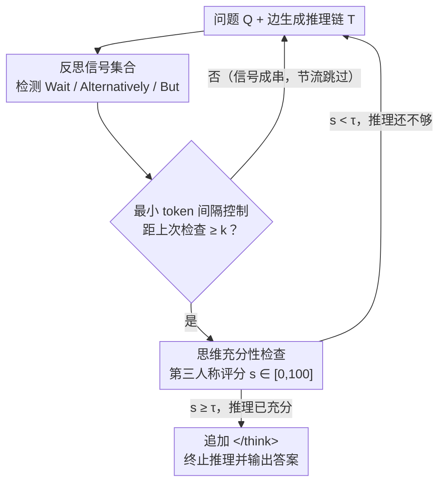

# When Is Thinking Enough? Early Exit via Sufficiency Assessment for Efficient Reasoning

**会议**: ACL 2026  
**arXiv**: [2604.06787](https://arxiv.org/abs/2604.06787)  
**代码**: 待确认  
**领域**: LLM推理  
**关键词**: 推理效率, 早退策略, 过度思考, 元认知, 链式思维

## 一句话总结

提出 DTSR 框架，通过检测推理过程中的"反思信号"（如 Wait、Alternatively）并在该位置让模型自我评估当前推理的"充分性"来决定是否提前终止推理，在 Qwen3 系列模型上实现 28.9%–34.9% 的推理长度缩减且几乎不损失精度。

## 研究背景与动机

**领域现状**：大型推理模型（LRM）如 DeepSeek-R1、Qwen3 通过长链式思维（CoT）在复杂推理任务上取得显著进步，但也带来了严重的推理冗余——即使在简单问题上也会反复验证和探索替代方案。

**现有痛点**：现有早退方法依赖手工设计的退出标准——Dynasor-CoT 用连续答案一致性判断（但在正确答案出现后仍需额外 token 验证），DEER 用中间答案的 entropy 作置信度指标。这些方法有两个根本问题：(1) 推理模型存在过度自信（overconfidence），即使答案错误时置信度也很高，导致基于置信度的判断不可靠；(2) 仅适用于短答案格式的任务，对代码生成、开放式问答等长答案场景不可行。

**核心矛盾**：如何在不依赖答案置信度的情况下判断推理过程是否已经"足够"？需要一种评估推理过程本身而非答案正确性的方法。

**本文目标**：设计一个通用的、可靠的早退框架，通过评估推理链的充分性而非答案的置信度来决定退出时机。

**切入角度**：借鉴人类元认知（metacognition）——人类不会频繁产出中间答案来判断是否该停止思考，而是内部评估"当前想法是否足够支撑最终结论"。

**核心 idea**：在推理模型的反思信号（如 "Wait"、"Let me check"）处触发充分性检查，让模型以第三人称视角评估当前推理链是否足以得出最终答案。

## 方法详解

### 整体框架

DTSR 分两阶段工作：(1) 反思信号监控——在模型生成过程中检测特定反思触发词（如 "Wait"、"Alternatively"、"But"），这些位置是模型即将开始冗余验证或回溯的信号；(2) 思维充分性检查——在检测到反思信号时，将原始问题和当前推理链输入充分性评估模板，让模型输出一个 0-100 的充分性分数。如果分数超过阈值 τ（默认 100），则追加 `</think>` 终止推理并输出最终答案，否则继续推理到下一个反思信号。为避免频繁触发检查，设置了最小 token 间隔 k（默认 64）。

### 关键设计

**1. 反思信号集合：把模型自己的"犹豫"当成天然退出口**

早退方法最棘手的是不知道该在哪里检查——固定间隔地插入检查既笨重又容易错过时机。作者换了个思路：先在 Qwen3-32B 的推理轨迹里标出每条样本的"最优早退点"（模型已经能给出正确答案的最早位置），然后观察这些点之后模型在做什么，发现它们后面紧跟着显式的自我反思行为——"Wait"、"Alternatively"、"But wait"、"Let me check" 这类词反复出现。于是这些反思触发词被收集成一个信号集合，作为退出候选点的标记。

这样做的合理性在于，反思信号恰好标记了模型从"推理"切换到"验证"的边界：正确答案往往在反思之前就已产生，反思之后的反复核对大多是冗余的。借用模型自身的生成规律来定位检查时机，比外加一套固定节奏的检查机制更贴合模型的行为。

**2. 思维充分性检查：让模型用第三人称视角评判"这段推理够不够"，而不是评判"我答得对不对"**

直接拿答案置信度判断该不该停，会撞上推理模型的过度自信——答案错了置信度也很高，导致判断不可靠，而且这套只对有标准短答案的任务有效。DTSR 绕开置信度，转而评估推理过程本身的完整性：在反思信号处，把原始问题 $Q$ 和当前推理链 $T$ 拼成一段充分性评估提示，让模型以"第三人称"口吻判断这段推理是否已经完整到足以推出正确答案，输出一个标量分数 $s \in [0, 100]$，当 $s \geq \tau$（默认 $\tau = 100$）时追加 `</think>` 终止推理、给出最终答案。

关键在"第三人称"这个视角转换。作者的假设是过度自信主要发生在"自我"评估里——评判别人的推理链比评判自己的答案更客观，实验也证实第三人称评估的准确率显著高于第一人称。这一转换同时带来了通用性：评估的是推理过程而非答案正确性，因此不再受限于有标准答案的任务，代码生成、开放式问答都能用。

**3. 最小 token 间隔控制：给密集出现的反思信号设一道节流阀**

反思信号经常成串出现，比如 "Wait, but let me check" 一句里就连着好几个触发词，若每个都触发一次充分性检查，开销会迅速堆积。DTSR 因此要求两次检查之间至少生成 $k$ 个 token（默认 $k = 64$），不足则跳过当前信号。这个间隔是个折中：$k < 64$ 检查过密、徒增延迟，$k > 64$ 又容易跨过最优退出点，$k = 64$ 时推理长度与推理延迟同时达到最优。

### 损失函数 / 训练策略

DTSR 是 training-free 方法，无需额外训练。仅在推理时插入充分性检查步骤。

## 实验关键数据

### 主实验

| 方法 | 模型 | Overall Acc | Overall Tok | 长度缩减 |
|------|------|------------|------------|---------|
| Vanilla | Qwen3-8B | 81.9 | 6510 | - |
| DEER | Qwen3-8B | 79.3 | 4532 | -30.4% |
| **DTSR** | Qwen3-8B | **81.0** | **4428** | **-32.0%** |
| Vanilla | Qwen3-14B | 84.4 | 5761 | - |
| DEER | Qwen3-14B | 83.0 | 4367 | -24.2% |
| **DTSR** | Qwen3-14B | **84.8** | **3748** | **-34.9%** |
| Vanilla | Qwen3-32B | 84.7 | 5638 | - |
| DEER | Qwen3-32B | 83.1 | 4318 | -23.4% |
| **DTSR** | Qwen3-32B | **84.6** | **4010** | **-28.9%** |

### 消融实验

| 配置 | 关键结果 | 说明 |
|------|---------|------|
| k=16 | 延迟增加，长度相当 | 检查过于频繁 |
| k=64 | 最优平衡点 | 默认设置 |
| k=256 | 长度增加 | 错过最优退出点 |
| τ=50 | Acc 显著下降 | 过早终止推理 |
| τ=100 | 最优 | 高置信终止 |
| 第一人称评估 | Acc 下降 | 过度自信更严重 |

### 关键发现
- Qwen3-14B 上 DTSR 甚至提升了精度（84.8 vs 84.4），说明去除冗余推理反而能改善结果
- 在编程任务（LiveCodeBench）上推理长度缩减超过 50%，因为编程任务的冗余验证更严重
- DTSR 的推理延迟低于 DEER（MATH-500: 1.9s vs 4.2s），因为 DEER 每次检查需要完整解码中间答案，而 DTSR 只需生成一个分数
- 第三人称评估范式（评估推理过程而非自我评估）显著优于第一人称，验证了作者关于"过度自信来源于自我评估"的假设

## 亮点与洞察

- **从元认知角度重新定义早退问题**：不是判断"答案对不对"，而是判断"推理够不够"——这一视角转换绕过了过度自信问题，且更具通用性（不限于有标准答案的任务）
- **反思信号是天然的退出候选点**：利用推理模型自身的行为模式（反思触发词），无需额外引入固定间隔的检查机制，更符合模型的生成规律
- **第三人称 vs 第一人称评估的发现**：模型评估他人的推理比评估自己的推理更准确，这一发现对 LLM 自评估领域有更广泛的启示

## 局限与展望

- 仅在 Qwen3 系列模型上验证，其他推理模型（DeepSeek-R1、o1 等）的反思信号模式可能不同
- 充分性检查本身需要额外计算——虽然整体延迟降低，但在部分场景（k 很小时）检查开销可能抵消节省
- 阈值 τ 的最优值可能随任务难度变化——固定为 100 可能不够灵活
- 未探讨与 training-based 方法的结合——若充分性检查模块经过训练可能效果更好

## 相关工作与启发

- **vs DEER**: 基于中间答案 entropy 的方法，受过度自信影响且仅适用于短答案任务；DTSR 评估推理过程而非答案，更通用且可靠
- **vs Dynasor-CoT**: 在连续答案一致后仍需额外验证 token，无法达到最优退出点；DTSR 在反思信号处直接评估可以更早退出
- **vs NoWAIT**: 通过遮蔽反思 token 减少冗余，但破坏了模型自然的推理能力；DTSR 保留完整推理能力仅在合适时机终止

## 评分

- 新颖性: ⭐⭐⭐⭐ 元认知视角和第三人称评估的思路有新意，但整体框架比较直觉
- 实验充分度: ⭐⭐⭐⭐ 三个模型尺寸、六个数据集、多维度消融，较为充分
- 写作质量: ⭐⭐⭐⭐ 动机和方法描述清晰，实验分析有深度
- 价值: ⭐⭐⭐⭐ 对推理效率领域有实际价值，training-free 方法易于部署

<!-- RELATED:START -->

## 相关论文

- [\[ACL 2026\] Step-GRPO: Internalizing Dynamic Early Exit for Efficient Reasoning](step-grpo_internalizing_dynamic_early_exit_for_efficient_reasoning.md)
- [\[ACL 2026\] Efficient Test-Time Scaling via Temporal Reasoning Aggregation](efficient_test-time_scaling_via_temporal_reasoning_aggregation.md)
- [\[ACL 2026\] DRP: Distilled Reasoning Pruning with Skill-aware Step Decomposition for Efficient Large Reasoning Models](drp_distilled_reasoning_pruning_with_skill-aware_step_decomposition_for_efficien.md)
- [\[ACL 2026\] Reinforced Efficient Reasoning via Semantically Diverse Exploration](reinforced_efficient_reasoning_via_semantically_diverse_exploration.md)
- [\[ACL 2026\] ETR: Entropy Trend Reward for Efficient Chain-of-Thought Reasoning](etr_entropy_trend_reward_for_efficient_chain-of-thought_reasoning.md)

<!-- RELATED:END -->
