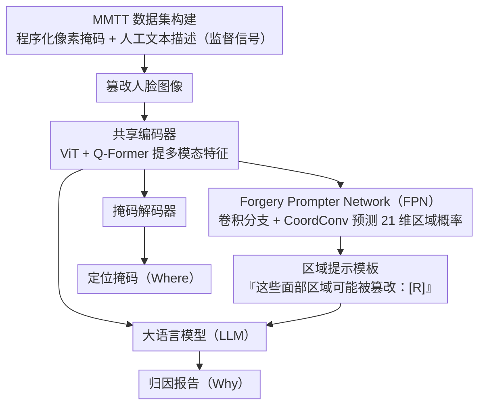

# ForgeryTalker: Generating Attribution Reports for Manipulated Facial Images

**会议**: ACL 2026  
**arXiv**: [2412.19685](https://arxiv.org/abs/2412.19685)  
**代码**: [https://github.com/NattyLianJc/Generating-Attribution-Reports](https://github.com/NattyLianJc/Generating-Attribution-Reports)  
**领域**: 人体理解  
**关键词**: 面部伪造检测, 归因报告生成, 多模态取证, 图像篡改定位, 可解释AI

## 一句话总结

本文提出伪造归因报告生成（Forgery Attribution Report Generation）这一新任务，构建了包含 152,217 个样本的 MMTT 数据集（首个同时提供像素级掩码和人工文本描述的大规模面部伪造数据集），并提出 ForgeryTalker 端到端基线，通过共享编码器和双解码器（掩码+语言模型）联合生成定位掩码和归因报告，达到 59.3 CIDEr 和 73.67 IoU。

## 研究背景与动机

**领域现状**：扩散模型等先进生成模型极大增强了合成图像的真实感，面部篡改检测研究已从二分类发展到细粒度伪造定位。

**现有痛点**：(1) 二分类仅输出判定，不提供语义理解；(2) 像素级掩码虽然能定位篡改区域，但对所有篡改像素一视同仁，无法区分微妙和显著的篡改，也无法解释篡改的原因和性质；(3) 随着现代伪造越来越逼真，掩码无法为人工审核者提供描述性证据。

**核心矛盾**：现有方法回答了"哪里被篡改了"但没有回答"为什么被认为是篡改的"和"篡改的具体表现是什么"。

**本文目标**：定义伪造归因报告生成任务——同时定位篡改区域（Where）并生成基于编辑过程的自然语言解释（Why），提供可解释的多模态取证。

**切入角度**：利用伪造过程本身生成像素完美的真值掩码（无需人工标注掩码），结合人工在环流水线编写文本描述，构建高质量数据集。

**核心 idea**：通过共享编码器学习统一的伪造感知多模态表示，同时驱动掩码解码器（定位）和大语言模型（解释），实现定位与解释的协同增强。

## 方法详解

### 整体框架

ForgeryTalker 基于 InstructBLIP 扩展，包含：(1) 共享编码器（ViT + Q-Former）处理篡改图像提取多模态特征；(2) Forgery Prompter Network (FPN) 生成区域关键词提示；(3) 掩码解码器用于伪造定位；(4) 大语言模型生成归因报告。训练分两阶段：伪造感知预训练和归因报告生成。

> 整张图由两阶段训练策略统一支配：阶段一预训练共享编码器，阶段二先单独训 FPN 再冻结、微调 Q-Former 与掩码解码器。

### 关键设计

**1. MMTT 数据集构建：用伪造过程本身换取像素完美的掩码，再叠上人工文本描述**

现有数据集（FaceForensics++、Celeb-DF 等）要么只给二分类标签，要么只给掩码，都回答不了“为什么这里被认定为篡改”。MMTT 把定位与解释两路真值一次性补齐：152,217 个样本覆盖四种篡改范式（人脸交换、面部编辑、Transformer 修复、扩散修复），其中掩码不靠人工描，而是从伪造流程程序化生成——既然篡改区域是生成器自己改出来的，就能直接拿到像素精确的真值，彻底消除标注误差。文本侧则走人工在环：30 名专业标注员遵循结构化流程，每张图至少观察 1 分钟、用 120 词以内描述篡改的位置与表现。两者结合让数据集第一次同时具备“哪里被改”和“怎么被改”的监督信号。

**2. Forgery Prompter Network (FPN)：先替人工审核者圈出“该重点查哪几块脸”，再把它喂给 LLM**

人工审核者也得逐区域仔细比对才能发现不一致，FPN 就是把这个“锁定可疑区域”的动作自动化。它以 ViT 为主干，在前 $m$ 层并行接入卷积分支（含坐标卷积 CoordConv），用局部卷积捕捉细微异常、利用面部刚性的空间结构；全局注意力特征与局部卷积特征逐层融合后，经分类头预测一个 21 维面部区域概率向量。这个区域预测不会孤立使用，而是填进“这些面部区域可能被 AI 篡改：[R]”的模板，作为显式提示引导 LLM 写报告——相当于先给语言模型划好重点，再让它就这些区域展开解释。

**3. 两阶段训练策略：先建伪造感知表示，再让区域提示引导报告生成**

直接端到端联合训练定位与解释并不稳定，于是拆成两阶段。阶段一是伪造感知预训练，联合优化掩码语言建模 $\mathcal{L}_{mlm}$、语言建模 $\mathcal{L}_{lm}$、分割损失 $\mathcal{L}_{seg}$ 和跨模态对比对齐 $\mathcal{L}_{con}$，让共享编码器先学到统一的伪造感知多模态表示。阶段二是报告生成：先单独训练 FPN（损失为 $\frac{1}{2}(\mathcal{L}_{BCE}+\mathcal{L}_{Dice})$，其中 BCE 用折扣因子 $\omega<1$ 缓解未修改区域占多数带来的类别不平衡），训好后冻结，再微调 Q-Former 和掩码解码器用于定位与解释。这样定位与解释共享同一编码器、又被 FPN 的区域提示串联，两个任务相互增强而非互相干扰。

### 损失函数 / 训练策略

预训练阶段损失：$\mathcal{L} = \mathcal{L}_{mlm} + \mathcal{L}_{lm} + \mathcal{L}_{seg} + \mathcal{L}_{con}$。FPN 损失：$\frac{1}{2}(\mathcal{L}_{BCE} + \mathcal{L}_{Dice})$，其中 BCE 使用折扣因子 $\omega < 1$ 处理未修改区域的类别不平衡。报告生成阶段使用标准语言建模损失。

## 实验关键数据

### 主实验

**报告生成和伪造定位性能**

| 方法 | CIDEr | BLEU-4 | ROUGE-L | IoU |
|------|-------|--------|---------|-----|
| InstructBLIP (baseline) | 42.1 | 8.2 | 29.5 | - |
| ForgeryTalker (w/o FPN) | 52.8 | 11.4 | 33.2 | 68.3 |
| **ForgeryTalker** | **59.3** | **13.1** | **35.7** | **73.67** |

### 消融实验

| 配置 | CIDEr | IoU | 说明 |
|------|-------|-----|------|
| Full model | 59.3 | 73.67 | 完整 |
| w/o FPN | 52.8 | 68.3 | FPN 对两个任务都有贡献 |
| w/o 预训练 | 45.6 | 65.1 | 预训练阶段至关重要 |
| w/o 对比损失 | 55.1 | 71.2 | 跨模态对齐有助于协同 |

### 关键发现

- FPN 对报告生成（+6.5 CIDEr）和定位（+5.37 IoU）都有显著贡献，说明区域提示有效引导了两个任务
- 联合训练定位和报告生成比单独训练更好，证实了两个任务的协同效应
- 眼睛、眉毛和嘴唇是最常见的篡改目标，占所有局部编辑的大部分
- 生成的文本描述平均 27.4 词，与视觉伪造区域高度对应

## 亮点与洞察

- 任务定义有前瞻性——从"检测伪造"到"解释伪造"是取证领域的自然演进方向
- 从伪造过程本身生成掩码的策略消除了标注误差，为数据集构建提供了高效范式
- 双解码器共享编码器的设计思路可迁移到其他需要同时定位和解释的多模态任务

## 局限与展望

- 假设输入图像已被上游检测器标记为可疑，不处理真实图像
- 文本描述的标注成本仍然较高（30 名标注员）
- 仅覆盖面部篡改，其他类型的图像篡改未涉及
- 未来可探索更细粒度的篡改方法归因（如区分 GAN 和扩散生成）

## 相关工作与启发

- **vs FaceForensics++**: 仅提供分类/分割标签，无文本解释；MMTT 首次提供文本归因
- **vs OpenForensics**: 提供检测框和掩码但无语义解释
- **vs DF40**: 大规模但仅标签+掩码；MMTT 虽规模较小但信息维度更丰富

## 评分

- 新颖性: ⭐⭐⭐⭐ 伪造归因报告生成是有意义的新任务定义
- 实验充分度: ⭐⭐⭐⭐ 数据集构建详尽，多消融验证
- 写作质量: ⭐⭐⭐⭐ 任务动机清晰，数据集对比全面
- 价值: ⭐⭐⭐⭐ 推动取证从检测走向可解释分析

<!-- RELATED:START -->

## 相关论文

- [\[ACL 2026\] De-Anonymization at Scale via Tournament-Style Attribution](de-anonymization_at_scale_via_tournament-style_attribution.md)
- [\[AAAI 2026\] Uncovering Pretraining Code in LLMs: A Syntax-Aware Attribution Approach](../../AAAI2026/llm_safety/uncovering_pretraining_code_in_llms_a_syntax-aware_attribution_approach.md)
- [\[ICLR 2026\] Automatic Dialectic Jailbreak: A Framework for Generating Effective Jailbreak Strategies](../../ICLR2026/llm_safety/automatic_dialectic_jailbreak_a_framework_for_generating_effective_jailbreak_str.md)
- [\[ICLR 2026\] Reasoning or Retrieval? A Study of Answer Attribution on Large Reasoning Models](../../ICLR2026/llm_safety/reasoning_or_retrieval_a_study_of_answer_attribution_on_large_reasoning_models.md)
- [\[NeurIPS 2025\] Attention! Your Vision Language Model Could Be Maliciously Manipulated](../../NeurIPS2025/llm_safety/attention_your_vision_language_model_could_be_maliciously_manipulated.md)

<!-- RELATED:END -->
