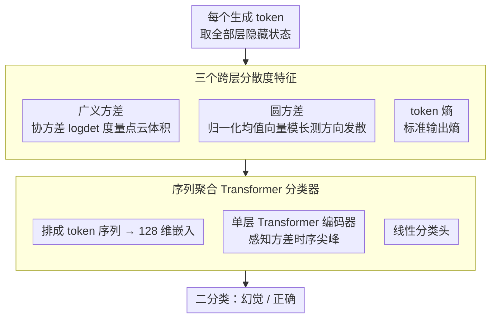

# Learning Uncertainty from Sequential Internal Dispersion in Large Language Models

**会议**: ACL 2026  
**arXiv**: [2604.15741](https://arxiv.org/abs/2604.15741)  
**代码**: [GitHub](https://github.com/ponhvoan/internal-variance)  
**领域**: 不确定性估计 / 幻觉检测  
**关键词**: 不确定性估计, 幻觉检测, 隐藏状态方差, 序列聚合, 内部表征分散度

## 一句话总结

提出 SIVR 框架，通过计算 LLM 隐藏状态跨层的内部方差（广义方差、圆方差、token 熵）作为 token 级特征，用轻量 Transformer 编码器聚合全序列模式来估计不确定性/检测幻觉，显著优于基线且泛化更强。

## 研究背景与动机

**领域现状**：不确定性估计是检测 LLM 幻觉的重要手段。现有方法包括采样一致性（如 Semantic Entropy）、输出概率方法（如 Entropy）、以及内部状态探针方法。

**现有痛点**：(1) 采样方法计算开销大；(2) CoE 等方法对层间演化假设过严，跨模型/任务不成立；(3) 仅用最后/平均 token 会丢失时序模式。

**核心矛盾**：CoE 压缩为单一分数，忽略了不同 token 位置的方差模式。如 "Praia is in Portugal" 中 "Portugal" 处的方差尖峰能标记错误，但均值汇总会掩盖。

**本文目标**：设计基于更宽松假设的内部状态特征，并保留完整序列信息。

**切入角度**：不确定性反映在隐藏状态跨层的"分散程度"上——正确时表征更集中，错误时更分散。

**核心 idea**：用三个分散度统计量（广义方差、圆方差、token 熵）描述每个 token 的跨层分散度，用 Transformer 编码器学习全序列模式来预测幻觉。

## 方法详解

### 整体框架

对每个生成 token 提取所有层隐藏状态，计算三个内部方差特征 $\bm{v}_t = [v_t, c_t, e_t]$，形成序列输入轻量 Transformer 编码器进行二分类。

### 关键设计

**1. 广义方差（Generalised Variance）：用一个标量刻画 token 跨层表征的"体积"分散度**

CoE 这类方法只看相邻层之间的差异（步长），假设偏强、跨模型跨任务常常失效。广义方差换了个更基本的视角——把某 token 在所有层上的隐藏状态看成一团点云，用其正则化协方差矩阵的对数行列式 $v_t = \log\det(\Sigma') = \sum_i \log \lambda_i$ 来度量这团点云的"体积"。

之所以有效，是因为对数行列式聚合的是整个特征谱（所有特征值 $\lambda_i$），而不是某两层的局部差，因此能给出更全面的跨层分散度；而且它与微分熵直接相关，分散度越大对应表征越不确定。这正契合本文的核心假设：模型答对时跨层表征更集中，答错时更分散。

**2. 圆方差（Circular Variance）：从"方向"而非"幅度"补一个互补的分散度信号**

广义方差捕捉的是幅度/体积，但两团体积相同的点云方向可能完全不同，单看体积会漏掉这类信息。圆方差先把各层隐藏状态归一化到单位球面，再看它们的均值向量模长能不能撑起来：

$$c_t = 1 - \Big\|\frac{1}{L+1}\sum_l \hat{\bm{h}}_t^l\Big\|$$

各层方向越一致，均值向量越接近单位长度，$c_t$ 越小；方向越发散，均值向量越短，$c_t$ 越大。它和广义方差天然互补——前者管幅度、后者管方向，且隐式编码了所有层之间的成对方向关系，两者拼起来才能完整描述一个 token 的跨层分散度。

**3. 序列聚合 Transformer 分类器：保留整条序列的分散度模式，而不是压成一个平均分**

CoE 把整段输出压缩成单一分数，会把"某个关键 token 处的方差尖峰"抹平——比如 "Praia is in Portugal" 里 "Portugal" 处的尖峰本能标记错误，一取均值就消失了。本文反过来保留完整时序：把每个 token 的三元特征 $\bm{v}_t = [v_t, c_t, e_t]$（广义方差、圆方差、token 熵）排成序列，先过一个 128 维嵌入层，再过单层 Transformer 编码器，最后接线性分类头做二分类，训练目标是带 $l_2$ 正则的交叉熵。

因为 Transformer 能感知 token 顺序，它可以学到"方差在某处突然飙升"这类时序模式，而这恰恰是均值聚合或只取末 token 会丢掉的判别信号——消融里序列聚合比均值聚合高 2–3 个 AUC 点正是这个原因。整套分类器很轻，只需几百到几千条标注样本即可训练。

### 损失函数 / 训练策略

二分类交叉熵 + $l_2$ 正则，仅需几百到几千标注样本。

## 实验关键数据

### 主实验

Llama-3.1-8B 上 7 个数据集 AUC 对比：

| 方法 | TriviaQA | SciQ | MedMCQA | MATH | 平均 AUC | 排名 |
|------|---------|------|---------|------|---------|------|
| Entropy | 80.46 | 72.85 | 62.76 | 62.77 | 67.63 | 7.96 |
| SE | 84.44 | 79.44 | 66.88 | 67.27 | 68.87 | 7.13 |
| CoE-C | 66.97 | 75.06 | 62.14 | 58.67 | 61.25 | 11.08 |
| **SIVR** | **90.75** | **83.64** | **68.37** | **71.22** | **75.35** | **1.88** |

### 消融实验

| 配置 | 平均 AUC | 说明 |
|------|---------|------|
| 仅 Token 熵 | 71.2 | 基本有效但不足 |
| 仅广义方差 | 72.8 | 互补信号 |
| 三者组合（SIVR） | **75.35** | 最佳 |
| 均值聚合替代序列 | 72.5 | 损失时序模式 |

### 关键发现

- SIVR 平均排名 1.88 远优于第二名，三个特征互补性强
- 序列聚合比均值/末 token 聚合提升 2-3 AUC，证明时序模式的价值
- OOD 泛化性显著优于 CoE，仅需少量训练数据

## 亮点与洞察

- **"分散度"假设比"步长"假设更鲁棒**——CoE 假设在不同模型间不一致，SIVR 的假设更基本通用
- **保留序列结构的范式可迁移**——任何需要从 token 级信号推断序列级属性的任务都可借鉴
- **轻量但有效**——3 个统计量 + 单层 Transformer，推理开销几乎可忽略

## 局限与展望

- 需要标注数据，虽然量不大但新领域需额外标注
- 仅验证贪婪解码，采样解码下表现待评估
- 大规模模型（70B+）上验证不足
- 未探索将 SIVR 用于主动幻觉缓解

## 相关工作与启发

- **vs CoE**: CoE 假设过强跨任务失效，SIVR 假设更宽松
- **vs Semantic Entropy**: SE 需多次采样计算昂贵，SIVR 仅需单次前向传播
- **vs Lookback Lens**: 侧重特定层/注意力模式，SIVR 提供更全局视角

## 评分

- 新颖性: ⭐⭐⭐⭐ 内部方差特征思路清晰，各组件较简单但组合有效
- 实验充分度: ⭐⭐⭐⭐⭐ 7 数据集多模型全面消融
- 写作质量: ⭐⭐⭐⭐ 动机论证清晰，可视化有效
- 价值: ⭐⭐⭐⭐⭐ 实用性强，对幻觉检测有直接实践价值

<!-- RELATED:START -->

## 相关论文

- [\[ACL 2026\] From Passive Metric to Active Signal: The Evolving Role of Uncertainty Quantification in Large Language Models](from_passive_metric_to_active_signal_the_evolving_role_of_uncertainty_quantifica.md)
- [\[ACL 2026\] Exploring Cross-Client Memorization of Training Data in Large Language Models for Federated Learning](exploring_cross-client_memorization_of_training_data_in_large_language_models_fo.md)
- [\[ACL 2025\] UAlign: Leveraging Uncertainty Estimations for Factuality Alignment on Large Language Models](../../ACL2025/llm_safety/ualign_leveraging_uncertainty_estimations_for_factuality_alignment_on_large_lang.md)
- [\[ICML 2025\] CROW: Eliminating Backdoors from Large Language Models via Internal Consistency Regularization](../../ICML2025/llm_safety/crow_eliminating_backdoors_from_large_language_models_via_internal_consistency_r.md)
- [\[ACL 2026\] Multi-component Causal Tracing in Large Language Models](multi-component_causal_tracing_in_large_language_models.md)

<!-- RELATED:END -->
