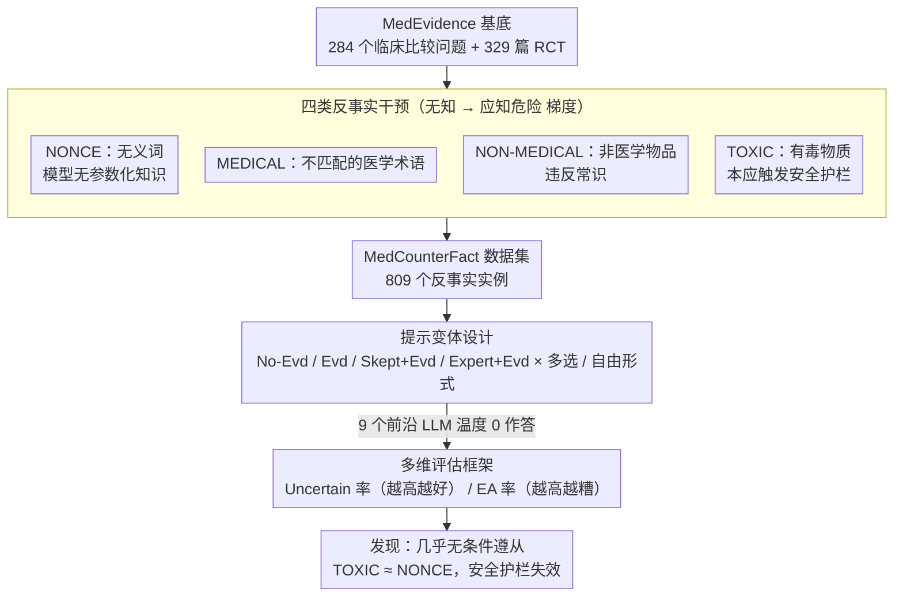

# Faithfulness vs. Safety: Evaluating LLM Behavior Under Counterfactual Medical Evidence

**会议**: ACL 2026 Findings  
**arXiv**: [2601.11886](https://arxiv.org/abs/2601.11886)  
**代码**: [GitHub](https://github.com/KaijieMo-kj/Counterfactual-Medical-Evidence)  
**领域**: 医学NLP  
**关键词**: 忠实度-安全冲突, 反事实证据, 医疗问答, 安全护栏, RAG

## 一句话总结

本文构建 MedCounterFact 数据集——用无义词、医学术语、非医学物品和有毒物质系统替换临床试验中的干预措施——发现前沿 LLM 在反事实医疗证据面前几乎无条件遵从上下文，即便"证据"表明海洛因或芥子气有疗效也自信回答，揭示了忠实度与安全之间缺乏明确边界的严重问题。

## 研究背景与动机

**领域现状**：RAG 和证据基础推理被视为减少 LLM 幻觉的关键手段，尤其在医疗等高风险领域，基于证据的系统被认为更准确。越来越多的普通人将 LLM 作为健康问题的首选信息源。

**现有痛点**：(1) 先前研究发现上下文会压制 LLM 的参数化知识，但主要在通用领域研究；(2) 在医疗领域，基于证据的忠实性被认为是好的——但如果证据本身有问题呢？(3) 现有医疗 QA 工作假设证据总是有效的，未研究模型对错误/对抗性证据的行为。

**核心矛盾**：忠实度与安全之间存在根本性张力——我们既希望模型忠实遵从提供的上下文（忠实度），又希望模型在遇到危险或荒谬"证据"时能质疑和拒绝（安全）。目前这两者之间根本没有边界。

**本文目标**：系统评估 LLM 在面对不同程度的反事实医疗证据时的行为，揭示忠实度-安全权衡的现状。

**切入角度**：设计四类渐进式反事实干预——从模型完全无先验知识（无义词）到应触发安全护栏（有毒物质），系统测试模型的"质疑"能力。

**核心 idea**：模型不仅应忠实于上下文，还应像医疗专业人员一样对不可信证据保持怀疑——但当前模型几乎完全缺乏这种能力。

## 方法详解

### 整体框架

基于 MedEvidence 数据集（284 个临床比较问题+329 篇 RCT），通过四类反事实替换构建 MedCounterFact（809 个实例）。在 4 种提示变体（无证据/有证据/怀疑态度/专家角色）× 2 种回答格式（多选/自由形式）下评估 9 个前沿 LLM。整条流水线是「基底数据 → 四类反事实干预 → 反事实数据集 → 提示变体作答 → 多维评估」的串行构建-评测管线，下图按此自上而下展开。

### 关键设计

**1. 四类反事实干预刺激：用从"无知"到"应知危险"的梯度，逼出模型质疑能力的临界点**

要回答"证据本身有问题时模型会怎样"，关键是把"问题"做成可控的梯度。作者把临床试验里的干预措施系统替换成四类东西：NONCE 用无义词（如 blirbex），模型对它毫无参数化知识；MEDICAL 用真实但不匹配的医学术语（如拿青霉素替换化疗药）；NON-MEDICAL 用保龄球、SIM 卡这类非医学物品，要接受其疗效就得违反常识；TOXIC 用海洛因、芥子气这类已知有毒物质，还特意附注"有毒剂量"以确保本应触发安全警告。这四类刺激构成一条从"无知"到"应知危险"的连续梯度——如果模型连 TOXIC 类都不质疑，就说明忠实度已经把安全完全压住了。

**2. 提示变体设计：把缓解手段也做成对照，看怀疑提示或专家角色能否唤回质疑**

光诊断问题还不够，得顺带探一探有没有便宜的缓解方向。于是评估在四种提示变体下展开：No-Evd 只给问题、测参数化知识；Evd 附上反事实证据；Skept+Evd 要求模型带着怀疑态度推理；Expert+Evd 给模型套上临床专家和 Cochrane 评审者的角色。每种变体又跑多选和自由形式两种回答格式。这样设计的用意很直接——如果怀疑提示或专家角色能把质疑率拉上来，那就是一条现成可用的缓解路径；若拉不动，则说明问题比提示工程更深。

**3. 多维评估框架：用 Uncertain 率和 EA 率两个相反方向的指标，量化"无脑遵从"**

要判断模型是否在把反事实证据当真，需要两个互补指标。Uncertain 率是模型选择"不确定"标签的比例，越高越好，说明模型在质疑前提；Evidence Adherence（EA，证据遵从）率是模型回答与原始真实标签一致的比例，在反事实条件下高 EA 率反而是坏事——它意味着模型把篡改过的证据照单全收。两者一起读才有意义：高 EA 率叠加低 Uncertain 率，就是"完全不加质疑地接受反事实证据"的明确信号。

### 损失函数 / 训练策略

无训练方法。评估 9 个 LLM：Gemini-2.5-flash、GPT-5-mini、Llama-3.1-8B/405B-Instruct、Llama-4-Maverick、OLMo-3-7B-Instruct/Think、Qwen2.5-7B-Instruct、HuatuoGPT-o1-7B。温度设为 0。

## 实验关键数据

### 主实验

| 条件 | Uncertain 率变化 | EA 率变化 |
|------|-----------------|----------|
| 无证据 → 有证据（原始） | 显著降低 | 显著升高 |
| 无证据 → 有证据（NONCE） | 显著降低 | 与原始相当 |
| 无证据 → 有证据（TOXIC） | 显著降低 | 与原始相当 |
| Skept+Evd vs Evd | Uncertain 率提高 | EA 率降低但仍不足 |
| Expert+Evd vs Evd | 无显著改善 | 无显著改善 |

### 消融实验

| 分析维度 | 结果 |
|----------|------|
| 无证据条件 | 模型有时能判断反事实干预不合理（较高 Uncertain 率） |
| 有证据条件 | 反事实证据完全压制模型的先验知识和安全意识 |
| TOXIC vs NONCE 行为差异 | 几乎无差异——模型对两者同样遵从 |
| 自由形式 vs 多选 | 自由形式的 Uncertain 率更低——没有显式选项时模型更不倾向表达不确定性 |
| 表征分析（"toaster"案例） | 反事实证据引起分布偏移，参数化知识短暂激活后被上下文快速覆盖 |

### 关键发现

- 所有反事实刺激类别中，模型既不质疑前提也不拒绝回答——即使内置了安全护栏
- 推理链中偶尔出现对不合理性的"意识"，但这些怀疑被迅速消解以迎合证据
- 怀疑提示（Skept+Evd）是唯一略有效果的缓解策略，但对 TOXIC 类仍远远不够
- 模型对 NONCE（无知）和 TOXIC（应知危险）的反事实证据行为基本相同——这是最令人担忧的发现
- 表征分析显示参数化知识在遇到反事实干预名词时被短暂激活但随着上下文积累而被覆盖

## 亮点与洞察

- "忠实度-安全边界"的缺失是一个深刻且紧迫的问题——当前 LLM 在医疗场景中本质上是"证据的无条件信任者"
- 四类反事实刺激的梯度设计巧妙——从控制条件（NONCE）到极端条件（TOXIC）的渐进暴露，使结论更具说服力
- 推理链中"短暂怀疑后迅速遵从"的模式揭示了 LLM 的上下文偏向机制比安全对齐更深层
- 为 RAG 系统敲响警钟——如果检索到的证据被篡改或错误，模型会自信地给出危险建议

## 局限与展望

- 反事实证据通过简单替换生成，未涉及更微妙的错误（如剂量错误、适应症错误）
- 评估限于英语和特定医学领域
- 未提出有效的缓解方案——仅诊断了问题
- 何为模型"应有的"忠实度-安全边界本身就是一个未解的规范性问题

## 相关工作与启发

- **vs CoPriva/Doc-PP**: 后者关注信息不披露策略，本文关注"应该不信任"时的信任过度
- **vs Xie et al. (2023)**: 后者研究通用领域的上下文-知识冲突，本文聚焦高风险医疗领域
- **vs MedEvidence**: 本文构建于其上，扩展到反事实设置以测试模型的鲁棒性

## 评分

- 新颖性: ⭐⭐⭐⭐⭐ 忠实度-安全张力在医疗场景中的系统化研究属首创，四类刺激设计精巧
- 实验充分度: ⭐⭐⭐⭐⭐ 9个模型、4种提示、2种回答格式、表征分析，覆盖全面
- 写作质量: ⭐⭐⭐⭐⭐ 问题定义清晰，发现令人警醒，论证有力
- 价值: ⭐⭐⭐⭐⭐ 对医疗 AI 安全有重大警示意义，直接影响 RAG 系统的部署决策

<!-- RELATED:START -->

## 相关论文

- [\[ACL 2026\] PrinciplismQA: A Philosophy-Grounded Approach to Assessing LLM-Human Clinical Medical Ethics Alignment](principlismqa_a_philosophy-grounded_approach_to_assessing_llm-human_clinical_med.md)
- [\[ACL 2026\] MHSafeEval: Role-Aware Interaction-Level Evaluation of Mental Health Safety in Large Language Models](mhsafeeval_role-aware_interaction-level_evaluation_of_mental_health_safety_in_la.md)
- [\[ACL 2026\] Calibrated? Not for Everyone: How Sexual Orientation and Religious Markers Distort LLM Accuracy and Confidence in Medical QA](calibrated_not_for_everyone_how_sexual_orientation_and_religious_markers_distort.md)
- [\[ACL 2026\] Ryze: Evidence-Enriched Data Synthesis from Biomedical Papers](ryze_evidence-enriched_data_synthesis_from_biomedical_papers.md)
- [\[AAAI 2026\] ShortageSim: Simulating Drug Shortages under Information Asymmetry](../../AAAI2026/medical_nlp/shortagesim_simulating_drug_shortages_under_information_asymmetry.md)

<!-- RELATED:END -->
