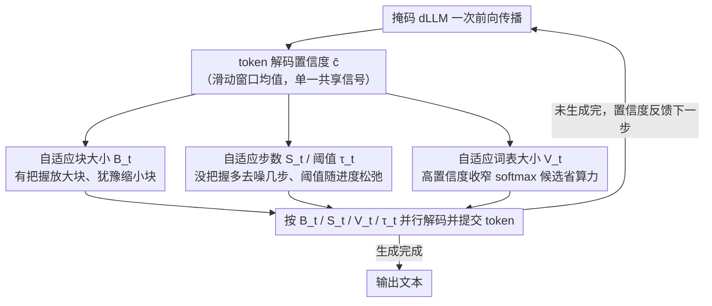

# CadLLM: Improving the Throughput of Diffusion-based LLMs via Training-Free Confidence-Aware Calibration

**会议**: ACL 2026 Findings  
**arXiv**: [2512.07173](https://arxiv.org/abs/2512.07173)  
**代码**: 有  
**领域**: 模型压缩  
**关键词**: 扩散语言模型, 推理加速, 自适应解码, 置信度校准, 无训练方法

## 一句话总结
提出 CadLLM，一种免训练的自适应推理加速方法，利用扩散语言模型（dLLM）的 token 解码置信度信号动态调整块大小、步数、词表采样范围和提交阈值四个维度，在 LLaDA 和 DREAM 上实现 1.1-2.28× 的吞吐量提升且保持竞争性准确率。

## 研究背景与动机

**领域现状**：掩码扩散语言模型（如 LLaDA、DREAM）通过多步去噪马尔可夫过程迭代精炼嘈杂状态来生成文本，展示了强大的生成能力。fast-dLLM 提出基于静态置信度阈值的并行解码加速。

**现有痛点**：fast-dLLM 使用固定的块大小、固定步数和固定采样宽度，忽略了置信度在序列和步骤间的动态变化。具体来说：(1) 固定块大小无视不同区域的难度差异；(2) 统一采样宽度忽略了确定性差异；(3) 固定提交阈值不适应不同推理阶段的置信度变化。

**核心矛盾**：静态调度策略对容易的块过度精炼（浪费计算），对困难的块精炼不足（损害质量）——需要根据置信度信号自适应分配计算资源。

**本文目标**：设计一种免训练、模型无关的即插即用方法，利用置信度信号自适应控制 dLLM 推理的多个资源维度。

**切入角度**：作者通过分析不同块和步骤间的置信度动态发现置信度变化显著——块内置信度快速上升后趋于平稳，不同块间难度差异大。

**核心 idea**：用 token 解码置信度作为单一共享信号，驱动四个闭环控制策略（块大小、步数、词表大小、阈值），在不确定性持续处分配计算资源，在预测稳定处节省资源。

## 方法详解

### 整体框架
CadLLM 在 dLLM 的每次前向传播后，利用 token 置信度作为反馈信号，通过四个线性插值策略动态更新块大小 $B_t$、步数 $S_t$、词表大小 $V_t$ 和阈值 $\tau_t$，形成闭环控制器。即插即用，兼容 KV 缓存的 dLLM。

### 关键设计

**1. 自适应块大小 $B_t$：按置信度决定一次并行解码多少 token**

固定块大小的麻烦在于不同区域的难度天差地别（Figure 1(a)）——简单段落给小块是浪费前向传播，困难段落给大块又会一次性提交太多没把握的 token。CadLLM 让块大小跟着置信度走：$B_t = \text{clip}(B_{\min} + (B_{\max} - B_{\min}) \cdot \bar{c}, B_{\min}, B_{\max})$，其中 $\bar{c}$ 是滑动窗口（$\Delta=2$）内的平均置信度。模型有把握时块放大，把一次前向的成本摊到更多 token 上；模型犹豫时块缩小，把算力集中到这一小段反复精炼。

**2. 自适应步数 $S_t$ 与自适应阈值 $\tau_t$：一个控精炼深度，一个控提交激进度**

块大小定了“一次解码范围”，但每块内部要精炼几步、提交时多大胆，仍是固定的就不合理。CadLLM 用两条互补的曲线来调：步数与置信度反相关 $S_t = \text{clip}(S_{\text{base}} + (S_{\max} - S_{\text{base}})(1 - \bar{c}), S_{\text{base}}, S_{\max})$，越没把握就多花几步去噪；提交阈值随生成进度 $g_t$ 逐渐松弛 $\tau_t = \tau_{\text{base}}(1-g_t) + \tau_{\min} g_t$，开头从严防止早提交，越往后越放开以免无谓拖延。这里阈值是整个方法的命门——消融里去掉自适应阈值，吞吐量直接暴跌 71.6%，因为它直接决定了有多少 token 能在每一步被“放行”。

**3. 自适应词表大小 $V_t$：动态裁剪 softmax 的候选词表省计算**

softmax 的延迟随词表大小急剧上涨（Figure 1(b)），~50K 的全词表比一个小子集慢近一个数量级，可大多数时候模型并不需要在全词表上挑词。CadLLM 把词表子集大小写成 $V_t = \text{clip}(V_{\text{phase}}(g_t) \cdot f_{\text{conf}}(\bar{c}) \cdot f_{\text{rep}}(r_t), V_{\min}, V_{\max})$：生成早期或低置信度时把词表放大保住鲁棒性，高置信度时收窄词表省下 softmax 开销；其中 $f_{\text{rep}}(r_t)$ 是一个重复检测因子，专门防止词表收得太窄把模型逼进退化的重复循环——这是快速解码里很容易踩的坑。

### 损失函数 / 训练策略
CadLLM 完全免训练，所有策略通过线性插值+裁剪实现，不引入额外的推理时计算。

## 实验关键数据

### 主实验
在 LLaDA-Instruct 上（单张 H100）的结果：

| 基准 | CadLLM 准确率 | CadLLM 吞吐量倍数 | Fast-dLLM 准确率 | 生成长度 |
|------|-------------|-----------------|----------------|---------|
| GSM8K | 78.01% | 1.33× | 79.00% | 256 |
| MATH | 32.06% | 1.34× | 32.40% | 256 |
| HumanEval | 35.97% | **2.28×** | 37.19% | 256 |
| HumanEval | 43.29% | 1.74× | 45.12% | 512 |

### 消融实验

| 配置 | Token/s | 准确率 | 说明 |
|------|---------|-------|------|
| All ON | 121.72 | 78.01% | 完整模型 |
| No $V_t$ | 119.67 | 74.41% | 准确率下降 4.6% |
| No $S_t$ | 136.76 | 76.12% | 速度快但准确率降 |
| No $B_t$ | 111.19 | 78.32% | 吞吐量降 8.6% |
| No $\tau_t$ | 34.57 | 78.17% | **吞吐量暴跌 71.6%** |
| All OFF | 34.32 | 78.01% | 无自适应 |

### 关键发现
- 自适应阈值是效率的绝对核心：去掉后吞吐量从 121.72 暴跌到 34.57 token/s，NFE 增加 289%
- HumanEval 上加速最显著（2.28×），因为代码生成中置信度变化更大
- 在 DREAM 上同样有效（1.1-1.4×提升），验证了模型无关性
- 自适应词表不影响速度但严重影响准确率（-4.6%），说明采样宽度控制的重要性

## 亮点与洞察
- 用单一置信度信号驱动四个资源维度的闭环控制器设计简洁优雅，"最小自适应性"已经大幅超越静态调度
- 重复检测器（防止词表缩小导致退化循环）是一个实用的工程细节，避免了快速解码的常见陷阱
- 线性插值策略的选择是刻意为之——证明即使最简单的单调映射也能显著获益，为更复杂策略建立了下界

## 局限与展望
- 仅在 LLaDA 和 DREAM 两个 dLLM 上验证，对更大规模模型的效果未知
- 超参数（$B_{\min}, B_{\max}, S_{\max}$ 等）需要手动设定，虽±20%敏感性分析显示稳定
- 准确率与基线相当但并非完全无损，HumanEval 上有 1-2% 的损失
- 未来可探索非线性控制策略或强化学习优化策略参数

## 相关工作与启发
- **vs fast-dLLM**: 静态阈值+固定块大小是资源分配不均的根源，CadLLM 用自适应策略解决
- **vs 自回归加速（投机解码等）**: dLLM 天然支持并行解码，CadLLM 在此基础上优化并行度
- **vs Lu et al. (并发工作)**: 他们也发现固定块大小导致过早提交低置信度 token，与本文动机一致

## 评分
- 新颖性: ⭐⭐⭐⭐ 四维自适应控制的统一设计在 dLLM 加速中是新的
- 实验充分度: ⭐⭐⭐⭐ 消融详尽，多任务多长度验证
- 写作质量: ⭐⭐⭐⭐ 动机分析清晰，方法描述精确
- 价值: ⭐⭐⭐⭐ 对 dLLM 推理部署有直接实用价值

<!-- RELATED:START -->

## 相关论文

- [\[ACL 2026\] BaseCal: Unsupervised Confidence Calibration via Base Model Signals](basecal_unsupervised_confidence_calibration_via_base_model_signals.md)
- [\[ACL 2026\] TELL-TALE: Task Efficient LLMs with Task Aware Layer Elimination](tell-tale_task_efficient_llms_with_task_aware_layer_elimination.md)
- [\[ACL 2026\] VecCISC: Improving Confidence-Informed Self-Consistency with Reasoning Trace Clustering and Candidate Answer Selection](veccisc_improving_confidence-informed_self-consistency_with_reasoning_trace_clus.md)
- [\[ICML 2026\] FAIR-Calib: Frontier-Aware Instability-Reweighted Calibration for Post-Training Quantization of Diffusion Large Language Models](../../ICML2026/model_compression/fair-calib_frontier-aware_instability-reweighted_calibration_for_post-training_q.md)
- [\[NeurIPS 2025\] DuoGPT: Training-free Dual Sparsity through Activation-aware Pruning in LLMs](../../NeurIPS2025/model_compression/duogpt_training-free_dual_sparsity_through_activation-aware_pruning_in_llms.md)

<!-- RELATED:END -->
