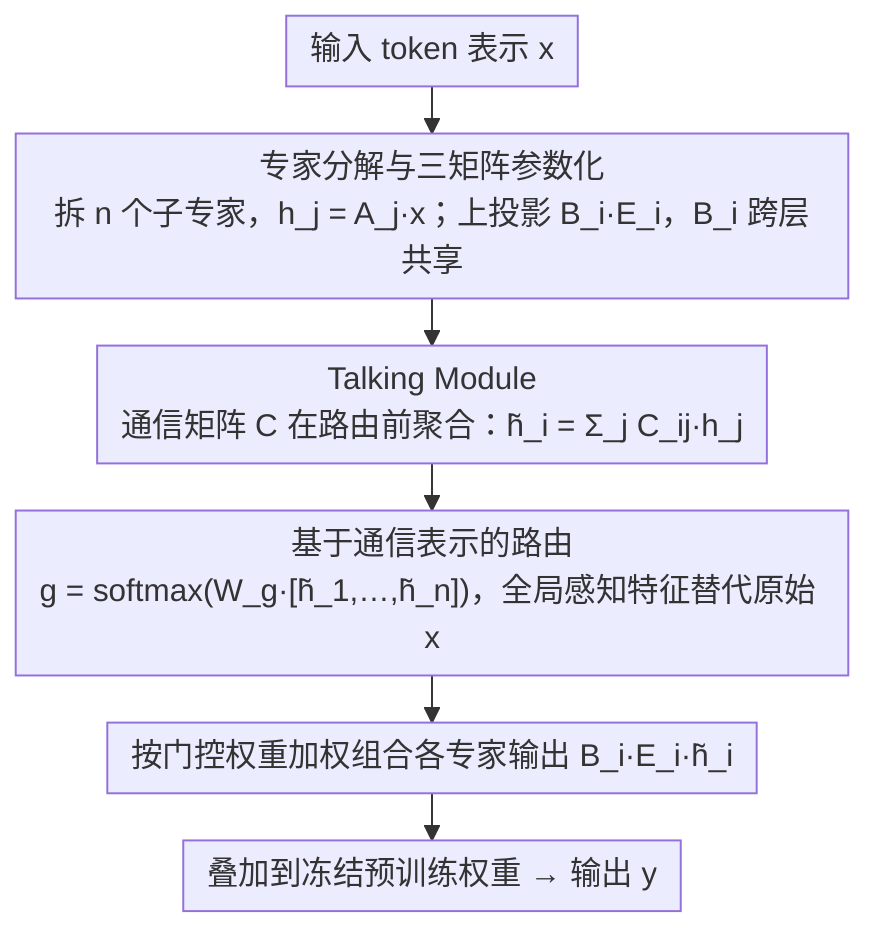

# TalkLoRA: Communication-Aware Mixture of Low-Rank Adaptation for Large Language Models

**会议**: ACL2026  
**arXiv**: [2604.06291](https://arxiv.org/abs/2604.06291)  
**代码**: [GitHub](https://github.com/why0129/TalkLoRA)  
**领域**: 模型压缩  
**关键词**: LoRA, MoE, 参数高效微调, 专家通信, 路由均衡, Talking Module

## 一句话总结

TalkLoRA 在 MoE-LoRA 架构中引入轻量级 Talking Module，允许低秩专家在路由前进行信息交换，解决传统 MoELoRA 中专家独立运行导致的路由不稳定和专家主导问题，在常识推理和 NLU 任务上以更少参数（0.2%）持续超越 LoRA 和 MoELoRA 变体。

## 研究背景与动机

LoRA 通过低秩分解实现参数高效微调，MoE 扩展（MoELoRA）将多个 LoRA 模块作为专家动态组合以增强灵活性。然而现有 MoELoRA 假设专家独立运行，导致三个问题：(1) 路由不稳定，门控分布尖锐且低熵；(2) 专家主导——少数专家持续获得最高权重，其他专家梯度信号可忽略（随网络深度加剧）；(3) 表征冗余——独立训练的专家在相同监督信号下学到高度重叠的表示。

## 方法详解

### 整体框架

TalkLoRA 将每个 LoRA 分解为 n 个子专家，在路由决策前通过 Talking Module 实现专家间信息交换。路由基于全局感知的专家特征而非原始输入，结合参数共享策略减少冗余参数。

### 关键设计

1. **专家分解与三矩阵参数化**：每个子专家 $i$ 的上投影矩阵进一步分解为 $B_i E_i A_i x$，其中 $A_i \in \mathbb{R}^{r/n \times d}$ 和 $E_i \in \mathbb{R}^{r/n \times r/n}$ 学习领域特定知识，$B_i \in \mathbb{R}^{k \times r/n}$ 恢复维度。$B_i$ 跨层共享以降低参数量，$A_i$ 和 $E_i$ 每层独立。
2. **Talking Module**：通过可学习通信矩阵 $C \in \mathbb{R}^{n \times n}$，将专家内部表示 $h_j = A_j x$ 进行线性聚合：$\tilde{h_i} = \sum_{j=1}^n C_{ij} h_j$，仅增加 $O(n^2)$ 参数。当 $C_{ij}=0$（$i \neq j$）时退化为标准 MoELoRA——TalkLoRA 严格泛化了 MoELoRA。
3. **基于通信表示的路由**：门控函数作用于通信后的拼接表示 $g([\tilde{h_1}, ..., \tilde{h_n}]) = \text{softmax}(W_g [\tilde{h_1}, ..., \tilde{h_n}])$，而非原始输入 $x$。全局感知的特征缓解路由过度自信，降低对局部噪声的敏感性。

### 损失函数/训练策略

标准 SFT 训练。$A_i$、$E_i$ 使用 Kaiming 初始化，$B_i$ 零初始化以保持初始输出不变。AdamW 优化器，4× 3090 GPU 训练 2 epochs，每 80 步验证。

## 实验关键数据

### 主实验

常识推理 8 任务平均准确率（%）：

| 模型 | 方法 | #Param(%) | BoolQ | PIQA | ARC-c | OBQA | Avg. |
|---|---|---|---|---|---|---|---|
| Qwen2.5-7B | LoRA (r=16) | 0.4 | 60.0 | 73.6 | 71.7 | 74.4 | 73.8 |
| Qwen2.5-7B | TeamLoRA (r=16) | 0.4 | 74.6 | 90.0 | 88.5 | 92.2 | 88.5 |
| Qwen2.5-7B | **TalkLoRA (r=16)** | **0.2** | 73.6 | 90.9 | 89.6 | 92.8 | **89.0** |
| LLaMA3-8B | MoELoRA (r=32) | 0.7 | 74.6 | 89.1 | 82.8 | 87.6 | 86.6 |
| LLaMA3-8B | **TalkLoRA (r=32)** | **0.4** | 76.1 | 89.6 | 84.5 | 89.4 | **87.6** |

GLUE 基准（RoBERTa-base, 0.3M 参数）：

| 方法 | SST-2 | MRPC | CoLA | QNLI | RTE | STS-B | Avg. |
|---|---|---|---|---|---|---|---|
| LoRA | 93.9 | 88.7 | 59.7 | 92.6 | 75.3 | 90.3 | 83.4 |
| DeLoRA | 94.1 | 89.0 | 63.6 | 92.8 | 77.1 | 90.9 | 84.6 |
| **TalkLoRA** | **94.2** | **89.3** | **64.2** | **93.0** | **77.6** | 90.9 | **84.9** |

### 消融实验

- **专家数量与秩**：LLaMA3-8B 上 r=32、8 专家（per-expert rank=4）达 87.8%，超越所有 r=32 基线且参数效率翻倍。
- **通信矩阵非扩张性**：实验验证 $C$ 的频谱范数 ≤ 1，确保扰动不被放大。
- **TalkLoRA 放置位置**：在 Transformer 的 Q/V 投影上应用效果最佳。

### 关键发现

- TalkLoRA 以 0.2% 参数（r=16）超越需要 0.4% 参数（r=16）的 TeamLoRA，参数效率翻倍。
- 专家通信使路由权重分布更均匀，缓解了深层中少数专家主导的问题。
- 严格泛化关系：当通信矩阵为对角阵时退化为 MoELoRA，理论证明 TalkLoRA 的函数类严格大于 MoELoRA。

## 亮点与洞察

- **Talking-Head 思想从注意力迁移到 MoE-LoRA**：受 talking-head attention 启发，将受控信息交换引入专家系统，解决路由不稳定的根本原因。
- **参数共享 + 通信的协同**：$B_i$ 跨层共享 + Talking Module 跨专家通信，双重机制在减少参数同时增强表达力。
- **理论保障完整**：证明了函数类严格扩展和路由平滑性。

## 局限与展望

- 仅在常识推理和 NLU 任务上验证，代码生成、数学推理等任务的效果未知。
- Talking Module 的 $O(n^2)$ 参数在专家数量很大时可能成为瓶颈。
- 参数共享策略（$B_i$ 跨层共享）可能在需要层间强差异化的任务上受限。

## 相关工作与启发

- **LoRA**（Hu et al., 2022）：参数高效微调基础方法，TalkLoRA 在此基础上引入 MoE + 通信。
- **Talking-Head Attention**（Shazeer et al., 2020）：独立注意力头间的信息交换启发了专家间通信设计。
- **TeamLoRA**（Lin et al., 2025）：通过协作和竞争模块平衡专家，TalkLoRA 以更少参数超越之。
- **DenseLoRA**（Mu et al., 2025）：压缩 LoRA 更新的冗余，启发了参数共享策略。

## 评分

| 维度 | 分数 (1-10) |
|---|---|
| 创新性 | 7 |
| 实用性 | 8 |
| 清晰度 | 7 |
| 实验充分度 | 8 |

## 评分
- 新颖性: 待评
- 实验充分度: 待评
- 写作质量: 待评
- 价值: 待评

<!-- RELATED:START -->

## 相关论文

- [\[ACL 2026\] TLoRA: Task-aware Low Rank Adaptation of Large Language Models](tlora_task-aware_low_rank_adaptation_of_large_language_models.md)
- [\[ACL 2026\] Not All Directions Matter: Towards Structured and Task-Aware Low-Rank Model Adaptation](not_all_directions_matter_towards_structured_and_task-aware_low-rank_model_adapt.md)
- [\[NeurIPS 2025\] Gated Integration of Low-Rank Adaptation for Continual Learning of Large Language Models](../../NeurIPS2025/model_compression/gated_integration_of_low-rank_adaptation_for_continual_learning_of_large_languag.md)
- [\[NeurIPS 2025\] Data Efficient Adaptation in Large Language Models via Continuous Low-Rank Fine-Tuning](../../NeurIPS2025/model_compression/data_efficient_adaptation_in_large_language_models_via_continuous_low-rank_fine-.md)
- [\[NeurIPS 2025\] C-LoRA: Contextual Low-Rank Adaptation for Uncertainty Estimation in Large Language Models](../../NeurIPS2025/model_compression/c-lora_contextual_low-rank_adaptation_for_uncertainty_estimation_in_large_langua.md)

<!-- RELATED:END -->
