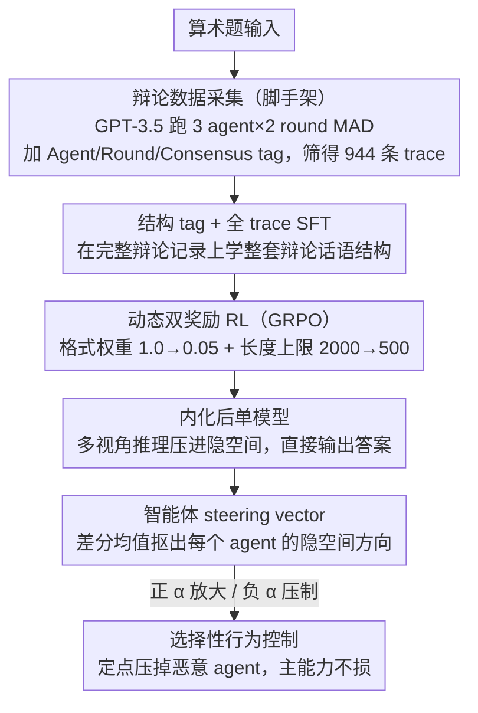

# Latent Agents: A Post-Training Procedure for Internalized Multi-Agent Debate

**会议**: ACL 2026  
**arXiv**: [2604.24881](https://arxiv.org/abs/2604.24881)  
**代码**: https://github.com/johnsk95/latent_agents  
**领域**: LLM Agent / 多智能体 / 可解释性  
**关键词**: 多智能体辩论, 知识蒸馏, 激活引导, 智能体子空间, GRPO

## 一句话总结
提出 IMAD（Internalized Multi-Agent Debate）框架，用 SFT + GRPO 两阶段后训练把多智能体辩论"内化"进单个 LLM，token 消耗最多减少 93%，并通过激活引导证明内化后的模型在隐空间中保留了可分离、可控的"智能体子空间"。

## 研究背景与动机

**领域现状**：多智能体辩论（Multi-Agent Debate, MAD）已被广泛证明能提升 LLM 的推理准确率、减少幻觉，做法是让多个 LLM 实例在多轮对话中互相批评和修正各自答案，最后投票得出结论。

**现有痛点**：MAD 的推理成本巨大——典型设置（3 智能体 × 2 轮）会产生上万 token 的对话记录才能给出一个最终答案，单次推理成本可达单 agent 的 5–16 倍。已有的蒸馏工作（如 DebateGPT、Subramaniam et al.）只在"最终共识答案"上微调，无法继承中间多视角推理的收益。

**核心矛盾**：MAD 的推理增益来自"多视角碰撞 + 迭代修正"这个**过程**，而不是最终那条结论；但保留过程就要付出 token 成本，去掉过程又会失去增益——存在性能和效率之间的根本 trade-off。

**本文目标**：(1) 把 MAD 的完整辩论过程（不只是结论）蒸馏到单个 LLM 中；(2) 验证内化是否真的把"多个智能体"嵌入到了模型隐空间里，还是只是记忆了输入输出映射；(3) 利用这种内化结构做选择性行为控制（如压制恶意/幻觉 agent）。

**切入角度**：作者观察到，如果在 SFT 阶段就让模型学会整条辩论 trace 的结构（带 `<|Agent 1|>` 这种结构 tag），后续可以用 RL 配合**逐步衰减的格式奖励**和**逐步收紧的长度上限**，迫使模型把多视角推理从"显式吐出来"压缩成"在 latent 里偷偷算"。

**核心 idea**：用"先学结构，再用动态奖励内化"的两阶段后训练，把外显辩论压成隐式推理；再用 difference-in-means 提取每个 agent 的 steering vector，证明内化后模型确实形成了可分离的"智能体子空间"，并可用负向引导精准压制其中的"坏 agent"。

## 方法详解

### 整体框架

整个 pipeline 分三阶段：

1. **辩论数据采集**：用 GPT-3.5 turbo 跑标准 3 agent × 2 round MAD，问题是 6 个两位数组成的算术表达式（如 $91+24\times 13+45-41\times 38$）；筛掉没达成多数共识的样本，给每条 trace 加上 `<|Agent i|>`、`<|Round j|>`、`<|Consensus|>`、`<|endofdebate|>` 结构 tag，共收集到 944 条 `{Question, Trace, Answer}` 三元组。
2. **结构学习（SFT）**：在完整 trace 上做标准自回归 next-token 预测（不是只在最终答案上 SFT），让单个 LLM 学会模仿整个辩论格式——会主动生成多个 agent 的发言、多轮迭代、最终共识。
3. **内化（RL/GRPO）**：用 Group Relative Policy Optimization 进一步优化，引入"格式奖励权重衰减"+"长度上限退火"的双动态奖励，把外显辩论逐步压成隐式推理。

输入是一道题，输出在训练初期是带结构 tag 的完整辩论 trace + 最终答案，训练末期则是直接给出最终答案（中间推理留在隐藏状态里）。

### 关键设计

**1. 结构 tag + 全 trace SFT：在整条辩论记录上学结构，而不是只学最终答案**

DebateGPT 等蒸馏工作只在"最终共识答案"上做 SFT，等于把多视角碰撞的过程整个丢掉、只继承结论——MAD 的推理增益自然也就继承不到。本文反其道而行，在带 `<|Agent i|>`、`<|Round j|>`、`<|Consensus|>`、`<|endofdebate|>` 等结构 tag 的完整 trace 上做标准 cross-entropy next-token 训练，让单个模型学会主动生成多 agent 发言、多轮迭代直到共识的整套话语结构。

这些结构 tag 不只是格式装饰：一方面它们给后续 RL 提供了可解析的奖励钩子（格式奖励就靠匹配 tag 来打），另一方面让不同 agent 在 latent 里更容易分离——消融显示去掉 tag 后 agent 子空间的可分性显著下降。一个有意思的副作用是，SFT 后的模型每步生成时能"看到"前面所有 agent 的发言（真实 MAD 里 agent 是并行的、只在 round 末互看），反而比真 MAD 更不容易协调失败，这也是为什么单 SFT 阶段就已强过显式辩论。

**2. 动态双奖励 RL：用格式权重衰减 + 长度退火，把显式辩论逼进隐空间**

SFT 学到的模型仍然把整条辩论显式吐出来，token 成本一点没省。RL 阶段的目标就是把"显式吐辩论"逐步压成"在 latent 里推理"，同时保证答案不出错。奖励是两项加权 $r(x,y)=w_{fmt}R^{fmt}+w_{clip}R(y;l)$：$R^{fmt}$ 是结构 tag 匹配奖励，鼓励早期保留辩论格式，其权重 $w_{fmt}$ 从 1.0 线性衰减到 0.05；$R(y;l)$ 是 length-clipping 正确性奖励，当且仅当正确答案 $y^*$ 出现在 $y$ 的前 $l$ 个 token 内才给 1、否则为 0，而长度上限 $l$ 从 2000 退火到 500。

两个动态信号合力制造了一个"不可能任务"：既要写完整辩论、又要把答案塞进前 500 token，根本做不到，模型唯一可行的策略就是把多视角推理搬进隐藏状态。之所以让 $l$ 渐进收紧而不是一上来就给个紧上限，是因为太紧会让模型从一开始就没有探索推理空间的余地；让长度上限和格式奖励同时渐进消失，才能平稳地把模型从"显式辩论员"推成"隐式辩论员"。这一思路借鉴了 Hou et al. (2025) 内化长 CoT 的做法，但首次用到多智能体场景。

**3. 基于差分均值的智能体 steering vector：把内化后每个 agent 的方向显式抠出来**

内化之后留下一个关键疑问：多 agent 结构到底是真存在于隐空间，还是被压成了无差别的单一推理？回答它最直接的办法，就是看能不能在隐空间里找到 agent 特定的方向。本文用 Contrastive Activation Addition（CAA），对每个 agent $i$ 构造正样本（相同辩论历史后接 agent $i$ 的真实回复）与负样本（相同历史后接另外两个 agent 回复的平均激活），在第 $\ell$ 层取差分均值得到 steering vector：

$$\mathbf{v}_i = \frac{1}{|\mathcal{D}|}\sum_{p,c\in\mathcal{D}}\left(\mathbf{h}_\ell(p,c_i) - \mathbf{h}_\ell(p,c_{\neg i})\right)$$

推理时把 $\alpha\cdot \mathbf{v}_i$ 加到隐藏状态上，正 $\alpha$ 放大该 agent 的特性、负 $\alpha$ 压制它；向量从 SFT checkpoint 提取，避开 RL 优化引入的伪影。可分离的方向不仅证明了"内化没有抹掉多 agent 结构"，还顺手给行为控制提供了抓手——把恶意 agent 的方向找出来负向加，就能选择性压掉坏行为而不毁掉通用能力，把"可控性"问题转成了"可设计性"问题。

### 损失函数 / 训练策略

SFT 用标准 next-token CE，训练 3–6 epoch。RL 用 GRPO 训练 2 epoch：每个 query 采 $k$ 个候选，按 $r(x,y)$ 打分，差分对构成 on-the-fly 偏好数据集；$w_{fmt}$ 从 1.0 → 0.05；$l$ 从 2000 → 500。两阶段都用 LoRA。对"恶意 agent 抑制"实验，RL 阶段把 $R^{fmt}$ 换成 LLM-judge 给出的"伦理性/诚实性"奖励。

## 实验关键数据

### 主实验

在 GSM8K、MMLU-Pro、BBH 三个 benchmark 上对比 Single / Debate / DebateGPT / SFT / IMAD（SFT+RL）五种设置，每个 benchmark 随机采 1000 题、跑 3 次取均值。

| 模型 | 方法 | GSM8K | MMLU-Pro | BBH | GSM8K tokens | 相对 Debate 节省 |
|------|------|-------|----------|-----|--------------|------------------|
| LLaMA-3.1 8B | Debate | 83.03 | 64.60 | 51.06 | 5757.78 | — |
| LLaMA-3.1 8B | **IMAD** | **85.20** | 62.00 | **58.53** | 644.33 | **88.8%** |
| Qwen 2.5 7B | Debate | 91.37 | 57.67 | 67.58 | 2319.71 | — |
| Qwen 2.5 7B | **IMAD** | 89.67 | 52.87 | **70.11** | 389.13 | **83.2%** |
| Mistral Nemo 12B | Debate | 61.03 | 41.30 | 62.76 | 1696.99 | — |
| Mistral Nemo 12B | **IMAD** | **80.00** | 38.97 | **63.73** | 358.01 | **78.9%** |

跨三个模型，IMAD 用 Debate 的 6.3%–21.1% token 拿到相当或更好的精度，最极端在 Mistral Nemo 12B 的 GSM8K 上比显式 Debate 高 18.97 个点。

### 消融 / 引导分析

| 实验 | 配置 | 关键指标 | 说明 |
|------|------|----------|------|
| Pipeline 消融 | SFT only | LLaMA GSM8K 79.23 / token 992 | SFT 已强于多数 baseline，但 token 比 IMAD 多 |
| Pipeline 消融 | SFT + RL (IMAD) | LLaMA GSM8K 85.20 / token 644 | RL 阶段同时涨点 + 砍 token 最多 66% |
| 结构 tag 消融 | 去掉 tag | 子空间分离度显著下降 | 验证 tag 对 agent 子空间形成的重要性 |
| Agent steering | IMAD vs base, ROUGE-L AUC | IMAD 平均比 base 高 **15.41%**（6.1%–24.97%） | Agent 3 (PoT) 提升最大 21–25%，证明 code-like 风格在 latent 中最可分 |
| Evil 压制 | $\alpha=-3.0\sim-5.0$ | IMAD 评分降到 0；base 仍残留 1.01 | 内化让恶意 trait 高度局部化、可彻底抑制 |
| Hallucination 压制 | $\alpha$ 范围内 | 两模型都只能部分压制（基线 ≈65） | 幻觉是分布式 trait，但 IMAD 仍线性可控 |
| 任务保留 | GSM8K @ extreme $\alpha$ | IMAD 保持稳定；base 出现性能崩溃 | IMAD 的子空间更"干净"，引导不破坏主能力 |

### 关键发现
- **RL 阶段是 token 杀手也是涨点关键**：相比 SFT，GRPO + 长度退火可在 LLaMA 上再砍 66% token 同时涨 6 个点，验证动态双奖励的有效性。
- **跨域泛化好**：只在算术上训练，却在 MMLU-Pro / BBH 等知识 + 推理任务上同步提升，说明内化的是"多视角推理 schema"而非"算术能力"。
- **Persona 在 latent 里真的存在**：仅 $\alpha=0.5$ 的微小引导就能让 IMAD 输出明显呈现 step enumeration（Agent 1）、自我批评（Agent 2）、代码/方程（Agent 3）三种风格，base 模型同样引导下风格混杂。
- **Trait 分布形态决定可控性**：Evil 在隐空间中是"局部化"trait，可被引导完全清零；hallucination 是"分布式"trait，只能线性削弱——这给 LLM 安全研究提供了一种诊断框架。
- **模型容量阈值**：≤7B 的模型内化效果差，需 7B+ 才能稳定承载多 agent 子空间。

## 亮点与洞察
- **"动态奖励退火 = 显式→隐式 的训练拓扑控制"**：把奖励权重和长度上限同时退火，是一种很优雅的方式来诱导模型把可观测计算转移到隐空间，比单纯加长度惩罚或一次性砍长度更稳定。这种设计可直接迁移到长 CoT 压缩、ReAct 内化、tool-use 简化等场景。
- **"内化创造可分离子空间"是一个反直觉的发现**：通常会担心蒸馏把多视角压成单一表示，但作者用 ROUGE AUC + persona 引导 + GSM8K 保留性三重证据说明 agent 结构真的"被刻"进了 latent，并且可用 difference-in-means 这种极简方法读出来，给可解释性研究开了一个新口子。
- **"恶意 agent 内化 → 负向引导精准移除"的安全应用**：与其在通用模型上找有害方向（容易误杀），不如**主动种入**一个坏 agent 再定点拔掉——把可控性问题转成可设计性问题，是个反向工程式的精彩思路。可以迁移到 jailbreak 防御、persona 微调、价值观对齐等。

## 局限与展望
- **数据分布单一**：训练数据是 6 数算术表达式且固定 3 agent × 2 round，泛化到更复杂辩论结构（分层、更多 agent、更多 round）和更开放的任务（如长篇 QA、创意写作）需要进一步验证。
- **依赖 SFT 阶段格式学习**：LLaMA 能稳定学到结构，Qwen/Mistral 在某些 setting 下学得不彻底，导致子空间分离度变差——内化的下限被 base 模型的 in-context schema 跟随能力卡住。
- **LLM-judge 评估有 bias**：Evil/Hallucination 评分依赖 GPT-4o-mini 作判官；虽然附录里做了 human-LLM 一致性实验，但完全脱离自评估的 protocol 仍待建设。
- **容量门槛 7B+**：小模型 (<7B) 内化收益不明显，作者推测是 capacity bottleneck；未来可探索通过更聪明的 LoRA 配置、MoE 或 mixture-of-personas 在小模型上复现效果。
- **改进思路**：(a) 把 difference-in-means 升级为稀疏字典学习/SAE，提取更细粒度的 agent circuit；(b) 把内化 agent 当 inference-time 控制旋钮，与采样温度、CoT 长度联动；(c) 把"种入-移除"框架推广到正向 trait（如礼貌、保密协议遵守）的精确植入。

## 相关工作与启发
- **vs Debate (Du et al., 2023)**: 经典 MAD 是 inference-time 协议；本文是 train-time 蒸馏，把协议吸进权重，inference 成本骤降。区别是 MAD 灵活但贵，IMAD 一次训练后便宜但 schema 固化。
- **vs DebateGPT / Subramaniam et al.**: 他们只在"最终共识答案"上 SFT；本文在完整 trace + 结构 tag 上 SFT + 动态 RL，能继承中间过程的推理增益（实验上 IMAD 全面优于 DebateGPT）。
- **vs Hou et al. (2025) 长 CoT 内化**: 同样用 length-based RL 内化推理，但 Hou 是单 agent 单视角，本文是多 agent 多视角 + 双奖励 + 子空间可解释性，把内化从"压缩"升级为"结构保留的压缩"。
- **vs Persona Vectors (Chen et al., 2025)**: 他们在通用模型上提 persona/trait 方向；本文先**用 IMAD 主动种入** persona 再提取，得到分离度更高的子空间，trait 压制更彻底且不伤主能力——是 persona 引导的"训练时增强版"。
- **vs Coconut (Hao et al., 2024) 连续 latent 推理**: 都把推理搬进 latent，但 Coconut 在 forward pass 中直接传 hidden state 作 thought token，本文则通过奖励压力让模型自己学会隐式推理，保留了离散 token 接口的实用性。

## 评分
- 新颖性: ⭐⭐⭐⭐⭐ 首次把多智能体辩论的完整结构蒸馏进单模型，且配套子空间分析和安全应用，组合罕见
- 实验充分度: ⭐⭐⭐⭐ 跨 3 模型 × 3 benchmark + 充分消融 + 引导/安全/perplexity 三视角分析；但训练数据仅算术，open-ended 任务覆盖偏弱
- 写作质量: ⭐⭐⭐⭐ 三段式论述（效率→可解释→可控）线索清晰，公式和直觉解释配合到位
- 价值: ⭐⭐⭐⭐⭐ 同时推进了"推理效率""LLM 可解释性""安全引导"三个方向，且代码开源，工程可复现

<!-- RELATED:START -->

## 相关论文

- [\[ACL 2026\] Efficient Multi-Agent System Training with Data Influence-Oriented Tree Search](efficient_multi-agent_system_training_with_data_influence-oriented_tree_search.md)
- [\[ACL 2026\] When Identity Skews Debate: Anonymization for Bias-Reduced Multi-Agent Reasoning](when_identity_skews_debate_anonymization_for_bias-reduced_multi-agent_reasoning.md)
- [\[ACL 2026\] HACHIMI: Scalable and Controllable Student Persona Generation via Orchestrated Agents](hachimi_scalable_and_controllable_student_persona_generation_via_orchestrated_ag.md)
- [\[AAAI 2026\] Beyond Detection: Exploring Evidence-based Multi-Agent Debate for Misinformation Intervention and Persuasion](../../AAAI2026/multi_agent/beyond_detection_exploring_evidence-based_multi-agent_debate_for_misinformation_.md)
- [\[ACL 2026\] ATLAS: Adaptive Trading with LLM AgentS Through Dynamic Prompt Optimization and Multi-Agent Coordination](atlas_adaptive_trading_with_llm_agents_through_dynamic_prompt_optimization_and_m.md)

<!-- RELATED:END -->
